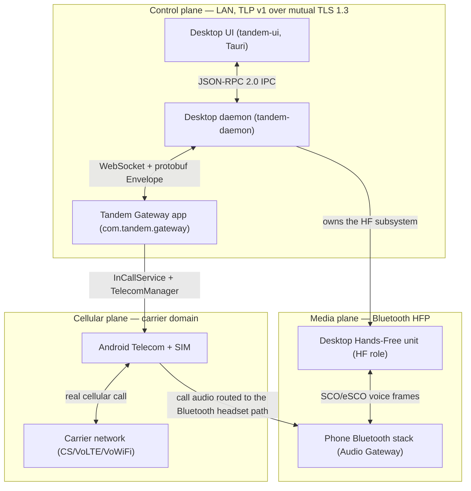

# Tandem Overview

Tandem lets one person place, receive, and control **real SIM-based cellular calls from their
desktop** while the SIM never leaves their Android phone. The phone runs the **Tandem Gateway**
app (`com.tandem.gateway`) as the default dialer; the desktop runs a headless Rust daemon
(`tandem-daemon`) plus a Tauri UI (`tandem-ui`). Control commands travel over an authenticated
LAN channel; call **audio** reaches the desktop because the desktop presents itself to the phone
as a **Bluetooth Hands-Free (HFP) headset** — exactly the mechanism a car kit uses. Tandem never
captures or injects cellular audio in software on the phone, and it never reimplements cellular
calling; it drives and bridges into the phone's genuine carrier call.

## Target user

Someone who works at a desk with their personal phone within Bluetooth range: they want desktop
ergonomics — keyboard dialing, a proper headset or speakers, on-screen call controls, searchable
history — for the calls that still arrive on their real SIM number. They do not want call
forwarding, a second VoIP number, a cloud relay of their voice, or a rooted phone. Both devices
belong to the same person; Tandem is a personal bridge, not a telephony service.

## Same-room LAN premise

Phone and desktop sit on the same LAN, in the same room. This is a design premise, not a
temporary limitation to engineer around: the control plane rides the local network (discovered
via mDNS/DNS-SD, service type `_tandem._tcp`), and the media plane rides Bluetooth, whose useful
range enforces proximity anyway. Nothing transits the internet. A beyond-same-room mode appears
only as a possible future phase (see [16-roadmap.md](16-roadmap.md)).

## The three planes

Keep these conceptually separate everywhere in the system and the docs:

1. **Control plane** — dial, answer, mute, hold, merge, end, DTMF, call-state mirroring,
   call-log sync. Runs over the Tandem LAN Protocol (TLP) v1: WebSocket over mutual TLS 1.3
   (see [06-transport-and-protocol.md](06-transport-and-protocol.md)). The phone is the source
   of truth for call state; every desktop holds a derived mirror (ADR-0007).
2. **Media plane** — live two-way call audio over Bluetooth HFP: phone = Audio Gateway (AG),
   desktop = Hands-Free unit (HF). The LAN coordinates audio routing but never carries voice
   (see [05-bluetooth-hfp.md](05-bluetooth-hfp.md)).
3. **Cellular plane** — the phone's genuine SIM CS/VoLTE/VoWiFi call on the carrier network.
   Entirely the carrier's and Android's domain.

## Tier model

| Tier | What ships | Feasibility verdict |
|---|---|---|
| `[Tier A]` — control + history | Desktop dials, answers, mutes, holds, merges, ends, sends DTMF, and mirrors the call log; the user talks on the handset or any headset paired to the phone | Feasible today on stock, non-rooted Android via default dialer + `InCallService`; independently shippable as a complete product with zero Bluetooth audio work. |
| `[Tier B — Linux]` — PC-as-headset audio | Desktop is the HFP Hands-Free device; two-way call audio on desktop mic/speakers | Feasible in software alone via BlueZ (+ PipeWire for audio); no special hardware. |
| `[Tier B — Win/macOS USB dongle]` — PC-as-headset audio | Same as above on Windows and macOS | Feasible only with a dedicated USB Bluetooth controller the daemon drives directly, implementing HFP against the published Bluetooth SIG spec; the OS stacks do not expose the HF role to apps. |
| `[Tier B-lite fallback]` — first-class supported mode | Desktop keeps full control + history; audio goes to any commodity Bluetooth speakerphone or earbuds paired to the phone | Feasible today with zero desktop Bluetooth work; the supported answer wherever Tier B hardware or OS support is absent. |
| `[Tier C — needs vendor support]` — sanctioned platform audio | A hypothetical AOSP/OEM "call-audio companion" API — the capability class Android Auto uses | Not feasible today for third-party apps; roadmap advocacy only. The architecture keeps a drop-in media-backend seam for it (ADR-0010). |

In file-level docstrings inherited from [REPO-STRUCTURE.md](REPO-STRUCTURE.md), bare `[Tier B]` is
shorthand for the whole Tier B family — `[Tier B — Linux]`, `[Tier B — Win/macOS USB dongle]` and
`[Tier B-lite fallback]` — and `[Tier A/B]` marks a seam used by both tiers. Authored prose always
uses the five exact tags.

## Non-goals

- **No global relay.** No cloud voice or control relay, no accounts, no telemetry in v1. Cloud
  appears only as a possible future account/sync layer in [16-roadmap.md](16-roadmap.md).
- **No software capture of carrier call audio.** See the hard-reality statement below; the HFP
  design exists precisely because capture is impossible on stock Android.
- **No root dependence.** Tier A and Tier B use only published, sanctioned mechanisms:
  default-dialer APIs, the public Bluetooth HFP specification, and standard LAN networking.
- **No cellular reimplementation.** Tandem is not a VoIP app and hosts no calls of its own; it
  drives carrier-managed calls (no `ConnectionService`, no `MANAGE_OWN_CALLS` — see
  [03-android-app.md](03-android-app.md)).
- **No call recording.** `RECORD_AUDIO` is never requested; the mirror of the call log is
  read-only.

## Hard realities

**No software capture.** On stock, non-rooted Android, a third-party app cannot capture call
audio: the `VOICE_CALL`, `VOICE_DOWNLINK`, and `VOICE_UPLINK` audio sources sit behind
`CAPTURE_AUDIO_OUTPUT`, a `signature|privileged` permission unavailable to installable apps, and
no API exists to inject audio into the cellular uplink. Tandem therefore never touches call
audio in software on the phone; audio reaches the desktop only over Bluetooth HFP, exactly as it
would reach a car kit. Full analysis in
[02-feasibility-and-constraints.md](02-feasibility-and-constraints.md); decision record in
ADR-0002.

**Emergency calls.**

> Tandem never places or manipulates emergency calls from the desktop. The phone gateway checks
> every `DialRequest` against `TelephonyManager.isEmergencyNumber()`, and the desktop pre-checks
> against the emergency-number list the phone syncs to it; matches are refused with
> `ERROR_CODE_EMERGENCY_NUMBER_BLOCKED` and the desktop UI tells the user to dial on the
> handset, which has carrier location facilities. An emergency call active on the phone is
> surfaced read-only: no remote control, no audio-route requests honored. A desktop-originated
> emergency call would lack reliable caller location and must never be silently bridged.
> (ADR-0008; restated as a safety control in
> [08-security-and-encryption.md](08-security-and-encryption.md).)

## Reading order

| Read | For |
|---|---|
| [00-overview.md](00-overview.md) → [02-feasibility-and-constraints.md](02-feasibility-and-constraints.md) → [01-architecture.md](01-architecture.md) | The idea, the engineering reality, then the shape of the system — in that order. |
| [03-android-app.md](03-android-app.md), [04-desktop-app.md](04-desktop-app.md) | Per-app module maps and file-level responsibilities. |
| [05-bluetooth-hfp.md](05-bluetooth-hfp.md), [06-transport-and-protocol.md](06-transport-and-protocol.md), [07-pairing-and-auth.md](07-pairing-and-auth.md), [08-security-and-encryption.md](08-security-and-encryption.md), [09-data-models.md](09-data-models.md) | Deep dives: media plane, control protocol, trust establishment, threat model, storage. |
| [10-sequence-diagrams.md](10-sequence-diagrams.md), [11-api-reference.md](11-api-reference.md), [12-permissions-and-platform.md](12-permissions-and-platform.md) | Reference: end-to-end flows, interface contracts, the permission matrix. |
| [13-build-and-setup.md](13-build-and-setup.md), [14-coding-conventions.md](14-coding-conventions.md), [15-testing-strategy.md](15-testing-strategy.md) | Working on the repo: toolchains, conventions, tests. |
| [16-roadmap.md](16-roadmap.md), [adr/](adr/) | Where this goes next, and why each binding decision was made. |

[REPO-STRUCTURE.md](REPO-STRUCTURE.md) is the canonical file inventory; the protobuf files under
`/proto/tandem/v1/` are the canonical wire schema, embedded verbatim only in
[06-transport-and-protocol.md](06-transport-and-protocol.md).
