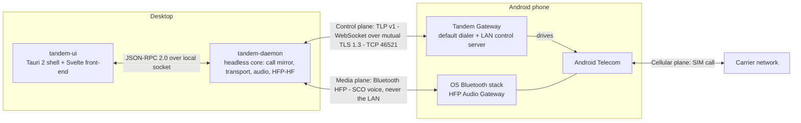
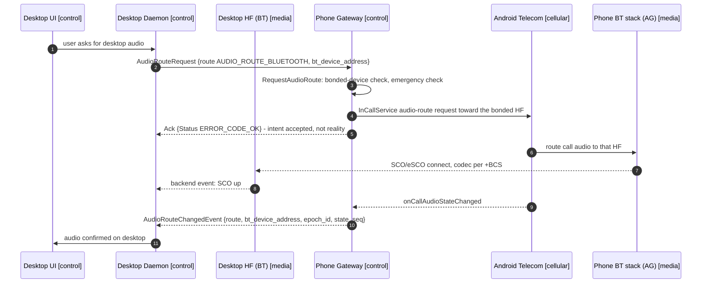

# Architecture

Tandem is two applications joined by two physically separate links. The **Tandem Gateway** Android
app (package `com.tandem.gateway`) is the phone side: it holds `ROLE_DIALER`, observes and drives
real SIM calls through `InCallService`, serves the LAN control protocol, and owns every piece of
durable truth. The **desktop** side is a Rust workspace: a headless `tandem-daemon` binary that
mirrors phone state and — at Tier B — renders call audio as a Bluetooth Hands-Free unit, plus a
`tandem-ui` Tauri 2 shell whose Svelte front-end talks to the daemon only over JSON-RPC 2.0 on a
local socket. The phone is the source of truth for all call state; the desktop is a remote
controller and audio renderer, never an authority.

This document defines process boundaries, component structure, data ownership, and the rule that
keeps the control plane and the media plane consistent while they run over different radios.
Per-file responsibilities live in [03-android-app.md](03-android-app.md) and
[04-desktop-app.md](04-desktop-app.md); wire messages live in
[06-transport-and-protocol.md](06-transport-and-protocol.md), Message Catalog.

## System shape

Three deliberate process boundaries:

1. **Phone: one process.** `GatewayForegroundService` (types `phoneCall|connectedDevice`) keeps the
   LAN server, NSD advertisement, and telecom observation alive. The handset Compose UI runs in the
   same process and dispatches through the same use-cases the LAN path uses — one command path for
   both surfaces, so policy cannot be bypassed from either side.
2. **Desktop: daemon and UI are separate processes** (ADR-0004). Real-time audio and Bluetooth never
   run in the webview process, so UI jank cannot reach the media path, and the front-end is
   replaceable (a future CLI or egui client reuses the same `IpcApi`).
3. **Control and media are separate physical links.** The LAN carries intent and state; Bluetooth
   carries voice. The LAN never carries a voice frame — and could not substitute for HFP: on stock,
   non-rooted Android an app cannot capture `VOICE_CALL`, `VOICE_DOWNLINK`, or `VOICE_UPLINK` audio
   (gated behind `CAPTURE_AUDIO_OUTPUT`, a `signature|privileged` permission) and cannot inject
   audio into the cellular uplink. HFP is the sanctioned path a car kit uses, and Tandem uses
   exactly that — see [02-feasibility-and-constraints.md](02-feasibility-and-constraints.md) and
   ADR-0002.

## The three planes mapped to modules

| Plane | What travels on it | Phone modules (`com.tandem.gateway`) | Desktop modules | Tier |
|---|---|---|---|---|
| **Control** | TLP v1: call control, call-state events, call-log sync, pairing — WebSocket over mutual TLS 1.3, default TCP 46521 (see [06-transport-and-protocol.md](06-transport-and-protocol.md)) | `transport`, `pairing`, `crypto`, `calllog`, `domain`, `data`, `service`, `ui` | `tandem_transport`, `tandem_pairing`, `tandem_crypto`, `tandem_core`, `tandem_ipc`, `tandem_proto`, `tandem-daemon`, `tandem-ui` | `[Tier A]` |
| **Media** | Bluetooth HFP v1.8: SLC over RFCOMM, SCO/eSCO voice, codec negotiation, indicator mirroring, volume sync (see [05-bluetooth-hfp.md](05-bluetooth-hfp.md)) | `bluetooth` — observes and steers the OS AG, never reimplements it | `tandem_audio`, `tandem_bluetooth` | `[Tier B — Linux]` `[Tier B — Win/macOS USB dongle]`; with null backends the same build runs `[Tier B-lite fallback]` |
| **Cellular** | The genuine SIM call — CS/VoLTE/VoWiFi on the carrier network | `telecom`, `dialer` are the control plane's adapters *into* this plane; the plane itself is Android Telecom plus the carrier | none — the desktop never touches the cellular plane | carrier-owned; Tandem drives it via `[Tier A]` APIs |

The planes touch at exactly three points, all deliberate and all one-directional in authority:

- `AudioRouteRequest` and `AudioRouteChangedEvent` cross from control to media and back (detailed
  under "Control and media in sync").
- `HfpCallMediaProvider` (phone `bluetooth` package) executes routing by calling into the telecom
  layer — control steering media.
- `hfp/call_mirror.rs` (desktop `tandem_bluetooth`) compares the HFP indicator view of call state
  against the LAN mirror as a consistency check; on divergence, LAN truth always wins
  (single-command-path rule, [05-bluetooth-hfp.md](05-bluetooth-hfp.md)).

Because the desktop never sends HFP call-control AT commands (`ATA`, `AT+CHUP`, `ATD`, `AT+CHLD` as
user actions), there is exactly one command path — the LAN — and no dual-command races between
Tandem and the phone's OS Bluetooth stack.

The separation is structural, not stylistic: the desktop's whole media plane can be absent (`null`
backends in `tandem_bluetooth` and `tandem_audio`) and the product remains a complete dialer. That
is `[Tier B-lite fallback]`, and it is why the seam is a trait rather than a compile-time branch
(ADR-0010).

## Data-ownership rules

One writer per datum. Everything on the desktop is derived state.

| Datum | Owner (sole writer) | Desktop replica | Propagation | Desktop write path |
|---|---|---|---|---|
| Live call list, per-call capabilities (`can_hold`, `can_merge`, `is_conference`) | Phone — Android Telecom, observed by `TelecomBridgeImpl` | `tandem_core` mirror | `IncomingCallEvent`, `CallStateChangedEvent` | None — requests express intent; only the phone mutates state |
| `(epoch_id, state_seq)` version pair | Phone — `ObserveCallState` | Last applied pair, persisted | Stamped on every phone event | None |
| Mute state and audio route | Phone — Telecom `CallAudioState`, surfaced by `HfpCallMediaProvider` | Mirror fields | `CallStateChangedEvent`, `AudioRouteChangedEvent` | None — `MuteRequest` and `AudioRouteRequest` are intent only |
| Call history | Phone OS — `android.provider.CallLog` | Bounded read-only projection in `tandem-cache.db` | `CallLogChangedEvent` then `CallLogSyncRequest` paging | None — `WRITE_CALL_LOG` is not requested and the phone never writes the OS log for a desktop |
| Paired-desktop list and revocation | Phone — `PairedDeviceRepository` (Room `tandem.db`) | The desktop knows only its own assigned `desktop_device_id` | `PairingDecision`, `RevokedEvent` | None |
| Paired-phone identity pin | Desktop — `tandem_pairing` at first pairing | Phone holds the mirror-image pin | `PairingDecision` | Written once at pairing; cleared on unpair |
| Emergency-number list | Phone — `EmergencyNumberSource` | Session-scoped copy for the local pre-check | `SessionWelcome.emergency_numbers` | None — refreshed on each new session |
| Desktop UI state: current view, in-progress dial string, pending-command indicators, freshness badges, window and tray state | Desktop — `tandem_core` plus `ui/src/lib/state.ts` | Not replicated to the phone | Local only | Desktop-only |
| Desktop audio device and Bluetooth backend selection | Desktop — `config.toml` and the `kv` table | Not replicated | Local only | Desktop-only |
| Identity private keys | Each device for itself — Android Keystore / OS secret store | Never leaves its device | Only public artifacts cross the wire | Not applicable |

Rules that follow:

1. **The phone owns telephony truth.** Tandem Gateway serializes Telecom's live call list and the OS
   call log into the versioned `CallSnapshot` stream and `CallLogEntry` pages. It adds nothing the OS
   does not report and keeps no parallel persistent copy of either.
2. **The desktop owns UI state derived from that truth, and nothing else.** `CallController` state
   is a mirror keyed by `(epoch_id, state_seq)`; `reconcile.rs` never lets stale mirror state
   override phone truth.
3. **No optimistic state.** A user action produces a request plus a pending-intent flag in the UI,
   never a speculative state change. The mirror advances only when the phone's next event arrives.
4. **Snapshot-shaped events.** `CallStateChangedEvent` carries a whole `CallSnapshot`, so a desktop
   converges after any missed event without delta bookkeeping.
5. **Epoch invalidation.** A changed `epoch_id` voids the entire mirror; the desktop discards it and
   adopts the snapshot from `ResumeResponse`.
6. **The phone owns trust.** Revocation on the phone is immediate and final: `RevokedEvent`, session
   close, and refusal of later TLS handshakes from that SPKI
   ([07-pairing-and-auth.md](07-pairing-and-auth.md)).
7. **The call log is mirrored read-only** and bounded; retention and refresh policy live in
   [09-data-models.md](09-data-models.md).
8. **HFP indicator state is never authoritative** — it is a desktop-side consistency signal only.
9. **Emergency calls are read-only from the desktop.** An active emergency call is surfaced via
   `CallInfo.is_emergency`; remote control and audio-route requests are refused, and
   desktop-originated emergency dials are rejected with `ERROR_CODE_EMERGENCY_NUMBER_BLOCKED` while
   the UI directs the user to the handset, which has carrier location facilities (ADR-0008,
   [08-security-and-encryption.md](08-security-and-encryption.md)).
10. **The desktop cache is disposable.** Every row in `tandem-cache.db` except the paired-phone
    identity can be rebuilt from the phone.

## Versioned truth: epoch_id and state_seq

Every phone-originated event carries `(epoch_id, state_seq)`:

- `epoch_id` — a UUID minted each time the gateway process starts. A new epoch means all prior
  desktop-held state is void.
- `state_seq` — a uint64, monotonic within an epoch, bumped on every call-plane transition: call
  list change, audio-route change, mute change.

The desktop persists the last pair it applied. On every reconnect it sends
`ResumeRequest{last_epoch_id, last_state_seq, last_call_log_version}`; the phone replies with
`ResumeResponse`, which includes a full `CallSnapshot` whenever the epoch differs or a gap is
detected, and the desktop snapshot-replaces its mirror. Connection lifecycle and the state table are
in [06-transport-and-protocol.md](06-transport-and-protocol.md).

## Control and media in sync, physically separate

Voice and intent travel on different radios, yet the user sees one coherent call. The contract is:
**the LAN is the intent source, HFP reports reality, and reality is confirmed by a phone event.**

1. **Intent crosses the LAN.** The UI calls the `IpcApi`; the daemon sends `AudioRouteRequest` with
   an absolute target route. It is idempotent, so retry after a reconnect is always safe.
2. **The phone executes.** `ControlPlaneRouter` dispatches to `RequestAudioRoute`, which validates
   through `CallMediaProvider` (`HfpCallMediaProvider`): the desktop's adapter address must match a
   bonded device (`BondedDesktopMatcher`) and no emergency call may be active. It then steers
   routing via the `InCallService` audio-route APIs.
3. **SCO carries the voice.** The phone's OS Bluetooth stack — the HFP Audio Gateway, Android's code
   and not Tandem's — opens SCO/eSCO to the desktop Hands-Free unit using the previously negotiated
   codec (CVSD or mSBC). Two-way call audio now flows phone to desktop over Bluetooth only.
   `[Tier B — Linux]` `[Tier B — Win/macOS USB dongle]`
4. **Reality returns as a versioned event.** `AudioRouteChangedEvent` — not the request's `Ack` — is
   the truth about where audio is. The UI shows "attaching" between the two and participates in
   normal resume reconciliation because the event is `(epoch_id, state_seq)`-stamped.
5. **Refusals are clean.** No bonded HF, no `BLUETOOTH_CONNECT` grant, or an active emergency call
   all yield `ERROR_CODE_AUDIO_ROUTE_UNAVAILABLE` — the single refusal code for every
   `AudioRouteRequest`, per its catalog row (tag 29) in
   [06-transport-and-protocol.md](06-transport-and-protocol.md) — never a partial attach.
6. **Degradation never touches the call.** If SCO drops, the phone falls back to the earpiece, a new
   `AudioRouteChangedEvent` reports the fallback, and the desktop offers re-attach. If the LAN drops
   instead, SCO audio keeps flowing while control is unavailable, and the desktop reconnects and
   re-derives its mirror. Under `[Tier B-lite fallback]` the null backends refuse attach cleanly and
   the user pairs commodity earbuds directly to the phone; control and history still work fully.

Both planes converge on the same authority: the phone. The control plane is how intent gets in, the
media plane is how sound gets out, and `AudioRouteChangedEvent` is how the two are reconciled.

## Component diagram

Component names match the packages and crates in [REPO-STRUCTURE.md](REPO-STRUCTURE.md) exactly;
[03-android-app.md](03-android-app.md) and [04-desktop-app.md](04-desktop-app.md) give per-file
docstrings. `tandem_testkit` and the Android `testkit` fakes are dev-only and omitted from the
runtime picture.

```mermaid
flowchart TB
    PROTO_SRC["proto/tandem/v1<br/>TLP v1 schema - single source of truth"]

    subgraph PHONE["Android phone - Tandem Gateway - com.tandem.gateway"]
        direction TB
        P_UI["ui<br/>MainActivity, StatusScreen, PairingScreen, SettingsScreen, InCallActivity, InCallScreen, IncomingCallNotifier, DialpadScreen + ViewModels"]
        P_SERVICE["service<br/>GatewayForegroundService, GatewayNotifications, BootCompletedReceiver"]
        P_DI["di<br/>AppModule, TelecomModule, TransportModule, DataModule"]
        P_USECASE["domain.usecase<br/>PlaceCall, AnswerCall, RejectCall, EndCall, SetMute, HoldCall, UnholdCall, MergeCalls, SendDtmf, RequestAudioRoute, ObserveCallState, SyncCallLog, PairDesktop, RevokeDesktop, GuardEmergencyNumber"]
        P_PORT["domain.port<br/>TelecomBridge, CallMediaProvider, LanServer, PairingManager, CallLogRepository, PairedDeviceRepository, IdentityStore, SettingsRepository, EmergencyNumberSource"]
        P_MODEL["domain.model<br/>Call, CallLogEntry, PairedDesktop, AudioRoute, DeviceIdentity"]
        P_TELECOM["telecom<br/>TandemInCallService, TelecomBridgeImpl, CallStateMapper"]
        P_DIALER["dialer<br/>DefaultDialerManager, OutgoingCallPlacer, DialIntentRouter, EmergencyNumberSourceImpl"]
        P_CALLLOG["calllog<br/>CallLogRepositoryImpl, CallLogObserver"]
        P_TRANSPORT["transport<br/>LanServerImpl, NsdAdvertiser, DesktopSession, SessionRegistry, EnvelopeCodec, ControlPlaneRouter"]
        P_PAIRING["pairing<br/>PairingManagerImpl, PairingSession, QrPayloadCodec"]
        P_CRYPTO["crypto<br/>IdentityStoreImpl, DeviceCertificates, TlsServerFactory, Fingerprints"]
        P_BLUETOOTH["bluetooth<br/>HfpAgMonitor, HfpCallMediaProvider, BondedDesktopMatcher"]
        P_DATA["data<br/>TandemDatabase, PairedDesktopDao, PairedDesktopEntity, PairedDeviceRepositoryImpl, SettingsRepositoryImpl"]
    end

    subgraph AOS["Android OS services"]
        A_TELECOM["Android Telecom framework"]
        A_CALLLOG["CallLog content provider"]
        A_BT["OS Bluetooth stack - HFP Audio Gateway"]
        A_NSD["NsdManager mDNS"]
        A_KS["Android Keystore / StrongBox"]
    end

    CARRIER["Carrier network"]

    subgraph DESKTOP["Desktop - Rust workspace"]
        direction TB
        subgraph D_UIP["UI process - tandem-ui"]
            D_SVELTE["desktop/ui<br/>Svelte front-end: DialerView, ActiveCallView, HistoryView, PairingView, SettingsView, lib/ipc.ts, lib/state.ts"]
            D_TAURI["desktop/ui/src-tauri<br/>Tauri 2 shell, daemon_bridge"]
        end
        subgraph D_DP["Daemon process - tandem-daemon"]
            D_DAEMON["daemon<br/>main, app, config, ipc_service, logging, store"]
            D_IPC["tandem_ipc<br/>IpcApi, server, client, socket"]
            D_CORE["tandem_core<br/>model, events, controller, reconcile, emergency, error"]
            D_TRANSPORT["tandem_transport<br/>discovery, client, codec, reconnect, tls"]
            D_PAIRING["tandem_pairing<br/>qr, flow, short_code"]
            D_CRYPTO["tandem_crypto<br/>identity, cert, pinning, secrets"]
            D_AUDIO["tandem_audio<br/>backend, cpal_backend, null_backend, ring_buffer, resampler, aec, pipeline"]
            D_BT["tandem_bluetooth<br/>hfp core + backends: linux_bluez, usb_dongle, null_backend"]
            D_PROTO["tandem_proto<br/>generated tandem.v1 types"]
        end
        D_AUDIODEV["OS audio devices via cpal"]
        D_ADAPTER["Bluetooth adapter<br/>BlueZ-managed or dedicated USB controller"]
        D_SEC["OS secret store<br/>Keychain, Credential Manager, Secret Service"]
        D_FILES["tandem-cache.db + config.toml"]
    end

    PROTO_SRC -->|"protobuf-gradle-plugin"| P_TRANSPORT
    PROTO_SRC -->|"prost build.rs"| D_PROTO

    P_UI --> P_USECASE
    P_SERVICE --> P_TRANSPORT
    P_SERVICE --> P_USECASE
    P_DI -. "binds ports to impls" .-> P_PORT
    P_USECASE --> P_PORT
    P_USECASE --> P_MODEL
    P_TRANSPORT -->|"decoded requests"| P_USECASE
    P_TRANSPORT --> P_PAIRING
    P_TRANSPORT --> P_DATA
    P_DIALER --> P_TELECOM
    P_CRYPTO -->|"mTLS server context"| P_TRANSPORT
    P_BLUETOOTH -->|"audio-route calls via InCallService"| P_TELECOM
    P_TELECOM -. "implements TelecomBridge" .-> P_PORT
    P_BLUETOOTH -. "implements CallMediaProvider" .-> P_PORT
    P_TRANSPORT -. "implements LanServer" .-> P_PORT
    P_PAIRING -. "implements PairingManager" .-> P_PORT
    P_CALLLOG -. "implements CallLogRepository" .-> P_PORT
    P_DIALER -. "implements EmergencyNumberSource" .-> P_PORT
    P_CRYPTO -. "implements IdentityStore" .-> P_PORT
    P_DATA -. "implements PairedDeviceRepository + SettingsRepository" .-> P_PORT

    P_TELECOM --> A_TELECOM
    P_CALLLOG --> A_CALLLOG
    P_BLUETOOTH --> A_BT
    P_TRANSPORT --> A_NSD
    P_CRYPTO --> A_KS
    A_TELECOM <-->|"CELLULAR PLANE - CS, VoLTE, VoWiFi"| CARRIER

    P_TRANSPORT <-->|"CONTROL PLANE - TLP v1: WebSocket over mutual TLS 1.3, TCP 46521"| D_TRANSPORT
    A_NSD -.->|"_tandem._tcp DNS-SD"| D_TRANSPORT
    A_BT <-->|"MEDIA PLANE - HFP v1.8: SLC on RFCOMM + SCO voice"| D_ADAPTER

    D_SVELTE --> D_TAURI
    D_TAURI -->|"JSON-RPC 2.0 over local socket"| D_IPC
    D_IPC --> D_DAEMON
    D_DAEMON --> D_CORE
    D_DAEMON --> D_BT
    D_DAEMON --> D_AUDIO
    D_DAEMON --> D_PAIRING
    D_DAEMON --> D_FILES
    D_CORE <-->|"phone events in, requests out"| D_TRANSPORT
    D_CORE --> D_PROTO
    D_TRANSPORT --> D_PROTO
    D_TRANSPORT --> D_CRYPTO
    D_PAIRING --> D_TRANSPORT
    D_PAIRING --> D_CRYPTO
    D_CRYPTO --> D_SEC
    D_BT <-->|"SCO frames via SPSC ring buffers"| D_AUDIO
    D_AUDIO --> D_AUDIODEV
    D_BT --> D_ADAPTER
```

What the diagram encodes:

- **`domain.port` is the only inbound edge to `domain.usecase`.** Framework packages depend on the
  ports; ports never depend back. `di` performs all binding.
- **`tandem_core` performs no I/O.** It touches `tandem_proto` only for wire-type conversion at its
  boundary; `tandem-daemon` owns every socket, device handle, and channel.
- **`tandem_bluetooth` drives `tandem_audio`, not the reverse.** The SCO clock paces the pipeline and
  ring buffers absorb OS-callback jitter.
- **`tandem-ui` reaches nothing but `tandem_ipc`.** The webview holds no keys, sockets, or Bluetooth
  handles.
- **Generated protobuf types exist in exactly two places** — `transport/EnvelopeCodec.kt` on the
  phone and `tandem_proto` on the desktop; everything inward speaks domain models (ADR-0009).

### Phone ports and their implementations

Contracts in [11-api-reference.md](11-api-reference.md).

| Port | Implementation | Backing system | Plane |
|---|---|---|---|
| `TelecomBridge` | `telecom/TelecomBridgeImpl` | Android Telecom via `TandemInCallService` | control into cellular |
| `CallMediaProvider` | `bluetooth/HfpCallMediaProvider` | `InCallService` audio routing + OS Bluetooth stack | control into media |
| `LanServer` | `transport/LanServerImpl` | Ktor CIO WebSocket over mutual TLS 1.3 | control |
| `PairingManager` | `pairing/PairingManagerImpl` | pairing window, QR payload, confirmation UX | control |
| `CallLogRepository` | `calllog/CallLogRepositoryImpl` | OS `CallLog` provider, read-only | control |
| `PairedDeviceRepository` | `data/PairedDeviceRepositoryImpl` | Room `tandem.db` | control |
| `IdentityStore` | `crypto/IdentityStoreImpl` | Android Keystore, StrongBox when available | control |
| `SettingsRepository` | `data/SettingsRepositoryImpl` | Preferences DataStore | control |
| `EmergencyNumberSource` | `dialer/EmergencyNumberSourceImpl` | `TelephonyManager` emergency data | control, policy gate |

### Desktop traits and their implementations

| Trait or surface | Crate | Implementations |
|---|---|---|
| `TransportClient` | `tandem_transport` | `client.rs` real; `fake_transport` in `tandem_testkit` |
| `BluetoothBackend` | `tandem_bluetooth` | `linux_bluez` `[Tier B — Linux]`; `usb_dongle` `[Tier B — Win/macOS USB dongle]`; `null_backend` `[Tier B-lite fallback]`; a future vendor backend `[Tier C — needs vendor support]` |
| `AudioBackend` | `tandem_audio` | `cpal_backend` `[Tier B — Linux]` `[Tier B — Win/macOS USB dongle]`; `null_backend` `[Tier B-lite fallback]` |
| `IpcApi` | `tandem_ipc` | served by `daemon/ipc_service.rs`; consumed by the Tauri shell via ts-rs-generated types |

These two trait seams plus the phone's `CallMediaProvider` port are the tier-model abstraction
(ADR-0010): Tier B Linux, Tier B dongle, Tier B-lite, and a future Tier C backend are
interchangeable without touching control-plane code.

## Dependency rules

Direction is one-way on both sides. Phone: `ui` and framework packages → `domain.usecase` →
`domain.port` → `domain.model`. Desktop: `tandem-ui` → `tandem_ipc` → `tandem-daemon` →
{`tandem_core`, `tandem_transport`, `tandem_pairing`, `tandem_crypto`, `tandem_audio`,
`tandem_bluetooth`} → `tandem_proto`.

Every I/O boundary in the diagram — telecom, Bluetooth, sockets, storage — sits behind one of the
named ports or traits and has a fake in the testkits
([15-testing-strategy.md](15-testing-strategy.md)). No business logic lives in framework callbacks:
`TandemInCallService` forwards to `TelecomBridgeImpl`, `ControlPlaneRouter` is pure dispatch with
policy in use-cases, `ipc_service.rs` translates IPC methods into controller commands, and
`tandem_core::controller` is a pure transition function — which is what makes epoch and sequence
reconciliation testable without a device. Layering rules in full:
[14-coding-conventions.md](14-coding-conventions.md).

## Failure domains

| Failure | Blast radius | Behavior |
|---|---|---|
| LAN link down | Control only | Mirror marked stale; reconnect backoff 0.5 s doubling to 30 s with jitter, then `ResumeRequest`; the handset stays fully usable |
| Phone gateway process restart | Control only | New `epoch_id`; desktops discard mirrors and adopt the `ResumeResponse` snapshot |
| Desktop daemon restart | Desktop only | UI reconnects to the local socket; mirror rebuilt via `ResumeRequest`; the call is untouched |
| SCO drop or adapter loss | Media only | Phone falls back to earpiece; `AudioRouteChangedEvent` reports it; the call continues |
| Audio subsystem failure on the desktop | Media only | `app.rs` supervises audio separately from control; audio loss never kills the control task |
| No HF-capable backend on this OS | Media only | `backends/mod.rs` selects `null_backend`; the product runs `[Tier B-lite fallback]` |
| Desktop revoked on the phone | Control | `RevokedEvent`, session closed, later handshakes from that SPKI refused |
| Foreground service killed | Control | Gateway restarts and mints a new epoch; Doze and battery behavior in [02-feasibility-and-constraints.md](02-feasibility-and-constraints.md) |

## Tier composition of the same architecture

| Tier | Components present | Components stubbed |
|---|---|---|
| `[Tier A]` | Entire control plane on both sides plus the handset UI | `tandem_bluetooth` and `tandem_audio` built with `null_backend`; the phone `bluetooth` package is inert |
| `[Tier B-lite fallback]` | Same as Tier A; the user pairs commodity earbuds or a speakerphone directly to the phone | Same as Tier A; `AudioRouteRequest` targets the user's own device instead of the desktop |
| `[Tier B — Linux]` | Adds `backends/linux_bluez` and `cpal_backend` | `backends/usb_dongle` |
| `[Tier B — Win/macOS USB dongle]` | Adds `backends/usb_dongle` and `cpal_backend`; needs a dedicated controller | `backends/linux_bluez` |
| `[Tier C — needs vendor support]` | A sanctioned platform audio backend behind `CallMediaProvider` on the phone and the `BluetoothBackend` seam on the desktop | Bluetooth transport for voice |

Tier A is independently shippable with zero Bluetooth audio work, and nothing above changes shape
when a media backend is added. Phase gates: [16-roadmap.md](16-roadmap.md).

## Where to go next

- Wire protocol, framing, full message catalog: [06-transport-and-protocol.md](06-transport-and-protocol.md)
- HFP roles, SLC, SCO, AT command usage: [05-bluetooth-hfp.md](05-bluetooth-hfp.md)
- Per-file module maps with docstrings: [03-android-app.md](03-android-app.md), [04-desktop-app.md](04-desktop-app.md)
- Storage schemas behind the ownership rules: [09-data-models.md](09-data-models.md)
- End-to-end flows as sequence diagrams: [10-sequence-diagrams.md](10-sequence-diagrams.md)
