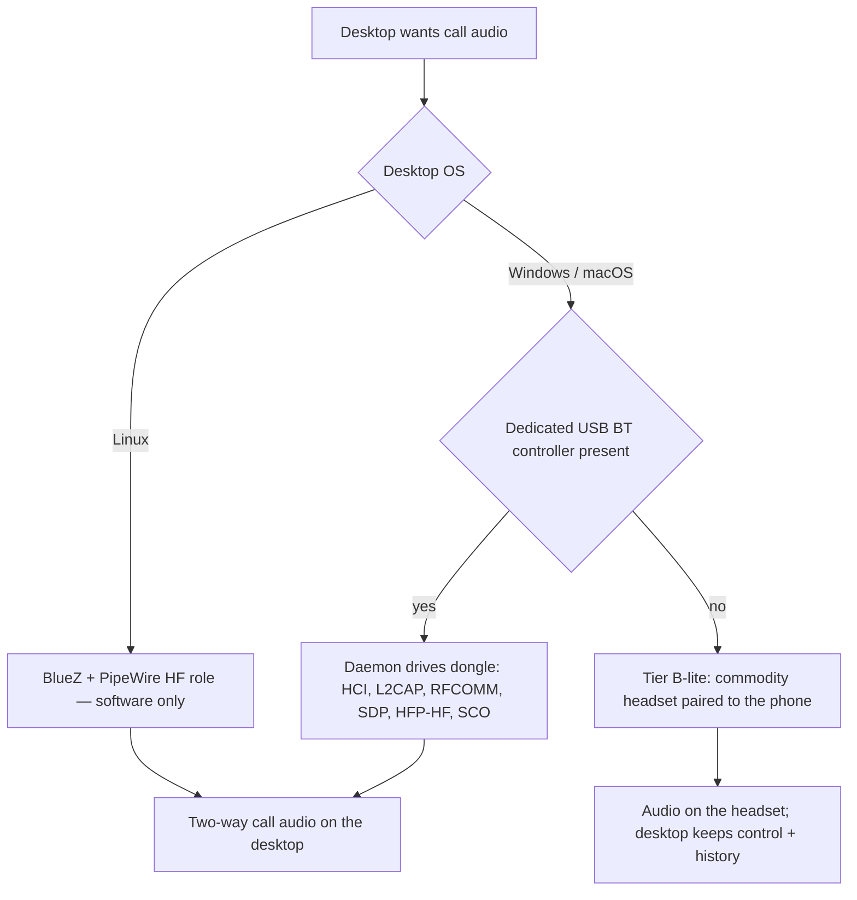

# Feasibility and Constraints

This is the engineering-reality document: what Android and each desktop OS actually permit,
where the walls are, and which mechanism Tandem uses on each side of a wall. Every OS-specific,
hardware-dependent, or vendor-gated claim carries a tier tag from the vocabulary in
[00-overview.md](00-overview.md). Anything stated here without a tag is a platform constraint
that binds every tier.

## 1. What Android Telecom grants a default dialer `[Tier A]`

Once the user grants Tandem the dialer role (`RoleManager.createRequestRoleIntent` with
`ROLE_DIALER`; minSdk 29 guarantees `RoleManager` exists), the system binds
`TandemInCallService` — an `android.telecom.InCallService` — for **every** call on the device
and hands it live `android.telecom.Call` objects. That single posture yields the whole Tier A
capability set:

- **Observe**: call added/removed callbacks, per-call state transitions
  (`CONNECTING`/`DIALING`/`RINGING`/`ACTIVE`/`HOLDING`/`DISCONNECTING`/`DISCONNECTED` — mirrored
  one-to-one by the `CallState` enum in `common.proto`), `Call.Details` capability bits,
  disconnect causes, conference membership, and audio-route changes via
  `onCallAudioStateChanged(CallAudioState)`.
- **Control**: `Call.answer`, `Call.reject`, `Call.disconnect`, `Call.hold`, `Call.unhold`,
  `Call.conference`/`Call.mergeConference`, `Call.playDtmfTone`/`Call.stopDtmfTone`,
  `InCallService.setMuted`, `InCallService.setAudioRoute`, and — API 28+ —
  `InCallService.requestBluetoothAudio(BluetoothDevice)` to steer audio at a *specific* bonded
  headset.
- **Originate**: `TelecomManager.placeCall(Uri, Bundle)` (requires `CALL_PHONE`), wrapped by
  `OutgoingCallPlacer` and always behind the `GuardEmergencyNumber` gate.
- **History**: paged reads of `android.provider.CallLog.Calls` (requires `READ_CALL_LOG`) plus a
  `ContentObserver` for change detection. The OS writes the log; Tandem only reads it
  (`WRITE_CALL_LOG` is never requested).
- **Line/SIM facts**: `READ_PHONE_STATE` and `READ_PHONE_NUMBERS` for SIM slot and line
  identity; `TelephonyManager.isEmergencyNumber` and `getEmergencyNumberList` for the emergency
  guard.

What Telecom does **not** require of Tandem: a `ConnectionService`. That API (and its
`MANAGE_OWN_CALLS` permission) exists for apps hosting their own self-managed VoIP calls. Tandem
drives carrier-managed SIM calls, for which default dialer + `InCallService` +
`TelecomManager.placeCall` is sufficient and correct — see
[03-android-app.md](03-android-app.md) for the full posture and ADR-0005.

Limits that shape the design:

- Capability bits are advisory reality: `Call.hold` on a call without
  `Call.Details.CAPABILITY_HOLD` fails, so the desktop UI must render capabilities from the
  mirrored `CallInfo.can_hold`/`can_merge` flags, not assume them.
- Only one default dialer exists per device. Losing the role (user switches back) makes Tandem
  inert as a gateway; `DefaultDialerManager` detects and surfaces this.
- The default-dialer contract obliges a complete handset dialer: dialpad, in-call UI usable
  without any desktop, and handling of `ACTION_DIAL`/`tel:` intents.

## 2. What Android withholds — the `CAPTURE_AUDIO_OUTPUT` wall

On stock, non-rooted Android, a third-party app **cannot capture call audio, in any tier, by
any API**:

- The `MediaRecorder.AudioSource` values `VOICE_CALL`, `VOICE_DOWNLINK`, and `VOICE_UPLINK` are
  gated behind `CAPTURE_AUDIO_OUTPUT`, a `signature|privileged` permission that installable apps
  cannot obtain.
- `AudioPlaybackCapture` (API 29) captures only app-rendered playback of allowed usages
  (`USAGE_MEDIA`, `USAGE_GAME`, `USAGE_UNKNOWN`); voice-call audio never transits that path — it
  runs through the modem/DSP and audio HAL below the app layer.
- There is **no API at all** to inject audio into the cellular uplink.

This wall is the founding constraint of the media plane (ADR-0002). The one sanctioned way call
audio leaves the phone is the same way it reaches a car kit: the phone's own Bluetooth stack
acting as HFP **Audio Gateway**, routing voice to a Hands-Free device over SCO/eSCO. So Tandem
puts a Hands-Free unit on the desk — in software `[Tier B — Linux]`, via dedicated hardware
`[Tier B — Win/macOS USB dongle]`, or as a commodity headset paired straight to the phone
`[Tier B-lite fallback]` — and never touches call audio in software on the phone. Consequently
`RECORD_AUDIO` and `CAPTURE_AUDIO_OUTPUT` are absent from the manifest by design (see
[12-permissions-and-platform.md](12-permissions-and-platform.md)).

## 3. Default-dialer requirement and Play Store policy `[Tier A]`

Being the default dialer is not optional for Tandem — `InCallService` binding and legal use of
the `phoneCall` foreground-service type both hang off `ROLE_DIALER`. The policy consequences:

- **Restricted permissions.** Google Play restricts the call-log permission group:
  `READ_CALL_LOG` is granted only to the device's default phone handler with an approved Play
  Console permissions declaration. Holding `ROLE_DIALER` is exactly the qualifying core use
  case, but the declaration work is a release-process obligation, not a code detail.
- **Complete-dialer obligation.** A default dialer that cannot ring, answer, and dial standalone
  is rejectable and user-hostile; the handset UI in
  [03-android-app.md](03-android-app.md) is a hard requirement, not a nicety.
- **Foreground-service typing.** targetSdk 35 requires typed declarations:
  `FOREGROUND_SERVICE`, `FOREGROUND_SERVICE_PHONE_CALL`, and
  `FOREGROUND_SERVICE_CONNECTED_DEVICE`, with the service declaring
  `android:foregroundServiceType="phoneCall|connectedDevice"`. The `phoneCall` type is legal
  precisely because Tandem holds `ROLE_DIALER`.
- **User friction.** Users must consciously replace their stock dialer, and can revert at any
  time; onboarding and graceful degradation on role loss are part of the product (matrix of
  every permission, when it is requested, and what degrades if denied:
  [12-permissions-and-platform.md](12-permissions-and-platform.md)).

## 4. Bluetooth HFP Hands-Free role support per desktop OS

The phone side is uniform: Android's Bluetooth stack implements the HFP Audio Gateway; Tandem
observes and steers it (`BLUETOOTH_CONNECT` to enumerate bonds and headset-profile state) but
never reimplements it. The desktop side is where OS support diverges. One general physics note:
SCO/eSCO shares the 2.4 GHz band with Wi-Fi, so heavy co-channel congestion degrades voice —
another reason the same-room premise is a feature. Protocol depth (SLC, AT commands, CVSD/mSBC,
latency of roughly 40–80 ms added) lives in [05-bluetooth-hfp.md](05-bluetooth-hfp.md).

### Linux `[Tier B — Linux]`

BlueZ exposes profile registration to user space: a process registers the HF UUID through the
D-Bus Profile API and receives the RFCOMM connection for the service-level connection, with
kernel SCO sockets carrying voice. PipeWire's native Bluetooth backend already implements the HF
role end to end, which is why Linux is the software-only tier: the `linux_bluez` backend of the
`BluetoothBackend` trait (see [04-desktop-app.md](04-desktop-app.md)) needs no hardware beyond
the machine's ordinary Bluetooth adapter.

### Windows `[Tier B — Win/macOS USB dongle]`

The in-box Windows stack implements hands-free calling for the OS's own features, but exposes
**no API for an application to take the HF role or touch SCO audio**: Windows Bluetooth sockets
(`AF_BTH`) support RFCOMM only, and the profile drivers are not pluggable from user space.
Tandem's path is a **dedicated USB Bluetooth controller** (standard HCI-over-USB class device)
detached from the in-box driver and bound to WinUSB, so `tandem-daemon` owns the controller and
implements HCI, L2CAP, RFCOMM, SDP, and HFP-HF itself — a clean-room implementation of the
published Bluetooth SIG Core and HFP v1.8 specifications, not reverse engineering of any
product. Driver rebinding needs one-time administrator action (packaging details in
[12-permissions-and-platform.md](12-permissions-and-platform.md)).

### macOS `[Tier B — Win/macOS USB dongle]`

IOBluetooth offers RFCOMM and L2CAP channels to apps, but the system daemon owns the HFP profile
and SCO audio; Core Bluetooth is LE-only. Same answer as Windows: an external USB controller
claimed from user space. Caveat stated honestly: macOS may bind its own stack to a recognized
controller first, so supported-dongle selection matters — the `tools/usb-dongle-probe` utility
exists to verify a specific dongle can be claimed before the daemon relies on it.

### No-dongle fallback `[Tier B-lite fallback]`

Any commodity Bluetooth speakerphone or earbuds paired directly to the phone carries the audio;
the desktop keeps the full control plane and history. This is a first-class supported mode (the
`null` backend of `BluetoothBackend`), not a degraded state: it requires zero desktop Bluetooth
work and is the default answer on Windows/macOS without a dongle.

### Sanctioned platform audio `[Tier C — needs vendor support]`

A future AOSP/OEM "call-audio companion" API — the capability class Android Auto projection
uses — would let the phone hand call audio to a companion device without HFP. No such API is
available to third-party apps today. Tandem's only obligation now is architectural: the
`CallMediaProvider` port on Android and the `BluetoothBackend`/`AudioBackend` traits on the
desktop keep a Tier C backend drop-in-replaceable (ADR-0010).

## 5. Battery, Doze, and process lifetime on the phone `[Tier A]`

`GatewayForegroundService` (types `phoneCall|connectedDevice`) keeps the LAN server, NSD
advertisement, and telecom observation alive and exempts the process from cached-process kills
and App Standby. It does **not** beat deep Doze:

- When the device is stationary, unplugged, and screen-off long enough, Doze suspends network
  access for all apps outside maintenance windows — foreground service or not. TLP heartbeats
  (5 s interval, 15 s dead-peer; see
  [06-transport-and-protocol.md](06-transport-and-protocol.md)) will stall and the desktop will
  honestly show the phone unreachable until a maintenance window or wake-up.
- Incoming calls are unaffected as calls: telephony wakes the device, `TandemInCallService`
  runs, and `IncomingCallEvent` is delivered as connectivity resumes — worst case a few seconds
  late, and answering on the handset always works.
- Mitigations, in order of preference: keep the phone charging at the desk (charging defeats
  Doze; also the typical Tandem posture); user-granted battery-optimization exemption — Tandem
  deep-links to the OS settings screen rather than declaring
  `REQUEST_IGNORE_BATTERY_OPTIMIZATIONS`, keeping the manifest to the set in
  [12-permissions-and-platform.md](12-permissions-and-platform.md); Wi-Fi kept on during sleep.
- OEM-specific task killers (aggressive vendor battery managers) can still kill the service;
  onboarding surfaces vendor guidance when such a device is detected. `RECEIVE_BOOT_COMPLETED`
  autostart exists but is off by default.

## 6. Emergency-call handling

Policy, restated from [00-overview.md](00-overview.md) (canonical decision: ADR-0008): the
desktop is never an emergency-calling device. Mechanics:

- Every `DialRequest` passes `GuardEmergencyNumber`, backed by
  `TelephonyManager.isEmergencyNumber` with a conservative static fallback (112/911) when
  telephony is unavailable; matches are refused with `ERROR_CODE_EMERGENCY_NUMBER_BLOCKED` and
  the desktop UI directs the user to the handset.
- The desktop pre-checks locally against the emergency-number list synced from the phone —
  defense in depth, with the phone authoritative.
- An emergency call active on the phone (`CallInfo.is_emergency`) is mirrored read-only: control
  requests are refused with `ERROR_CODE_INVALID_CALL_STATE`, `AudioRouteRequest` is refused with
  `ERROR_CODE_AUDIO_ROUTE_UNAVAILABLE`, and the OS owns audio routing for the call's duration.
- Rationale: a desktop-originated emergency call has no reliable caller location and must never
  be silently bridged. Sequence: [10-sequence-diagrams.md](10-sequence-diagrams.md), flow (j).

## 7. Capability map

Definitions for the audio rows: **audio-out** = the far end heard on the desktop; **audio-in** =
the desktop microphone feeding the call uplink.

| Capability | Exact Android API / Bluetooth mechanism | Permission / role | Tier |
|---|---|---|---|
| Dial | `TelecomManager.placeCall(Uri, Bundle)` behind the `GuardEmergencyNumber` gate; TLP `DialRequest` | `CALL_PHONE` + `ROLE_DIALER` | `[Tier A]` |
| Answer | `android.telecom.Call.answer` inside `TandemInCallService`; first valid TLP `AnswerRequest` wins across desktops | `ROLE_DIALER` (system binds the `InCallService`); `ANSWER_PHONE_CALLS` not needed, not requested | `[Tier A]` |
| Mute | `InCallService.setMuted` with an absolute target state; TLP `MuteRequest` (idempotent) | `ROLE_DIALER` | `[Tier A]` |
| Hold | `Call.hold` / `Call.unhold`, gated by `Call.Details.CAPABILITY_HOLD` mirrored as `CallInfo.can_hold`; TLP `HoldRequest` / `UnholdRequest` (idempotent) | `ROLE_DIALER` | `[Tier A]` |
| Merge | `Call.conference` / `Call.mergeConference`, gated by merge capability bits mirrored as `CallInfo.can_merge`; TLP `MergeRequest` | `ROLE_DIALER` | `[Tier A]` |
| End | `Call.disconnect`; `Call.reject` while `CALL_STATE_RINGING`; TLP `EndRequest` / `RejectRequest` | `ROLE_DIALER` | `[Tier A]` |
| DTMF | `Call.playDtmfTone` + `Call.stopDtmfTone`, digits sequenced with standard Telecom timing; TLP `SendDtmfRequest` | `ROLE_DIALER` | `[Tier A]` |
| History | Paged `android.provider.CallLog.Calls` queries + `ContentObserver` version bumps; TLP `CallLogSyncRequest` / `CallLogSyncResponse` / `CallLogChangedEvent` | `READ_CALL_LOG` (read-only; `WRITE_CALL_LOG` never requested) | `[Tier A]` |
| Audio-out | Phone: `InCallService.setAudioRoute` / `requestBluetoothAudio(BluetoothDevice)` steers the AG at the desktop's bonded HF (triggered by TLP `AudioRouteRequest`); voice rides the HFP SCO/eSCO downlink; desktop renders through the `AudioBackend` trait | Phone: `ROLE_DIALER` + `BLUETOOTH_CONNECT`; desktop: HF role per section 4 | `[Tier B — Linux]`, `[Tier B — Win/macOS USB dongle]`; `[Tier B-lite fallback]` renders on a commodity headset instead |
| Audio-in | Desktop captures the mic via `AudioBackend` and transmits the HFP SCO/eSCO uplink; the phone's Bluetooth stack (AG) feeds the cellular uplink — Android's stack, never Tandem software on the phone | Same as audio-out | `[Tier B — Linux]`, `[Tier B — Win/macOS USB dongle]`; `[Tier B-lite fallback]` captures on a commodity headset instead |

The through-line of the table: everything above the audio rows is pure Tier A and ships without
a single line of Bluetooth code; the audio rows are exactly where OS and hardware gates begin,
and even there the phone-side mechanism is stock Android steering its own AG.
