# 03 — Android App (Tandem Gateway)

The Android app — **Tandem Gateway**, package `com.tandem.gateway` — is the authoritative half of
Tandem. It is a full default dialer (usable stand-alone with zero desktop involvement), and it is
the gateway that lets paired desktops drive the phone's real SIM calls over the LAN control plane.
The phone owns call state, the call log, and the paired-desktop trust list (ADR-0007); desktops
hold derived mirrors. Baselines (13-build-and-setup.md): minSdk 29 (Android 10), targetSdk 35,
compileSdk 35, Kotlin 2.0.x, AGP 8.7.x, Hilt for DI, Jetpack Compose UI, Ktor (CIO) embedded
server for the LAN listener, Room, DataStore.

Everything in this document except the `bluetooth/` package and `RequestAudioRoute` is `[Tier A]`
— independently shippable with zero Bluetooth audio work. The phone-side audio-routing code is
exercised by `[Tier B — Linux]` and `[Tier B — Win/macOS USB dongle]` desktops alike; under
`[Tier B-lite fallback]` no desktop Hands-Free unit exists, the OS routes call audio to whatever
commodity headset is bonded, and Tandem merely mirrors the route in `CallSnapshot.audio_route`.

## Layered architecture

The app follows the global layering rules (see 14-coding-conventions.md):

1. `domain` — pure models + use-cases, **no framework dependencies**. `domain/model` holds
   framework-free data types, `domain/port` holds an interface over every I/O boundary
   (telecom, Bluetooth, sockets, storage), `domain/usecase` holds one orchestration per
   user-facing capability.
2. Implementation packages (`telecom`, `dialer`, `calllog`, `transport`, `pairing`, `crypto`,
   `bluetooth`, `service`, `data`) implement the ports. They are the only code that touches
   Android framework APIs.
3. `ui` — Compose screens and ViewModels. ViewModels project use-case output into UI state and
   dispatch commands back through use-cases.

Rules: depend on interfaces, not concretions (Hilt binds port → impl; see DI wiring below). No
business logic in UI or framework callbacks — `TandemInCallService` callbacks forward to
`TelecomBridgeImpl` and stop; `InCallViewModel` dispatches through the same use-cases the LAN
path uses, so there is exactly one command path for both surfaces. Shared behavior lives in one
place (e.g. the emergency guard is only in `GuardEmergencyNumber`). Every port has a fake in
`testkit/` (see 15-testing-strategy.md). Each source file carries a single file-level KDoc
docstring and no other narration (see 14-coding-conventions.md); the Module Map below reproduces
each docstring verbatim from REPO-STRUCTURE.md.

### Module / interface diagram

```mermaid
flowchart TB
    subgraph ui_layer["ui — Compose presentation"]
        MAIN["MainActivity"]
        INCALL_UI["incall: InCallActivity, InCallScreen, InCallViewModel, IncomingCallNotifier"]
        SCREENS["status, pairing, settings, dialpad screens + ViewModels"]
    end

    subgraph domain_layer["domain — framework-free"]
        USECASES["usecase — 15 call, sync, pairing, and guard use-cases"]
        subgraph ports["domain.port"]
            P_TB["TelecomBridge"]
            P_CMP["CallMediaProvider"]
            P_LAN["LanServer"]
            P_PAIR["PairingManager"]
            P_CLR["CallLogRepository"]
            P_PDR["PairedDeviceRepository"]
            P_IDS["IdentityStore"]
            P_SET["SettingsRepository"]
            P_EMG["EmergencyNumberSource"]
        end
        MODELS["model: Call, CallLogEntry, PairedDesktop, AudioRoute, DeviceIdentity"]
    end

    subgraph impl_layer["implementation packages"]
        TEL["telecom"]
        DIAL["dialer"]
        CLOG["calllog"]
        TRANS["transport"]
        PAIRP["pairing"]
        CRYPT["crypto"]
        BT["bluetooth"]
        SVC["service"]
        DATA["data"]
    end

    subgraph os_layer["Android platform"]
        TELECOM_OS["android.telecom — InCallService, TelecomManager"]
        NSD_OS["NsdManager"]
        BTSTACK["Bluetooth stack — the HFP Audio Gateway"]
        KEYSTORE["Android Keystore"]
        STORE_OS["Room + DataStore"]
        CALLLOG_OS["CallLog provider"]
    end

    MAIN --> SCREENS
    SCREENS --> USECASES
    INCALL_UI --> USECASES
    USECASES --> P_TB
    USECASES --> P_CMP
    USECASES --> P_LAN
    USECASES --> P_PAIR
    USECASES --> P_CLR
    USECASES --> P_PDR
    USECASES --> P_EMG
    USECASES --> MODELS

    TEL -. implements .-> P_TB
    BT -. implements .-> P_CMP
    TRANS -. implements .-> P_LAN
    PAIRP -. implements .-> P_PAIR
    CLOG -. implements .-> P_CLR
    DATA -. implements .-> P_PDR
    DATA -. implements .-> P_SET
    CRYPT -. implements .-> P_IDS
    DIAL -. implements .-> P_EMG

    SVC --> TRANS
    TRANS --> USECASES
    TEL --> TELECOM_OS
    DIAL --> TELECOM_OS
    TRANS --> NSD_OS
    BT --> BTSTACK
    CRYPT --> KEYSTORE
    DATA --> STORE_OS
    CLOG --> CALLLOG_OS
```



The dashed edges are Hilt `@Binds` relationships (port → implementation). `TRANS --> USECASES`
is `ControlPlaneRouter` dispatching decoded requests; `SVC --> TRANS` is
`GatewayForegroundService` hosting the LAN server's lifecycle.

## Source tree

Copied from REPO-STRUCTURE.md (canonical). Generated files — `android/gradlew`,
`android/gradlew.bat`, `res/mipmap-*/` launcher icons, protobuf codegen output, build
directories — are not hand-authored and not listed.

```text
android/
├── settings.gradle.kts
├── build.gradle.kts
├── gradle.properties
├── gradle/
│   ├── libs.versions.toml
│   └── wrapper/gradle-wrapper.properties
└── app/
    ├── build.gradle.kts
    ├── proguard-rules.pro
    └── src/
        ├── main/
        │   ├── AndroidManifest.xml
        │   ├── res/values/strings.xml
        │   ├── res/values/themes.xml
        │   └── kotlin/com/tandem/gateway/
        │       ├── TandemApplication.kt
        │       ├── di/
        │       │   ├── AppModule.kt
        │       │   ├── TelecomModule.kt
        │       │   ├── TransportModule.kt
        │       │   └── DataModule.kt
        │       ├── domain/
        │       │   ├── model/
        │       │   │   ├── Call.kt
        │       │   │   ├── CallLogEntry.kt
        │       │   │   ├── PairedDesktop.kt
        │       │   │   ├── AudioRoute.kt
        │       │   │   └── DeviceIdentity.kt
        │       │   ├── port/
        │       │   │   ├── TelecomBridge.kt
        │       │   │   ├── CallMediaProvider.kt
        │       │   │   ├── LanServer.kt
        │       │   │   ├── PairingManager.kt
        │       │   │   ├── CallLogRepository.kt
        │       │   │   ├── PairedDeviceRepository.kt
        │       │   │   ├── IdentityStore.kt
        │       │   │   ├── SettingsRepository.kt
        │       │   │   └── EmergencyNumberSource.kt
        │       │   └── usecase/
        │       │       ├── PlaceCall.kt
        │       │       ├── AnswerCall.kt
        │       │       ├── RejectCall.kt
        │       │       ├── EndCall.kt
        │       │       ├── SetMute.kt
        │       │       ├── HoldCall.kt
        │       │       ├── UnholdCall.kt
        │       │       ├── MergeCalls.kt
        │       │       ├── SendDtmf.kt
        │       │       ├── RequestAudioRoute.kt
        │       │       ├── ObserveCallState.kt
        │       │       ├── SyncCallLog.kt
        │       │       ├── PairDesktop.kt
        │       │       ├── RevokeDesktop.kt
        │       │       └── GuardEmergencyNumber.kt
        │       ├── telecom/
        │       │   ├── TandemInCallService.kt
        │       │   ├── TelecomBridgeImpl.kt
        │       │   └── CallStateMapper.kt
        │       ├── dialer/
        │       │   ├── DefaultDialerManager.kt
        │       │   ├── OutgoingCallPlacer.kt
        │       │   ├── DialIntentRouter.kt
        │       │   └── EmergencyNumberSourceImpl.kt
        │       ├── calllog/
        │       │   ├── CallLogRepositoryImpl.kt
        │       │   └── CallLogObserver.kt
        │       ├── transport/
        │       │   ├── LanServerImpl.kt
        │       │   ├── NsdAdvertiser.kt
        │       │   ├── DesktopSession.kt
        │       │   ├── SessionRegistry.kt
        │       │   ├── EnvelopeCodec.kt
        │       │   └── ControlPlaneRouter.kt
        │       ├── pairing/
        │       │   ├── PairingManagerImpl.kt
        │       │   ├── PairingSession.kt
        │       │   └── QrPayloadCodec.kt
        │       ├── crypto/
        │       │   ├── IdentityStoreImpl.kt
        │       │   ├── DeviceCertificates.kt
        │       │   ├── TlsServerFactory.kt
        │       │   └── Fingerprints.kt
        │       ├── bluetooth/
        │       │   ├── HfpAgMonitor.kt
        │       │   ├── HfpCallMediaProvider.kt
        │       │   └── BondedDesktopMatcher.kt
        │       ├── service/
        │       │   ├── GatewayForegroundService.kt
        │       │   ├── GatewayNotifications.kt
        │       │   └── BootCompletedReceiver.kt
        │       ├── data/
        │       │   ├── db/
        │       │   │   ├── TandemDatabase.kt
        │       │   │   ├── PairedDesktopDao.kt
        │       │   │   └── PairedDesktopEntity.kt
        │       │   ├── PairedDeviceRepositoryImpl.kt
        │       │   └── SettingsRepositoryImpl.kt
        │       └── ui/
        │           ├── MainActivity.kt
        │           ├── theme/Theme.kt
        │           ├── status/StatusScreen.kt
        │           ├── status/StatusViewModel.kt
        │           ├── pairing/PairingScreen.kt
        │           ├── pairing/PairingViewModel.kt
        │           ├── settings/SettingsScreen.kt
        │           ├── settings/SettingsViewModel.kt
        │           ├── incall/InCallActivity.kt
        │           ├── incall/InCallScreen.kt
        │           ├── incall/InCallViewModel.kt
        │           ├── incall/IncomingCallNotifier.kt
        │           ├── dialpad/DialpadScreen.kt
        │           └── dialpad/DialpadViewModel.kt
        └── test/kotlin/com/tandem/gateway/testkit/
            ├── FakeTelecomBridge.kt
            ├── FakeCallMediaProvider.kt
            ├── FakeCallLogRepository.kt
            ├── FakePairedDeviceRepository.kt
            ├── FakeIdentityStore.kt
            ├── FakeSettingsRepository.kt
            └── InMemoryLanServer.kt
```

## Subsystems

### Default-dialer registration (RoleManager)

`dialer/DefaultDialerManager.kt` wraps `RoleManager`: it reports whether the app currently holds
`ROLE_DIALER` and builds `RoleManager.createRequestRoleIntent(RoleManager.ROLE_DIALER)` for the
onboarding flow launched from `MainActivity`. `ROLE_DIALER` is a role, not a permission — the
user grants it in a system sheet, and eligibility requires the manifest components below: an
activity handling `ACTION_DIAL` with and without a `tel:` URI, and an `InCallService` declared
with the `BIND_INCALL_SERVICE` permission. Until the role is granted the app is inert as a
gateway: `TandemInCallService` never binds, `TelecomManager.placeCall` is unavailable, and
`StatusScreen` shows the role as the first unmet prerequisite. If the user later switches
default dialers, Telecom unbinds the service; `StatusViewModel` surfaces the degradation and
offers re-request. Play Store policy implications of shipping a default dialer are covered in
12-permissions-and-platform.md. `[Tier A]`

### InCallService integration — and the explicit ConnectionService posture

`telecom/TandemInCallService.kt` is the app's `android.telecom.InCallService`. While Tandem is
the default dialer, Telecom binds it and delivers every carrier call as an
`android.telecom.Call` plus `CallAudioState` callbacks. The service does exactly two things:
forward objects and callbacks to `TelecomBridgeImpl`, and launch the handset in-call UI — no
business logic in framework callbacks. `TelecomBridgeImpl` is the single class that touches
`android.telecom.Call`: it mints stable `call_id`s (the ids that appear in `CallInfo.call_id` on
the wire), executes answer/reject/end/hold/unhold/merge/mute/DTMF on the right `Call`, and emits
domain events. `CallStateMapper` is a stateless pure function from telecom state, details, and
capabilities to the domain `Call` model, including `DisconnectCause` translation — unit-tested
exhaustively with no Android dependency.

**ConnectionService posture (binding):** Tandem does **NOT** implement a
`ConnectionService` and does **NOT** use `MANAGE_OWN_CALLS`. Those APIs exist for apps hosting
their own self-managed (VoIP) calls — apps that *are* the call's source. Tandem drives
carrier-managed SIM calls that Android Telephony already hosts; for that, default-dialer status
+ `InCallService` (observe and control every call) + `TelecomManager.placeCall` (originate) is
sufficient and correct. Implementing a `ConnectionService` would create a second, fictitious
call source and buy nothing. Doc 12 lists `MANAGE_OWN_CALLS` in the NOT-requested set. `[Tier A]`

### Dialing path, including the emergency guard

Two entry surfaces converge on one use-case:

- **Desktop:** `DialRequest` arrives in a `DesktopSession` (which enforces the 5/min/session
  dial rate limit), `ControlPlaneRouter` dispatches to `PlaceCall`, which runs
  `GuardEmergencyNumber` first. A match is refused with a typed `EmergencyNumberBlocked` result
  that `ControlPlaneRouter` maps to `Ack{Status{code: ERROR_CODE_EMERGENCY_NUMBER_BLOCKED}}`;
  the desktop UI then instructs the user to dial on the handset (ADR-0008).
- **Handset:** `DialpadScreen` → `DialpadViewModel` → `PlaceCall`. The guard applies only to
  desktop-originated dials; handset dials pass through, because the handset is the sanctioned
  emergency path with carrier location facilities.

Past the guard, `PlaceCall` delegates to `TelecomBridge.dial`, which invokes
`dialer/OutgoingCallPlacer.kt` — the `TelecomManager.placeCall` wrapper (requires `CALL_PHONE` +
`ROLE_DIALER`). `GuardEmergencyNumber` classifies via the `EmergencyNumberSource` port, backed by
`EmergencyNumberSourceImpl` over `TelephonyManager.isEmergencyNumber` /
`getEmergencyNumberList`, with a conservative static fallback (112/911) when telephony is
unavailable; it also exposes the emergency-number list the phone syncs to desktops for their
local pre-check, and flags active emergency calls so remote control and audio-route requests are
refused while one is live (`CallInfo.is_emergency` is read-only surfacing).
`dialer/DialIntentRouter.kt` completes the default-dialer contract: external `ACTION_DIAL` /
`tel:` intents open the dialpad with the number prefilled and are never auto-placed. `[Tier A]`

### Call-log repository

`calllog/CallLogRepositoryImpl.kt` implements the read-only `CallLogRepository` port over
`android.provider.CallLog.Calls` (`READ_CALL_LOG`): paged, timestamp-bounded projections capped
at 200 entries per page, matching `CallLogSyncRequest{since_ms, max_entries}`.
`calllog/CallLogObserver.kt` registers a `ContentObserver` on the provider, bumps the persisted
monotonic `log_version`, and emits change notifications that `SyncCallLog` and the transport
layer turn into `CallLogChangedEvent` fan-outs. The desktop cache is a read-only projection of
the phone's OS call log; the phone never writes the OS call log on a desktop's behalf
(`WRITE_CALL_LOG` is not requested). Retention/refresh policy: 09-data-models.md. `[Tier A]`

### LAN control server

`transport/LanServerImpl.kt` implements the `LanServer` port as a Ktor (CIO) WebSocket endpoint
over mutual TLS 1.3 (context built by `TlsServerFactory`), default TCP port 46521 (override via
`SettingsRepository`), one protobuf `Envelope` per binary frame, 256 KiB max. It accepts paired
desktops (client cert verified against pinned SPKI hashes) and provisional pairing sessions, and
knows nothing about message semantics. Per connection, `DesktopSession` runs the
`SessionHello`/`SessionWelcome` handshake and version negotiation, `ResumeRequest`/
`ResumeResponse` reconciliation, 5 s heartbeats with 15 s dead-peer detection, per-session rate
limits, and serialized outbound event delivery tracked by `(epoch_id, state_seq)` — one
coroutine per session, no shared mutable state. `SessionRegistry` fans call/log events out to
all live sessions, enforces revocation, and provides the atomic claim primitive `AnswerCall`
uses for first-answer-wins arbitration (losers get `Ack{ERROR_CODE_ALREADY_HANDLED}` plus the
resulting `CallStateChangedEvent`). `EnvelopeCodec` is the only Android file that imports
generated proto classes (ADR-0009); `ControlPlaneRouter` dispatches decoded requests to
use-cases and maps results onto `Ack`/typed responses. Full framing, catalog, and lifecycle: see
06-transport-and-protocol.md. `[Tier A]`

### NSD/mDNS discovery

`transport/NsdAdvertiser.kt` advertises `_tandem._tcp` via `NsdManager` with TXT keys `v`
(protocol version), `id` (phone device id), and `name` (display name); the actual listening port
travels in the SRV record. It re-registers on network change (driven by `ACCESS_NETWORK_STATE`
connectivity callbacks) and the advertisement carries no secrets — discovery reveals only
service name/version/id. The desktop side of discovery is in 04-desktop-app.md. `[Tier A]`

### Pairing

`pairing/PairingManagerImpl.kt` implements the `PairingManager` port: it opens a 120 s
single-use pairing window, exposes the QR payload built by `QrPayloadCodec` (host, port, SPKI
fingerprint, one-time token, name — format pinned in 07-pairing-and-auth.md), validates
incoming `PairingRequest` tokens, drives the user confirmation sheet on `PairingScreen`, and
finalizes through the `PairDesktop` use-case, which persists the accepted desktop via
`PairedDeviceRepository` and produces the `PairingDecision` payload (including the
phone-assigned UUIDv4 `desktop_device_id`). `PairingSession` is the per-candidate state machine
— TokenPresented, AwaitingConfirm (with the optional 6-digit short-code comparison on the
manual-entry path, signalled by `PairingAwaitConfirmEvent{require_short_code}`), Accepted,
Rejected, Expired — and only one candidate is admitted at a time. Revocation is immediate:
`RevokeDesktop` flags the row and instructs `LanServer` to emit `RevokedEvent` and close live
sessions before returning; subsequent TLS handshakes from that SPKI are rejected. Protocol-level
detail and re-pairing after key loss: 07-pairing-and-auth.md.

### Crypto and Keystore

`crypto/IdentityStoreImpl.kt` implements `IdentityStore` over Android Keystore (StrongBox when
available): a non-exportable P-256 identity keypair generated on first run; private-key
operations never leave the Keystore, callers only see public artifacts (`DeviceIdentity`).
`DeviceCertificates` wraps the public key in a long-lived (3650-day) self-signed X.509
certificate used strictly as a TLS carrier — trust is pinned SPKI-SHA256, never chains or
expiry (ADR-0006). `TlsServerFactory` assembles the TLS 1.3-only server context for
`LanServerImpl`: presents the device cert, requires client certs, verifies peers against
`PairedDeviceRepository` pins, and admits unknown peers only into the provisional pairing path.
`Fingerprints` holds the pure helpers: SPKI-SHA256, base64url, and the 6-digit short code
derived via HKDF-SHA256 over both SPKI hashes plus the TLS exporter binding. Threat model and
rotation policy: 08-security-and-encryption.md.

### Bluetooth HFP AG-side coordination

The phone is the HFP **Audio Gateway**, and the AG is implemented by Android's Bluetooth stack —
Tandem observes and steers routing, it never reimplements the AG, opens SCO sockets, or touches
call audio in software (on stock non-rooted Android, `VOICE_CALL`/`VOICE_DOWNLINK`/
`VOICE_UPLINK` capture is gated behind the `signature|privileged` permission
`CAPTURE_AUDIO_OUTPUT`, and there is no uplink-injection API — the entire reason Tandem bridges
audio over HFP; see 02-feasibility-and-constraints.md).

- `HfpAgMonitor` observes `BluetoothHeadset` profile state via the `BluetoothProfile` proxy
  (`BLUETOOTH_CONNECT`): which bonded devices hold an HFP link, and SCO audio state changes.
- `HfpCallMediaProvider` implements the `CallMediaProvider` port: it executes
  `AudioRouteRequest` by calling `InCallService.setAudioRoute` / `requestBluetoothAudio` toward
  the desktop's bonded HF device, reports route reality from `CallAudioState` callbacks (which
  become `AudioRouteChangedEvent`s), and falls back to earpiece automatically if SCO drops — the
  call itself is never touched.
- `BondedDesktopMatcher` resolves a paired desktop's stored BT MAC (from
  `SessionHello.bt_adapter_address`, persisted at pairing time) to a live bonded
  `BluetoothDevice`, and reports unbonded desktops so UX can prompt standard Bluetooth bonding.

**Single-command-path rule:** the desktop never issues HFP AT call-control commands;
all user intent travels over the LAN control plane, and the HFP link carries audio, codec
negotiation, indicator mirroring as a consistency check, and volume sync. LAN is the intent
source; HFP reflects reality. See 05-bluetooth-hfp.md. This package serves `[Tier B — Linux]`
and `[Tier B — Win/macOS USB dongle]` identically — the phone side cannot tell which HF
implementation is on the other end. Under `[Tier B-lite fallback]` it stays dormant apart from
route mirroring. A future `[Tier C — needs vendor support]` backend would implement the same
`CallMediaProvider` port (ADR-0010).

### Foreground service and process lifecycle (including Doze)

`GatewayForegroundService` is the long-lived host for the LAN server, NSD advertisement, and
telecom observation, declared with `android:foregroundServiceType="phoneCall|connectedDevice"`.
The modern typed-FGS rules (targetSdk 34+) make these legal for Tandem specifically:

- `phoneCall` requires the app to hold `ROLE_DIALER` (or `MANAGE_OWN_CALLS`, which Tandem does
  not use) — Tandem qualifies through the role, plus the declared
  `FOREGROUND_SERVICE_PHONE_CALL` permission.
- `connectedDevice` eligibility is satisfied by the declared `BLUETOOTH_CONNECT` permission and
  covers the persistent LAN/Bluetooth device coordination, plus the declared
  `FOREGROUND_SERVICE_CONNECTED_DEVICE` permission.

`TandemApplication` schedules service startup when a paired desktop exists; there is nothing to
host before first pairing. `GatewayNotifications` builds the persistent status notification
(connected desktops, audio-route state) on its own channel set; incoming-call notifications are
`IncomingCallNotifier`'s job exclusively. `BootCompletedReceiver` restarts the service after
reboot only when the user has opted into autostart (default off).

**Doze reality:** a foreground service keeps the process alive but does not prevent Doze from
suspending network in deep idle. When that happens, desktops detect the dead peer at 15 s of
heartbeat silence and reconnect with `ResumeRequest` once the network returns; the
`(epoch_id, state_seq)` resume protocol makes the gap harmless. Incoming calls always wake the
device through telephony regardless of Doze, so ringing is never missed — at worst the desktop
learns of it on reconnect. Battery guidance and measured behavior: see
02-feasibility-and-constraints.md. `[Tier A]`

### DI wiring (Hilt)

`TandemApplication` hosts the Hilt component graph. Four modules, all bindings-only with no
logic: `AppModule` (dispatchers, monotonic clock, application context), `TelecomModule`
(`TelecomBridge` → `TelecomBridgeImpl`, `CallMediaProvider` → `HfpCallMediaProvider`,
`EmergencyNumberSource` → `EmergencyNumberSourceImpl`), `TransportModule` (`LanServer` →
`LanServerImpl`, `PairingManager` → `PairingManagerImpl`, `IdentityStore` →
`IdentityStoreImpl`), and `DataModule` (provides `TandemDatabase`, DAOs, DataStore; binds
`CallLogRepository`, `PairedDeviceRepository`, `SettingsRepository`). Because use-cases take
ports via constructor injection, unit tests bypass Hilt entirely and construct use-cases with
the `testkit/` fakes; Hilt exists to assemble the real graph, not to enable testing.

## Permissions

Full matrix (why-needed / when-requested / degradation-if-denied) is owned by
12-permissions-and-platform.md; this is the binding list.

| Declared | Justification |
|---|---|
| `ROLE_DIALER` (role, not permission) | Requested via `RoleManager` at onboarding. Prerequisite for `InCallService` binding, `TelecomManager.placeCall`, and the `phoneCall` FGS type. |
| `READ_CALL_LOG` | Call-history sync — the read-only mirror served to desktops. |
| `READ_PHONE_STATE` | Line/SIM info. |
| `READ_PHONE_NUMBERS` | Line/SIM info. |
| `CALL_PHONE` | Required by `TelecomManager.placeCall`. |
| `BLUETOOTH_CONNECT` | Enumerate bonded devices / headset profile state; Tier B audio routing only. Also satisfies `connectedDevice` FGS eligibility. |
| `BLUETOOTH` (`android:maxSdkVersion="30"`) | Legacy pre-API-31 equivalent of `BLUETOOTH_CONNECT` for the `BluetoothHeadset` profile proxy; install-time, capped at API 30. |
| `POST_NOTIFICATIONS` | Incoming-call and gateway status notifications. |
| `USE_FULL_SCREEN_INTENT` | Incoming-call UI over the lock screen (`IncomingCallNotifier`). On targetSdk 34+ this is special app access, auto-granted to apps whose core function is calling — Tandem qualifies through `ROLE_DIALER`, so no `ACTION_MANAGE_APP_USE_FULL_SCREEN_INTENT` prompt is needed. |
| `FOREGROUND_SERVICE` | Base FGS permission for `GatewayForegroundService`. |
| `FOREGROUND_SERVICE_PHONE_CALL` | Typed FGS permission; legal because the app holds `ROLE_DIALER`. |
| `FOREGROUND_SERVICE_CONNECTED_DEVICE` | Typed FGS permission for the LAN/Bluetooth coordination role of the service. |
| `INTERNET` | LAN listener sockets (Ktor server). |
| `ACCESS_NETWORK_STATE` | Network-change detection for NSD re-registration. |
| `RECEIVE_BOOT_COMPLETED` | Optional autostart, default off. |

Explicitly **NOT** requested:

| Not requested | Why |
|---|---|
| `MANAGE_OWN_CALLS` | For self-managed `ConnectionService` VoIP calls; Tandem drives carrier-managed calls (see posture above). |
| `ANSWER_PHONE_CALLS` | Unneeded for a default dialer — `InCallService` answers. |
| `WRITE_CALL_LOG` | The mirror is read-only. |
| `RECORD_AUDIO` | Tandem never records. |
| `CAPTURE_AUDIO_OUTPUT` | Unobtainable (`signature\|privileged`); the entire point of the HFP design. |

## AndroidManifest.xml

Structure, top to bottom: (1) the `uses-permission` block from the declared list above,
including the `android:maxSdkVersion="30"`-capped legacy `BLUETOOTH` declaration — nothing more;
(2) the `<application>` element naming `TandemApplication`; (3) five components: `MainActivity`
(launcher plus the `ACTION_DIAL` filters, with and without `tel:` data, that `ROLE_DIALER`
eligibility requires — handled in code by `DialIntentRouter`), `InCallActivity` (not exported;
lock-screen window flags), `TandemInCallService` (exported for the system, guarded by
`BIND_INCALL_SERVICE`, with the `IN_CALL_SERVICE_UI` metadata declaring that Tandem provides
the in-call UI), `GatewayForegroundService` (not exported, typed `phoneCall|connectedDevice`),
and `BootCompletedReceiver`. The application namespace `com.tandem.gateway` is set in
`app/build.gradle.kts` (AGP 8), not in the manifest.

```xml
<!--
Tandem Gateway manifest: dialer-role intent filters, TandemInCallService binding,
GatewayForegroundService with phoneCall|connectedDevice types, and the permission set
justified in docs/12-permissions-and-platform.md.
-->
<manifest xmlns:android="http://schemas.android.com/apk/res/android">

    <uses-permission android:name="android.permission.READ_CALL_LOG" />
    <uses-permission android:name="android.permission.READ_PHONE_STATE" />
    <uses-permission android:name="android.permission.READ_PHONE_NUMBERS" />
    <uses-permission android:name="android.permission.CALL_PHONE" />
    <uses-permission android:name="android.permission.BLUETOOTH_CONNECT" />
    <uses-permission android:name="android.permission.BLUETOOTH" android:maxSdkVersion="30" />
    <uses-permission android:name="android.permission.POST_NOTIFICATIONS" />
    <uses-permission android:name="android.permission.USE_FULL_SCREEN_INTENT" />
    <uses-permission android:name="android.permission.FOREGROUND_SERVICE" />
    <uses-permission android:name="android.permission.FOREGROUND_SERVICE_PHONE_CALL" />
    <uses-permission android:name="android.permission.FOREGROUND_SERVICE_CONNECTED_DEVICE" />
    <uses-permission android:name="android.permission.INTERNET" />
    <uses-permission android:name="android.permission.ACCESS_NETWORK_STATE" />
    <uses-permission android:name="android.permission.RECEIVE_BOOT_COMPLETED" />

    <application
        android:name=".TandemApplication"
        android:label="@string/app_name"
        android:theme="@style/Theme.Tandem">

        <activity
            android:name=".ui.MainActivity"
            android:exported="true">
            <intent-filter>
                <action android:name="android.intent.action.MAIN" />
                <category android:name="android.intent.category.LAUNCHER" />
            </intent-filter>
            <intent-filter>
                <action android:name="android.intent.action.DIAL" />
                <category android:name="android.intent.category.DEFAULT" />
            </intent-filter>
            <intent-filter>
                <action android:name="android.intent.action.DIAL" />
                <category android:name="android.intent.category.DEFAULT" />
                <data android:scheme="tel" />
            </intent-filter>
        </activity>

        <activity
            android:name=".ui.incall.InCallActivity"
            android:exported="false"
            android:showWhenLocked="true"
            android:turnScreenOn="true" />

        <service
            android:name=".telecom.TandemInCallService"
            android:exported="true"
            android:permission="android.permission.BIND_INCALL_SERVICE">
            <meta-data
                android:name="android.telecom.IN_CALL_SERVICE_UI"
                android:value="true" />
            <intent-filter>
                <action android:name="android.telecom.InCallService" />
            </intent-filter>
        </service>

        <service
            android:name=".service.GatewayForegroundService"
            android:exported="false"
            android:foregroundServiceType="phoneCall|connectedDevice" />

        <receiver
            android:name=".service.BootCompletedReceiver"
            android:exported="true">
            <intent-filter>
                <action android:name="android.intent.action.BOOT_COMPLETED" />
            </intent-filter>
        </receiver>

    </application>
</manifest>
```

## Module map

Every hand-authored file under `android/`, grouped as in REPO-STRUCTURE.md. Blockquotes are the
file-level docstrings, copied **verbatim** from REPO-STRUCTURE.md (in real files they are
wrapped in KDoc `/** … */`, `<!-- … -->` for XML, or `#` blocks for properties/TOML). The
sentences after each blockquote add collaborator and constraint detail. Kotlin paths are under
`android/app/src/main/kotlin/com/tandem/gateway/` (testkit under
`android/app/src/test/kotlin/com/tandem/gateway/testkit/`).

### Build files

- **`android/settings.gradle.kts`** — Gradle settings: project name, module include, repos.
  > Gradle settings for the Tandem Gateway build: single :app module, pluginManagement and
  > dependencyResolutionManagement repositories.

  Evaluated first by Gradle; the version catalog at `gradle/libs.versions.toml` is picked up by
  convention. Repository declarations live only here — module scripts never add repositories.

- **`android/build.gradle.kts`** — Root build script registering plugin versions.
  > Root Gradle build script: declares AGP, Kotlin, Hilt, and protobuf plugin versions for the
  > single-module Android build. No build logic lives here.

  Plugin versions are resolved through the catalog, applied `apply false`, and activated by the
  `:app` module. Adding build logic here is a review flag.

- **`android/gradle.properties`** — JVM/AndroidX build flags.
  > Build-wide Gradle properties: JVM args, AndroidX flag, Kotlin code style. No secrets.

  Also carries caching/parallelism flags. Machine-local overrides belong in the user-level
  `gradle.properties`, never committed here.

- **`android/gradle/libs.versions.toml`** — Version catalog for all Android dependencies.
  > Gradle version catalog: single place pinning AGP, Kotlin, Compose BOM, Hilt, Ktor, Room,
  > DataStore, protobuf, and test dependency versions.

  Every dependency bump is a one-line change in this file; both build scripts reference catalog
  aliases only. Pins the baselines recorded in 13-build-and-setup.md (Kotlin 2.0.x, AGP 8.7.x).

- **`android/gradle/wrapper/gradle-wrapper.properties`** — Pins the Gradle wrapper version.
  > Gradle wrapper pin. Regenerate with `gradle wrapper`; do not edit the distribution URL by
  > hand except to bump versions.

  The wrapper scripts themselves (`gradlew`, `gradlew.bat`) are generated and untracked in this
  inventory.

- **`android/app/build.gradle.kts`** — App module build: SDK levels, Compose, Hilt, protobuf codegen.
  > App module build script: applies AGP/Kotlin/Hilt/protobuf plugins, sets minSdk 29 /
  > targetSdk 35, wires Compose, Room, Ktor, and generates Kotlin protobuf bindings from
  > /proto (see ADR-0009).

  Declares `namespace = "com.tandem.gateway"` (AGP 8 — no `package` attribute in the manifest)
  and points the protobuf plugin at the repo-root `/proto` directory so there is no vendored
  schema copy. Generated Java package: `com.tandem.gateway.proto.v1`.

- **`android/app/proguard-rules.pro`** — R8 keep rules.
  > R8/ProGuard keep rules: protobuf generated classes, Ktor reflection points, Hilt generated
  > components. Keep minimal; prefer consumer rules from libraries.

  Only release builds consume it; any new keep rule needs a comment-free justification in the
  PR, not in the file (docstring-only rule).

### Manifest and resources

- **`android/app/src/main/AndroidManifest.xml`** — Manifest: permissions, roles, services, filters.
  > Tandem Gateway manifest: dialer-role intent filters, TandemInCallService binding,
  > GatewayForegroundService with phoneCall|connectedDevice types, and the permission set
  > justified in docs/12-permissions-and-platform.md.

  Skeleton above. The permission block must stay byte-identical to the declared list in this
  document and doc 12; adding a permission is a cross-doc change.

- **`android/app/src/main/res/values/strings.xml`** — User-visible strings.
  > All user-visible strings for the gateway app, including the emergency-call refusal copy
  > mandated by docs/08 and ADR-0008.

  Single source for Compose screens and notifications; no hard-coded strings in Kotlin. The
  emergency refusal copy is referenced by `PlaceCall` failure UI and the desktop mirrors its
  wording independently.

- **`android/app/src/main/res/values/themes.xml`** — Material theme bootstrap.
  > Material 3 theme bootstrap for Compose interop and the splash/incoming-call window styles.

  Provides `Theme.Tandem` referenced by the manifest and the window styles `InCallActivity`
  needs for lock-screen presentation; all in-Compose theming lives in `ui/theme/Theme.kt`.

### Application root and DI

- **`TandemApplication.kt`** — Application entry; Hilt root; starts the foreground service.
  > Application root for the Tandem Gateway. Hosts the Hilt component graph and schedules
  > GatewayForegroundService startup when a paired desktop exists. No business logic; wiring
  > only.

  Consults `PairedDeviceRepository` for the has-paired-desktop check; before first pairing the
  process runs UI-only with no service, no listener, no advertisement.

- **`di/AppModule.kt`** — App-scoped bindings (clock, dispatchers, app context).
  > Hilt module for app-wide primitives: coroutine dispatchers, monotonic clock, and
  > application context providers consumed across layers. Bindings only; no logic.

  The injectable clock and dispatchers are what make time- and concurrency-dependent use-cases
  deterministic under test.

- **`di/TelecomModule.kt`** — Binds telecom/dialer/bluetooth ports to impls.
  > Hilt module binding telephony-side ports: TelecomBridge to TelecomBridgeImpl,
  > CallMediaProvider to HfpCallMediaProvider, EmergencyNumberSource to
  > EmergencyNumberSourceImpl. Bindings only; no logic.

  A future Tier C media backend replaces exactly one binding here (`CallMediaProvider`) and
  nothing else in the app changes (ADR-0010).

- **`di/TransportModule.kt`** — Binds transport/pairing/crypto ports to impls.
  > Hilt module binding LAN-side ports: LanServer to LanServerImpl, PairingManager to
  > PairingManagerImpl, IdentityStore to IdentityStoreImpl. Bindings only; no logic.

  Also where `TlsServerFactory` reaches its `IdentityStore` and `PairedDeviceRepository`
  collaborators via constructor injection.

- **`di/DataModule.kt`** — Binds repositories and provides Room/DataStore.
  > Hilt module for persistence: provides TandemDatabase, DAOs, DataStore, and binds
  > CallLogRepository, PairedDeviceRepository, and SettingsRepository to their impls. Bindings
  > only; no logic.

  Owns the Room database instantiation (`tandem.db`, v1 — schema in 09-data-models.md) and the
  Preferences DataStore instance; nothing else constructs storage.

### domain/model — framework-free models

- **`domain/model/Call.kt`** — Call, CallState, CallDirection, DisconnectCause domain types.
  > Domain model of a live call: Call plus the CallState, CallDirection, and DisconnectCause
  > enums, mirroring Android Telecom semantics without framework types. Mapped to/from
  > tandem.v1 protos in the transport layer only.

  Field-compatible with wire `CallInfo` (stable `call_id`, `can_hold`, `can_merge`,
  `is_conference`, `is_emergency`, `sim_slot`) so `EnvelopeCodec` mapping is mechanical.
  Produced by `CallStateMapper`, consumed by use-cases and ViewModels.

- **`domain/model/CallLogEntry.kt`** — One call-history row.
  > Domain model of one call-log row as mirrored to desktops: number, cached display name,
  > type, start time, duration, SIM slot. Read-only projection of the OS call log.

  Mirrors wire `CallLogEntry` (`entry_id` is the CallLog row `_ID` as string). Never persisted
  on the phone — the OS call log is the store; this type exists only in flight.

- **`domain/model/PairedDesktop.kt`** — A trusted desktop's identity + metadata.
  > Domain model of a paired desktop: device id, display name, platform, pinned SPKI hash,
  > certificate bytes, optional Bluetooth MAC, timestamps, and revocation flag. The phone is
  > the authority for this set (ADR-0007).

  One-to-one with `PairedDesktopEntity` (mapping in `PairedDeviceRepositoryImpl`) and with the
  per-desktop persisted fields listed in 07-pairing-and-auth.md.

- **`domain/model/AudioRoute.kt`** — Audio route enum + BT device address holder.
  > Domain model of the phone's call-audio route (earpiece, speaker, wired, Bluetooth with
  > device address). Mirrors android.telecom.CallAudioState routes without framework types.

  Corresponds to wire enum `AudioRoute` plus `bt_route_address`; consumed by
  `RequestAudioRoute`, `ObserveCallState`, and the in-call route picker.

- **`domain/model/DeviceIdentity.kt`** — This phone's identity key metadata.
  > Domain model of this phone's own identity: device id, display name, SPKI-SHA256
  > fingerprint, and certificate bytes. Private key material never leaves IdentityStore.

  Feeds `QrPayloadCodec` (fingerprint into the QR `fp` field) and `SessionWelcome`
  (`phone_device_id`, `phone_name`).

### domain/port — interfaces over every I/O boundary

Contracts (pre/postconditions, error cases) for all ports live in 11-api-reference.md; the
sealed error hierarchies are `TelecomError`, `MediaRouteError`, `TransportError`,
`PairingError`, `StoreError`.

- **`domain/port/TelecomBridge.kt`** — Telephony control + observation port.
  > Port over Android Telecom: observe the authoritative call list as a Flow, and execute
  > answer/reject/end/hold/unhold/merge/mute/DTMF/dial commands. Implemented by
  > TelecomBridgeImpl; faked in tests. Contract in docs/11-api-reference.md.

  The single seam between the domain and Android Telephony; every call-control use-case
  terminates here. Failures surface as `TelecomError`.

- **`domain/port/CallMediaProvider.kt`** — Media-plane routing port (Tier abstraction seam).
  > Port over call-audio routing: request/observe the active audio route, including routing to
  > a specific Bluetooth device. Implemented today by HfpCallMediaProvider [Tier A/B]; a Tier C
  > vendor backend would implement the same port (ADR-0010).

  The phone-side twin of the desktop's `BluetoothBackend`/`AudioBackend` traits: media backends
  swap behind it without touching use-cases. Failures surface as `MediaRouteError`. The
  docstring's `[Tier A/B]` is the inherited-docstring shorthand defined in the tier-tag legend in
  00-overview.md; authored prose in this document uses the five exact tags.

- **`domain/port/LanServer.kt`** — Control-plane server port.
  > Port over the LAN control server: start/stop listening, observe inbound authenticated
  > requests, and fan events out to connected desktop sessions. Implemented by LanServerImpl;
  > faked by InMemoryLanServer in tests.

  Consumed by `GatewayForegroundService` (lifecycle) and `RevokeDesktop` (session close);
  event fan-out input comes from `ObserveCallState` and `CallLogObserver`.

- **`domain/port/PairingManager.kt`** — Pairing lifecycle port.
  > Port over the pairing lifecycle: open/close a pairing window, expose the QR payload,
  > surface confirmation prompts, and finalize or reject a pairing candidate. Implemented by
  > PairingManagerImpl.

  Consumed by `PairingViewModel` (UI side) and `PairDesktop` (decision side); failures surface
  as `PairingError`.

- **`domain/port/CallLogRepository.kt`** — Read-only call-history port.
  > Port over the OS call log: paged reads since a timestamp plus a Flow of change
  > notifications with a monotonic log version. Strictly read-only (no writes to the OS log).

  Consumed by `SyncCallLog`; the read-only constraint is why `WRITE_CALL_LOG` never appears in
  the manifest.

- **`domain/port/PairedDeviceRepository.kt`** — Trusted-desktop persistence port.
  > Port over the paired-desktop store: CRUD for PairedDesktop rows, revocation flagging, and
  > lookup by pinned SPKI hash during TLS handshakes.

  On the hot path of every TLS accept (`TlsServerFactory` pin lookup), so implementations must
  answer the SPKI query without full-table scans. Failures surface as `StoreError`.

- **`domain/port/IdentityStore.kt`** — Identity-key custody port.
  > Port over identity-key custody: create-if-absent and expose this device's DeviceIdentity,
  > and sign TLS handshake material. Key material stays inside the implementation (Android
  > Keystore); callers only ever see public artifacts.

  The signing operation is what lets `TlsServerFactory` complete handshakes without the private
  key ever being representable in process memory.

- **`domain/port/SettingsRepository.kt`** — User settings port.
  > Port over user settings (autostart, listening port, device display name) exposed as Flows
  > with suspend setters. Backed by DataStore in SettingsRepositoryImpl.

  Port changes flow into `LanServerImpl` (rebind) and `NsdAdvertiser` (re-register); autostart
  gates `BootCompletedReceiver`.

- **`domain/port/EmergencyNumberSource.kt`** — Emergency-number classification port.
  > Port answering "is this an emergency number right now" from current SIM/region data, and
  > exposing the current emergency-number list for sync to desktops. Consulted by
  > GuardEmergencyNumber before every dial (ADR-0008).

  "Right now" matters: the answer varies with SIM and region, so classification is never
  cached across SIM or carrier-config changes.

### domain/usecase — one orchestration per user-facing capability

- **`domain/usecase/PlaceCall.kt`** — Dial a number after the emergency guard. `[Tier A]`
  > Use-case: place an outgoing call. Runs GuardEmergencyNumber, then delegates to
  > TelecomBridge.dial; returns a typed result the transport layer maps onto Ack statuses.

  Carries the dial origin (desktop vs handset) so the guard can refuse only desktop-originated
  emergency dials. Wire counterpart: `DialRequest{number, sim_slot}`.

- **`domain/usecase/AnswerCall.kt`** — Answer with multi-desktop arbitration. `[Tier A]`
  > Use-case: answer a ringing call. Atomically arbitrates first-answer-wins across desktop
  > sessions against current telecom state, then delegates to TelecomBridge.answer.

  Uses `SessionRegistry`'s atomic claim primitive; the losing sessions' `AnswerRequest`s map to
  `Ack{ERROR_CODE_ALREADY_HANDLED}`. The handset answer path competes in the same arbitration.

- **`domain/usecase/RejectCall.kt`** — Decline a ringing call. `[Tier A]`
  > Use-case: reject a ringing call via TelecomBridge. Idempotence: rejecting a non-ringing
  > call yields InvalidCallState, never a crash.

  Wire counterpart `RejectRequest`; `InvalidCallState` maps to
  `ERROR_CODE_INVALID_CALL_STATE`.

- **`domain/usecase/EndCall.kt`** — Hang up a call. `[Tier A]`
  > Use-case: end an active, held, or dialing call via TelecomBridge.disconnect. Emergency
  > calls in progress are excluded (GuardEmergencyNumber policy; see docs/08).

  The exclusion applies to remote (desktop) hang-ups; the handset in-call UI can always end its
  own call. Wire counterpart `EndRequest`.

- **`domain/usecase/SetMute.kt`** — Set absolute microphone mute. `[Tier A]`
  > Use-case: set the phone microphone mute state via TelecomBridge. Idempotent by design:
  > callers send the absolute target state, not a toggle.

  Matches idempotent `MuteRequest{muted}`; retries after reconnect are harmless by
  construction (see 11-api-reference.md).

- **`domain/usecase/HoldCall.kt`** — Put a call on hold. `[Tier A]`
  > Use-case: hold a call via TelecomBridge, honoring Call.can_hold capability. Holding an
  > already-held call is an OK no-op.

  Wire counterpart `HoldRequest`; a `can_hold = false` call yields `InvalidCallState`.

- **`domain/usecase/UnholdCall.kt`** — Resume a held call. `[Tier A]`
  > Use-case: unhold a call via TelecomBridge. Unholding an active call is an OK no-op.

  Wire counterpart `UnholdRequest`; together with `HoldCall` it forms the idempotent pair the
  desktop can safely retry.

- **`domain/usecase/MergeCalls.kt`** — Merge into a conference. `[Tier A]`
  > Use-case: merge two calls into a conference via TelecomBridge, honoring can_merge. Maps
  > telecom conference semantics onto the single is_conference flag desktops render.

  Wire counterpart `MergeRequest{call_id, other_call_id}` — empty `other_call_id` means the
  single held call.

- **`domain/usecase/SendDtmf.kt`** — Play DTMF digits into an active call. `[Tier A]`
  > Use-case: send a DTMF digit sequence into an active call via TelecomBridge, which plays
  > digits sequentially with standard Telecom tone timing.

  Wire counterpart `SendDtmfRequest{call_id, digits}` — digits 0-9, *, #, A-D. DTMF is
  in-band on the cellular plane; nothing crosses the LAN but the request.

- **`domain/usecase/RequestAudioRoute.kt`** — Route call audio (incl. to desktop HF).
  `[Tier B — Linux]` `[Tier B — Win/macOS USB dongle]` `[Tier B-lite fallback]`
  > Use-case: request an absolute audio route via CallMediaProvider, validating that Bluetooth
  > targets are bonded and that no emergency call is active. The LAN triggers routing; HFP
  > carries the audio (docs/05).

  Wire counterpart `AudioRouteRequest{route, bt_device_address}` (idempotent, absolute).
  Bonding validation goes through `BondedDesktopMatcher`; failure maps to
  `ERROR_CODE_AUDIO_ROUTE_UNAVAILABLE`.

- **`domain/usecase/ObserveCallState.kt`** — The authoritative state stream. `[Tier A]`
  > Use-case: merge TelecomBridge call events, CallMediaProvider route changes, and mute state
  > into the versioned CallSnapshot stream (epoch_id, state_seq) that feeds every desktop
  > session and the handset UI alike.

  The single producer of `state_seq`; every `CallStateChangedEvent` and `ResumeResponse`
  snapshot originates here, which is what makes phone truth uncontested (ADR-0007).

- **`domain/usecase/SyncCallLog.kt`** — Paged history reads for desktops. `[Tier A]`
  > Use-case: serve CallLogSyncRequest pages from CallLogRepository and expose the current
  > log_version. Read-only; retention/refresh policy in docs/09-data-models.md.

  Produces `CallLogSyncResponse{status, entries, log_version, has_more}` with pages capped at
  200 entries.

- **`domain/usecase/PairDesktop.kt`** — Drive one pairing candidacy to a verdict.
  > Use-case: validate a PairingRequest token, await user confirmation via PairingManager,
  > persist the accepted desktop through PairedDeviceRepository, and produce the
  > PairingDecision payload.

  Assigns the UUIDv4 `desktop_device_id` and records `bt_mac` as nullable until Tier B
  bonding. Rejection maps to `ERROR_CODE_PAIRING_REJECTED`.

- **`domain/usecase/RevokeDesktop.kt`** — Revoke a paired desktop immediately.
  > Use-case: flag a desktop revoked in PairedDeviceRepository and instruct LanServer to emit
  > RevokedEvent and close its live sessions. Takes effect before returning.

  Ordering is the contract: flag first (so new TLS handshakes already fail), then
  `RevokedEvent` + close. Triggered from `SettingsViewModel`.

- **`domain/usecase/GuardEmergencyNumber.kt`** — The force-to-handset policy gate.
  > Use-case: classify a dial string via EmergencyNumberSource and refuse desktop-originated
  > emergency calls with EmergencyNumberBlocked (ADR-0008). Also flags active emergency calls
  > so remote control and audio-route requests are refused while one is live.

  The refusal maps to `ERROR_CODE_EMERGENCY_NUMBER_BLOCKED`. Consulted by `PlaceCall`,
  `EndCall`, and `RequestAudioRoute` — the only place the policy is encoded.

### telecom — InCallService integration

- **`telecom/TandemInCallService.kt`** — The InCallService; telecom's callback surface. `[Tier A]`
  > android.telecom.InCallService implementation: receives Call objects and audio-state
  > callbacks while Tandem is the default dialer, forwards them to TelecomBridgeImpl, and
  > launches the handset in-call UI. No business logic in callbacks (docs/14 layering rule).

  Also the object on which `HfpCallMediaProvider` invokes `setAudioRoute` /
  `requestBluetoothAudio`, since audio-route control is an `InCallService` capability. Bound
  and unbound by Telecom as the dialer role comes and goes.

- **`telecom/TelecomBridgeImpl.kt`** — TelecomBridge over live telecom state. `[Tier A]`
  > TelecomBridge implementation: tracks Call objects registered by TandemInCallService, mints
  > stable call ids, executes control commands on the right Call, and emits domain call events.
  > The only class that touches android.telecom.Call directly.

  The minted ids are the `call_id`s in every wire message; they outlive telecom's own object
  identity across state transitions. Delegates outgoing dials to `OutgoingCallPlacer` and
  mapping to `CallStateMapper`.

- **`telecom/CallStateMapper.kt`** — telecom.Call → domain Call mapping. `[Tier A]`
  > Pure mapping from android.telecom.Call state, details, and capabilities to the domain Call
  > model, including DisconnectCause translation. Stateless; unit-tested exhaustively.

  Capability bits become `can_hold`/`can_merge`; telecom's disconnect causes collapse into the
  eight-value domain `DisconnectCause`. Pure function — the most heavily unit-tested file in
  the package.

### dialer — placing calls and dialer-role plumbing

- **`dialer/DefaultDialerManager.kt`** — ROLE_DIALER acquisition/status. `[Tier A]`
  > Wraps RoleManager: reports whether Tandem holds ROLE_DIALER and builds the role-request
  > intent for onboarding. The app is inert as a gateway until the role is granted (docs/12).

  Queried by `StatusViewModel` for the dashboard and by onboarding in `MainActivity`; role loss
  is detected via the same query on resume, not via callback.

- **`dialer/OutgoingCallPlacer.kt`** — TelecomManager.placeCall wrapper. `[Tier A]`
  > Places outgoing calls via TelecomManager.placeCall (requires CALL_PHONE + ROLE_DIALER).
  > Invoked only by TelecomBridgeImpl after the emergency guard has passed.

  Translates `sim_slot` into the corresponding `PhoneAccountHandle` for dual-SIM dialing;
  `sim_slot = -1` uses the default account.

- **`dialer/DialIntentRouter.kt`** — Handles ACTION_DIAL/tel: intents. `[Tier A]`
  > Routes external ACTION_DIAL and tel: intents into the handset dialpad UI with the number
  > prefilled, fulfilling the default-dialer contract. Never auto-places calls from intents.

  Invoked from `MainActivity`'s intent handling (the manifest filters land there); the
  never-auto-place rule means an external intent can never bypass the user's explicit dial tap.

- **`dialer/EmergencyNumberSourceImpl.kt`** — TelephonyManager-backed emergency data. `[Tier A]`
  > EmergencyNumberSource implementation over TelephonyManager.isEmergencyNumber and
  > getEmergencyNumberList, with a conservative static fallback (112/911) when telephony is
  > unavailable. Refreshes on SIM/carrier config change.

  Also the producer of the emergency-number list the phone syncs to desktops for their local
  pre-check (defense in depth — the phone remains the authoritative enforcer).

### calllog — history mirroring

- **`calllog/CallLogRepositoryImpl.kt`** — CallLog provider reads. `[Tier A]`
  > CallLogRepository implementation querying android.provider.CallLog.Calls with paged,
  > timestamp-bounded projections (READ_CALL_LOG). Read-only by design; never writes or
  > deletes OS call-log rows.

  Query shape mirrors `CallLogSyncRequest{since_ms, max_entries}` directly, so `SyncCallLog`
  adds no translation layer. Contact display names are resolved at query time and cached in the
  projection.

- **`calllog/CallLogObserver.kt`** — Change detection + version bump. `[Tier A]`
  > ContentObserver on the CallLog provider: bumps the persisted monotonic log_version and
  > emits change notifications that become CallLogChangedEvent fan-outs.

  `log_version` persists across process restarts (it is not epoch-scoped), which is what lets
  `ResumeRequest.last_call_log_version` short-circuit redundant re-syncs.

### transport — LAN control-plane server

- **`transport/LanServerImpl.kt`** — Ktor WS-over-mTLS listener. `[Tier A]`
  > LanServer implementation: Ktor (CIO) WebSocket endpoint over mutual TLS 1.3 built by
  > TlsServerFactory, accepting paired desktops (pinned SPKI) and provisional pairing sessions.
  > Delegates frames to DesktopSession; owns nothing about message semantics.

  Lifecycle owned by `GatewayForegroundService`; listening port from `SettingsRepository`
  (default 46521). The TLS port is the process's only listener — no plaintext socket exists.

- **`transport/NsdAdvertiser.kt`** — mDNS/DNS-SD advertisement. `[Tier A]`
  > Advertises _tandem._tcp via NsdManager with TXT records for protocol version, device id,
  > and display name. Re-registers on network change; advertisement carries no secrets.

  TXT keys `v`/`id`/`name` per the discovery section of 06-transport-and-protocol.md; the SRV
  record carries the actual port so a user-overridden port needs no desktop configuration.

- **`transport/DesktopSession.kt`** — One connected desktop's session actor. `[Tier A]`
  > Per-connection session actor: performs SessionHello/SessionWelcome and Resume, tracks
  > (epoch_id, state_seq) delivery, applies per-session rate limits, and serializes outbound
  > events. One coroutine per session; no shared mutable state.

  Version negotiation happens here (`SessionHello.protocol_min/max` → highest mutual, else
  `ERROR_CODE_VERSION_UNSUPPORTED`), as do heartbeats (5 s send, 15 s dead-peer) and the
  5/min dial rate limit (`ERROR_CODE_RATE_LIMITED`).

- **`transport/SessionRegistry.kt`** — Live session registry + fan-out. `[Tier A]`
  > Registry of live DesktopSessions: broadcast fan-out of call/log events, revocation
  > enforcement, and the atomic claim primitive AnswerCall uses for first-answer-wins
  > arbitration.

  The multi-desktop story lives here: every event goes to every authenticated session, and the
  claim primitive is the only cross-session synchronization point in the app.

- **`transport/EnvelopeCodec.kt`** — Envelope ↔ domain mapping. `[Tier A]`
  > Encodes/decodes tandem.v1 Envelope frames and maps between generated proto types and
  > domain models. The only Android file that imports generated proto classes (ADR-0009).

  Assigns `message_id` (per-sender monotonic from 1) and stamps `in_reply_to` on responses;
  enforces the 256 KiB envelope cap. Unknown proto fields pass through untouched
  (forward-compat rule, see 06-transport-and-protocol.md).

- **`transport/ControlPlaneRouter.kt`** — Request dispatch to use-cases. `[Tier A]`
  > Routes decoded control-plane requests to their use-cases and maps results onto Ack/typed
  > responses. Pure dispatch: authentication happened at TLS accept, policy lives in
  > use-cases.

  Also implements at-most-once semantics for the non-idempotent requests by deduping on
  `message_id` after reconnect (see 11-api-reference.md). The mapping from sealed error types
  to `ErrorCode` values is centralized here.

### pairing — trust establishment

- **`pairing/PairingManagerImpl.kt`** — Pairing window + confirmation orchestration.
  > PairingManager implementation: opens a 120 s single-use pairing window, validates tokens,
  > drives the user confirmation sheet, and finalizes via PairDesktop. Enforces one pairing
  > candidate at a time.

  Bridges the provisional TLS path (unknown SPKI admitted by `TlsServerFactory`) to the domain:
  no control-plane request is honored on a provisional session, only pairing messages.

- **`pairing/PairingSession.kt`** — One pairing candidate's state machine.
  > State machine for one pairing candidacy: TokenPresented, AwaitingConfirm (with optional
  > short-code comparison), Accepted, Rejected, Expired. Emits the PairingAwaitConfirmEvent
  > and PairingDecision payloads.

  Expiry follows the 120 s token TTL; every terminal state closes the provisional session.
  Fully unit-testable — the states are pure and time comes from the injected clock.

- **`pairing/QrPayloadCodec.kt`** — QR payload build/parse.
  > Builds the pairing QR payload (host, port, SPKI fingerprint, one-time token, name) and
  > renders it for display. Format is pinned in docs/07-pairing-and-auth.md; token TTL 120 s.

  Payload fields (`v`, `host`, `port`, `fp`, `tok`, `name`) come from `DeviceIdentity`,
  `SettingsRepository`, and the token minted by `PairingManagerImpl`.

### crypto — identity, certs, TLS

- **`crypto/IdentityStoreImpl.kt`** — Keystore-backed identity.
  > IdentityStore implementation over Android Keystore (StrongBox when available): generates
  > the non-exportable P-256 identity key on first run and exposes DeviceIdentity. Private key
  > operations never leave the Keystore.

  StrongBox is attempted first and silently degraded to TEE-backed Keystore where absent.
  Phone identity rotation is app factory reset only (08-security-and-encryption.md) — there is
  no key-rotation API on this port.

- **`crypto/DeviceCertificates.kt`** — Self-signed device cert management.
  > Creates and persists the long-lived self-signed X.509 certificate wrapping the identity
  > key. Certificates are TLS carriers only; trust is pinned SPKI hashes, never chains
  > (ADR-0006).

  Validity 3650 days; expiry is deliberately irrelevant because trust is the pinned key. The
  DER bytes are what `PairingDecision` and the paired-desktop store carry.

- **`crypto/TlsServerFactory.kt`** — mTLS server context assembly.
  > Builds the TLS 1.3-only server context for LanServerImpl: presents the device cert,
  > requires client certs, and verifies peers against PairedDeviceRepository pins — accepting
  > unknown peers only into the provisional pairing path.

  TLS 1.2 is disabled outright (ADR-0003). Revoked SPKIs fail here, before any frame is read —
  revocation enforcement is a handshake property, not a message check.

- **`crypto/Fingerprints.kt`** — SPKI hashing + short-code derivation.
  > Pure helpers: SPKI-SHA256 fingerprints, base64url rendering, and the 6-digit pairing short
  > code derived via HKDF from both SPKI hashes and the TLS exporter (docs/07). No I/O.

  Shared by pairing (short code, QR `fp`) and TLS accept (pin comparison); the desktop derives
  the identical short code from its ends of the same inputs.

### bluetooth — HFP AG-side coordination `[Tier B — Linux]` `[Tier B — Win/macOS USB dongle]` `[Tier B-lite fallback]`

- **`bluetooth/HfpAgMonitor.kt`** — Headset-profile connection observer.
  `[Tier B — Linux]` `[Tier B — Win/macOS USB dongle]` `[Tier B-lite fallback]`
  > Observes BluetoothHeadset profile state via BluetoothProfile proxy (BLUETOOTH_CONNECT):
  > which bonded devices have an HFP link, SCO audio state changes. The AG itself is Android's
  > Bluetooth stack — Tandem observes and steers, never reimplements it.

  Feeds `StatusViewModel` (BT audio state on the dashboard) and gives `HfpCallMediaProvider`
  the ground truth it needs before requesting a Bluetooth route.

- **`bluetooth/HfpCallMediaProvider.kt`** — CallMediaProvider over InCallService routing.
  `[Tier B — Linux]` `[Tier B — Win/macOS USB dongle]` `[Tier B-lite fallback]`
  > CallMediaProvider implementation: executes AudioRouteRequest by calling
  > InCallService.setAudioRoute / requestBluetoothAudio toward the desktop's bonded HF device
  > and reports route reality from CallAudioState callbacks. Falls back to earpiece
  > automatically if SCO drops — the call itself is never touched (docs/05).

  The fall-back behavior is the media-plane degradation guarantee: an HFP drop can never end or
  degrade the cellular call, only move its audio back to the handset. Route reality becomes
  `AudioRouteChangedEvent` via `ObserveCallState`.

- **`bluetooth/BondedDesktopMatcher.kt`** — Maps paired desktops to bonded BT devices.
  `[Tier B — Linux]` `[Tier B — Win/macOS USB dongle]`
  > Resolves a paired desktop's stored BT MAC to a live BluetoothDevice among current bonds,
  > so routing targets the right HF. Reports unbonded desktops so UX can prompt Bluetooth
  > pairing.

  The stored MAC arrives via `SessionHello.bt_adapter_address` and is persisted on the
  `PairedDesktop` row; LAN pairing and BT bonding remain deliberately separate steps
  (07-pairing-and-auth.md).

### service — process lifecycle

- **`service/GatewayForegroundService.kt`** — The long-lived gateway process host. `[Tier A]`
  > Foreground service (types phoneCall|connectedDevice) keeping the LAN server, NSD
  > advertisement, and telecom observation alive; legal for phoneCall type because Tandem
  > holds ROLE_DIALER. Doze/battery behavior documented in docs/02.

  Owns start/stop of `LanServer` and `NsdAdvertiser` and keeps the `ObserveCallState`
  collection running; stopping the service is the single switch that takes the phone off the
  LAN.

- **`service/GatewayNotifications.kt`** — Notification channels + builders. `[Tier A]`
  > Builds the persistent gateway status notification and its channel set (POST_NOTIFICATIONS)
  > showing connected desktops and audio-route state. Incoming-call notifications live in
  > IncomingCallNotifier, not here.

  The persistent notification doubles as the FGS's mandatory user-visible anchor; content
  updates are driven by `SessionRegistry` and route-state flows.

- **`service/BootCompletedReceiver.kt`** — Optional autostart hook. `[Tier A]`
  > BroadcastReceiver for BOOT_COMPLETED (RECEIVE_BOOT_COMPLETED): starts
  > GatewayForegroundService when the user has opted into autostart in settings. Disabled by
  > default.

  Reads the autostart flag from `SettingsRepository` and exits without side effects when the
  flag is off; it never shows UI.

### data — persistence

- **`data/db/TandemDatabase.kt`** — Room database definition.
  > Room database (tandem.db, v1) hosting the paired-desktop table. Schema DDL and migration
  > policy documented in docs/09-data-models.md.

  Provided as a singleton by `DataModule`; v1 has a single table because settings live in
  DataStore and the call log stays in the OS provider.

- **`data/db/PairedDesktopDao.kt`** — Paired-desktop table access.
  > Room DAO for paired_desktop rows: upsert, revoke-flag update, lookup by SPKI hash for TLS
  > accept, and an observable list for the settings UI.

  The SPKI-hash lookup backs `TlsServerFactory`'s per-handshake pin check; the observable list
  backs `SettingsScreen`'s revoke UI.

- **`data/db/PairedDesktopEntity.kt`** — Room entity for a paired desktop.
  > Room entity mirroring domain PairedDesktop one-to-one (docs/09 schema). Mapping to domain
  > lives in PairedDeviceRepositoryImpl, keeping Room out of the domain layer.

  Columns match the persisted set in 07-pairing-and-auth.md: device_id, name, platform,
  spki_sha256, cert_der, bt_mac (nullable), created_at_ms, last_seen_at_ms, revoked.

- **`data/PairedDeviceRepositoryImpl.kt`** — Repository over the DAO.
  > PairedDeviceRepository implementation bridging PairedDesktopDao rows and domain models.
  > Owns the entity/domain mapping; enforces that revocation is a flag-set, never a hard
  > delete, so audit history survives.

  The flag-not-delete rule also keeps a revoked SPKI permanently recognizable, so a revoked
  desktop can never silently re-pair under its old identity.

- **`data/SettingsRepositoryImpl.kt`** — DataStore-backed settings.
  > SettingsRepository implementation over Preferences DataStore: autostart, port override,
  > device display name. Exposes Flows; all writes are suspend and transactional.

  Display-name changes propagate live into `NsdAdvertiser` TXT records and future
  `SessionWelcome.phone_name` values.

### ui — Compose screens

- **`ui/MainActivity.kt`** — Single-activity Compose host. `[Tier A]`
  > Launcher activity hosting the Compose navigation graph (status, pairing, settings,
  > dialpad). Receives DialIntentRouter forwards; holds no state beyond navigation.

  Carries the manifest's launcher and `ACTION_DIAL` intent filters and hands dial intents to
  `DialIntentRouter`; onboarding (role request via `DefaultDialerManager`) starts here.

- **`ui/theme/Theme.kt`** — Compose theme.
  > Material 3 Compose theme (colors, typography, shapes) for all gateway screens, light and
  > dark.

  Complements `res/values/themes.xml`, which only bootstraps the window before Compose takes
  over.

- **`ui/status/StatusScreen.kt`** — Gateway status dashboard. `[Tier A]`
  > Compose screen showing gateway health: dialer-role status, LAN listener state, connected
  > desktops, BT audio state, and the emergency-policy notice. Renders StatusViewModel state;
  > no logic.

  The first screen a user sees; each unhealthy row deep-links to its fix (role request,
  service start, pairing).

- **`ui/status/StatusViewModel.kt`** — Status screen state holder. `[Tier A]`
  > ViewModel deriving StatusScreen state from ObserveCallState, LanServer status, and
  > repositories. UI state only; commands delegate to use-cases.

  Also polls `DefaultDialerManager` on resume so role loss shows up without process restart.

- **`ui/pairing/PairingScreen.kt`** — QR display + confirmation sheet.
  > Compose screen for pairing: renders the QR payload, the manual short-code path, and the
  > accept/reject confirmation sheet with the desktop's name and fingerprint.

  Displays exactly what `PairingViewModel` exposes: the QR image, the candidate's
  `desktop_name` and fingerprint, and the 6-digit code on the manual path.

- **`ui/pairing/PairingViewModel.kt`** — Pairing flow state holder.
  > ViewModel driving PairingScreen from PairingManager events: window open/expiry, candidate
  > arrival, short-code display, verdict submission.

  Verdicts feed back into `PairingManager`, which finalizes through `PairDesktop`; the
  ViewModel never touches the repositories directly.

- **`ui/settings/SettingsScreen.kt`** — Settings + paired-desktop management.
  > Compose screen for settings: paired desktop list with revoke actions, autostart toggle,
  > port override, device name. Revocation confirmation copy warns it is immediate.

  The revoke action is the user-facing end of the `RevokeDesktop` → `RevokedEvent` chain
  described in 07-pairing-and-auth.md.

- **`ui/settings/SettingsViewModel.kt`** — Settings state holder.
  > ViewModel binding SettingsScreen to SettingsRepository and RevokeDesktop. UI state only.

  Port-override edits are validated here (range only) before the suspend write; rebinding is
  the server's reaction, not the ViewModel's job.

- **`ui/incall/InCallActivity.kt`** — Handset in-call window. `[Tier A]`
  > Activity shown over the lock screen for active calls (launched by TandemInCallService and
  > IncomingCallNotifier full-screen intent). Hosts InCallScreen; window flags only, no call
  > logic.

  Declared in the manifest with `showWhenLocked`/`turnScreenOn`; it is not exported — only
  Tandem's own service and notifier launch it.

- **`ui/incall/InCallScreen.kt`** — Handset in-call controls. `[Tier A]`
  > Compose in-call UI on the handset: answer/reject/end, mute, hold, merge, DTMF pad, audio
  > route picker. The default-dialer contract requires this to be fully usable without any
  > desktop.

  This screen is why Tier A is a complete product with no desktop at all: every control the
  desktop mirrors exists here first.

- **`ui/incall/InCallViewModel.kt`** — In-call state holder. `[Tier A]`
  > ViewModel projecting ObserveCallState snapshots into in-call UI state and dispatching
  > control actions through the same use-cases the LAN path uses — one command path for both
  > surfaces.

  Because both surfaces share use-cases, handset and desktop actions compete in the same
  arbitration and hit the same guards — there is no privileged path.

- **`ui/incall/IncomingCallNotifier.kt`** — Ringing notification/full-screen intent. `[Tier A]`
  > Posts the incoming-call notification (USE_FULL_SCREEN_INTENT + POST_NOTIFICATIONS) with
  > answer/decline actions and launches InCallActivity when ringing. The only surface allowed
  > to use a full-screen intent.

  Notification answer/decline actions dispatch `AnswerCall`/`RejectCall` — again the shared
  use-case path, so a notification answer also settles multi-desktop arbitration.

- **`ui/dialpad/DialpadScreen.kt`** — Handset dialpad. `[Tier A]`
  > Compose dialpad for placing calls from the handset, including numbers prefilled by
  > DialIntentRouter. Emergency numbers dial normally here — the handset is the sanctioned
  > emergency path (ADR-0008).

  Prefill arrives via navigation arguments from `MainActivity`; the screen renders and edits,
  the ViewModel dials.

- **`ui/dialpad/DialpadViewModel.kt`** — Dialpad state holder. `[Tier A]`
  > ViewModel for DialpadScreen: dial-string editing and PlaceCall dispatch. Note the
  > emergency guard applies only to desktop-originated dials; handset dials pass through.

  Passes the handset origin marker to `PlaceCall` so the guard distinguishes surfaces; no
  emergency logic lives in the UI layer.

### test/testkit — deterministic fakes

These fakes are the unit-test seams mandated by the global conventions; the desktop's
counterparts live in `tandem_testkit` (see 15-testing-strategy.md for the full fake inventory).

- **`testkit/FakeTelecomBridge.kt`** — Scriptable telecom fake.
  > In-memory TelecomBridge fake: tests script call arrivals and state transitions and assert
  > on received commands. Backs use-case and router unit tests without Android Telecom.

  Used to test every call-control use-case plus `ControlPlaneRouter` end-to-end without a
  device.

- **`testkit/FakeCallMediaProvider.kt`** — Scriptable media-route fake.
  > In-memory CallMediaProvider fake: records route requests and lets tests simulate route
  > changes and SCO drops, including the fall-back-to-earpiece path.

  Verifies `RequestAudioRoute` validation and the degradation behavior without any Bluetooth
  hardware.

- **`testkit/FakeCallLogRepository.kt`** — In-memory call-log fake.
  > In-memory CallLogRepository fake seeded with fixture entries; supports paging bounds and
  > log-version bumps for sync tests.

  Backs `SyncCallLog` paging tests, including `has_more` edge cases at the 200-entry cap.

- **`testkit/FakePairedDeviceRepository.kt`** — In-memory trust-store fake.
  > In-memory PairedDeviceRepository fake for pairing, revocation, and TLS-pin lookup tests.

  Lets `PairDesktop`, `RevokeDesktop`, and pin-lookup logic run without Room.

- **`testkit/FakeIdentityStore.kt`** — Deterministic identity fake.
  > IdentityStore fake with a fixed test keypair and fingerprint so pairing and TLS tests are
  > deterministic.

  Fixed material makes short-code derivation and QR payload assertions byte-stable across
  runs.

- **`testkit/FakeSettingsRepository.kt`** — In-memory settings fake.
  > In-memory SettingsRepository fake with mutable Flows for settings-dependent behavior
  > tests.

  Drives port-override and autostart-gating tests, including `BootCompletedReceiver`'s
  no-op-when-off contract.

- **`testkit/InMemoryLanServer.kt`** — Loopback LanServer fake.
  > LanServer fake that connects in-process desktop sessions, letting protocol round-trip
  > tests run the real router/use-case path with no sockets or TLS.

  The backbone of integration-style tests: real `ControlPlaneRouter`, real use-cases, fake
  everything at the I/O edge.

## Related documents

- 01-architecture.md — system-level component diagram this module map plugs into.
- 02-feasibility-and-constraints.md — capability→API table, Doze/battery, the
  `CAPTURE_AUDIO_OUTPUT` wall.
- 05-bluetooth-hfp.md — the HFP deep dive and the single-command-path rule in full.
- 06-transport-and-protocol.md — TLP framing, full message catalog, connection lifecycle.
- 07-pairing-and-auth.md — pairing sequence, persisted trust data, revocation and re-pairing.
- 09-data-models.md — Room DDL, DataStore keys, retention policy.
- 11-api-reference.md — port contracts and error enums.
- 12-permissions-and-platform.md — the full permission matrix and Play Store policy notes.
- 15-testing-strategy.md — how the testkit fakes compose into the test pyramid.
