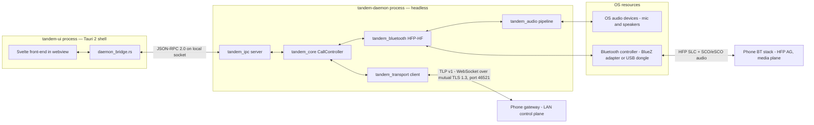
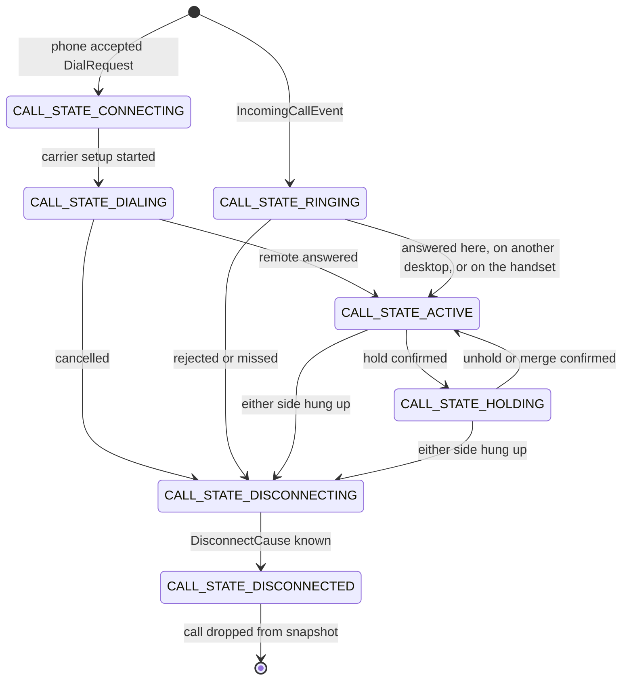

# Desktop App

The Tandem desktop is a Rust workspace producing **two separate processes**: `tandem-daemon`, a
headless service that owns everything real — the LAN control-plane client, the mirrored call
state, audio I/O, and the Bluetooth Hands-Free subsystem — and `tandem-ui`, a Tauri 2 shell
hosting a Svelte + TypeScript front-end that renders state and forwards user intent. The two
talk over JSON-RPC 2.0 on a local socket. On the control plane the desktop is a remote
controller of the phone; on the media plane it is an HFP Hands-Free unit, exactly like a car
kit. The desktop never captures carrier audio in software on the phone — that is impossible on
stock Android (see [02-feasibility-and-constraints.md](02-feasibility-and-constraints.md)); call
audio arrives only over Bluetooth HFP `[Tier B — Linux]` `[Tier B — Win/macOS USB dongle]`, or
not at all in `[Tier B-lite fallback]` where the user pairs commodity earbuds directly to the
phone.

## Process model and why two processes (ADR-0004)

Decision (see [ADR-0004](adr/0004-desktop-rust-core-and-ui-toolkit.md)):

- **Real-time audio and Bluetooth never run in the UI process.** The SCO audio pump and HFP
  state machines live in `tandem-daemon`, so webview overhead — GC pauses, compositor stalls,
  renderer restarts — cannot touch the media path. The UI can crash and relaunch mid-call
  without the call or its audio being affected.
- **Tauri 2** gives the dialer what a mainstream desktop app needs at low cost: system tray,
  native notifications, OS accessibility integration, and small binaries. **egui was rejected**
  because its accessibility, IME, and theming support are weaker than a webview's — a dialer
  must work with screen readers and non-Latin input.
- **The daemon/UI split keeps alternative front-ends possible.** Because the entire UI contract
  is the `IpcApi` JSON-RPC surface, a future egui or CLI front-end is a new client of the same
  socket, not a rewrite.

The daemon runs whether or not a window is open; the shell's `daemon_bridge.rs` spawns or
reconnects to it as needed. Multiple UI connections are allowed (see `tandem_ipc::server`).

### Process and media-path diagram



The media path is `OS audio devices ⇄ tandem_audio ⇄ tandem_bluetooth ⇄ Bluetooth controller ⇄
phone AG` — it starts and ends inside the daemon process and **never crosses the IPC boundary**.
The UI receives only JSON state events (route indicators, latency figures), never audio frames.

## Workspace layout

Canonical inventory and docstrings: [REPO-STRUCTURE.md](REPO-STRUCTURE.md). The `desktop/`
subtree:

```text
desktop/
├── Cargo.toml
├── rust-toolchain.toml
├── crates/
│   ├── proto/
│   │   ├── Cargo.toml
│   │   ├── build.rs
│   │   └── src/lib.rs
│   ├── core/
│   │   ├── Cargo.toml
│   │   └── src/
│   │       ├── lib.rs
│   │       ├── model.rs
│   │       ├── events.rs
│   │       ├── controller.rs
│   │       ├── reconcile.rs
│   │       ├── emergency.rs
│   │       └── error.rs
│   ├── transport/
│   │   ├── Cargo.toml
│   │   └── src/
│   │       ├── lib.rs
│   │       ├── discovery.rs
│   │       ├── client.rs
│   │       ├── codec.rs
│   │       ├── reconnect.rs
│   │       ├── tls.rs
│   │       └── error.rs
│   ├── pairing/
│   │   ├── Cargo.toml
│   │   └── src/
│   │       ├── lib.rs
│   │       ├── qr.rs
│   │       ├── flow.rs
│   │       ├── short_code.rs
│   │       └── error.rs
│   ├── crypto/
│   │   ├── Cargo.toml
│   │   └── src/
│   │       ├── lib.rs
│   │       ├── identity.rs
│   │       ├── cert.rs
│   │       ├── pinning.rs
│   │       ├── secrets.rs
│   │       └── error.rs
│   ├── audio/
│   │   ├── Cargo.toml
│   │   └── src/
│   │       ├── lib.rs
│   │       ├── backend.rs
│   │       ├── cpal_backend.rs
│   │       ├── null_backend.rs
│   │       ├── ring_buffer.rs
│   │       ├── resampler.rs
│   │       ├── aec.rs
│   │       ├── pipeline.rs
│   │       └── error.rs
│   ├── bluetooth/
│   │   ├── Cargo.toml
│   │   └── src/
│   │       ├── lib.rs
│   │       ├── backend.rs
│   │       ├── error.rs
│   │       ├── hfp/
│   │       │   ├── mod.rs
│   │       │   ├── at.rs
│   │       │   ├── slc.rs
│   │       │   ├── indicators.rs
│   │       │   ├── codec_negotiation.rs
│   │       │   └── call_mirror.rs
│   │       └── backends/
│   │           ├── mod.rs
│   │           ├── null_backend.rs
│   │           ├── linux_bluez/
│   │           │   ├── mod.rs
│   │           │   ├── profile.rs
│   │           │   └── sco.rs
│   │           └── usb_dongle/
│   │               ├── mod.rs
│   │               ├── usb_transport.rs
│   │               ├── hci.rs
│   │               ├── l2cap.rs
│   │               ├── rfcomm.rs
│   │               ├── sdp.rs
│   │               ├── security.rs
│   │               └── sco_route.rs
│   ├── ipc/
│   │   ├── Cargo.toml
│   │   └── src/
│   │       ├── lib.rs
│   │       ├── api.rs
│   │       ├── server.rs
│   │       ├── client.rs
│   │       ├── socket.rs
│   │       └── error.rs
│   └── testkit/
│       ├── Cargo.toml
│       └── src/
│           ├── lib.rs
│           ├── fake_phone.rs
│           ├── fake_ag.rs
│           ├── fake_audio_backend.rs
│           ├── fake_bluetooth_backend.rs
│           ├── fake_transport.rs
│           └── fixtures.rs
├── daemon/
│   ├── Cargo.toml
│   └── src/
│       ├── main.rs
│       ├── app.rs
│       ├── config.rs
│       ├── ipc_service.rs
│       ├── logging.rs
│       └── store.rs
└── ui/
    ├── package.json
    ├── tsconfig.json
    ├── vite.config.ts
    ├── svelte.config.js
    ├── index.html
    ├── src/
    │   ├── main.ts
    │   ├── App.svelte
    │   ├── lib/
    │   │   ├── ipc.ts
    │   │   ├── state.ts
    │   │   └── format.ts
    │   ├── views/
    │   │   ├── DialerView.svelte
    │   │   ├── ActiveCallView.svelte
    │   │   ├── HistoryView.svelte
    │   │   ├── PairingView.svelte
    │   │   └── SettingsView.svelte
    │   └── components/
    │       ├── DialPad.svelte
    │       ├── CallControls.svelte
    │       └── StatusBadge.svelte
    └── src-tauri/
        ├── Cargo.toml
        ├── build.rs
        ├── tauri.conf.json
        ├── capabilities/default.json
        └── src/
            ├── main.rs
            └── daemon_bridge.rs
```

Layering follows [14-coding-conventions.md](14-coding-conventions.md): `tandem_core` is pure
domain (no I/O, no async runtime types in public APIs); `tandem_transport`, `tandem_audio`,
`tandem_bluetooth`, `tandem_crypto`, and `tandem_ipc` are infrastructure behind traits; the
daemon is the composition root; the UI is presentation only. Wire types come exclusively from
`tandem_proto`, generated from `/proto` (ADR-0009); no hand-duplicated DTOs.

## Call controller — `tandem_core`

The desktop never owns call state. The phone is the source of truth (ADR-0007); `tandem_core`
maintains a **derived mirror** and `CallController` (`controller.rs`) is a **pure transition
function**: `(mirror state, input) → (new mirror state, effects)`. Inputs are phone events
(`CallStateChangedEvent` snapshots, `IncomingCallEvent`, `AudioRouteChangedEvent`,
`CallLogChangedEvent`) and user commands from the IPC layer; effects are outbound TLP requests
and UI-facing state deltas. A user command never mutates the mirror directly — the mirror
changes only when the phone confirms via an event, so the UI always renders phone truth, never
optimistic guesses.

The mirrored lifecycle of one call uses the `CallState` values from `common.proto` verbatim.
Every arrow below fires only because a `CallStateChangedEvent` snapshot (or a
`ResumeResponse.snapshot`) said so; a snapshot replace may also jump straight to any state after
a reconnect:



Every phone event carries `(epoch_id, state_seq)`. `reconcile.rs` applies the resume rules
after a reconnect: if the epoch differs or a sequence gap is detected, the
`ResumeResponse.snapshot` replaces the entire mirror; otherwise the stream continues. Stale
mirror state can never override phone truth. Losing an answer race in a multi-desktop setup is
ordinary convergence: the phone replies `Ack` with `ERROR_CODE_ALREADY_HANDLED` and the next
`CallStateChangedEvent` snaps this desktop's mirror to reality.

`emergency.rs` pre-checks every dial string against the emergency-number list synced from the
phone and blocks matches locally with clear UX before any request is sent. This is defense in
depth: the phone enforces the same policy authoritatively and answers
`ERROR_CODE_EMERGENCY_NUMBER_BLOCKED` regardless (ADR-0008, see
[08-security-and-encryption.md](08-security-and-encryption.md)).

Because the crate has no I/O and no async types in its public API, the whole state machine is
unit-testable with plain values (see [15-testing-strategy.md](15-testing-strategy.md)).

## LAN client, reconnection, and resume — `tandem_transport`

`tandem_transport` implements the desktop side of Tandem LAN Protocol v1: discovery, the
WebSocket-over-mutual-TLS-1.3 session, Envelope framing, and the reconnect loop. Message
catalog, framing, and connection lifecycle are specified in
[06-transport-and-protocol.md](06-transport-and-protocol.md); this section covers only the
client mechanics.

- **Discovery** (`discovery.rs`): browses `_tandem._tcp` via mdns-sd, parses the `v`/`id`/`name`
  TXT records, and filters candidates against the paired phone's identity before any connection
  attempt. The SRV record carries the actual port (default 46521).
- **Session** (`client.rs`): dials with the pinned-peer TLS config from `tls.rs`, performs
  `SessionHello`/`SessionWelcome` (protocol version negotiation, advertising
  `bt_adapter_address` for Tier B routing), then pumps `Envelope` frames bidirectionally.
  Heartbeats every 5 s each way; the peer is dead after 15 s of silence.
- **Codec** (`codec.rs`): one `Envelope` per binary WebSocket message, 256 KiB cap, per-sender
  monotonic `message_id` from 1, `in_reply_to` matching of responses to pending requests with
  timeouts.
- **Reconnect + resume** (`reconnect.rs`): exponential backoff 0.5 s doubling to 30 s with
  ±20 % jitter, and an immediate retry on OS network-change signals. On reconnect it sends
  `ResumeRequest{last_epoch_id, last_state_seq, last_call_log_version}`; the `ResumeResponse`
  feeds `tandem_core::reconcile`. Non-idempotent requests in flight during a drop are deduped
  by `message_id` for at-most-once retry semantics — idempotency rules per message are in
  [11-api-reference.md](11-api-reference.md).

The crate exposes the `TransportClient` trait so `tandem_core` and tests never touch sockets;
`tandem_testkit::fake_transport` implements the same trait.

## Pairing — `tandem_pairing`

Desktop side of first pairing, specified end-to-end in
[07-pairing-and-auth.md](07-pairing-and-auth.md). `qr.rs` parses and validates the QR payload
(host, port, SPKI fingerprint, one-time token with 120 s TTL, name) offline. `flow.rs` runs the
state machine: provisional TLS connect pinning the fingerprint from the QR, `PairingRequest`
submission, `PairingAwaitConfirmEvent` handling, and `PairingDecision` finalization — persisting
the phone identity and this desktop's phone-assigned `desktop_device_id`. On the manual-entry
path, `short_code.rs` derives the 6-digit comparison code via HKDF-SHA256 over both SPKI hashes
and the TLS exporter, byte-identical to the phone's `Fingerprints` implementation. `PairingError`
variants map to actionable UI copy in `PairingView.svelte`.

## Identity, certificates, and secret storage — `tandem_crypto`

The desktop's identity is a P-256 keypair generated on first run (`identity.rs`) and wrapped in
a long-lived (3650-day) self-signed X.509 certificate (`cert.rs`, rcgen) used purely as a TLS
carrier. Trust is **pinned SPKI-SHA256, never certificate chains** (ADR-0006); `pinning.rs`
provides fingerprint computation, base64url rendering, and constant-time comparison used by
`tandem_transport::tls` on both the pairing-bootstrap and paired paths. `secrets.rs` stores key
material in the OS secret store via `keyring` — macOS Keychain, Windows Credential Manager,
Linux Secret Service — with an encrypted-file fallback for headless Linux sessions. Key-loss
and rotation consequences (re-pair with a fresh identity) are covered in
[07-pairing-and-auth.md](07-pairing-and-auth.md) and
[08-security-and-encryption.md](08-security-and-encryption.md).

## Audio I/O — `tandem_audio` `[Tier B — Linux]` `[Tier B — Win/macOS USB dongle]`

`tandem_audio` moves voice frames between OS audio devices and the Bluetooth SCO link. The
pipeline (`pipeline.rs`) is a duplex graph: capture → AEC → resample → SCO uplink, and SCO
downlink → resample → playback, clocked against 7.5 ms SCO frames at 8 kHz mono (CVSD) or
16 kHz mono (mSBC). End-to-end latency accounting is surfaced to the UI; expected added latency
over the handset is ≈ 40–80 ms (see [05-bluetooth-hfp.md](05-bluetooth-hfp.md)).

Two mechanisms keep the path real-time safe:

- **Lock-free SPSC ring buffers** (`ring_buffer.rs`) between the OS real-time callback and the
  SCO pump. Fixed capacity; overruns drop the oldest frames and increment a counter — the RT
  thread is never blocked.
- **WebRTC AEC3** (`aec.rs`, via webrtc-audio-processing) with the playback path as far-end
  reference, so desktop speakerphone use does not echo into the cellular uplink.

Device I/O goes through the `AudioBackend` trait: `cpal_backend.rs` isolates every
WASAPI/CoreAudio/ALSA-PipeWire quirk; `null_backend.rs` accepts and discards frames for
`[Tier B-lite fallback]` builds and deterministic tests. Note the phone-side half of the media
plane is Android's own Bluetooth stack — this crate only ever handles audio that arrived over
HFP, never audio captured on the phone in software.

## Bluetooth HFP-HF — `tandem_bluetooth`

The desktop presents itself to the phone as an HFP v1.8 **Hands-Free unit**; the phone's Audio
Gateway is Android's Bluetooth stack. The protocol deep dive is
[05-bluetooth-hfp.md](05-bluetooth-hfp.md); the crate splits into an OS-independent HFP core
and pluggable backends.

**HFP core** (`hfp/`): pure protocol logic over a byte channel supplied by a backend. `at.rs`
tokenizes/serializes the AT subset (BRSF, CIND, CMER, CIEV, BAC, BCS, CLCC, CLIP, VGS, VGM);
`slc.rs` runs SLC establishment per HFP v1.8 §4.2; `indicators.rs` tracks AG indicators;
`codec_negotiation.rs` handles wide-band speech (mSBC via AT+BAC/+BCS, CVSD always as
fallback). Critically, **the HF never sends call-control AT commands** (no ATA, AT+CHUP, ATD,
AT+CHLD as user actions) — the single-command-path rule: all user intent travels over the LAN
control plane; the HFP link carries audio, codec negotiation, indicator mirroring, and volume
sync. `call_mirror.rs` compares the HFP indicator view against the LAN `CallSnapshot` mirror
and always resolves divergence in favor of LAN truth.

**Backends** (`backends/`), selected by platform, feature flags, and configuration in
`backends/mod.rs`:

- `linux_bluez` `[Tier B — Linux]` — software-only: adapter/bonding via org.bluez D-Bus,
  HF profile (UUID 0x111E) registration via Profile1, SCO via `BTPROTO_SCO` kernel sockets.
  Requires disabling PipeWire's native HFP backend so the profile is not double-claimed
  (setup in [13-build-and-setup.md](13-build-and-setup.md)).
- `usb_dongle` `[Tier B — Win/macOS USB dongle]` — Windows and macOS stacks do not expose the
  HF role to applications, so this backend drives a dedicated USB Bluetooth controller directly
  through nusb (WinUSB/IOKit) and implements the host stack from HCI up: HCI, L2CAP (basic
  mode), RFCOMM (TS 07.10 subset), SDP, SSP bonding, and SCO over USB isochronous endpoints.
  This is a legitimate implementation of the published Bluetooth SIG specifications, not
  reverse engineering of any product; it is scoped to one vetted controller family at a time
  (the `tools/usb-dongle-probe` CLI vets candidates).
- `null` `[Tier B-lite fallback]` — reports no adapter and rejects audio-route attach cleanly,
  so the product runs control-plane-only while the user pairs commodity earbuds or a
  speakerphone directly to the phone.

Degradation rule everywhere: **losing HFP audio never ends the call** — the phone falls back to
its earpiece and the desktop keeps full LAN control (see
[05-bluetooth-hfp.md](05-bluetooth-hfp.md)).

## The backend-trait seam (ADR-0010)

Three traits — `TransportClient`, `AudioBackend`, `BluetoothBackend` — are the only surfaces
`tandem_core` and the daemon supervisor see. The same controller and daemon therefore run
unchanged on Linux, Windows, and macOS; a platform is just a choice of implementations made in
`daemon/src/app.rs`. A future sanctioned platform audio API `[Tier C — needs vendor support]`
becomes one more drop-in backend behind the same seam — no controller, transport, or UI change.
Signatures below are sketches; the normative contracts (pre/postconditions, error cases,
idempotency) live in [11-api-reference.md](11-api-reference.md).

```rust
// tandem_transport — sketch; contract in docs/11.
pub trait TransportClient: Send + Sync {
    async fn connect(&self, endpoint: Endpoint) -> Result<SessionInfo, TransportError>;
    async fn send(&self, payload: EnvelopePayload) -> Result<(), TransportError>;
    async fn request(&self, payload: EnvelopePayload) -> Result<EnvelopePayload, TransportError>;
    fn events(&self) -> BoxStream<'static, TransportEvent>;
    async fn close(&self);
}

// tandem_audio — sketch; contract in docs/11.
pub trait AudioBackend: Send {
    fn enumerate_devices(&self) -> Result<Vec<AudioDevice>, AudioError>;
    fn open(&mut self, config: StreamConfig) -> Result<DuplexHandles, AudioError>;
    fn events(&self) -> BoxStream<'static, AudioDeviceEvent>;
    fn close(&mut self);
}

// tandem_bluetooth — sketch; contract in docs/11.
pub trait BluetoothBackend: Send {
    fn adapter_info(&self) -> AdapterInfo;
    async fn bond(&mut self, peer: BtAddress) -> Result<(), BluetoothError>;
    async fn connect_slc(&mut self, peer: BtAddress)
        -> Result<Box<dyn RfcommChannel>, BluetoothError>;
    async fn open_sco(&mut self, codec: ScoCodec) -> Result<ScoStream, BluetoothError>;
    async fn close_sco(&mut self) -> Result<(), BluetoothError>;
    fn events(&self) -> BoxStream<'static, BluetoothEvent>;
}
```

`DuplexHandles` couples the capture-consumer and playback-producer ends of the lock-free ring
buffers; `RfcommChannel` is the byte channel the HFP core drives. Async methods are written
plainly above for readability; the real traits keep their futures boxed (`#[async_trait]`) so
`app.rs` can hold a backend as `Box<dyn BluetoothBackend>` chosen at runtime. Every trait has a
deterministic fake in `tandem_testkit`, which is what makes the whole daemon testable without
hardware ([15-testing-strategy.md](15-testing-strategy.md)).

A `[Tier A]` build selects the null Bluetooth and null audio backends and needs nothing else:
no HFP code path, no SCO pump, no audio device. That is the structural reason Tier A is an
independently shippable product with zero Bluetooth audio work — the tier is a backend choice,
not a different architecture.

## Daemon ⇄ UI IPC — `tandem_ipc`

The UI contract is **JSON-RPC 2.0 over a local socket**: Unix domain socket at
`$XDG_RUNTIME_DIR/tandem/daemon.sock`, Windows named pipe `\\.\pipe\tandem-daemon`, both with
same-user peer checks (`socket.rs`). The entire vocabulary — methods `dial`, `answer`,
`reject`, `end`, `mute`, `hold`, `unhold`, `merge`, `dtmf`, `audio-route`, `history`,
`pairing`, `settings`, `status`, plus event payloads — is defined once in `tandem_ipc::api`
(the `IpcApi` surface) and exported to TypeScript via **ts-rs**, so the Svelte front-end
compiles against the exact Rust types. The server (`server.rs`) accepts multiple UI
connections, dispatches to the daemon's `ipc_service.rs`, and pushes state events; the client
(`client.rs`) adds timeouts, event subscription, and automatic reconnect to a restarted daemon.
Method contracts and `IpcError` semantics are specified in
[11-api-reference.md](11-api-reference.md). No audio, keys, or raw protocol frames ever cross
this boundary — only JSON control and state.

## Daemon assembly — `tandem-daemon`

`daemon/src/app.rs` is the composition root: it selects backends per platform and config
(ADR-0010), wires controller, transport, audio, bluetooth, and IPC together with channels, and
supervises task lifecycles with graceful degradation — **loss of the audio subsystem never
kills control**; Tier A functionality survives any Tier B failure. `config.rs` loads
`config.toml` with CLI overrides; `store.rs` keeps the SQLite local store `tandem-cache.db`
(paired phone identity, read-only call-log mirror with sync cursor); the identity key itself
lives in the OS secret store, never in these files. Schemas and config keys are documented in
[09-data-models.md](09-data-models.md). `logging.rs` redacts call metadata in release builds
per the privacy policy in [08-security-and-encryption.md](08-security-and-encryption.md).

## UI layer — Tauri 2 + Svelte

The shell (`ui/src-tauri/`) creates the window, tray, and notification bridge and forwards
JSON-RPC between webview and daemon socket via `daemon_bridge.rs`, including daemon liveness
management (spawn/reconnect prompts). Its Tauri v2 capability file grants the minimal window
permissions and **no filesystem or network capabilities** — all I/O goes through the daemon
IPC, and the CSP is locked to bundled assets.

The front-end (`ui/src/`) is a plain Vite + Svelte SPA (no SvelteKit). `lib/ipc.ts` is the only
module that talks to the daemon, using the ts-rs-generated types; `lib/state.ts` holds Svelte
stores as read-only projections of daemon events; views (dialer, active call, history, pairing,
settings) render stores and emit intents. `DialerView` shows the emergency-block explanation
when `tandem_core::emergency` refuses a number, and `App.svelte` carries the emergency-notice
surface required by ADR-0008. History is the read-only mirrored call log; the desktop never
writes the phone's OS call log.

## Module map

Every file under `desktop/` from [REPO-STRUCTURE.md](REPO-STRUCTURE.md), grouped by crate.
Blockquotes are the file-level docstrings, verbatim; they are the only narrative comment each
source file carries ([14-coding-conventions.md](14-coding-conventions.md)).

### Workspace roots

- **`desktop/Cargo.toml`** — Workspace manifest.

  > Cargo workspace for the Tandem desktop: member crates (proto, core, transport, pairing,
  > crypto, audio, bluetooth, ipc, testkit), the daemon and Tauri shell binaries, and shared
  > workspace dependency versions.

  Single place dependency versions are bumped; member crates inherit them, so the whole
  workspace builds against one coherent set.

- **`desktop/rust-toolchain.toml`** — Pinned Rust toolchain.

  > Pins the Rust toolchain version and components (rustfmt, clippy) so all contributors and
  > CI build identically.

  Read automatically by rustup; toolchain bumps are deliberate PRs, never drift.

### crates/proto — generated wire types

- **`desktop/crates/proto/Cargo.toml`** — Proto crate manifest.

  > Manifest for tandem_proto: prost/prost-build dependencies and the build-script hookup that
  > compiles /proto at build time (ADR-0009).

  Declares only codegen dependencies; every other crate gets wire types by depending on
  `tandem_proto`.

- **`desktop/crates/proto/build.rs`** — prost codegen from /proto.

  > Build script compiling proto/tandem/v1/*.proto with prost-build into Rust modules. The
  > repo-root proto directory is the only schema source; no vendored copies.

  Runs on every `cargo build` after a schema change, so Rust can never drift from the
  `.proto` files embedded in [06-transport-and-protocol.md](06-transport-and-protocol.md).

- **`desktop/crates/proto/src/lib.rs`** — Generated-module exports.

  > tandem_proto: re-exports the prost-generated tandem.v1 types as the single Rust wire-type
  > surface. No hand-written types beyond include! glue.

  Consumers import `Envelope`, `CallSnapshot`, and friends from here; proto-to-domain
  conversion happens at the transport boundary, keeping prost types out of `tandem_core`
  public APIs.

### crates/core — domain + call-controller state machine

- **`desktop/crates/core/Cargo.toml`** — Core crate manifest.

  > Manifest for tandem_core: pure domain crate; depends only on tandem_proto and std
  > ecosystem basics — no I/O, no async runtime types in public APIs.

  The dependency list is the purity guarantee: adding tokio or a socket crate here is a
  layering violation caught in review.

- **`desktop/crates/core/src/lib.rs`** — Crate root and public surface.

  > tandem_core: framework-free domain for the desktop — call mirror model, controller state
  > machine, reconciliation, and emergency pre-check. Everything here is deterministic and
  > unit-testable with no I/O (docs/14 layering).

  Exports the module set the daemon composes: `model`, `events`, `controller`, `reconcile`,
  `emergency`, `error`.

- **`desktop/crates/core/src/model.rs`** — Domain models mirrored from phone truth.

  > Domain models of the mirrored call plane: Call, CallState, AudioRoute, CallLogRow,
  > PairedPhone, plus (epoch_id, state_seq) versioning. Converted from tandem.v1 protos at the
  > transport boundary only.

  These are the types `CallController` transitions over and `ipc_service.rs` projects to the
  UI; they mirror `CallInfo`/`CallSnapshot` semantics without exposing prost types.

- **`desktop/crates/core/src/events.rs`** — Controller input/output event types.

  > Event vocabulary between transport and controller: inbound phone events (snapshot,
  > incoming call, route change, log change) and outbound UI-facing state deltas. Pure data;
  > no channels or runtime types.

  Being plain values, whole controller scenarios are expressed as event lists in tests —
  no fakes needed at this layer.

- **`desktop/crates/core/src/controller.rs`** — The call-controller state machine.

  > CallController: consumes phone events and user commands, maintains the mirrored
  > CallSnapshot (phone is the source of truth — ADR-0007), and emits UI state plus outbound
  > requests. Pure transition function; side effects live in the daemon.

  The heart of the desktop: user commands become outbound TLP requests, never local state
  edits; the mirror moves only on phone events, so every surface renders phone truth.

- **`desktop/crates/core/src/reconcile.rs`** — Resume/gap reconciliation rules.

  > Reconciliation after reconnect: compares (epoch_id, state_seq) against ResumeResponse,
  > decides snapshot-replace vs continue, and never lets stale mirror state override phone
  > truth.

  Invoked by the controller when `tandem_transport::reconnect` delivers a `ResumeResponse`;
  the rules match flow (h) in [10-sequence-diagrams.md](10-sequence-diagrams.md).

- **`desktop/crates/core/src/emergency.rs`** — Client-side emergency pre-check.

  > Desktop-side emergency-number pre-check against the list synced from the phone: blocks
  > the dial locally with clear UX before any request is sent. Defense in depth — the phone
  > enforces the same policy authoritatively (ADR-0008).

  Consulted by the controller before emitting any `DialRequest`; its refusal reason feeds the
  `DialerView` explanation copy.

- **`desktop/crates/core/src/error.rs`** — Core error enum.

  > CoreError: typed domain failures (unknown call id, invalid state for command, emergency
  > blocked, stale epoch) mapped from/to TLP Status codes at the boundaries.

  The mapping to `ErrorCode` values and to `IpcError` is specified in
  [11-api-reference.md](11-api-reference.md).

### crates/transport — LAN client

- **`desktop/crates/transport/Cargo.toml`** — Transport crate manifest.

  > Manifest for tandem_transport: tokio, tokio-tungstenite, rustls, mdns-sd, and tandem_proto
  > dependencies for the LAN control-plane client.

  The only crate with WebSocket and mDNS dependencies; everything above it sees the
  `TransportClient` trait.

- **`desktop/crates/transport/src/lib.rs`** — Crate root; TransportClient trait.

  > tandem_transport: discovery, connection, and codec for TLP v1 over WebSocket + mutual TLS
  > 1.3. Exposes the TransportClient trait (docs/11) so core and tests never touch sockets
  > directly.

  Trait sketch above; `tandem_testkit::fake_transport` is the in-memory implementation used by
  reconnect and reconciliation tests.

- **`desktop/crates/transport/src/discovery.rs`** — mDNS browse for _tandem._tcp.

  > Browses _tandem._tcp via mdns-sd, parses TXT records (version, device id, name), and
  > emits candidate endpoints — filtered against the paired phone's identity before any
  > connection attempt.

  Feeds `reconnect.rs` with fresh endpoints when the phone's DHCP lease or port changes;
  `store.rs` remembers the last known endpoint as a hint.

- **`desktop/crates/transport/src/client.rs`** — WS-over-mTLS session client.

  > TransportClient implementation: dials the phone endpoint with the pinned-peer TLS config,
  > performs SessionHello/SessionWelcome, then pumps Envelope frames bidirectionally with
  > heartbeats (5 s send / 15 s dead-peer).

  Collaborates with `tls.rs` for the rustls config and `codec.rs` for framing; surfaces
  connection-state changes as `TransportEvent`s the controller and UI badge consume.

- **`desktop/crates/transport/src/codec.rs`** — Envelope framing + correlation.

  > Encodes/decodes Envelope frames (one per binary WS message, 256 KiB cap), assigns
  > monotonic message_ids, and matches in_reply_to responses to pending requests with
  > timeouts.

  The only transport file touching `tandem_proto::Envelope` directly; oversize or malformed
  frames become protocol-violation `TransportError`s.

- **`desktop/crates/transport/src/reconnect.rs`** — Backoff + resume orchestration.

  > Reconnect loop: exponential backoff (0.5 s to 30 s, jittered), immediate retry on
  > network-change signals, and ResumeRequest emission with the last seen (epoch_id,
  > state_seq, call_log_version) so core can reconcile (docs/10 flow h).

  Owns the persistence handshake with `store.rs` for the last-seen cursor triple; hands the
  `ResumeResponse` to `tandem_core::reconcile`.

- **`desktop/crates/transport/src/tls.rs`** — rustls config with SPKI pinning.

  > Builds the rustls client config: TLS 1.3 only, presents the desktop device cert, and
  > verifies the server by pinned SPKI-SHA256 (pairing-bootstrap mode pins from the QR
  > payload instead). No WebPKI roots are consulted, ever.

  Pin comparison delegates to `tandem_crypto::pinning`; the device cert comes from
  `tandem_crypto::cert` via the daemon's wiring.

- **`desktop/crates/transport/src/error.rs`** — Transport error enum.

  > TransportError: discovery, TLS/pinning, session-handshake, timeout, and protocol-violation
  > failures, with retryability annotations consumed by reconnect.

  Retryability drives whether `reconnect.rs` backs off and retries or surfaces a terminal
  failure (e.g. pin mismatch after revocation) to the UI.

### crates/pairing — trust bootstrap (desktop side)

- **`desktop/crates/pairing/Cargo.toml`** — Pairing crate manifest.

  > Manifest for tandem_pairing: depends on tandem_transport, tandem_crypto, and tandem_proto
  > for the first-pairing flow.

  Pairing reuses the real transport in bootstrap mode rather than a parallel network path.

- **`desktop/crates/pairing/src/lib.rs`** — Crate root.

  > tandem_pairing: desktop side of first pairing — QR payload parsing, the pairing state
  > machine, and short-code derivation. Produces the persisted PairedPhone identity on
  > success (docs/07).

  Invoked by `ipc_service.rs` when the UI starts `PairingView`; its output row is written by
  `daemon/src/store.rs`.

- **`desktop/crates/pairing/src/qr.rs`** — QR payload parsing.

  > Parses and validates the pairing QR payload (host, port, SPKI fingerprint, one-time
  > token, name); rejects unknown versions and malformed fingerprints before any network
  > activity.

  Fail-fast validation means a mistyped manual code or stale QR never opens a socket; format
  is pinned in [07-pairing-and-auth.md](07-pairing-and-auth.md).

- **`desktop/crates/pairing/src/flow.rs`** — Pairing state machine.

  > Pairing flow driver: provisional TLS connect (pin from QR), PairingRequest submission,
  > PairingAwaitConfirmEvent handling, and PairingDecision finalization — persisting the
  > phone identity and this desktop's assigned device id.

  Drives `TransportClient` in bootstrap mode and reports progress states the `PairingView`
  wizard renders one-to-one.

- **`desktop/crates/pairing/src/short_code.rs`** — 6-digit comparison code.

  > Derives the 6-digit short authentication code via HKDF-SHA256 over both SPKI hashes and
  > the TLS exporter, byte-identical to the phone's Fingerprints implementation (docs/07).

  Pure function; a cross-implementation test vector shared with the Android side guards
  byte-identical derivation.

- **`desktop/crates/pairing/src/error.rs`** — Pairing error enum.

  > PairingError: invalid QR, token expired, fingerprint mismatch, user rejection, and
  > version-negotiation failures, each mapped to actionable UI copy.

  Distinguishes retry-with-new-QR failures (token expired) from trust failures (fingerprint
  mismatch), which the UI must present differently.

### crates/crypto — identity + secrets (desktop side)

- **`desktop/crates/crypto/Cargo.toml`** — Crypto crate manifest.

  > Manifest for tandem_crypto: ring/rcgen for keys and certs, keyring for OS secret storage.

  All cryptographic dependencies concentrate here; no other crate links a crypto library
  directly.

- **`desktop/crates/crypto/src/lib.rs`** — Crate root.

  > tandem_crypto: desktop device identity (P-256), self-signed certificate management, SPKI
  > pinning helpers, and OS-keychain-backed secret storage. Trust is pinned keys, never
  > chains (ADR-0006).

  Serves three consumers: `tandem_transport::tls` (cert + pins), `tandem_pairing`
  (fingerprints, short code inputs), and the `usb_dongle` backend (link-key storage).

- **`desktop/crates/crypto/src/identity.rs`** — Device keypair lifecycle.

  > Creates the desktop's P-256 identity keypair on first run and loads it thereafter; the
  > private key lives in the OS secret store via secrets.rs, with an encrypted-file fallback.

  Create-if-absent semantics mirror the phone's `IdentityStoreImpl`; losing this key means
  re-pairing (see [07-pairing-and-auth.md](07-pairing-and-auth.md)).

- **`desktop/crates/crypto/src/cert.rs`** — Self-signed cert generation.

  > Generates the long-lived self-signed X.509 certificate over the identity key (rcgen) used
  > as the TLS carrier for mutual authentication.

  3650-day validity is deliberate: trust is the pinned key, not expiry — the tradeoff is
  discussed honestly in [08-security-and-encryption.md](08-security-and-encryption.md).

- **`desktop/crates/crypto/src/pinning.rs`** — SPKI pin computation/verification.

  > SPKI-SHA256 fingerprint computation, base64url rendering, and constant-time pin
  > comparison used by transport TLS verification on both the pairing and paired paths.

  Constant-time comparison closes the timing side channel on pin checks; rendering matches
  the QR payload `fp` field format.

- **`desktop/crates/crypto/src/secrets.rs`** — OS secret-store access.

  > Stores/loads identity-key material via the OS secret service (macOS Keychain, Windows
  > Credential Manager, Linux Secret Service) through keyring, with an encrypted-file
  > fallback for headless Linux sessions.

  The fallback keeps a keyboard-less Linux box (daemon as a user service, no desktop session)
  functional without weakening the default path.

- **`desktop/crates/crypto/src/error.rs`** — Crypto error enum.

  > CryptoError: key-generation, secret-store access, certificate, and pin-verification
  > failures. Never carries key material in messages.

  The no-key-material rule means these errors are safe to log and to forward to the UI
  verbatim.

### crates/audio — low-latency call audio `[Tier B — Linux]` `[Tier B — Win/macOS USB dongle]`

Bare `[Tier B]` inside the docstrings below is the `REPO-STRUCTURE.md` shorthand for the whole
Tier B family; see the tier-tag legend in [00-overview.md](00-overview.md).

- **`desktop/crates/audio/Cargo.toml`** — Audio crate manifest.

  > Manifest for tandem_audio: cpal for device I/O, webrtc-audio-processing for AEC, plus
  > resampling dependencies. [Tier B]

  Compiled on all platforms; whether it does anything depends on the selected
  `AudioBackend`/`BluetoothBackend` pair.

- **`desktop/crates/audio/src/lib.rs`** — Crate root; AudioBackend trait export.

  > tandem_audio: microphone/speaker I/O for the HFP voice path — AudioBackend trait,
  > lock-free ring buffers, resampling, and echo cancellation. Consumes/produces 8 or 16 kHz
  > mono frames against the Bluetooth SCO clock. [Tier B]

  The SCO clock is the master; device-side rates adapt to it through the resampler, never the
  reverse.

- **`desktop/crates/audio/src/backend.rs`** — AudioBackend trait.

  > AudioBackend trait (docs/11): open capture/playback streams at a negotiated sample rate,
  > push/pull frames with bounded latency, report device changes. Implementations: cpal
  > (real), null (Tier B-lite / tests).

  One of the three ADR-0010 seams; sketch above, contract in
  [11-api-reference.md](11-api-reference.md).

- **`desktop/crates/audio/src/cpal_backend.rs`** — Real device I/O via cpal.

  > AudioBackend implementation over cpal: device enumeration, stream setup at native rates,
  > and frame exchange with the pipeline through ring buffers. All OS-audio quirks
  > (WASAPI/CoreAudio/ALSA-PipeWire) isolate here. [Tier B]

  The isolation rule means a WASAPI-specific workaround can never leak into pipeline or
  controller logic.

- **`desktop/crates/audio/src/null_backend.rs`** — Silent no-op backend.

  > Null AudioBackend: accepts and discards frames, produces silence. Serves Tier B-lite
  > fallback builds and deterministic tests. [Tier B-lite fallback]

  Keeps the daemon's task graph identical across tiers — the pipeline runs, it just moves
  silence — so tier differences stay in backends, not control flow.

- **`desktop/crates/audio/src/ring_buffer.rs`** — Lock-free SPSC ring buffer.

  > Lock-free single-producer single-consumer ring buffer for audio frames between the
  > real-time OS callback and the SCO pump. Fixed capacity; overruns drop oldest and count,
  > never block the RT thread.

  The drop counters surface through `pipeline.rs` latency accounting so xrun trouble is
  visible in the UI, not silent degradation.

- **`desktop/crates/audio/src/resampler.rs`** — Rate conversion.

  > Resamples between device native rates and the HFP codec rate (8 kHz CVSD / 16 kHz mSBC)
  > with fixed latency budget; quality/latency tradeoffs documented inline in docs/05.

  Fixed budget keeps end-to-end latency predictable inside the ≈ 40–80 ms envelope stated in
  [05-bluetooth-hfp.md](05-bluetooth-hfp.md).

- **`desktop/crates/audio/src/aec.rs`** — Echo cancellation wrapper.

  > Wraps WebRTC AEC3 (webrtc-audio-processing): feeds far-end reference from the playback
  > path and near-end from capture so speakerphone use on the desktop does not echo into the
  > cellular uplink. [Tier B]

  Sits on the capture branch of the pipeline before resampling; disabled paths (headset use)
  pass frames through untouched.

- **`desktop/crates/audio/src/pipeline.rs`** — Capture/playback graph assembly.

  > Assembles the duplex audio graph: capture → AEC → resample → SCO uplink, and SCO downlink
  > → resample → playback, with end-to-end latency accounting surfaced to the UI. [Tier B]

  Bridges `AudioBackend` handles to the SCO frame endpoints supplied by the active
  `BluetoothBackend`; rebuilt on device change or codec renegotiation.

- **`desktop/crates/audio/src/error.rs`** — Audio error enum.

  > AudioError: device-unavailable, format-negotiation, stream, and xrun failures; states
  > which are recoverable by pipeline rebuild vs fatal to the audio session.

  The recoverable/fatal split is what lets `app.rs` degrade to control-only instead of
  crashing the daemon on audio failure.

### crates/bluetooth — HFP Hands-Free subsystem `[Tier B — Linux]` `[Tier B — Win/macOS USB dongle]`

- **`desktop/crates/bluetooth/Cargo.toml`** — Bluetooth crate manifest.

  > Manifest for tandem_bluetooth: zbus (BlueZ D-Bus) behind the linux_bluez feature, nusb
  > behind the usb_dongle feature, shared HFP core always compiled. [Tier B]

  Feature gating keeps a Windows build free of D-Bus code and a Linux build free of the USB
  stack; the HFP core compiles everywhere for tests.

- **`desktop/crates/bluetooth/src/lib.rs`** — Crate root; backend selection.

  > tandem_bluetooth: the HFP Hands-Free unit — OS-independent HFP protocol core plus
  > pluggable backends (linux_bluez, usb_dongle, null). Implements the public Bluetooth SIG
  > HFP v1.8 spec; no product's proprietary protocol is involved (docs/05). [Tier B]

  Exposes the `BluetoothBackend` trait and the HFP core; the daemon obtains a concrete
  backend through `backends/mod.rs`.

- **`desktop/crates/bluetooth/src/backend.rs`** — BluetoothBackend trait.

  > BluetoothBackend trait (docs/11): adapter lifecycle, bonding state, RFCOMM channel to the
  > AG, SCO audio open/close, and backend events. The seam that makes Tier B Linux, Tier B
  > dongle, Tier B-lite, and a future Tier C backend interchangeable (ADR-0010).

  Sketch above; the HFP core is written entirely against this trait plus a byte channel, so
  it runs identically over BlueZ, the dongle stack, and the testkit fake.

- **`desktop/crates/bluetooth/src/error.rs`** — Bluetooth error enum.

  > BluetoothError: adapter, bonding, RFCOMM, SCO, and HFP-protocol failures with
  > degradation guidance (audio loss never ends the call — docs/05).

  Degradation guidance tells `app.rs` and the UI whether a failure means "retry SCO", "re-bond",
  or "fall back to Tier B-lite" — never "drop the call".

- **`desktop/crates/bluetooth/src/hfp/mod.rs`** — HFP core module root.

  > OS-independent HFP v1.8 Hands-Free implementation: SLC bring-up, indicator tracking, and
  > codec negotiation as pure protocol logic over a byte channel supplied by a backend.
  > Call-control AT commands are deliberately not sent — LAN is the intent path (docs/05).

  The single-command-path rule lives here structurally: the module exposes no API for sending
  ATA/AT+CHUP/ATD, so a dual-command race cannot be written by accident.

- **`desktop/crates/bluetooth/src/hfp/at.rs`** — AT command tokenizer/serializer.

  > Parser and serializer for the HFP AT command subset (BRSF, CIND, CMER, CIEV, BAC, BCS,
  > CLCC, CLIP, VGS, VGM and friends), line-discipline aware, tolerant of AG quirks.

  Quirk tolerance matters because AG behavior varies by Android OEM Bluetooth stack; parsing
  is fuzz-tested against `tandem_testkit::fake_ag` scripts.

- **`desktop/crates/bluetooth/src/hfp/slc.rs`** — Service-level connection state machine.

  > SLC establishment state machine per HFP v1.8 §4.2: BRSF exchange, CIND read, CMER enable,
  > CHLD query, then connected-idle. Emits typed SLC events; drives at.rs over the backend's
  > RFCOMM channel.

  The full bring-up sequence is diagrammed in [05-bluetooth-hfp.md](05-bluetooth-hfp.md); this
  file is its executable form.

- **`desktop/crates/bluetooth/src/hfp/indicators.rs`** — AG indicator tracking.

  > Tracks AG indicators (call, callsetup, callheld, service, signal, battchg) from +CIEV and
  > periodic +CLCC polls, producing the HFP-view call state used for consistency checks
  > against LAN truth.

  Its output is consumed only by `call_mirror.rs` — indicator state never drives user-visible
  call state directly.

- **`desktop/crates/bluetooth/src/hfp/codec_negotiation.rs`** — CVSD/mSBC selection.

  > Wide-band speech negotiation: advertises mSBC via AT+BAC, answers +BCS codec selection,
  > and configures the SCO path for the agreed codec (CVSD fallback always supported).

  The negotiated codec sets the pipeline sample rate (8 vs 16 kHz) via the SCO parameters
  passed to `AudioBackend::open` and `open_sco`.

- **`desktop/crates/bluetooth/src/hfp/call_mirror.rs`** — HFP-view vs LAN-truth reconciliation.

  > Compares the HFP indicator view of call state with the LAN CallSnapshot mirror, flags
  > divergence for logging/telemetry, and always resolves in favor of LAN truth (single-
  > command-path rule, docs/05).

  Divergence is a diagnostic signal (e.g. an OEM AG misreporting callheld), never a state
  source; nothing downstream acts on the HFP view alone.

- **`desktop/crates/bluetooth/src/backends/mod.rs`** — Backend registry/selection.

  > Compile-time and runtime backend selection: picks linux_bluez, usb_dongle, or null by
  > platform, feature flags, and configuration; exposes a uniform constructor to the daemon.

  The one place `app.rs` calls to obtain a `BluetoothBackend`; a Tier C backend registers
  here and nowhere else (ADR-0010).

- **`desktop/crates/bluetooth/src/backends/null_backend.rs`** — No-op backend. `[Tier B-lite fallback]`

  > Null BluetoothBackend: reports no adapter and rejects audio-route attach cleanly, letting
  > the product run control-plane-only while the user pairs commodity earbuds directly to
  > the phone. [Tier B-lite fallback]

  Clean rejection (typed `BluetoothError`, no panic) is what makes Tier B-lite a first-class
  supported mode rather than a degraded crash path.

- **`desktop/crates/bluetooth/src/backends/linux_bluez/mod.rs`** — BlueZ backend root. `[Tier B — Linux]`

  > BluetoothBackend over BlueZ: adapter and bonding via org.bluez D-Bus, HFP HF profile
  > registration via Profile1, SCO via kernel sockets. Requires disabling PipeWire's native
  > HFP backend to avoid double-claiming the profile (docs/13). [Tier B — Linux]

  The software-only Tier B path: no special hardware, just BlueZ and kernel SCO sockets;
  setup prerequisites in [13-build-and-setup.md](13-build-and-setup.md).

- **`desktop/crates/bluetooth/src/backends/linux_bluez/profile.rs`** — Profile1 registration. `[Tier B — Linux]`

  > Registers the Hands-Free profile (UUID 0x111E) with BlueZ via ProfileManager1, receives
  > the RFCOMM fd for the SLC on NewConnection, and adapts it to the HFP core's byte-channel
  > interface.

  The adapter from BlueZ's fd-passing model to the HFP core's channel abstraction; connection
  teardown flows back as backend events.

- **`desktop/crates/bluetooth/src/backends/linux_bluez/sco.rs`** — SCO socket audio. `[Tier B — Linux]`

  > Opens and services BTPROTO_SCO sockets for call audio, honoring the negotiated codec
  > (CVSD/mSBC with transparent eSCO), and exchanges frames with tandem_audio ring buffers.

  The Linux half of the media path inside the daemon; its frame pump is paced by the SCO
  socket clock the pipeline synchronizes to.

- **`desktop/crates/bluetooth/src/backends/usb_dongle/mod.rs`** — Dongle backend root. `[Tier B — Win/macOS USB dongle]`

  > BluetoothBackend driving a dedicated USB Bluetooth controller directly (bypassing the OS
  > stack, which does not expose the HF role to apps): full host stack from HCI up. Scoped to
  > one vetted controller family at a time (docs/05). [Tier B — Win/macOS USB dongle]

  Composes the layer files below into one `BluetoothBackend`; controller vetting uses
  `tools/usb-dongle-probe`.

- **`desktop/crates/bluetooth/src/backends/usb_dongle/usb_transport.rs`** — USB HCI transport. `[Tier B — Win/macOS USB dongle]`

  > USB transport for HCI (interrupt/bulk/isochronous endpoints per the Bluetooth USB
  > transport spec) via WinUSB/IOKit through nusb; owns exclusive device claim and hotplug
  > detection.

  Exclusive claim keeps the OS stack off the dongle; hotplug events propagate up as backend
  events so mid-call unplug degrades per the audio-loss rule.

- **`desktop/crates/bluetooth/src/backends/usb_dongle/hci.rs`** — HCI host layer. `[Tier B — Win/macOS USB dongle]`

  > Minimal HCI host: command/event flow, ACL and SCO data paths, controller init, inquiry/
  > paging, and connection management — only the subset HFP-HF requires.

  Deliberately not a general Bluetooth stack: scope is bounded by what the HF role needs,
  which keeps the audit surface small.

- **`desktop/crates/bluetooth/src/backends/usb_dongle/l2cap.rs`** — L2CAP layer. `[Tier B — Win/macOS USB dongle]`

  > L2CAP channel management over ACL: signaling, fixed and dynamic channels, and the
  > single-session multiplexing RFCOMM and SDP need. No ERTM; basic mode only.

  Basic mode suffices because HFP's RFCOMM and SDP traffic is low-rate and loss shows up as
  link failure, handled above.

- **`desktop/crates/bluetooth/src/backends/usb_dongle/rfcomm.rs`** — RFCOMM layer. `[Tier B — Win/macOS USB dongle]`

  > RFCOMM (TS 07.10 subset) over L2CAP: multiplexer session, DLCI management, credit-based
  > flow control — enough to carry the HFP SLC byte stream.

  Produces the byte channel the HFP core drives — the same interface BlueZ's RFCOMM fd is
  adapted to, so `hfp/` is oblivious to which stack is underneath.

- **`desktop/crates/bluetooth/src/backends/usb_dongle/sdp.rs`** — SDP records/queries. `[Tier B — Win/macOS USB dongle]`

  > SDP: publishes the Hands-Free service record (UUID 0x111E, RFCOMM channel) and queries
  > the AG's record for its channel number during connection setup.

  Publishing the HF record is what makes the phone's AG initiate the SLC toward the desktop
  like toward any headset.

- **`desktop/crates/bluetooth/src/backends/usb_dongle/security.rs`** — Bonding/link keys. `[Tier B — Win/macOS USB dongle]`

  > SSP bonding for the dongle path: numeric-comparison pairing with the phone, link-key
  > generation and encrypted storage via tandem_crypto secrets, and authentication/encryption
  > enforcement on the ACL.

  Link keys persist through `tandem_crypto::secrets`, so a dongle survives daemon restarts
  without re-bonding; BT link security posture is summarized in
  [08-security-and-encryption.md](08-security-and-encryption.md).

- **`desktop/crates/bluetooth/src/backends/usb_dongle/sco_route.rs`** — SCO over USB. `[Tier B — Win/macOS USB dongle]`

  > Routes SCO audio over the controller's USB isochronous endpoints (HCI SCO packets),
  > pacing against the Bluetooth clock and bridging frames into tandem_audio ring buffers.

  The dongle-path equivalent of `linux_bluez/sco.rs`; both ends terminate at the same ring
  buffers, keeping the pipeline backend-agnostic.

### crates/ipc — daemon ⇄ UI contract

- **`desktop/crates/ipc/Cargo.toml`** — IPC crate manifest.

  > Manifest for tandem_ipc: serde/serde_json, ts-rs for TypeScript type export, and the
  > platform socket dependencies.

  ts-rs export runs from this crate's tests/build, producing the types `ui/src/lib/ipc.ts`
  imports.

- **`desktop/crates/ipc/src/lib.rs`** — Crate root.

  > tandem_ipc: the daemon-to-UI contract — JSON-RPC 2.0 over a local socket, with request,
  > response, and event types defined once in api.rs and exported to TypeScript via ts-rs
  > (docs/11).

  Both the daemon (server) and the Tauri shell (client) depend on this crate, guaranteeing
  the two processes agree on the contract by construction.

- **`desktop/crates/ipc/src/api.rs`** — The IpcApi type vocabulary.

  > IpcApi: every method (dial, answer, reject, end, mute, hold, unhold, merge, dtmf,
  > audio-route, history, pairing, settings, status) with its params, results, and event
  > payloads. Single source for both the Rust server and the generated TS client types.

  Adding a UI capability starts here; method contracts, error mapping, and idempotency notes
  are specified in [11-api-reference.md](11-api-reference.md).

- **`desktop/crates/ipc/src/server.rs`** — Daemon-side dispatcher.

  > JSON-RPC server: accepts one or more UI connections on the local socket, authenticates
  > same-user peers, dispatches to the daemon's service implementation, and pushes state
  > events.

  Multiple connections mean tray, main window, and a future CLI can coexist; dispatch targets
  `daemon/src/ipc_service.rs`.

- **`desktop/crates/ipc/src/client.rs`** — UI-side client.

  > JSON-RPC client used by the Tauri shell: request/response with timeouts, event
  > subscription, and automatic reconnect to a restarted daemon.

  Consumed by `daemon_bridge.rs`; reconnect keeps the UI usable across daemon upgrades or
  crashes without a window restart.

- **`desktop/crates/ipc/src/socket.rs`** — Platform socket abstraction.

  > Local-socket abstraction: Unix domain socket at $XDG_RUNTIME_DIR/tandem/daemon.sock and
  > Windows named pipe \\.\pipe\tandem-daemon, with same-user peer checks on both.

  Same-user peer checks are the IPC trust boundary: another local account cannot drive your
  calls (threat table in [08-security-and-encryption.md](08-security-and-encryption.md)).

- **`desktop/crates/ipc/src/error.rs`** — IPC error enum.

  > IpcError: connect, protocol, timeout, and daemon-unavailable failures with UI-facing
  > retry guidance.

  Daemon-unavailable is a distinguished state the shell turns into a "starting daemon"
  UX rather than an error dialog.

### crates/testkit — desktop fakes

- **`desktop/crates/testkit/Cargo.toml`** — Testkit manifest.

  > Manifest for tandem_testkit: dev-dependency crate providing fakes and fixtures; never
  > shipped in release binaries.

  Referenced only under `[dev-dependencies]` across the workspace; the fake list matches the
  seams enumerated in [15-testing-strategy.md](15-testing-strategy.md).

- **`desktop/crates/testkit/src/lib.rs`** — Crate root.

  > tandem_testkit: deterministic fakes for every desktop I/O seam (transport, Bluetooth,
  > audio, phone peer, HFP AG) plus shared fixtures, backing the test pyramid in docs/15.

  One fake per ADR-0010 trait plus the two protocol peers (phone, AG); everything the daemon
  wires can be replaced in-process.

- **`desktop/crates/testkit/src/fake_phone.rs`** — Scripted TLP phone peer.

  > In-process fake of the phone gateway: speaks real TLP envelopes over an in-memory
  > transport, scriptable call scenarios (incoming, answer races, epoch bumps) for
  > integration tests without a device.

  The desktop counterpart of Android's `InMemoryLanServer`; scripts drive controller,
  reconcile, and arbitration behavior end-to-end.

- **`desktop/crates/testkit/src/fake_ag.rs`** — Scripted HFP Audio Gateway.

  > Fake HFP AG speaking the AT protocol over an in-memory byte channel: drives SLC
  > bring-up, indicator sequences, codec negotiation, and SCO open/close for hfp core tests
  > (docs/15 integration tier).

  Lets the entire `hfp/` module be tested against realistic and quirky AG behavior with no
  radio; quirk scripts encode observed OEM variations.

- **`desktop/crates/testkit/src/fake_audio_backend.rs`** — Deterministic AudioBackend.

  > AudioBackend fake producing synthetic frames and capturing playback for assertion;
  > deterministic clocking for pipeline and latency tests.

  Deterministic clocking makes ring-buffer overrun and latency-budget tests reproducible in
  CI.

- **`desktop/crates/testkit/src/fake_bluetooth_backend.rs`** — Scriptable BluetoothBackend.

  > BluetoothBackend fake: scripted adapter/bond/RFCOMM/SCO behavior including mid-call SCO
  > drops, backing controller and degradation tests.

  The mid-call SCO drop script verifies the crate-wide invariant that audio loss never ends
  the call.

- **`desktop/crates/testkit/src/fake_transport.rs`** — In-memory TransportClient.

  > TransportClient fake wired to fake_phone: connect/disconnect/resume scripting with
  > deterministic timing for reconnect and reconciliation tests.

  Exercises backoff, resume, and dedupe logic without sockets; timing is virtual so the
  0.5 s → 30 s schedule tests run instantly.

- **`desktop/crates/testkit/src/fixtures.rs`** — Shared test data.

  > Canonical fixtures: sample CallSnapshots, call-log pages, QR payloads, certificates, and
  > keys used across unit and integration tests.

  One fixture set shared across crates keeps tests comparable and avoids drift in sample
  data.

### daemon — headless binary

- **`desktop/daemon/Cargo.toml`** — Daemon manifest.

  > Manifest for tandem-daemon: assembles core, transport, pairing, crypto, audio, bluetooth,
  > and ipc into the headless desktop service binary.

  The only crate depending on every subsystem; feature flags select which Bluetooth backend
  compiles in.

- **`desktop/daemon/src/main.rs`** — Entry point.

  > tandem-daemon entry point: parses CLI flags, loads config, initializes logging, and runs
  > the app supervisor until shutdown signal. No logic beyond bootstrapping app.rs.

  Thin by rule; anything beyond bootstrap belongs in `app.rs` where it is testable.

- **`desktop/daemon/src/app.rs`** — Composition root + supervisor.

  > Composition root: constructs backends per platform/config (ADR-0010 selection), wires
  > controller, transport, audio, bluetooth, and IPC together with channels, and supervises
  > task lifecycles with graceful degradation (audio subsystem loss never kills control).

  The single place concrete types meet traits; the graceful-degradation rule is what keeps
  Tier A alive through any Tier B failure.

- **`desktop/daemon/src/config.rs`** — Config file + flags.

  > Loads and validates config.toml (paired-phone endpoint hints, backend selection, audio
  > devices, log level) with CLI overrides; documents every key in docs/09.

  Validation failures are fatal at startup with actionable messages — a daemon never runs on
  a half-understood config.

- **`desktop/daemon/src/ipc_service.rs`** — IpcApi implementation.

  > Implements the IpcApi surface over the live controller and subsystems: translates UI
  > method calls into controller commands and streams state events to connected UIs.

  The daemon-side realization of `tandem_ipc::api`; it owns the mapping from `CoreError` and
  subsystem errors onto IPC results per [11-api-reference.md](11-api-reference.md).

- **`desktop/daemon/src/logging.rs`** — tracing setup.

  > Initializes tracing subscribers (stderr + rolling file), with call metadata redaction in
  > release builds per the privacy policy in docs/08.

  Redaction means phone numbers and contact names never land in release logs; debug builds
  opt in explicitly.

- **`desktop/daemon/src/store.rs`** — SQLite mirror + identity persistence.

  > rusqlite-backed local store (tandem-cache.db): paired phone identity row, call-log mirror
  > with sync cursor, and settings not held in config.toml. Schema DDL in docs/09.

  Holds the `(last_epoch_id, last_state_seq, last_call_log_version)` cursor reconnect resumes
  from; the call-log table is a read-only projection of the phone's OS log.

### ui — Tauri shell + Svelte front-end

- **`desktop/ui/package.json`** — Front-end manifest.

  > npm manifest for the Tandem UI: Svelte + TypeScript + Vite toolchain and Tauri CLI
  > scripts (dev, build, tauri dev, tauri build).

  Front-end dependency surface only; no runtime network dependencies exist because the UI
  talks solely to the daemon.

- **`desktop/ui/tsconfig.json`** — TypeScript config.

  > TypeScript compiler options for the Svelte front-end: strict mode on, ES2022 target,
  > path alias to generated IPC types.

  The path alias points at the ts-rs output from `tandem_ipc`, so IPC type drift is a compile
  error, not a runtime surprise.

- **`desktop/ui/vite.config.ts`** — Vite build config.

  > Vite configuration: Svelte plugin, dev-server port for tauri dev, and build output
  > consumed by the Tauri bundler.

  Dev-server settings pair with `tauri.conf.json` for the `tauri dev` loop described in
  [13-build-and-setup.md](13-build-and-setup.md).

- **`desktop/ui/svelte.config.js`** — Svelte compiler config.

  > Svelte configuration: vitePreprocess for TypeScript in components. No SvelteKit; this is
  > a plain Vite + Svelte SPA inside Tauri.

  No router framework or SSR — view switching is a store in `App.svelte`, which keeps the
  bundle small and the shell simple.

- **`desktop/ui/index.html`** — SPA entry document.

  > Single-page entry for the Tauri webview: mounts App.svelte into #app; no external
  > resources (all assets bundled).

  All-bundled assets satisfy the locked CSP in `tauri.conf.json`; nothing loads from the
  network.

- **`desktop/ui/src/main.ts`** — Front-end bootstrap.

  > Front-end entry: instantiates App.svelte, initializes the IPC client connection to the
  > daemon, and installs global error reporting.

  Bootstrap only; the IPC connection it opens is the one `lib/ipc.ts` wraps for the rest of
  the app.

- **`desktop/ui/src/App.svelte`** — Root component + navigation.

  > Root component: view switching (dialer, active call, history, pairing, settings),
  > connection status header, and the emergency-notice surface required by ADR-0008 UX copy.

  Owns which view is visible (incoming calls force `ActiveCallView`) and hosts the
  `StatusBadge` header fed from `state.ts`.

- **`desktop/ui/src/lib/ipc.ts`** — Daemon IPC client wrapper.

  > Typed wrapper over the JSON-RPC client for the daemon socket, using ts-rs-generated
  > types from tandem_ipc::api. The only module that talks to the daemon; views never do.

  The single-egress rule makes every daemon interaction greppable and mockable in front-end
  tests.

- **`desktop/ui/src/lib/state.ts`** — Front-end state stores.

  > Svelte stores derived from daemon events: mirrored call snapshot, connection state,
  > history cache, pairing progress. Read-only projections; commands go through ipc.ts.

  The front-end's copy of the mirror-of-a-mirror: it renders daemon state and never invents
  call state, matching the phone-is-truth model end to end.

- **`desktop/ui/src/lib/format.ts`** — Display formatting helpers.

  > Pure formatting helpers: phone-number display, call duration, timestamps, and BT/route
  > labels. No state, no IPC.

  Pure functions shared by all views; unit-tested without any Svelte or Tauri machinery.

- **`desktop/ui/src/views/DialerView.svelte`** — Dialer screen. `[Tier A]`

  > Dialer view: number entry via DialPad, recent-call shortcuts, and dial dispatch. Shows
  > the emergency-block explanation when core/emergency refuses a number (ADR-0008).

  Dial dispatch goes through `ipc.ts`; the emergency explanation instructs the user to dial
  on the handset, which has carrier location facilities.

- **`desktop/ui/src/views/ActiveCallView.svelte`** — Live-call screen. `[Tier A]`

  > Active-call view: caller identity, call timer, CallControls, DTMF pad, and the audio
  > route indicator with attach/detach-to-desktop action where a Tier B backend is present.

  The attach/detach action is capability-gated on backend status from `state.ts`; with the
  null backend it is absent and the view is pure Tier A control.

- **`desktop/ui/src/views/HistoryView.svelte`** — Call-history screen. `[Tier A]`

  > History view: the read-only mirrored call log with incremental loading and call-back
  > actions; displays the sync freshness state from state.ts.

  Incremental loading pages the daemon's local mirror (synced in 200-entry pages from the
  phone); call-back dispatches a dial like `DialerView`.

- **`desktop/ui/src/views/PairingView.svelte`** — Pairing wizard.

  > Pairing view: QR-scan instructions and manual entry path, live pairing progress, the
  > 6-digit short-code comparison step, and success/failure outcomes.

  Renders `tandem_pairing` flow states one-to-one; failure copy comes from `PairingError`
  mapping (see [07-pairing-and-auth.md](07-pairing-and-auth.md)).

- **`desktop/ui/src/views/SettingsView.svelte`** — Settings screen.

  > Settings view: paired phone identity and fingerprint display, audio device pickers,
  > Bluetooth backend status, autostart, and unpair (with the re-pairing consequence spelled
  > out).

  Fingerprint display supports manual verification against the phone's settings screen; the
  unpair warning reflects that re-pairing means a fresh identity.

- **`desktop/ui/src/components/DialPad.svelte`** — Dial pad component.

  > Reusable 12-key dial pad emitting digit events; used by DialerView for dialing and
  > ActiveCallView for DTMF. Presentation only.

  Emits digits upward; whether they build a dial string or become `SendDtmfRequest` traffic
  is the parent view's concern.

- **`desktop/ui/src/components/CallControls.svelte`** — Call control buttons.

  > Reusable call-control cluster (mute, hold, merge, end) rendering capability-gated
  > buttons from the mirrored call state; emits intents upward, never calls IPC itself.

  Capability gating follows `can_hold`/`can_merge` from the mirrored snapshot, so impossible
  actions are never presented.

- **`desktop/ui/src/components/StatusBadge.svelte`** — Connection/route badge.

  > Small status badge for connection and audio-route states with accessible labels; used in
  > the header and settings.

  Accessible labels are part of the ADR-0004 rationale for a webview UI — screen-reader users
  get connection state, not just a colored dot.

### ui/src-tauri — Tauri shell

- **`desktop/ui/src-tauri/Cargo.toml`** — Tauri shell manifest.

  > Manifest for the tandem-ui Tauri shell: tauri 2.x, tandem_ipc client dependency, and
  > bundler metadata.

  Depends on `tandem_ipc` only as a client — the shell holds no subsystem dependencies, by
  design.

- **`desktop/ui/src-tauri/build.rs`** — Tauri build script.

  > Standard tauri-build invocation generating the shell's compile-time context. Do not add
  > logic here.

  Boilerplate by contract; kept minimal so bundling stays reproducible.

- **`desktop/ui/src-tauri/tauri.conf.json`** — Tauri app config.

  > Tauri configuration: window defaults, bundle identifiers com.tandem.desktop, updater
  > disabled in v1, and CSP locked to bundled assets only.

  The locked CSP plus no-updater posture keeps the shell's attack surface minimal (see
  [08-security-and-encryption.md](08-security-and-encryption.md)).

- **`desktop/ui/src-tauri/capabilities/default.json`** — Tauri capability grants.

  > Tauri v2 capability file: minimal permission set for the main window (shell events,
  > window control); no filesystem or network capabilities — all I/O goes through the daemon
  > IPC.

  The enforcement artifact for the process split: even a compromised webview cannot reach
  disk or network directly.

- **`desktop/ui/src-tauri/src/main.rs`** — Shell entry point.

  > Tauri shell entry: creates the window, tray icon, and notification bridge, and spawns
  > daemon_bridge for IPC forwarding. Contains no call logic (docs/14 layering).

  Tray and notifications are the shell's native value-add; every call-related decision lives
  in the daemon or front-end.

- **`desktop/ui/src-tauri/src/daemon_bridge.rs`** — Webview ⇄ daemon forwarder.

  > Bridges the webview and the daemon socket: forwards JSON-RPC requests from the front-end
  > via Tauri commands, streams daemon events to the webview, and manages daemon liveness
  > (spawn/reconnect prompts).

  Uses `tandem_ipc::client` under the hood; liveness management (spawn if absent, reconnect
  with prompts) is why a daemon restart is invisible to the user.
