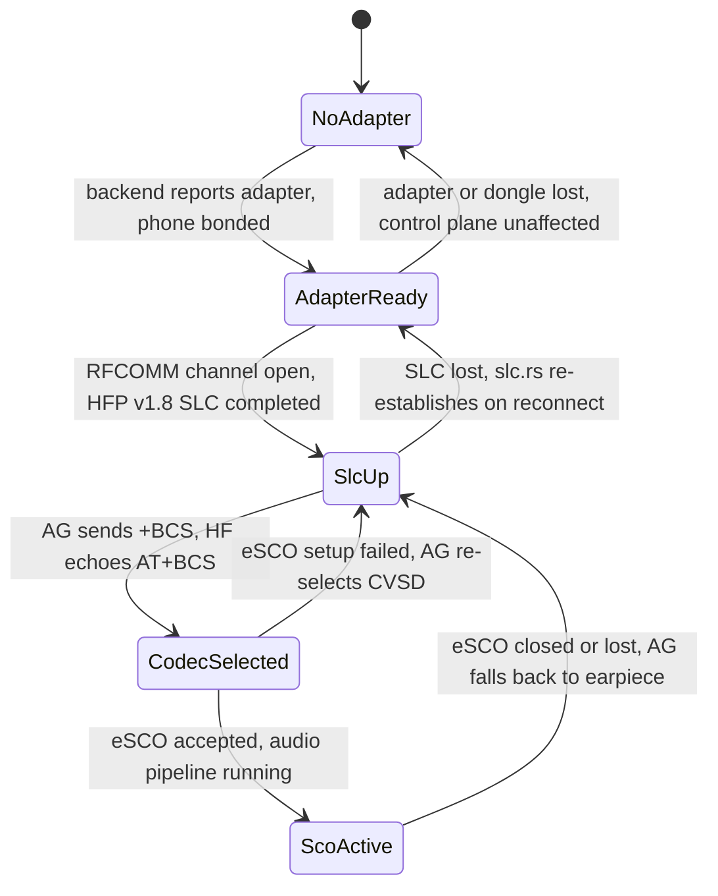
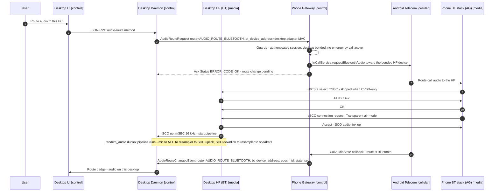

# Bluetooth HFP Deep Dive

This document specifies the media plane: how live call audio reaches the desktop by presenting
the desktop to the phone as a **Bluetooth Hands-Free unit**, exactly as a car kit does. It covers
the HFP role split, Service Level Connection (SLC) bring-up, the SCO/eSCO audio link, codec
negotiation, the AT command subset Tandem uses, the single-command-path rule that keeps HFP
subordinate to the LAN control plane, per-OS backend implementations, and failure behavior.
Message and field names below are from `proto/tandem/v1/` (catalog in
[06-transport-and-protocol.md](06-transport-and-protocol.md), Message Catalog); crate and file
names, and every docstring quoted here, come from
[REPO-STRUCTURE.md](REPO-STRUCTURE.md) and are reproduced in
[04-desktop-app.md](04-desktop-app.md).

## Standards posture

Tandem's Hands-Free unit is an implementation of the **published Bluetooth SIG Hands-Free
Profile v1.8 specification** (and, on the USB-dongle path, the published Core specification
layers beneath it: HCI, L2CAP, RFCOMM per TS 07.10, SDP, SSP). It interoperates with any
conformant Audio Gateway. It does **not** implement, emulate, or depend on any product's
proprietary protocol, and nothing is reverse engineered: every byte Tandem puts on the air is
defined by public SIG documents. This is the same legitimacy class as building a car kit or a
headset.

Why HFP at all: on stock non-rooted Android, software capture of carrier call audio is
impossible — `VOICE_CALL`, `VOICE_DOWNLINK`, and `VOICE_UPLINK` sit behind
`CAPTURE_AUDIO_OUTPUT`, a `signature|privileged` permission installable apps cannot hold — and
no API injects audio into the cellular uplink. See
[02-feasibility-and-constraints.md](02-feasibility-and-constraints.md) and ADR-0002. HFP is the
sanctioned path the OS already offers every headset, and Tandem uses nothing else for voice.

## Role split

| Role | Device | Implemented by | Tandem's involvement |
|---|---|---|---|
| **Audio Gateway (AG)** | Phone | **Android's Bluetooth stack** — never Tandem code | The Tandem Gateway app only *observes and steers*: `HfpAgMonitor` watches `BluetoothHeadset` profile state via the `BluetoothProfile` proxy (`BLUETOOTH_CONNECT`), `HfpCallMediaProvider` executes `AudioRouteRequest` via `InCallService.setAudioRoute` / `requestBluetoothAudio`, `BondedDesktopMatcher` resolves the paired desktop's stored `bt_mac` to a live bonded device |
| **Hands-Free unit (HF)** | Desktop | `tandem_bluetooth` — an OS-independent HFP v1.8 core (`hfp/`) over pluggable `BluetoothBackend` implementations (`linux_bluez`, `usb_dongle`, `null`) | Full HF implementation: SLC, indicators, codec negotiation, SCO audio, volume sync |

Nothing in the AG is Tandem's to change. That single fact drives the single-command-path rule
below, the observe-and-steer shape of the phone-side `bluetooth/` package
([03-android-app.md](03-android-app.md)), and the decision to keep call-state truth on the LAN.

Bluetooth **bonding** between phone and desktop is standard SSP bonding, separate from LAN
pairing and required only for Tier B. The desktop reports its adapter MAC in
`SessionHello.bt_adapter_address`; the phone stores it against the paired desktop and
`AudioRouteRequest.bt_device_address` targets it. Flow in
[07-pairing-and-auth.md](07-pairing-and-auth.md).

### HFP protocol core module map

Pure protocol logic over a byte channel and a SCO handle supplied by whichever backend is
active; it runs unchanged on every backend and is integration-tested against
`tandem_testkit::fake_ag` ([15-testing-strategy.md](15-testing-strategy.md)). Docstrings are
verbatim from [REPO-STRUCTURE.md](REPO-STRUCTURE.md).

| File under `desktop/crates/bluetooth/src/` | Docstring |
|---|---|
| `backend.rs` | BluetoothBackend trait (docs/11): adapter lifecycle, bonding state, RFCOMM channel to the AG, SCO audio open/close, and backend events. The seam that makes Tier B Linux, Tier B dongle, Tier B-lite, and a future Tier C backend interchangeable (ADR-0010). |
| `error.rs` | BluetoothError: adapter, bonding, RFCOMM, SCO, and HFP-protocol failures with degradation guidance (audio loss never ends the call — docs/05). |
| `hfp/mod.rs` | OS-independent HFP v1.8 Hands-Free implementation: SLC bring-up, indicator tracking, and codec negotiation as pure protocol logic over a byte channel supplied by a backend. Call-control AT commands are deliberately not sent — LAN is the intent path (docs/05). |
| `hfp/at.rs` | Parser and serializer for the HFP AT command subset (BRSF, CIND, CMER, CIEV, BAC, BCS, CLCC, CLIP, VGS, VGM and friends), line-discipline aware, tolerant of AG quirks. |
| `hfp/slc.rs` | SLC establishment state machine per HFP v1.8 §4.2: BRSF exchange, CIND read, CMER enable, CHLD query, then connected-idle. Emits typed SLC events; drives at.rs over the backend's RFCOMM channel. |
| `hfp/indicators.rs` | Tracks AG indicators (call, callsetup, callheld, service, signal, battchg) from +CIEV and periodic +CLCC polls, producing the HFP-view call state used for consistency checks against LAN truth. |
| `hfp/codec_negotiation.rs` | Wide-band speech negotiation: advertises mSBC via AT+BAC, answers +BCS codec selection, and configures the SCO path for the agreed codec (CVSD fallback always supported). |
| `hfp/call_mirror.rs` | Compares the HFP indicator view of call state with the LAN CallSnapshot mirror, flags divergence for logging/telemetry, and always resolves in favor of LAN truth (single-command-path rule, docs/05). |

The `BluetoothBackend` contract — preconditions, error cases, idempotency — is in
[11-api-reference.md](11-api-reference.md).

## The single-command-path rule

**The desktop never sends HFP call-control AT commands.** Not `ATA` (answer), not `AT+CHUP`
(hang up), not `ATD` (dial), not `AT+BLDN` (redial), not `AT+CHLD=<n>` hold/multiparty actions,
not `AT+VTS` (DTMF). All user intent travels over the LAN control plane as TLP requests. The
HFP link carries exactly four things:

1. **Audio** — the SCO/eSCO voice connection.
2. **Codec negotiation** — `AT+BAC` / `+BCS` / `AT+BCS`.
3. **Indicator mirroring** — `+CIEV`, `AT+CLCC`, `+CLIP`, consumed as a *consistency check*,
   never as a command surface.
4. **Volume sync** — `AT+VGS` / `AT+VGM`.

**Why.** The AG is Android's Bluetooth stack, not Tandem's code. It translates HFP call-control
commands into Telecom actions through its own internal path, with its own timing, and Tandem can
neither observe nor serialize that path. Tandem's phone app *also* drives Telecom, from LAN
requests, through `InCallService`. If the desktop issued `ATA` while its own `AnswerRequest` was
in flight, two independent command paths would converge inside Telecom with no ordering
guarantee: duplicate answers, answer-vs-reject races, hold toggles that ping-pong, and failures
attributable to neither path. The race gets worse with multiple desktops, where the phone's
first-answer-wins arbitration (`SessionRegistry`) can only arbitrate what it sees — and it never
sees the AT path. AT results (`OK` / `ERROR` / `+CME ERROR`) are also far coarser than TLP's
typed `Status` codes, so the desktop would lose error fidelity precisely on the risky path. One
intent path eliminates the race by construction and keeps every command answerable with a typed
result (`Ack` carrying `ERROR_CODE_OK`, `ERROR_CODE_INVALID_CALL_STATE`,
`ERROR_CODE_ALREADY_HANDLED`).

`hfp/call_mirror.rs` continuously compares the HFP indicator view against the LAN-mirrored
`CallSnapshot`. Divergence — a `+CIEV` that arrives before the corresponding
`CallStateChangedEvent`, or an AG quirk that misreports `callheld` — is flagged for
logging/telemetry and **always resolved in favor of LAN truth**: the phone is the source of
truth (ADR-0007) and the LAN carries its authoritative, versioned `(epoch_id, state_seq)` state.
The HFP view is never allowed to mutate the mirror or the UI.

What travels where:

| Concern | Path |
|---|---|
| Dial, answer, reject, end, hold, unhold, merge, DTMF, mute intent | LAN — `DialRequest`, `AnswerRequest`, `RejectRequest`, `EndRequest`, `HoldRequest`, `UnholdRequest`, `MergeRequest`, `SendDtmfRequest`, `MuteRequest` |
| Audio route intent | LAN — `AudioRouteRequest` (idempotent, absolute target) |
| Call-state truth | LAN — `CallStateChangedEvent` carrying `CallSnapshot`; HFP indicators are a cross-check only |
| Incoming-call alert | LAN — `IncomingCallEvent`; `RING` / `+CLIP` are observed, never the trigger for UI |
| Live voice | HFP — SCO/eSCO |
| Codec selection | HFP — `AT+BAC` / `+BCS` |
| Volume and mic gain | HFP — `AT+VGS` / `AT+VGM` |

## SLC establishment

The Service Level Connection is an RFCOMM channel between HF and AG carrying AT commands, built
per HFP v1.8 §4.2 by `hfp/slc.rs` (state machine) over `hfp/at.rs` (tokenizer/serializer,
tolerant of AG quirks). The AG's RFCOMM channel number comes from its SDP Hands-Free Audio
Gateway record; how the channel itself is obtained is backend-specific — BlueZ hands over a
connected fd, the dongle stack dials it through its own RFCOMM layer.

Canonical bring-up transcript:

```text
HF -> AG   AT+BRSF=<hf_features>          capability bitmap exchange
AG -> HF   +BRSF:<ag_features>
AG -> HF   OK
HF -> AG   AT+BAC=1,2                     advertise CVSD(1) + mSBC(2); only when both
AG -> HF   OK                             sides advertised codec negotiation in BRSF
HF -> AG   AT+CIND=?                      read the AG's indicator map
AG -> HF   +CIND: ("service",(0,1)),("call",(0,1)),("callsetup",(0-3)),
           ("callheld",(0-2)),("signal",(0-5)),("roam",(0,1)),("battchg",(0-5))
AG -> HF   OK
HF -> AG   AT+CIND?                       read current indicator values
AG -> HF   +CIND: 1,0,0,0,4,0,5           service yes, no call, signal 4, battery 5
AG -> HF   OK
HF -> AG   AT+CMER=3,0,0,1                enable unsolicited +CIEV indicator events
AG -> HF   OK
HF -> AG   AT+CHLD=?                      query AG multiparty capabilities; only when both
AG -> HF   +CHLD: (0,1,2,3,4)             sides advertised three-way calling in BRSF
AG -> HF   OK
                                          --- SLC established ---
```

Indicator order is **not** fixed across AGs: `indicators.rs` binds names to positions from the
`AT+CIND=?` response and interprets later `+CIEV:<index>,<value>` events through that map. Any
implementation that hard-codes indices will misread call state on some phones.

Feature choices in Tandem's `AT+BRSF` bitmap: the HF advertises **CLI presentation** (unlocks
`+CLIP`), **remote volume control** (`+VGS` / `+VGM` from the AG), **enhanced call status**
(unlocks `AT+CLCC`), **codec negotiation** (unlocks `AT+BAC` / `+BCS`), **eSCO S4 settings**, and
**call waiting and three-way calling** — the last so the SLC includes the standard `AT+CHLD=?`
step and Tandem looks to the AG like any conformant hands-free unit. The `AT+CHLD=?` *query* is
a mandatory SLC step, not a call action; its response is recorded and `AT+CHLD=<n>` actions are
never sent. **Enhanced call control** is deliberately not advertised — Tandem will never use it.
Where the AG advertises HF indicators (HFP v1.7+), the optional `AT+BIND` exchange completes
minimally; Tandem exposes no HF indicators of its own.

After SLC, `slc.rs` emits typed events and the link idles: `AT+CLIP=1` enables caller-ID
presentation, `AT+NREC=0` disables AG-side echo cancellation and noise reduction when the AG
advertises that capability (the desktop runs WebRTC AEC3 in `tandem_audio` and must own that
processing), and the connection waits for indicator traffic or audio setup.

### HF link lifecycle



## Codec negotiation and the SCO/eSCO audio link

Voice travels on a synchronous connection, separate from the RFCOMM SLC:

- **CVSD** — mandatory baseline. 64 kbit/s continuously variable slope delta at **8 kHz** mono
  (narrow-band). Runs over legacy SCO or eSCO packet types. Always supported; the HF accepts it
  unconditionally.
- **mSBC** — optional wide-band speech at **16 kHz** mono, markedly better than CVSD.
  Negotiated only when both sides advertised codec negotiation: the HF listed it in
  `AT+BAC=1,2` during SLC; before each audio connection the AG sends `+BCS:<codec>`, the HF
  confirms `AT+BCS=<codec>`, and the AG establishes an **eSCO** link with Transparent air
  coding — mSBC frames pass through the controller unmodified and the host codec in
  `hfp/codec_negotiation.rs` does the encode/decode. If eSCO setup with mSBC fails, the AG
  re-selects CVSD (`+BCS:1`).

eSCO adds a retransmission window over legacy SCO, which is why it is preferred and why mSBC
requires it. The **AG initiates** the audio connection in every flow Tandem uses: the desktop
asks for routing over the LAN and *accepts* the resulting eSCO request. The HF never sends
`AT+BCC` (the HF-triggered audio-setup command) because routing intent already has a path.
mSBC frames are 7.5 ms (120 samples at 16 kHz), which sets the pipeline cadence — 7.5 ms SCO
frames feeding the lock-free SPSC ring buffers and AEC3 in `tandem_audio`, whose graph and
device handling are described in [04-desktop-app.md](04-desktop-app.md).

### Latency expectations

Expect **≈ 40–80 ms of added latency** relative to talking on the handset. Contributors: the
eSCO retransmission window, controller and transport buffering (USB isochronous transfers on the
dongle path), 7.5 ms codec framing, desktop resampling plus AEC, and the OS audio callback
period. Jitter is absorbed by the fixed-capacity ring buffers, which drop oldest on overrun and
never block the real-time thread. This is car-kit-class latency, small against the cellular
path's own round-trip; it is not a sub-20 ms VoIP path and does not need to be.

## Call-state mirroring over HFP

`hfp/indicators.rs` tracks the AG indicator set — `call`, `callsetup`, `callheld`, `service`,
`signal`, `battchg` — from unsolicited `+CIEV:<index>,<value>` events, supplemented by periodic
`AT+CLCC` polls that return a precise per-call list (index, direction, status, multiparty flag,
number). `+CLIP` supplies caller ID alongside `RING`. Together these produce the *HFP view* of
call state.

That view drives neither UI nor commands. It exists so `hfp/call_mirror.rs` can compare it with
the LAN `CallSnapshot`, flag divergence, and confirm that media-plane reality (`callsetup`
transitions, SCO presence, `callheld`) matches control-plane truth — useful diagnostics when an
AG behaves unusually, and a hard signal that the audio path is attached to the call the user
thinks it is. In-band ringtone, if the AG streams one over SCO, is simply played back; the
desktop's incoming-call UX is driven exclusively by `IncomingCallEvent` over the LAN.

## AT command catalog

Commands and unsolicited results Tandem's HF uses (parser/serializer in `hfp/at.rs`):

| AT traffic | Direction | Phase | Purpose in Tandem |
|---|---|---|---|
| `AT+BRSF=<n>` / `+BRSF:<n>` | HF→AG / AG→HF | SLC | Feature bitmap exchange |
| `AT+BAC=1,2` | HF→AG | SLC | Advertise CVSD + mSBC |
| `AT+CIND=?` / `AT+CIND?` / `+CIND:` | HF→AG / AG→HF | SLC | Indicator map, then initial values |
| `AT+CMER=3,0,0,1` | HF→AG | SLC | Enable `+CIEV` event reporting |
| `AT+CHLD=?` / `+CHLD:` | HF→AG / AG→HF | SLC | Multiparty capability **query only** |
| `AT+BIND` family | both | SLC | Optional HF-indicators exchange, minimal |
| `AT+CLIP=1` / `+CLIP:` | HF→AG / AG→HF | post-SLC | Caller-ID presentation, cross-check only |
| `AT+NREC=0` | HF→AG | post-SLC | Disable AG echo/noise processing; desktop AEC3 owns it |
| `+CIEV:<index>,<value>` | AG→HF | runtime | Indicator mirroring into `indicators.rs` |
| `AT+CLCC` / `+CLCC:` | HF→AG / AG→HF | runtime | Per-call list poll for `call_mirror.rs` |
| `RING` | AG→HF | runtime | Observed; never triggers UI, the LAN does |
| `+BCS:<c>` / `AT+BCS=<c>` | AG→HF / HF→AG | audio setup | Codec selection per audio connection |
| `AT+VGS=<0-15>` / `+VGS:` | both | runtime | Speaker volume sync |
| `AT+VGM=<0-15>` / `+VGM:` | both | runtime | Microphone gain sync |

Never sent — each has a LAN replacement:

| Banned AT command | Would do | Tandem path instead |
|---|---|---|
| `ATA` | Answer | `AnswerRequest` |
| `AT+CHUP` | Hang up / reject | `EndRequest`, `RejectRequest` |
| `ATD<number>;` / `ATD><mem>;` / `AT+BLDN` | Dial / redial | `DialRequest` |
| `AT+CHLD=<n>` | Hold, release, swap, join | `HoldRequest`, `UnholdRequest`, `MergeRequest`, `EndRequest` |
| `AT+VTS=<d>` | DTMF | `SendDtmfRequest` |
| `AT+BVRA` | Voice recognition | Not a Tandem feature |

## Sequence: audio attaches to an active call over HFP

A call is already active — answered from either surface, audio on the phone — and the user moves
audio to the desktop. Preconditions: BT bonding complete, SLC up, no emergency call active.
`AudioRouteRequest` is idempotent, so re-sending the same absolute target is safe, including
after a LAN reconnect.



Note what the desktop did **not** do: it never touched the call. No AT command in that exchange
is call control; the only AT traffic is codec selection. Detach is the mirror image —
`AudioRouteRequest{route = AUDIO_ROUTE_EARPIECE}` (or `AUDIO_ROUTE_SPEAKER`), the AG tears down
eSCO, the HF stops the pipeline, `AudioRouteChangedEvent` confirms. If the target cannot be
served — desktop not bonded, no adapter, `null` backend — the phone answers `Ack` with
`ERROR_CODE_AUDIO_ROUTE_UNAVAILABLE` and the call is untouched. While an emergency call is
active on the handset, audio-route requests are refused outright and the OS owns routing
([08-security-and-encryption.md](08-security-and-encryption.md), ADR-0008). The same flow with
detach and the other nine canonical flows are in
[10-sequence-diagrams.md](10-sequence-diagrams.md).

## Failure and degradation

**Losing HFP audio never drops the call.** The cellular call exists entirely between the phone's
SIM and the carrier; HFP is a rendering peripheral, and the phone's own earpiece is always a
valid destination. If the SCO link or the SLC drops mid-call — interference, adapter unplugged,
dongle power loss, daemon crash — Android's audio routing **falls back to the earpiece
automatically** and the call continues on the handset. The phone emits
`AudioRouteChangedEvent{route = AUDIO_ROUTE_EARPIECE}`, the desktop UI immediately tells the user
to pick up the phone, and the conversation is interrupted for at most the fallback interval,
never terminated. `HfpCallMediaProvider` reports route reality from `CallAudioState` callbacks
and touches nothing else.

Degradation ladder, least to most severe:

1. **mSBC eSCO setup fails** → AG re-selects CVSD (`+BCS:1`); narrow-band audio, call and route
   unaffected.
2. **SCO drops, SLC survives** → earpiece fallback as above; the desktop re-attaches with a
   fresh idempotent `AudioRouteRequest` once the backend reports the link healthy.
3. **SLC drops** → earpiece fallback; `slc.rs` re-establishes when the backend reconnects, then
   re-attach as in 2.
4. **Adapter or backend lost** → `BluetoothBackend` surfaces a `BluetoothError`; the daemon
   supervisor degrades to control-plane-only operation, because audio-subsystem loss never kills
   control ([04-desktop-app.md](04-desktop-app.md)). The product keeps working exactly as in
   `[Tier B-lite fallback]`.

The LAN control plane and the HFP link fail independently by design: a Wi-Fi blip kills neither
the call nor the audio ([10-sequence-diagrams.md](10-sequence-diagrams.md), flow h); a Bluetooth
failure kills neither the call nor control.

## Backend implementation notes

Selection is by platform, feature flag, and configuration in `backends/mod.rs` (ADR-0010).
Docstrings quoted below are verbatim from [REPO-STRUCTURE.md](REPO-STRUCTURE.md).

### `[Tier B — Linux]` BlueZ + PipeWire

Software-only; the machine's built-in adapter suffices, no extra hardware.

| File under `.../bluetooth/src/backends/linux_bluez/` | Docstring |
|---|---|
| `mod.rs` | BluetoothBackend over BlueZ: adapter and bonding via org.bluez D-Bus, HFP HF profile registration via Profile1, SCO via kernel sockets. Requires disabling PipeWire's native HFP backend to avoid double-claiming the profile (docs/13). [Tier B — Linux] |
| `profile.rs` | Registers the Hands-Free profile (UUID 0x111E) with BlueZ via ProfileManager1, receives the RFCOMM fd for the SLC on NewConnection, and adapts it to the HFP core's byte-channel interface. |
| `sco.rs` | Opens and services BTPROTO_SCO sockets for call audio, honoring the negotiated codec (CVSD/mSBC with transparent eSCO), and exchanges frames with tandem_audio ring buffers. |

- **Profile registration**: register the Hands-Free role (UUID `0x111E`) with BlueZ via
  `org.bluez.ProfileManager1.RegisterProfile`. When the AG connects, BlueZ invokes
  `Profile1.NewConnection` with a connected **RFCOMM fd**, adapted to the HFP core's byte-channel
  interface, so `slc.rs` and `at.rs` run unchanged.
- **Audio**: open **`BTPROTO_SCO`** kernel sockets to the AG, configured for Transparent air
  mode when mSBC was negotiated, and exchange frames with `tandem_audio` ring buffers. Kernel
  and controller support for mSBC-capable eSCO settings varies by adapter; `tools/usb-dongle-probe`
  reports the same capability facts for a Linux adapter.
- **PipeWire coexistence — mandatory setup step**: PipeWire's native BlueZ backend, and
  oFono-based HFP where present, also register the HF profile. Two registrants double-claim UUID
  `0x111E`: `RegisterProfile` fails, or the AG's SLC lands in the wrong stack and Tandem sees no
  audio. PipeWire's native HFP/HSP handling (and oFono HFP) **must be disabled** so Tandem is the
  sole HF registrant. PipeWire stays the desktop's general audio server — the voice path enters
  and leaves through `tandem_audio`'s cpal streams, not through PipeWire's Bluetooth code. Exact
  configuration in [13-build-and-setup.md](13-build-and-setup.md).

### `[Tier B — Win/macOS USB dongle]` dedicated controller, own host stack

**Why the native stacks are bypassed:** neither Windows nor macOS exposes the Hands-Free *role*
to applications. Both stacks implement hands-free machinery internally for OS features, but
there is no public API to register as an HF, receive the SLC's RFCOMM stream, or open a SCO
channel for an app. There is nothing to plug into, so Tandem does not fight the native stack —
it sidesteps it with hardware it fully owns.

The daemon claims a **dedicated USB Bluetooth controller exclusively** — WinUSB driver binding on
Windows, IOKit exclusive claim on macOS, both through `nusb` — so the OS Bluetooth stack never
sees that device. On top of raw HCI-over-USB, Tandem runs its own host stack, implementing only
what HFP-HF requires:

| Layer | File under `.../bluetooth/src/backends/usb_dongle/` | Docstring |
|---|---|---|
| Backend root | `mod.rs` | BluetoothBackend driving a dedicated USB Bluetooth controller directly (bypassing the OS stack, which does not expose the HF role to apps): full host stack from HCI up. Scoped to one vetted controller family at a time (docs/05). [Tier B — Win/macOS USB dongle] |
| USB transport | `usb_transport.rs` | USB transport for HCI (interrupt/bulk/isochronous endpoints per the Bluetooth USB transport spec) via WinUSB/IOKit through nusb; owns exclusive device claim and hotplug detection. |
| HCI | `hci.rs` | Minimal HCI host: command/event flow, ACL and SCO data paths, controller init, inquiry/paging, and connection management — only the subset HFP-HF requires. |
| L2CAP | `l2cap.rs` | L2CAP channel management over ACL: signaling, fixed and dynamic channels, and the single-session multiplexing RFCOMM and SDP need. No ERTM; basic mode only. |
| RFCOMM | `rfcomm.rs` | RFCOMM (TS 07.10 subset) over L2CAP: multiplexer session, DLCI management, credit-based flow control — enough to carry the HFP SLC byte stream. |
| SDP | `sdp.rs` | SDP: publishes the Hands-Free service record (UUID 0x111E, RFCOMM channel) and queries the AG's record for its channel number during connection setup. |
| Security | `security.rs` | SSP bonding for the dongle path: numeric-comparison pairing with the phone, link-key generation and encrypted storage via tandem_crypto secrets, and authentication/encryption enforcement on the ACL. |
| SCO routing | `sco_route.rs` | Routes SCO audio over the controller's USB isochronous endpoints (HCI SCO packets), pacing against the Bluetooth clock and bridging frames into tandem_audio ring buffers. |

Scope is deliberately narrow: **vetted controller families only**, qualified one family at a
time. The gating capability is **SCO-over-USB** (HCI SCO packets on the USB isochronous
endpoints) — many controllers route SCO audio only to on-board PCM pins and can therefore never
deliver call audio to a host application, no matter how correct the host stack is.
`tools/usb-dongle-probe` checks HCI version, SCO-over-USB support, mSBC capability, and
exclusive-claim viability and prints a supported/unsupported verdict; bring-up, including the
Windows driver swap to WinUSB and the macOS entitlement/permission steps, is in
[13-build-and-setup.md](13-build-and-setup.md) with the elevated-access notes in
[12-permissions-and-platform.md](12-permissions-and-platform.md). While claimed, the dongle
serves only Tandem; the machine's primary Bluetooth adapter, if any, keeps serving the OS
normally.

### `[Tier B-lite fallback]` commodity speakerphone, zero desktop BT code

A first-class supported mode, not a degraded state. The `null` backend
(`backends/null_backend.rs`: "Null BluetoothBackend: reports no adapter and rejects audio-route
attach cleanly, letting the product run control-plane-only while the user pairs commodity earbuds
directly to the phone. [Tier B-lite fallback]") turns every attach attempt into a clean
`ERROR_CODE_AUDIO_ROUTE_UNAVAILABLE`. The user pairs any commodity Bluetooth speakerphone or
earbuds **directly to the phone**; the phone's AG serves it exactly as it would serve Tandem's
HF, and Tandem writes no Bluetooth code at all. The desktop keeps the complete `[Tier A]`
control surface — dial, answer, mute, hold, merge, end, DTMF, history — and can still steer
routing over the LAN, because `AudioRouteRequest.bt_device_address` may name any device bonded to
the phone, including that speakerphone. No part of the HFP core in this document runs in this
mode.

### `[Tier C — needs vendor support]` future sanctioned backend

A hypothetical AOSP/OEM call-audio companion API would arrive as one more `BluetoothBackend`
plus `CallMediaProvider` implementation behind the same seams (ADR-0010). Neither the LAN
contract nor the single-command-path rule changes; only the media transport beneath
`AudioRouteRequest` would.

## Security note

The HFP link relies on standard Bluetooth link-layer security — SSP/Secure Connections bonding,
link-key authentication, ACL encryption. On Linux and on the phone that is the platform stack's
job; on the dongle path `security.rs` enforces it with link keys stored through `tandem_crypto`
secrets. The LAN control plane is separately protected by mutual TLS 1.3, and the cellular leg is
the carrier's domain. The full what-is-encrypted-where split is stated in
[08-security-and-encryption.md](08-security-and-encryption.md).
