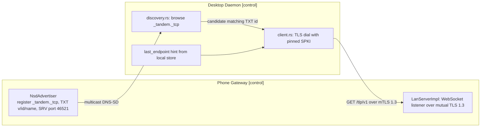
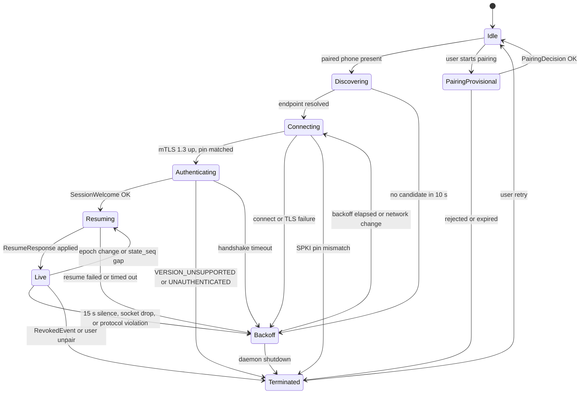
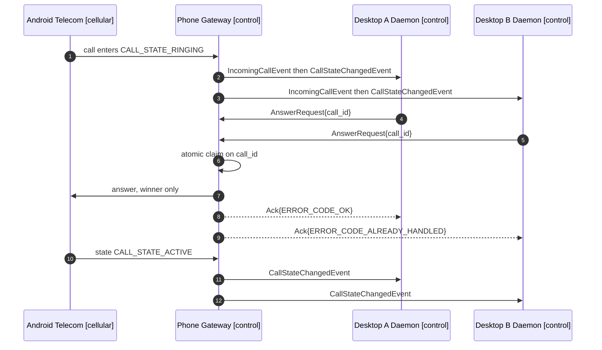

# Transport and Protocol — Tandem LAN Protocol (TLP) v1

The control plane. TLP carries user intent (dial, answer, reject, end, mute, hold, unhold, merge,
DTMF, audio-route requests) from desktops to the phone, and authoritative call state plus
call-history pages back. TLP never carries voice: call audio travels the media plane over Bluetooth
HFP (see [05-bluetooth-hfp.md](05-bluetooth-hfp.md)), and the cellular leg is the carrier's. The
phone is the source of truth for all call state
([adr/0007-phone-as-source-of-truth.md](adr/0007-phone-as-source-of-truth.md)); TLP delivers intent
up and versioned state down.

Scope of this document: transport choice, framing, discovery, session lifecycle, version
negotiation, the complete message catalog, multi-desktop arbitration, and the canonical schema.
Interface contracts on either side of the wire live in
[11-api-reference.md](11-api-reference.md); pairing semantics in
[07-pairing-and-auth.md](07-pairing-and-auth.md); crypto and threat model in
[08-security-and-encryption.md](08-security-and-encryption.md).

Everything here is `[Tier A]`: TLP is fully exercised by the control-only product with no Bluetooth
audio work. The only tier-conditional elements are `SessionHello.bt_adapter_address` and
`AudioRouteRequest` / `AudioRouteChangedEvent` with `AUDIO_ROUTE_BLUETOOTH`, which matter for
`[Tier B — Linux]` and `[Tier B — Win/macOS USB dongle]` and are simply unused under
`[Tier B-lite fallback]`.

---

## 1. Transport: WebSocket over mutual TLS 1.3

**Decision (ADR-0003):** binary WebSocket over mutual TLS 1.3 on TCP, one protobuf `Envelope` per
binary frame, 256 KiB maximum payload, default port **46521**. Phone = server (`LanServerImpl`,
Ktor CIO, TLS context from `TlsServerFactory`); desktop = client (`tandem_transport::client`,
tokio-tungstenite over a rustls config from `tandem_transport::tls`).

| Property | TLP choice |
|---|---|
| L4 | TCP; default port 46521, configurable, actual port always taken from the SRV record |
| Security | Mutual TLS **1.3 only**; self-signed per-device X.509 over P-256 identity keys; peer verified by pinned SPKI-SHA256; no CA, no WebPKI roots |
| L7 framing | WebSocket binary frames (RFC 6455), upgrade request `GET /tlp/v1` |
| Serialization | protobuf 3, package `tandem.v1`, one `Envelope` per frame |
| Max frame payload | 256 KiB; oversized frames are a protocol violation |
| Text frames | Not used; a received text frame is a protocol violation |
| Compression | `permessage-deflate` not negotiated — payloads are small, and compressing an encrypted channel invites length side channels |
| Liveness | Application-level `Heartbeat`/`HeartbeatAck`, not WS ping/pong, so liveness behaves identically across libraries and appears in protocol logs |

**Why not QUIC or gRPC** (full argument in
[adr/0003-lan-transport-choice.md](adr/0003-lan-transport-choice.md)):

- **Mature mTLS and WebSocket libraries already exist on both platforms** — Ktor CIO / OkHttp on
  Android, tokio-tungstenite + rustls on the desktop. Client-certificate authentication and custom
  peer verification are first-class in all of them, so pinning-only trust needs no exotic hooks.
- **Message framing for free.** WebSocket frame boundaries mean `EnvelopeCodec` and `codec.rs`
  decode exactly one `Envelope` per read. A raw TCP socket would need a hand-rolled length-prefix
  codec to write, fuzz, and get wrong on two platforms.
- **Control-plane rates are under 10 messages per second**, even during a transition storm plus
  heartbeats. QUIC's stream multiplexing, 0-RTT, and head-of-line-blocking avoidance solve problems
  TLP does not have, while adding UDP reachability risk on Wi-Fi networks that filter UDP or isolate
  clients, and a younger library ecosystem on Android.
- **gRPC would add HTTP/2, ALPN, and a service-definition layer** on top of the protobuf we already
  need, for a single symmetric, server-push-heavy bidirectional stream of one message type. The
  `Envelope` `oneof` gives the same typed surface with none of that runtime.
- **One ordered stream is a feature.** Strictly ordered per-session delivery keeps
  `(epoch_id, state_seq)` reasoning trivial; multiplexed streams would reintroduce ordering
  questions the protocol would then have to answer.
- **Debuggability.** A WebSocket session is inspectable with commodity tooling and a decoded
  `Envelope` is readable protobuf — decisive for a protocol whose failure modes occur on the user's
  own LAN.

TLS 1.2 is refused outright: both stacks support 1.3, and pinning-only trust plus 1.3's mandatory
forward secrecy and encrypted handshake is the whole channel-security story
([08-security-and-encryption.md](08-security-and-encryption.md)).

---

## 2. Framing and correlation

```text
TCP  ──▶  TLS 1.3 record  ──▶  WebSocket binary frame  ──▶  Envelope (protobuf)  ──▶  oneof payload
```

1. **Exactly one `Envelope` per binary WebSocket frame.** No batching, no `Envelope` spanning
   frames. Library-level fragmentation is permitted, but a frame's reassembled payload must be one
   complete `Envelope`.
2. **256 KiB cap** on the reassembled payload. Only `CallLogSyncResponse` approaches it, and the
   200-entry page cap keeps it well below. Exceeding the cap closes the session with WebSocket
   status `1009`; the desktop then enters backoff.
3. **`Envelope.protocol_version`** is set on every frame to the version agreed for the session
   (§5). A frame carrying a different value is a protocol violation.
4. **`Envelope.message_id`** is a per-sender monotonic `uint64` that starts at **1** at first
   pairing, is persisted by the sender, and **never resets across sessions**. Each side owns its
   own counter and the two counters are independent, so `(sender device id, message_id)` is unique
   for the life of the pairing — the property the dedup ledger under *Retries* below depends on.
5. **`Envelope.in_reply_to`** is `0` on requests and unsolicited events, and carries the request's
   `message_id` on any response. A response with `in_reply_to = 0` is unroutable: dropped with a
   logged protocol warning.
6. **Unknown `oneof` variant or empty `payload`**: ignore the frame and log once per session. This
   is the forward-compatibility escape hatch (§5), not an error.

**Response shape.** Every request receives exactly one response. Requests that need data get a
typed response — `SessionWelcome`, `ResumeResponse`, `CallLogSyncResponse`, `PairingDecision`.
Every other request gets `Ack{Status}`. `Status.code` is `ERROR_CODE_OK` on success;
`Status.message` is developer-facing detail, never UI copy — the desktop maps `ErrorCode` to
localized strings.

**Request timeouts.** The desktop's pending-request map (`codec.rs`) times out session-control and
call-control requests after **5 s** and `CallLogSyncRequest` after **15 s**. A timeout resolves the
caller with a transport timeout error but does not by itself close the session: the heartbeat
deadline (§4.2) is the liveness authority.

**Retries.** Retries happen only across a reconnect, never inside a live session: a live session
either delivers a request or the session is already dead. The phone keeps a dedup ledger keyed by
`(desktop_device_id, message_id)` covering the non-idempotent request set — `DialRequest`,
`AnswerRequest`, `RejectRequest`, `EndRequest`, `MergeRequest`, `SendDtmfRequest` — retained for a
bounded window of **10 minutes or 256 entries per device, whichever is larger**. A desktop retrying
one of those requests after a reconnect **reuses the original `message_id`**; because ids never
reset (rule 4), that retry can never collide with a fresh request, and the ledger recognizes it as
a duplicate even though the session it was first sent on is gone. Together these give at-most-once
execution across reconnects. See [11-api-reference.md](11-api-reference.md), *Idempotency and retry
semantics*.

---

## 3. Discovery — mDNS/DNS-SD

The phone advertises; desktops browse. Advertisement uses Android `NsdManager`
(`transport/NsdAdvertiser.kt`); browsing uses `mdns-sd` (`transport/src/discovery.rs`).

| Item | Value |
|---|---|
| Service type | `_tandem._tcp` |
| Instance name | Phone display name, DNS-SD-escaped; collisions resolved by the responder's standard suffixing |
| Port | From the SRV record — 46521 by default, overridden by the user's port setting |
| TXT `v` | Protocol version the phone advertises, decimal, currently `1` |
| TXT `id` | Phone device id (UUID) |
| TXT `name` | Phone display name, UTF-8 |

Discovery reveals nothing secret: no fingerprints, no call state, no pairing tokens. It only locates
an endpoint — **authentication is entirely in the TLS handshake**, so a spoofed advertisement can at
most cause a failed pin check.

Desktop resolution order at startup:

1. Dial the persisted `last_endpoint` (`host:port`) immediately, in parallel with starting the
   browse. This makes the common case — same network, same DHCP lease — a sub-second reconnect.
2. Accept a browsed instance only when TXT `id` equals the paired phone's stored `phone_device_id`.
   Any other `id` is ignored and never dialed.
3. If TXT `v` exceeds the desktop's maximum supported version, still connect: negotiation in
   `SessionHello`/`SessionWelcome` is authoritative and yields an actionable error rather than a
   silent skip.
4. Try resolved addresses in the order the resolver returns them; on success persist the winning
   `host:port` as `last_endpoint`.

Both sides re-advertise / re-browse on network change (Android connectivity callback, desktop OS
network-change signal), and treat a network change as an immediate trigger that bypasses backoff
delay (§4.2).

Where mDNS is blocked — some corporate and guest Wi-Fi networks suppress multicast — the user can
enter `host:port` manually in desktop settings, which becomes `last_endpoint`. First contact never
depends on mDNS either, because the pairing QR payload carries `host` and `port` directly.



---

## 4. Connection lifecycle

### 4.1 Phases

1. **Connect.** TCP, then TLS 1.3. The desktop presents its device certificate and verifies the
   phone's leaf by SPKI-SHA256 against the pinned value — from the paired-phone record, or from the
   QR payload `fp` on the pairing path. The phone requires a client certificate and looks its SPKI
   up in `PairedDeviceRepository`: a known non-revoked pin enters the **paired** path; an unknown
   pin is admitted only to the **provisional pairing** path, and only while a pairing window is
   open; a revoked pin is refused at handshake.
2. **Authenticate.** The desktop's first frame is `SessionHello{device_id, protocol_min,
   protocol_max, client_name, bt_adapter_address}`. The phone replies `SessionWelcome{status,
   protocol_version, phone_device_id, phone_name, epoch_id, state_seq, call_log_version,
   emergency_numbers}`. `status.code == ERROR_CODE_OK` makes the session live. Sending any other
   frame first, or a `device_id` that does not match the certificate's pinned row, is answered with
   `SessionWelcome{ERROR_CODE_UNAUTHENTICATED}` and an immediate close. TLS has already
   authenticated the peer; `device_id` is a consistency check, not a credential.
3. **Resume.** The desktop immediately sends `ResumeRequest{last_epoch_id, last_state_seq,
   last_call_log_version}` and reconciles from `ResumeResponse` (§4.3) before rendering any call
   state. On a first-ever session it sends empty/zero values, which always yields a snapshot.
4. **Live.** Events flow phone → desktop, requests flow desktop → phone, heartbeats run both ways.
5. **Close.** Either side may close. The phone closes on revocation (after emitting `RevokedEvent`)
   and on protocol violation. A desktop close is followed by reconnect unless the user unpaired or
   the daemon is shutting down.

`SessionWelcome.emergency_numbers` refreshes the desktop's local emergency pre-check list
(`core/emergency.rs`) on every new session. The phone-side guard stays authoritative, so
mid-session staleness such as a SIM swap is acceptable defense in depth
([adr/0008-emergency-call-policy.md](adr/0008-emergency-call-policy.md)).

### 4.2 Heartbeat and reconnect

| Item | Value |
|---|---|
| Heartbeat interval | **5 s**, each direction independently |
| Dead-peer deadline | **15 s** of silence, i.e. 3 missed → close socket |
| Frames | `Heartbeat{seq}` → `HeartbeatAck{seq}` echoing the same `seq` |
| Liveness credit | *Any* inbound frame resets the deadline, not only `HeartbeatAck` |
| Desktop reconnect backoff | 0.5 s doubling to a 30 s maximum, ±20 % jitter |
| Backoff reset | On reaching a live session, and on a network-change signal, which also triggers an immediate retry |

`Heartbeat.seq` is a per-sender counter used to correlate and to detect a peer that is still ACKing
stale sequence numbers. A `HeartbeatAck` whose `seq` was never sent is a protocol violation.

### 4.3 Resume and reconciliation

Every phone → desktop event carries `(epoch_id, state_seq)` — directly on `IncomingCallEvent` and
`AudioRouteChangedEvent`, and inside `CallSnapshot` on `CallStateChangedEvent`. `epoch_id` is a UUID
minted at each gateway process start; `state_seq` is monotonic within an epoch.

Desktop rules (`core/reconcile.rs`):

| Observation | Desktop action |
|---|---|
| `ResumeResponse.snapshot_included = true` | Replace the entire call mirror from `snapshot`; adopt its `(epoch_id, state_seq)` |
| `ResumeResponse.snapshot_included = false` | Keep the mirror; continue from the stored `state_seq` |
| `ResumeResponse.call_log_version` greater than stored | Schedule `CallLogSyncRequest{since_ms = newest mirrored entry, max_entries = 200}` |
| Live event `epoch_id` differs from stored | Discard local call state and send a fresh `ResumeRequest` |
| Live event `state_seq` greater than stored + 1, i.e. a gap | Apply the event, since it carries a full snapshot, **and** send a fresh `ResumeRequest` to close the gap in log and route state |
| Live event `state_seq` less than or equal to stored | Duplicate or reorder; ignore |

The phone sets `snapshot_included = true` whenever `last_epoch_id` differs from the current epoch,
whenever `last_state_seq` is behind the current head, and whenever it cannot prove continuity.
Stale desktop state never overrides phone truth.

### 4.4 Desktop connection state table

`Terminated` means "no automatic retry": the UI surfaces a reason and, where applicable, a
re-pairing action.

| State | Event | Action | Next state |
|---|---|---|---|
| `Idle` | Daemon start, paired phone present | Dial `last_endpoint`; start mDNS browse | `Discovering` |
| `Idle` | Daemon start, no paired phone | Show pairing entry point | `Idle` |
| `Idle` | User starts pairing via QR or manual entry | Pin from QR `fp`; TLS dial the payload's `host:port` | `PairingProvisional` |
| `Discovering` | Instance with matching TXT `id` resolved, or `last_endpoint` reachable | TLS dial with pinned SPKI | `Connecting` |
| `Discovering` | No candidate within 10 s | Arm backoff timer | `Backoff` |
| `Connecting` | TLS 1.3 handshake complete, SPKI pin matches | Send `SessionHello` | `Authenticating` |
| `Connecting` | SPKI pin mismatch | Drop socket; raise a pin-mismatch error; warn about possible impersonation | `Terminated` |
| `Connecting` | TCP refused, TLS failure, or handshake timeout | Arm backoff timer | `Backoff` |
| `Authenticating` | `SessionWelcome{ERROR_CODE_OK}` | Store `epoch_id`, `state_seq`, `call_log_version`, `emergency_numbers`; send `ResumeRequest` | `Resuming` |
| `Authenticating` | `SessionWelcome{ERROR_CODE_VERSION_UNSUPPORTED}` | Surface "update required"; do not retry | `Terminated` |
| `Authenticating` | `SessionWelcome{ERROR_CODE_UNAUTHENTICATED}`, or close before any reply | Surface "re-pair required" | `Terminated` |
| `Authenticating` | No `SessionWelcome` within 5 s | Close socket; arm backoff timer | `Backoff` |
| `Resuming` | `ResumeResponse{snapshot_included = true}` | Replace mirror from `snapshot` | `Live` |
| `Resuming` | `ResumeResponse{snapshot_included = false}` | Keep mirror; continue at stored `state_seq` | `Live` |
| `Resuming` | `ResumeResponse.status.code != ERROR_CODE_OK`, or no reply within 5 s | Close socket; arm backoff timer | `Backoff` |
| `Live` | `Heartbeat{seq}` received | Reply `HeartbeatAck{seq}`; reset deadline | `Live` |
| `Live` | Any inbound frame | Reset dead-peer deadline | `Live` |
| `Live` | `state_seq` gap or `epoch_id` change observed | Send fresh `ResumeRequest` | `Resuming` |
| `Live` | 15 s silence | Close socket; arm backoff timer | `Backoff` |
| `Live` | WebSocket close, TCP reset, or Wi-Fi drop | Arm backoff timer; retry immediately if a network-change signal accompanies it | `Backoff` |
| `Live` | Framing rule violated (§2) or 256 KiB exceeded | Close with status `1002` / `1009`; arm backoff timer | `Backoff` |
| `Live` | `RevokedEvent` received | Delete the paired-phone record and mirror; surface "access revoked" | `Terminated` |
| `Live` | User unpairs on the desktop | Close; delete local trust material | `Terminated` |
| `Live` | Daemon shutdown | Close cleanly | `Terminated` |
| `Backoff` | Timer elapsed | Retry `last_endpoint`, then discovery candidates | `Connecting` |
| `Backoff` | Network-change signal | Cancel timer; reset backoff to 0.5 s; retry now | `Connecting` |
| `Backoff` | Daemon shutdown | Abort timer | `Terminated` |
| `PairingProvisional` | `PairingAwaitConfirmEvent{require_short_code}` | Show waiting state; display the 6-digit code when `require_short_code` is true | `PairingProvisional` |
| `PairingProvisional` | `PairingDecision{ERROR_CODE_OK}` | Persist phone identity and the assigned `desktop_device_id`; close the provisional session | `Idle` |
| `PairingProvisional` | `PairingDecision{ERROR_CODE_PAIRING_REJECTED}`, token expiry, or short-code mismatch | Surface the specific failure; discard provisional trust | `Terminated` |
| `Terminated` | User retries or re-pairs | Reset transport state | `Idle` |



### 4.5 Phone-side session states

Each accepted connection is one `DesktopSession` actor. `SessionRegistry` holds only `Live`
sessions.

| State | Entered when | Exits to |
|---|---|---|
| `Handshaking` | TLS complete, awaiting `SessionHello` | `Live` on a valid hello; `Closing` on an invalid hello or 5 s timeout |
| `Provisional` | TLS complete with an unknown SPKI while a pairing window is open | `Closing` once `PairingDecision` is sent, either verdict |
| `Live` | `SessionWelcome{ERROR_CODE_OK}` sent; registered for fan-out | `Closing` on 15 s silence, protocol violation, revocation, or peer close |
| `Closing` | Any terminal condition | Deregistered from `SessionRegistry`; socket closed |

A `Provisional` session accepts only `PairingRequest` and heartbeats. Any call-control or call-log
frame on it is answered `Ack{ERROR_CODE_UNAUTHENTICATED}` and closes the session.

---

## 5. Version negotiation and forward compatibility

`protocol_version` is a single `uint32` **major** version. Current value: **1**.

**Negotiation.** The desktop states the closed range it supports in `SessionHello.protocol_min` /
`protocol_max`, and during first pairing in `PairingRequest.protocol_min` / `protocol_max`. The
phone picks the **highest version in the intersection** of its own range and the desktop's and
returns it in `SessionWelcome.protocol_version` or `PairingDecision.protocol_version`. If the
intersection is empty the phone replies
`SessionWelcome{status.code = ERROR_CODE_VERSION_UNSUPPORTED}` and closes; the desktop surfaces an
"update required" state and does not retry. Both sides then stamp `Envelope.protocol_version` with
the agreed value on every subsequent frame.

**Forward-compatibility rules:**

| Change | Version impact | Peer behavior |
|---|---|---|
| Add a field to an existing message | Minor — no bump | proto3 unknown fields are preserved and ignored by older peers |
| Add a new `oneof payload` variant with a fresh tag number | Minor — no bump | Older peers see an unrecognized variant, ignore the frame, and log once per session |
| Add an `ErrorCode`, `CallState`, `AudioRoute`, `CallLogType`, or `DisconnectCause` value | Minor — no bump | Older peers receive the numeric value; each enum's `*_UNSPECIFIED = 0` plus the rule "treat unknown as unspecified, never crash" keeps them safe |
| Change the meaning of an existing field, or the semantics of a request | **Major** — bump `protocol_version` | Negotiation excludes incompatible peers |
| Remove or renumber a field or `oneof` tag | **Forbidden** | Mark the tag `reserved` instead; removal is a major break |
| Make a previously optional field mandatory | **Major** | Same as a semantic change |

Hard rules for both implementations:

- Never reuse a tag number. Deleted fields become `reserved`.
- Never treat an absent `Envelope.payload` as fatal; ignore it.
- Unknown enum values map to the domain type's unknown case and never gate a destructive action —
  an unknown `CallState` must not be treated as `CALL_STATE_DISCONNECTED`.
- A request whose `oneof` variant is not recognized in the agreed version receives no `Ack`; it is
  ignored, because the sender did not respect the negotiated version. Senders must therefore emit
  only variants valid in the agreed version.
- Generated code is the only definition: Kotlin via protobuf-gradle-plugin, Rust via prost in
  `tandem_proto`
  ([adr/0009-protobuf-single-source-of-truth.md](adr/0009-protobuf-single-source-of-truth.md)).
  Hand-written DTOs are prohibited.

---

## 6. Message catalog

Complete inventory of `Envelope.payload`. Tag numbers are the `oneof` field numbers and are part of
the wire contract.

### 6.1 Session control

| Tag | Message | Direction | Response | Purpose |
|---|---|---|---|---|
| 10 | `SessionHello` | desktop → phone | `SessionWelcome` | First frame of a paired session: identity check, version range, optional BT adapter address |
| 11 | `SessionWelcome` | phone → desktop | — | Verdict, agreed version, `epoch_id` / `state_seq` / `call_log_version`, emergency-number list |
| 12 | `Heartbeat` | both | `HeartbeatAck` | Liveness probe every 5 s |
| 13 | `HeartbeatAck` | both | — | Echoes `seq` |
| 14 | `ResumeRequest` | desktop → phone | `ResumeResponse` | Reconcile the mirror after connect or a detected gap |
| 15 | `ResumeResponse` | phone → desktop | — | Snapshot-or-continue verdict plus current `call_log_version` |
| 16 | `Ack` | phone → desktop | — | Generic result for every request without a typed response |

`SessionHello.bt_adapter_address` is meaningful only under `[Tier B — Linux]` and
`[Tier B — Win/macOS USB dongle]`; it is empty under `[Tier B-lite fallback]`. The phone stores it
for later Bluetooth bonding rather than acting on it (see
[07-pairing-and-auth.md](07-pairing-and-auth.md)).

### 6.2 Call-control requests (desktop → phone)

All are answered with `Ack{Status}`, all require a `Live` session, and all pass through the same
use-case the handset UI uses — one command path for both surfaces.

| Tag | Message | Fields | Idempotent | Notable failure codes |
|---|---|---|---|---|
| 20 | `DialRequest` | `number`, `sim_slot` | No | `ERROR_CODE_EMERGENCY_NUMBER_BLOCKED`, `ERROR_CODE_RATE_LIMITED` at 5 dials/min/session, `ERROR_CODE_TELECOM_FAILURE` |
| 21 | `AnswerRequest` | `call_id` | No | `ERROR_CODE_ALREADY_HANDLED`, `ERROR_CODE_CALL_NOT_FOUND`, `ERROR_CODE_INVALID_CALL_STATE` |
| 22 | `RejectRequest` | `call_id` | No | `ERROR_CODE_ALREADY_HANDLED`, `ERROR_CODE_CALL_NOT_FOUND`, `ERROR_CODE_INVALID_CALL_STATE` |
| 23 | `EndRequest` | `call_id` | No | `ERROR_CODE_CALL_NOT_FOUND`, `ERROR_CODE_INVALID_CALL_STATE`, which includes refusal on an active emergency call |
| 24 | `MuteRequest` | `muted` | **Yes** — absolute state | `ERROR_CODE_TELECOM_FAILURE` |
| 25 | `HoldRequest` | `call_id` | **Yes** — already held is an OK no-op | `ERROR_CODE_INVALID_CALL_STATE` when `can_hold` is false |
| 26 | `UnholdRequest` | `call_id` | **Yes** — already active is an OK no-op | `ERROR_CODE_INVALID_CALL_STATE` |
| 27 | `MergeRequest` | `call_id`, `other_call_id` | No | `ERROR_CODE_INVALID_CALL_STATE` when `can_merge` is false, `ERROR_CODE_CALL_NOT_FOUND` |
| 28 | `SendDtmfRequest` | `call_id`, `digits` | No | `ERROR_CODE_INVALID_CALL_STATE`, `ERROR_CODE_CALL_NOT_FOUND` |
| 29 | `AudioRouteRequest` | `route`, `bt_device_address` | **Yes** — absolute route | `ERROR_CODE_AUDIO_ROUTE_UNAVAILABLE` for an unbonded target, no SCO, or an active emergency call |

`DialRequest.number` is the raw dial string; the phone normalizes it and applies the emergency
guard. `sim_slot = -1` selects the default SIM. `MergeRequest.other_call_id` empty means "the single
held call".

`AudioRouteRequest` with `route = AUDIO_ROUTE_BLUETOOTH` requires `bt_device_address`; it is the LAN
trigger that makes the phone route call audio to the desktop's Hands-Free unit
`[Tier B — Linux]` `[Tier B — Win/macOS USB dongle]`. Under `[Tier B-lite fallback]` the desktop
never sends it and the user routes audio to commodity Bluetooth earbuds paired directly to the
phone. The desktop **never** sends HFP call-control AT commands to achieve any of this — the
single-command-path rule in [05-bluetooth-hfp.md](05-bluetooth-hfp.md).

### 6.3 Call-plane events (phone → desktop)

Events are unsolicited (`in_reply_to = 0`), unacknowledged, and fan out to every `Live` session.

| Tag | Message | Carries | Emitted when |
|---|---|---|---|
| 40 | `IncomingCallEvent` | `CallInfo call`, `epoch_id`, `state_seq` | A call enters `CALL_STATE_RINGING`; the ring-specific hook desktops use to raise incoming-call UI |
| 41 | `CallStateChangedEvent` | `CallSnapshot snapshot` | Every telecom transition; carries the **full** snapshot so desktops converge without delta bookkeeping |
| 42 | `AudioRouteChangedEvent` | `route`, `bt_device_address`, `epoch_id`, `state_seq` | The phone's actual route changed, including an involuntary fall back to earpiece after a SCO drop |

`CallStateChangedEvent` always follows `IncomingCallEvent` for the same transition, so a desktop
that handles only snapshots is still correct. `CallInfo.is_emergency = true` marks a call read-only:
the phone refuses control and audio-route requests against it.

### 6.4 Call-log sync

| Tag | Message | Direction | Response | Notes |
|---|---|---|---|---|
| 50 | `CallLogSyncRequest` | desktop → phone | `CallLogSyncResponse` | `since_ms` lower bound, `max_entries` page size; the phone caps at 200 |
| 51 | `CallLogSyncResponse` | phone → desktop | — | `entries`, `log_version`, `has_more`; page again with `since_ms` advanced past the last entry while `has_more` is true |
| 52 | `CallLogChangedEvent` | phone → desktop | — | Nudge carrying the new `log_version`; the desktop decides when to sync |

The desktop cache is a **read-only projection** of the phone's OS call log; the phone never writes
the OS call log on a desktop's behalf. Retention and refresh policy:
[09-data-models.md](09-data-models.md).

### 6.5 Pairing and trust lifecycle

`PairingRequest`, `PairingAwaitConfirmEvent`, and `PairingDecision` are valid **only** on a
provisional session (§4.5). `RevokedEvent` arrives on a paired session. Token rules and short-code
derivation: [07-pairing-and-auth.md](07-pairing-and-auth.md).

| Tag | Message | Direction | Response | Notes |
|---|---|---|---|---|
| 60 | `PairingRequest` | desktop → phone | `PairingDecision` | One-time token with 120 s TTL, desktop cert DER, name, platform, version range |
| 61 | `PairingAwaitConfirmEvent` | phone → desktop | — | Token accepted, awaiting the user's tap; `require_short_code` is true on the manual-entry path |
| 62 | `PairingDecision` | phone → desktop | — | Verdict, assigned `desktop_device_id`, phone identity, agreed version, `phone_bt_address` |
| 63 | `RevokedEvent` | phone → desktop | — | Authorization withdrawn; the session closes immediately after and future handshakes from that SPKI are refused |

### 6.6 Error-code reference

`ErrorCode` (common.proto) is the single result vocabulary for every `Status`.

| Code | Meaning on the wire |
|---|---|
| `ERROR_CODE_UNSPECIFIED` | Never sent deliberately; treat as `ERROR_CODE_INTERNAL` |
| `ERROR_CODE_OK` | Success |
| `ERROR_CODE_UNAUTHENTICATED` | Frame arrived on a session not entitled to send it: wrong phase, provisional session, or `device_id` mismatch |
| `ERROR_CODE_VERSION_UNSUPPORTED` | Empty version intersection; the session closes and the desktop does not retry |
| `ERROR_CODE_CALL_NOT_FOUND` | `call_id` unknown to the phone, usually a lost race with disconnection |
| `ERROR_CODE_INVALID_CALL_STATE` | Operation illegal for the call's current state or capabilities |
| `ERROR_CODE_EMERGENCY_NUMBER_BLOCKED` | Desktop-originated emergency dial refused; the UI must direct the user to the handset |
| `ERROR_CODE_ALREADY_HANDLED` | Another desktop or the handset won the arbitration race (§7) |
| `ERROR_CODE_RATE_LIMITED` | Per-session limit exceeded; dials are capped at 5/min |
| `ERROR_CODE_TELECOM_FAILURE` | Android Telecom rejected or failed the operation |
| `ERROR_CODE_AUDIO_ROUTE_UNAVAILABLE` | Requested route not currently achievable |
| `ERROR_CODE_PAIRING_REJECTED` | User declined, token invalid or expired, or short code mismatched |
| `ERROR_CODE_INTERNAL` | Unexpected gateway-side failure; idempotent operations are safe to retry |

Mapping from these codes onto each side's typed error enums:
[11-api-reference.md](11-api-reference.md).

---

## 7. Multi-desktop handling

The phone accepts **multiple concurrent authenticated sessions** — a laptop and a workstation may
both be paired and connected.

**Fan-out.** `SessionRegistry` broadcasts every call-plane and call-log event to all `Live`
sessions. Each session's outbound queue is serialized independently, so a slow or stalled session
cannot delay others and is closed on its own 15 s deadline. Every fan-out copy carries the same
`(epoch_id, state_seq)`, so all desktops converge on identical state.

**First-`AnswerRequest`-wins.** Answering is arbitrated atomically against telecom state:

1. Each session forwards `AnswerRequest{call_id}` to the `AnswerCall` use-case.
2. `AnswerCall` performs a single atomic claim on `call_id` via the `SessionRegistry` claim
   primitive, conditional on the call still being in `CALL_STATE_RINGING`.
3. The winner proceeds to `TelecomBridge.answer` and receives `Ack{ERROR_CODE_OK}`.
4. Every loser receives `Ack{ERROR_CODE_ALREADY_HANDLED}` **plus** the resulting
   `CallStateChangedEvent` from normal fan-out, so a losing desktop's UI transitions into the
   in-call state instead of showing an error.
5. The handset participates in the same arbitration: if the user answers on the phone, the claim is
   already taken and every desktop gets `ERROR_CODE_ALREADY_HANDLED`.

The same claim-then-act pattern covers `RejectRequest` and `EndRequest`: a duplicate from a second
desktop yields `ERROR_CODE_ALREADY_HANDLED` when the transition already happened, or
`ERROR_CODE_INVALID_CALL_STATE` / `ERROR_CODE_CALL_NOT_FOUND` when the call has moved on. Losing is
never an error the user must act on.

**No cross-desktop precedence.** There is no primary desktop and no priority order — arbitration is
purely first-to-arrive at the phone. Ties are impossible because the claim is atomic.

**Audio is single-consumer.** Only one HFP audio route is active at a time. A second desktop's
`AudioRouteRequest` targeting its own adapter re-routes audio away from the first, and both learn
the outcome from `AudioRouteChangedEvent`. Under `[Tier B — Linux]` and
`[Tier B — Win/macOS USB dongle]` this is a deliberate hand-off, not a conflict; the losing desktop
keeps full control-plane function.

**Rate limits are per session.** The 5-dial/minute budget is not shared, so one desktop cannot
starve another; the phone's own telecom state is the real backstop.



---

## 8. Wire schema — `proto/tandem/v1/`

The five files below are the wire contract, embedded verbatim. `/proto` is the only source: Kotlin
bindings come from protobuf-gradle-plugin, Rust bindings from prost via `tandem_proto`. On Android
only `transport/EnvelopeCodec.kt` imports generated proto classes; on the desktop only
`tandem_proto` re-exports them. Editing these definitions is editing the protocol — apply §5.

### 8.1 `common.proto`

```protobuf
// Shared enums and value types for the Tandem LAN Protocol (TLP) v1.
// Single source of truth: generated into Kotlin (protobuf-gradle-plugin) and
// Rust (prost via tandem_proto). Never hand-duplicate these types.

syntax = "proto3";

package tandem.v1;

option java_package = "com.tandem.gateway.proto.v1";
option java_multiple_files = true;

// Result codes for every request/response boundary in TLP.
enum ErrorCode {
  ERROR_CODE_UNSPECIFIED = 0;
  ERROR_CODE_OK = 1;
  ERROR_CODE_UNAUTHENTICATED = 2;
  ERROR_CODE_VERSION_UNSUPPORTED = 3;
  ERROR_CODE_CALL_NOT_FOUND = 4;
  ERROR_CODE_INVALID_CALL_STATE = 5;
  ERROR_CODE_EMERGENCY_NUMBER_BLOCKED = 6;
  ERROR_CODE_ALREADY_HANDLED = 7;
  ERROR_CODE_RATE_LIMITED = 8;
  ERROR_CODE_TELECOM_FAILURE = 9;
  ERROR_CODE_AUDIO_ROUTE_UNAVAILABLE = 10;
  ERROR_CODE_PAIRING_REJECTED = 11;
  ERROR_CODE_INTERNAL = 12;
}

// Mirrors android.telecom.Call states; the phone is the source of truth.
enum CallState {
  CALL_STATE_UNSPECIFIED = 0;
  CALL_STATE_CONNECTING = 1;
  CALL_STATE_DIALING = 2;
  CALL_STATE_RINGING = 3;
  CALL_STATE_ACTIVE = 4;
  CALL_STATE_HOLDING = 5;
  CALL_STATE_DISCONNECTING = 6;
  CALL_STATE_DISCONNECTED = 7;
}

enum CallDirection {
  CALL_DIRECTION_UNSPECIFIED = 0;
  CALL_DIRECTION_INCOMING = 1;
  CALL_DIRECTION_OUTGOING = 2;
}

enum DisconnectCause {
  DISCONNECT_CAUSE_UNSPECIFIED = 0;
  DISCONNECT_CAUSE_LOCAL_HANGUP = 1;
  DISCONNECT_CAUSE_REMOTE_HANGUP = 2;
  DISCONNECT_CAUSE_BUSY = 3;
  DISCONNECT_CAUSE_MISSED = 4;
  DISCONNECT_CAUSE_REJECTED = 5;
  DISCONNECT_CAUSE_CANCELED = 6;
  DISCONNECT_CAUSE_ERROR = 7;
}

// Where the phone is currently rendering call audio.
enum AudioRoute {
  AUDIO_ROUTE_UNSPECIFIED = 0;
  AUDIO_ROUTE_EARPIECE = 1;
  AUDIO_ROUTE_SPEAKER = 2;
  AUDIO_ROUTE_WIRED_HEADSET = 3;
  AUDIO_ROUTE_BLUETOOTH = 4;
}

// Generic operation result attached to acks and typed responses.
message Status {
  ErrorCode code = 1;
  string message = 2;
}

// One live (or just-disconnected) call as known to Android Telecom.
message CallInfo {
  string call_id = 1;               // Stable id minted by the phone gateway.
  CallState state = 2;
  CallDirection direction = 3;
  string remote_number = 4;         // E.164 where resolvable; may be empty (private).
  string remote_display_name = 5;   // Contact name resolved on the phone; may be empty.
  int64 started_at_ms = 6;          // Unix ms; 0 until the call leaves CONNECTING/RINGING.
  bool is_conference = 7;
  bool can_hold = 8;
  bool can_merge = 9;
  bool is_emergency = 10;           // Read-only surfacing; remote control is refused.
  DisconnectCause disconnect_cause = 11;  // Set only in DISCONNECTED state.
  int32 sim_slot = 12;              // 0-based; -1 when unknown/single-SIM.
}

// Full authoritative call-plane state, versioned for resumption.
message CallSnapshot {
  string epoch_id = 1;              // UUID minted at each phone-gateway process start.
  uint64 state_seq = 2;             // Monotonic within an epoch.
  repeated CallInfo calls = 3;
  AudioRoute audio_route = 4;
  bool microphone_muted = 5;
  string bt_route_address = 6;      // MAC of the active BT audio device, if route is Bluetooth.
}
```

### 8.2 `call.proto`

```protobuf
// Call-control requests (desktop -> phone) and call-plane events
// (phone -> desktop) for TLP v1. All user intent flows over these messages;
// the desktop never issues HFP AT call-control commands (see docs/05).

syntax = "proto3";

package tandem.v1;

import "tandem/v1/common.proto";

option java_package = "com.tandem.gateway.proto.v1";
option java_multiple_files = true;

// ---- Requests (desktop -> phone). Non-idempotent unless noted. ----

message DialRequest {
  string number = 1;                // Raw dial string; phone normalizes and guards emergencies.
  int32 sim_slot = 2;               // 0-based; -1 = default SIM.
}

message AnswerRequest {
  string call_id = 1;
}

message RejectRequest {
  string call_id = 1;
}

message EndRequest {
  string call_id = 1;
}

// Idempotent: sets absolute mute state of the phone microphone path.
message MuteRequest {
  bool muted = 1;
}

// Idempotent: holding an already-held call is an OK no-op.
message HoldRequest {
  string call_id = 1;
}

// Idempotent: unholding an active call is an OK no-op.
message UnholdRequest {
  string call_id = 1;
}

message MergeRequest {
  string call_id = 1;               // Call to merge from (typically the active call).
  string other_call_id = 2;         // Call to merge with; empty = the single held call.
}

message SendDtmfRequest {
  string call_id = 1;
  string digits = 2;                // 0-9, *, #, A-D; played sequentially by Telecom.
}

// Idempotent: requests an absolute audio route on the phone.
message AudioRouteRequest {
  AudioRoute route = 1;
  string bt_device_address = 2;     // Required when route = AUDIO_ROUTE_BLUETOOTH.
}

// Generic response for requests without a typed response body.
message Ack {
  Status status = 1;
}

// ---- Events (phone -> desktop). ----

message IncomingCallEvent {
  CallInfo call = 1;
  string epoch_id = 2;
  uint64 state_seq = 3;
}

// Emitted on every telecom state transition; carries the full snapshot so
// desktops converge without delta bookkeeping.
message CallStateChangedEvent {
  CallSnapshot snapshot = 1;
}

message AudioRouteChangedEvent {
  AudioRoute route = 1;
  string bt_device_address = 2;
  string epoch_id = 3;
  uint64 state_seq = 4;
}
```

### 8.3 `calllog.proto`

```protobuf
// Call-history sync messages for TLP v1. The phone's OS call log is the
// source of truth; desktops hold a read-only, incrementally synced projection.

syntax = "proto3";

package tandem.v1;

import "tandem/v1/common.proto";

option java_package = "com.tandem.gateway.proto.v1";
option java_multiple_files = true;

enum CallLogType {
  CALL_LOG_TYPE_UNSPECIFIED = 0;
  CALL_LOG_TYPE_INCOMING = 1;
  CALL_LOG_TYPE_OUTGOING = 2;
  CALL_LOG_TYPE_MISSED = 3;
  CALL_LOG_TYPE_REJECTED = 4;
}

// Projection of one android.provider.CallLog.Calls row.
message CallLogEntry {
  string entry_id = 1;              // Phone-side stable id (CallLog row _ID as string).
  string number = 2;
  string display_name = 3;          // Contact name at time of sync; may be empty.
  CallLogType type = 4;
  int64 started_at_ms = 5;
  uint32 duration_seconds = 6;
  int32 sim_slot = 7;               // -1 when unknown.
}

message CallLogSyncRequest {
  int64 since_ms = 1;               // Return entries with started_at_ms >= since_ms.
  uint32 max_entries = 2;           // Page size; server caps at 200.
}

message CallLogSyncResponse {
  Status status = 1;
  repeated CallLogEntry entries = 2;
  uint64 log_version = 3;           // Phone-persisted monotonic call-log version.
  bool has_more = 4;
}

// Nudge: the phone's call log changed; desktops should issue a sync request.
message CallLogChangedEvent {
  uint64 log_version = 1;
}
```

### 8.4 `pairing.proto`

```protobuf
// First-pairing handshake messages for TLP v1. Runs inside a provisional TLS
// session bootstrapped by the QR/short-code secret (see docs/07). The phone
// owns the paired-desktop list and arbitrates acceptance.

syntax = "proto3";

package tandem.v1;

import "tandem/v1/common.proto";

option java_package = "com.tandem.gateway.proto.v1";
option java_multiple_files = true;

message PairingRequest {
  string pairing_token = 1;         // One-time token from the QR payload; TTL 120 s.
  bytes desktop_cert_der = 2;       // Desktop's self-signed device cert (P-256).
  string desktop_name = 3;          // Human label shown in the phone's paired list.
  string desktop_platform = 4;      // "linux" | "windows" | "macos".
  uint32 protocol_min = 5;
  uint32 protocol_max = 6;
}

// Phone -> desktop: token accepted; waiting on the user's confirmation tap.
// require_short_code is true on the manual-entry (no-QR) path, where both
// screens display a 6-digit code derived from the key exchange for comparison.
message PairingAwaitConfirmEvent {
  bool require_short_code = 1;
}

// Phone -> desktop: final verdict. On success the desktop persists the phone
// identity and may connect normal sessions from then on.
message PairingDecision {
  Status status = 1;
  string desktop_device_id = 2;     // UUIDv4 assigned by the phone.
  string phone_device_id = 3;
  string phone_name = 4;
  uint32 protocol_version = 5;      // Highest mutually supported version.
  string phone_bt_address = 6;      // For later BT bonding (Tier B); may be empty.
}

// Phone -> desktop: this desktop's authorization was revoked; the session
// closes immediately after this event and future TLS handshakes are refused.
message RevokedEvent {
  string reason = 1;
}
```

### 8.5 `transport.proto`

```protobuf
// Session layer and the Envelope frame for TLP v1. Every WebSocket binary
// frame carries exactly one Envelope; the oneof below is the complete message
// catalog. Version negotiation happens in SessionHello/SessionWelcome.

syntax = "proto3";

package tandem.v1;

import "tandem/v1/common.proto";
import "tandem/v1/call.proto";
import "tandem/v1/calllog.proto";
import "tandem/v1/pairing.proto";

option java_package = "com.tandem.gateway.proto.v1";
option java_multiple_files = true;

// First frame from the desktop after TLS establishment (paired sessions).
message SessionHello {
  string device_id = 1;             // Desktop device id assigned at pairing.
  uint32 protocol_min = 2;
  uint32 protocol_max = 3;
  string client_name = 4;
  string bt_adapter_address = 5;    // Desktop BT adapter MAC for HFP routing; may be empty.
}

// Phone's reply; on OK the session is live and events begin to flow.
message SessionWelcome {
  Status status = 1;
  uint32 protocol_version = 2;      // Chosen version for this session.
  string phone_device_id = 3;
  string phone_name = 4;
  string epoch_id = 5;
  uint64 state_seq = 6;             // Current head; use Resume to fetch the snapshot.
  uint64 call_log_version = 7;
  repeated string emergency_numbers = 8;  // Current SIM/region emergency list for the
                                          // desktop's local pre-check; the phone-side
                                          // guard remains authoritative (ADR-0008).
}

message Heartbeat {
  uint64 seq = 1;
}

message HeartbeatAck {
  uint64 seq = 1;
}

// Desktop -> phone after (re)connect: reconcile against the source of truth.
message ResumeRequest {
  string last_epoch_id = 1;
  uint64 last_state_seq = 2;
  uint64 last_call_log_version = 3;
}

// snapshot_included is true whenever the epoch differs or a gap was detected;
// the snapshot then replaces all desktop-side call state.
message ResumeResponse {
  Status status = 1;
  bool snapshot_included = 2;
  CallSnapshot snapshot = 3;
  uint64 call_log_version = 4;
}

// The single top-level frame of TLP. message_id is a per-sender monotonic
// counter that starts at 1 on first pairing and never resets across sessions,
// so (sender device id, message_id) is unique for the life of the pairing —
// that is what makes at-most-once dedup work across a reconnect. Responses set
// in_reply_to to the request's id.
message Envelope {
  uint32 protocol_version = 1;
  uint64 message_id = 2;
  uint64 in_reply_to = 3;

  oneof payload {
    // Session control.
    SessionHello session_hello = 10;
    SessionWelcome session_welcome = 11;
    Heartbeat heartbeat = 12;
    HeartbeatAck heartbeat_ack = 13;
    ResumeRequest resume_request = 14;
    ResumeResponse resume_response = 15;
    Ack ack = 16;

    // Call control (desktop -> phone).
    DialRequest dial_request = 20;
    AnswerRequest answer_request = 21;
    RejectRequest reject_request = 22;
    EndRequest end_request = 23;
    MuteRequest mute_request = 24;
    HoldRequest hold_request = 25;
    UnholdRequest unhold_request = 26;
    MergeRequest merge_request = 27;
    SendDtmfRequest send_dtmf_request = 28;
    AudioRouteRequest audio_route_request = 29;

    // Call-plane events (phone -> desktop).
    IncomingCallEvent incoming_call_event = 40;
    CallStateChangedEvent call_state_changed_event = 41;
    AudioRouteChangedEvent audio_route_changed_event = 42;

    // Call-log sync.
    CallLogSyncRequest call_log_sync_request = 50;
    CallLogSyncResponse call_log_sync_response = 51;
    CallLogChangedEvent call_log_changed_event = 52;

    // Pairing (provisional sessions) and trust lifecycle.
    PairingRequest pairing_request = 60;
    PairingAwaitConfirmEvent pairing_await_confirm_event = 61;
    PairingDecision pairing_decision = 62;
    RevokedEvent revoked_event = 63;
  }
}
```

---

## 9. Implementation map

| Concern | Phone (`com.tandem.gateway`) | Desktop (Rust) |
|---|---|---|
| Listener / dialer | `transport/LanServerImpl.kt` | `transport/src/client.rs` |
| TLS and pinning | `crypto/TlsServerFactory.kt`, `crypto/Fingerprints.kt` | `transport/src/tls.rs`, `crypto/src/pinning.rs` |
| Discovery | `transport/NsdAdvertiser.kt` | `transport/src/discovery.rs` |
| Framing and correlation | `transport/EnvelopeCodec.kt` | `transport/src/codec.rs` |
| Session actor / lifecycle | `transport/DesktopSession.kt` | `transport/src/client.rs`, `transport/src/reconnect.rs` |
| Fan-out and answer arbitration | `transport/SessionRegistry.kt` | — |
| Request dispatch | `transport/ControlPlaneRouter.kt` | `core/src/controller.rs` |
| Resume reconciliation | `domain/usecase/ObserveCallState.kt` | `core/src/reconcile.rs` |

End-to-end traces for connect, resume after a Wi-Fi blip, and multi-desktop arbitration:
[10-sequence-diagrams.md](10-sequence-diagrams.md), flows (a), (h), and (i).
