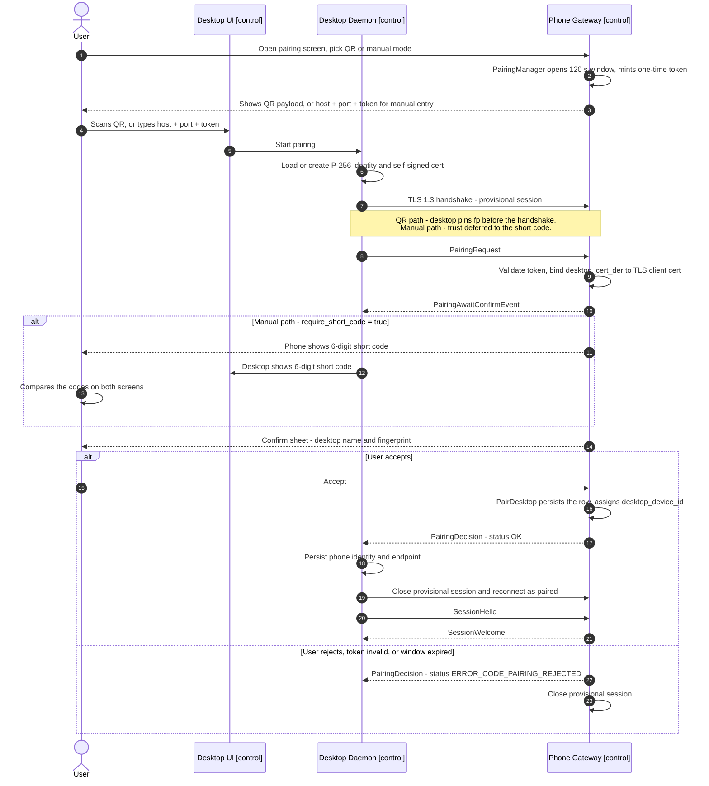
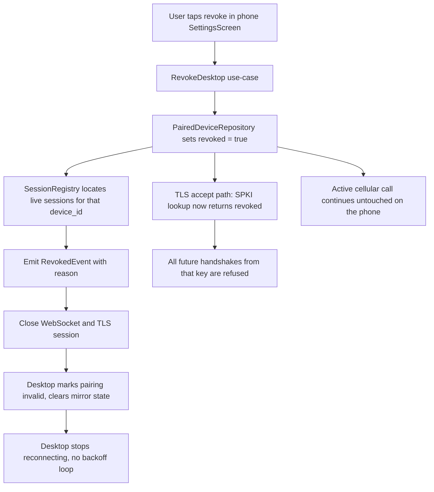
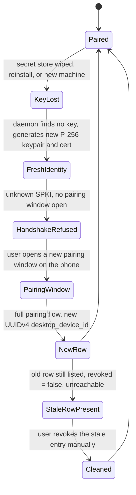

# Pairing and Authentication

How a desktop and a phone establish mutual trust over the LAN, what each side persists, and how
that trust is revoked or rebuilt. Pairing runs entirely on the control plane; no account server is
involved. Wire messages referenced here are defined in `proto/tandem/v1/pairing.proto` and embedded
verbatim in [06-transport-and-protocol.md](06-transport-and-protocol.md) (Message Catalog).
Interface contracts for `PairingManager`, `IdentityStore`, and `PairedDeviceRepository` are in
[11-api-reference.md](11-api-reference.md). Storage schemas are in
[09-data-models.md](09-data-models.md).

Pairing is tier-independent: it is all that `[Tier A]` and `[Tier B-lite fallback]` require. The
optional Bluetooth bonding step at the end applies only to `[Tier B — Linux]` and
`[Tier B — Win/macOS USB dongle]`.

## Trust model

- Every device (phone and each desktop) has its own **P-256 identity keypair**, generated at first
  run and never shared between devices.
- Each device wraps its public key in a long-lived (3650-day) **self-signed X.509 certificate**
  used only as a TLS carrier. Trust is **pinned SPKI-SHA256 hashes**, never certificate chains and
  never a CA. Certificate expiry is not a security control; see
  [08-security-and-encryption.md](08-security-and-encryption.md), Key rotation.
- **The phone owns the paired-desktop list.** A desktop is authorized if and only if its SPKI hash
  appears in the phone's `paired_desktop` table with `revoked = false`. The user manages this list
  on the phone (`SettingsScreen`); revocation is immediate.
- The desktop symmetrically pins exactly one phone SPKI hash and connects to nothing else.
- Pairing is the only path by which an unknown SPKI becomes trusted, and it always requires an
  explicit user confirmation on the phone. Possession of the pairing token grants *candidacy*, not
  access.
- Authentication is symmetric; authority is not. Both peers verify each other, but only the phone
  grants or withdraws it.

## Device identity keys

| Side | Generation | Custody | Exportability |
|---|---|---|---|
| Phone | First run, by `IdentityStoreImpl` behind the `IdentityStore` port | Android Keystore, StrongBox when available | Non-exportable; signing happens inside the Keystore |
| Desktop | First run, by `tandem_crypto` (`identity.rs`) | OS secret store via `keyring`: macOS Keychain, Windows Credential Manager/DPAPI, Linux Secret Service | Encrypted-file fallback when no secret service is present |

Callers on both sides only ever see public artifacts (device id, fingerprint, cert bytes);
private-key operations stay inside the store. Failures surface as `PairingError` / `CryptoError`
(see [11-api-reference.md](11-api-reference.md)).

## QR payload

The phone's pairing screen (`PairingScreen`, backed by `QrPayloadCodec`) renders this JSON:

```json
{"v":1,"host":"<ip>","port":46521,"fp":"<b64url SPKI-SHA256>","tok":"<128-bit one-time token, b64url>","name":"<phone name>"}
```

| Key | Meaning |
|---|---|
| `v` | Payload format version, `1`. A desktop that does not recognise the value stops before any network activity. |
| `host` | Phone's current LAN IP address. |
| `port` | Actual TLS listener port. Default **46521**; user-overridable, so always read from the payload. |
| `fp` | Base64url SPKI-SHA256 fingerprint of the phone's identity key. The desktop pins this before its first byte of application data. |
| `tok` | 128-bit random one-time pairing token, base64url. **TTL 120 s, single use** — consumed by the first `PairingRequest` that presents it, whether that candidacy succeeds or fails. Compared in constant time on the phone. |
| `name` | Phone display name, for the desktop's confirmation UI. |

The payload contains no long-term secrets: `fp` and `name` are public, and `tok` only grants
candidacy — acceptance still requires the user's confirmation tap on the phone. A photographed QR
is worthless after 120 s, and worthless at any time without that tap.

## Provisional TLS session

All pairing traffic runs inside a **provisional mutual TLS 1.3 session** on the same listener as
normal sessions. `TlsServerFactory` requires a client certificate always; a client whose SPKI is
unknown is accepted **only** while a pairing window is open, and is confined to the pairing message
flow (`ControlPlaneRouter` rejects everything else with `ERROR_CODE_UNAUTHENTICATED`). The desktop
presents its own device certificate in this handshake; the phone binds it to the application layer
by checking that `PairingRequest.desktop_cert_der` byte-equals the TLS-layer client certificate, so
the identity the user confirms is exactly the one on the wire.

| Property | Provisional pairing session | Normal paired session |
|---|---|---|
| Phone cert verified by desktop | Pinned to `fp` from the QR; on the manual path deferred to the short-code comparison | Pinned to the stored `spki_sha256` |
| Desktop cert verified by phone | Unknown SPKI accepted as the candidate, only while a window is open | Must match a `paired_desktop` row with `revoked = false` |
| Admitted payloads | `PairingRequest`, `Heartbeat`, `HeartbeatAck` | Full catalog — [06-transport-and-protocol.md](06-transport-and-protocol.md) |
| Call plane reachable | No. No `DialRequest`, no events, no call-log access | Yes |
| Lifetime | Bounded by the 120 s window; closed with the `PairingDecision` | Until close, 15 s dead-peer timeout, or revocation |

With no pairing window open, an unknown client certificate is simply a failed handshake — not a
pairing attempt.

- **QR path:** the desktop verifies the phone's certificate against `fp` from the QR before
  proceeding. The visual QR channel is the out-of-band trust root.
- **Manual path:** the user types `host`, `port`, and the token; there is no fingerprint to pin, so
  the handshake is provisionally trusted and authentication is deferred to the short-code
  comparison below.

## Pairing flow

The phone enforces **one pairing candidate at a time** (`PairingManagerImpl`); the window and token
expire together after 120 s. `require_short_code` in `PairingAwaitConfirmEvent` is set from the mode
the user chose on the phone's pairing screen: `false` for QR, `true` for manual.



Step notes:

1. `PairingRequest` carries `pairing_token`, `desktop_cert_der`, `desktop_name`,
   `desktop_platform` (`"linux" | "windows" | "macos"`), and `protocol_min`/`protocol_max`. The
   phone picks the highest mutually supported protocol version and returns it in
   `PairingDecision.protocol_version`; no overlap yields a rejection with
   `ERROR_CODE_VERSION_UNSUPPORTED` (see
   [06-transport-and-protocol.md](06-transport-and-protocol.md), version negotiation).
2. On acceptance the phone assigns `desktop_device_id` (UUIDv4 — the desktop never chooses its own
   id) and replies `PairingDecision{status, desktop_device_id, phone_device_id, phone_name,
   protocol_version, phone_bt_address}`. `phone_bt_address` may be empty; it exists for the later
   optional Bluetooth bonding step.
3. The provisional session ends with the decision. The desktop then opens a normal paired session
   (`SessionHello` → `SessionWelcome`) — connection lifecycle in
   [06-transport-and-protocol.md](06-transport-and-protocol.md). That first paired session is also
   where the desktop reports `SessionHello.bt_adapter_address`.
4. Candidacy state on the phone is a small state machine (`PairingSession`): TokenPresented →
   AwaitingConfirm → Accepted | Rejected | Expired.

### Terminal outcomes

Every failure ends the candidacy and closes the provisional session; the window is not extended and
no token is reissued automatically.

| Condition | Response |
|---|---|
| Token unknown, expired, or already consumed | `PairingDecision{status.code = ERROR_CODE_PAIRING_REJECTED}` |
| `desktop_cert_der` does not byte-equal the TLS client certificate | `PairingDecision{status.code = ERROR_CODE_PAIRING_REJECTED}` |
| User declines on the confirm sheet | `PairingDecision{status.code = ERROR_CODE_PAIRING_REJECTED}` |
| Window expires while the confirm sheet is up | `PairingDecision{status.code = ERROR_CODE_PAIRING_REJECTED}`, `PairingSession` → Expired |
| Short codes do not match, so the user declines | `PairingDecision{status.code = ERROR_CODE_PAIRING_REJECTED}` |
| No `protocol_min`/`protocol_max` overlap | `PairingDecision{status.code = ERROR_CODE_VERSION_UNSUPPORTED}` |
| Any payload other than `PairingRequest`/heartbeats on a provisional session | `Ack{status.code = ERROR_CODE_UNAUTHENTICATED}`, session closed |
| Unknown SPKI connects with no pairing window open | TLS handshake refused; nothing reaches the application layer |

### Manual path: 6-digit short code

When `require_short_code = true`, both peers derive and display a 6-digit code the user compares
across screens. Derivation (implemented in `Fingerprints.kt` and `tandem_pairing::short_code`):

1. `exporter` = 32 bytes from the TLS 1.3 exporter interface (RFC 8446 §7.5) of the provisional
   session, label `EXPORTER-tandem-pairing-v1`, empty context.
2. `okm` = HKDF-SHA256(salt = UTF-8 `"tandem-pairing-short-code-v1"`, ikm = `exporter`,
   info = phone SPKI-SHA256 ‖ desktop SPKI-SHA256), first 4 bytes. Hash order is fixed as
   phone-then-desktop regardless of TLS role.
3. code = (`okm` as big-endian uint32, high bit cleared) mod 1 000 000, zero-padded to 6 digits.
   The high bit is cleared so the signed 32-bit arithmetic of the Kotlin implementation and the
   unsigned Rust one cannot diverge.

Because the code binds **both SPKI hashes and the TLS exporter**, a machine-in-the-middle
necessarily terminates two different TLS sessions with different key material: the two screens show
different codes and the user's comparison fails. The attacker must commit to its keys before the
code is visible, so the residual risk is a blind 1-in-10⁶ guess within a single 120 s window. The
comparison and confirm tap happen on the phone; the desktop displays its code read-only. A
cross-language test vector pinning steps 1–3 is mandatory — see
[15-testing-strategy.md](15-testing-strategy.md).

On the QR path `require_short_code` is `false`: the QR already carried the phone's pin out of band,
so the handshake itself authenticates the phone and there is nothing left for the user to compare.

## Data persisted per paired device

Written only on `PairingDecision` with `ERROR_CODE_OK`, never before. Authoritative field list
below; schema DDL and store formats in [09-data-models.md](09-data-models.md).

### Phone side — Room `tandem.db`, `paired_desktop` table

| Field | Content |
|---|---|
| `device_id` | UUIDv4 assigned by the phone at acceptance. Primary key; echoed back in `SessionHello.device_id`. |
| `name` | `desktop_name` from the `PairingRequest`. User-editable label. |
| `platform` | `desktop_platform` string. |
| `spki_sha256` | Pinned SPKI-SHA256 of the desktop's identity key. Lookup key at TLS accept. |
| `cert_der` | Desktop certificate bytes (`desktop_cert_der`), retained so the pin can be re-derived and audited. |
| `bt_mac` | Desktop Bluetooth adapter MAC; **nullable until BT bonding** (Tier B step below). |
| `created_at_ms` | Pairing acceptance time, Unix ms. |
| `last_seen_at_ms` | Updated on session activity. |
| `revoked` | Boolean flag. Revocation sets the flag; rows are never hard-deleted, so audit history survives. |

### Desktop side — SQLite `tandem-cache.db` plus `config.toml`; identity key in the OS secret store

| Field | Content |
|---|---|
| phone `device_id` | From `PairingDecision.phone_device_id`. |
| `name` | `phone_name`; refreshed from `SessionWelcome.phone_name` on later sessions. |
| `spki_sha256` | Pinned SPKI-SHA256 of the phone's identity key, cross-checked against QR `fp`. |
| `cert_der` | Phone certificate bytes. |
| `phone_bt_address` | From `PairingDecision`; may be empty until Tier B is in play. |
| `last_endpoint` | `host:port` of the most recent successful connection; seeds reconnection alongside mDNS discovery. |
| `last_epoch_id` | Resume cursor, updated during sessions. |
| `last_state_seq` | Resume cursor, updated during sessions. |
| `last_call_log_version` | Resume cursor, updated during sessions. |

The desktop also persists its own assigned `desktop_device_id` in `config.toml` and sends it as
`SessionHello.device_id`. The three `last_*` values are session-resume cursors, not pairing outputs;
they feed `ResumeRequest` after reconnect (see
[06-transport-and-protocol.md](06-transport-and-protocol.md), connection lifecycle).

## Authenticated sessions after pairing

Every subsequent connection is a fresh mutual TLS 1.3 handshake in which each peer verifies the
other's SPKI against its pin, the phone additionally requires `revoked = false`, and the session is
established via `SessionHello`/`SessionWelcome`. There are no session tokens, cookies, or passwords;
the pinned keys are the entire credential. Multi-desktop: the phone accepts multiple concurrent
authenticated sessions, one per paired desktop.

## Revocation



Steps up to the flag set, the session teardown, and the TLS-accept refusal all complete before
`RevokeDesktop` returns — a revoked desktop loses control the moment the user confirms, not at some
later expiry. Consequences worth building against:

- **Three enforcement points, in order:** the row flag, live-session teardown, and the TLS accept
  check. A revoked desktop cannot reconnect even if its process never saw `RevokedEvent`.
- **TLS-layer refusal, not application-layer.** A revoked pin is treated as an unknown peer, and
  because no pairing window is open it gets no provisional session either. Re-admission requires a
  fresh identity and a fresh confirmation tap — the key-loss procedure below.
- **Flag, not delete.** `PairedDeviceRepositoryImpl` keeps the row so fingerprint and timestamps
  survive for audit, and so a stale cache cannot silently re-admit the same key.
- **Calls are never affected.** Revocation removes control, not connectivity. If the revoked desktop
  was carrying call audio as the Hands-Free unit (`[Tier B — Linux]` or
  `[Tier B — Win/macOS USB dongle]`), audio falls back per
  [05-bluetooth-hfp.md](05-bluetooth-hfp.md) — the call itself is never dropped.
- **Bluetooth bonding is separate.** Revoking LAN trust does not unbond the desktop's adapter; the
  revoke confirmation copy tells the user to remove the bond in Android's Bluetooth settings too.
  Until then the desktop remains a bonded headset with no ability to place or control calls.

## Re-pairing after desktop key loss

If the desktop's identity key is lost — OS reinstall, secret-store wipe, new machine — the desktop
generates a fresh P-256 identity at next run and its handshakes are refused (unknown SPKI). There is
no recovery of the old identity, deliberately: the phone cannot distinguish key loss from
impersonation, so it never re-binds an old `device_id` to a new key. There is no key escrow and no
"restore from backup" pairing path.



- **Nothing is inherited:** new keypair, new pin, new `device_id`, new row.
- **The stale row is the user's to remove.** The phone never auto-prunes; `SettingsScreen` shows the
  entry with its stale `last_seen_at_ms`, and the pairing-complete UX on both sides reminds the user
  to revoke it. A stale non-revoked row is harmless — its key no longer exists — but it dilutes the
  list's value as an audit surface.
- **The desktop's resume cursors are void.** `last_epoch_id`, `last_state_seq`, and
  `last_call_log_version` belong to a trust relationship that no longer exists; the daemon resets
  them and re-syncs the call log from scratch after re-pairing.
- **Phone-side key loss is the coarser, rarer case:** phone identity rotation means an app factory
  reset, after which every desktop's pinned phone SPKI fails and all desktops must re-pair (see
  [08-security-and-encryption.md](08-security-and-encryption.md), Key rotation).

## Optional Bluetooth bonding — Tier B only

LAN pairing and Bluetooth bonding are **separate trust events**. The LAN pairing above is sufficient
for `[Tier A]` and for `[Tier B-lite fallback]` (where the audio device bonded to the phone is a
commodity speakerphone or earbuds, not the desktop — a supported end state, not a degraded one). For
desktop audio — `[Tier B — Linux]` and `[Tier B — Win/macOS USB dongle]` — one extra, optional step
links the media plane:

1. On a paired session, the desktop reports its adapter MAC in `SessionHello.bt_adapter_address`;
   the phone stores it in the `bt_mac` column. Under the dongle path this is the **dongle's**
   address, not the host's built-in adapter.
2. The user completes **standard Bluetooth bonding** between phone and desktop. Phone-side security
   (SSP/Secure Connections) is owned by Android's Bluetooth stack, not Tandem code; desktop-side by
   BlueZ `[Tier B — Linux]` or by `tandem_bluetooth`'s dongle stack
   `[Tier B — Win/macOS USB dongle]`. Requires `BLUETOOTH_CONNECT` on the phone to observe
   bonded-device state.
3. `BondedDesktopMatcher` resolves the stored `bt_mac` to a live bonded device and reports unbonded
   desktops so the UI can prompt. Only then does
   `AudioRouteRequest{route: AUDIO_ROUTE_BLUETOOTH, bt_device_address}` have a legal target. HFP
   link details in [05-bluetooth-hfp.md](05-bluetooth-hfp.md).

The two identities are deliberately distinct: the LAN pin authenticates the *control* peer, the
Bluetooth bond authenticates the *audio* peer. Neither implies the other, and Tandem requires the
LAN pin before it will ever target a bonded address.

## Future: optional cloud account

A later optional cloud account (roadmap phase 7, see [16-roadmap.md](16-roadmap.md)) could sit
*above* this design — syncing the paired-device roster and settings across a user's machines,
delivering a phone's pin and endpoint to a new desktop without a QR scan, and providing rendezvous
for a beyond-same-room mode — without changing the trust anchor. Per-device pinned keys, the
phone-owned authorization list, the human confirmation tap, and locally enforced revocation would
remain authoritative; an account could only ever be another way to *deliver* a pin, never an
authority that grants one. Nothing in this document assumes such an account exists, and the pairing
code must keep working unchanged with no cloud party present.
