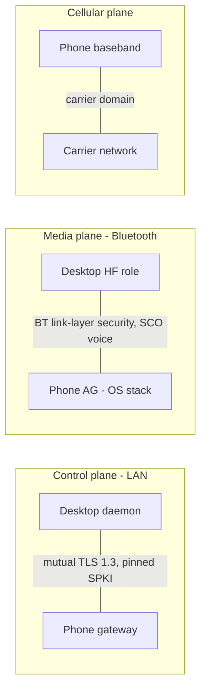

# Security and Encryption

Threat model and cryptographic design for Tandem. The asset being protected is control over a real
SIM line and the metadata around it: the ability to dial and manipulate calls, the call log, and the
live call-state mirror. Pairing mechanics live in [07-pairing-and-auth.md](07-pairing-and-auth.md);
wire messages in [06-transport-and-protocol.md](06-transport-and-protocol.md); the permission matrix
in [12-permissions-and-platform.md](12-permissions-and-platform.md).

## Scope and security goals

1. Only devices the user has explicitly paired — and not since revoked — can observe or control
   calls. The phone is the sole authority on that set.
2. A LAN observer learns nothing about call content or metadata beyond what mDNS discovery
   deliberately advertises.
3. A compromised or malicious desktop is contained: bounded dialing, read-only history, no
   emergency-call capability, revocable instantly, and everything it does is visible on the handset.
4. Tandem never weakens the phone: the cellular call and the phone-side Bluetooth stack remain
   entirely OS/carrier territory.

## What is and is not encrypted

The three planes have three different protection domains. State them separately; never let one
imply another.

| Plane | Link | Protection | Owner |
|---|---|---|---|
| Control | Desktop ⇄ phone over LAN | **Mutual TLS 1.3** (no 1.2), both peers authenticated by pinned SPKI-SHA256 | Tandem, both ends |
| Media | Bluetooth HFP link, SCO voice | **Bluetooth link-layer security** — SSP/Secure Connections pairing and link encryption. Phone side is Android's Bluetooth stack, not Tandem code; desktop side is BlueZ `[Tier B — Linux]` or Tandem's own dongle stack `[Tier B — Win/macOS USB dongle]`. Tandem adds no media-layer crypto of its own | OS stacks (Tandem only on the dongle path, desktop side) |
| Cellular | Phone ⇄ carrier | Carrier domain (CS/VoLTE/VoWiFi); entirely out of Tandem's hands | Carrier |

**Explicitly not encrypted, by design:**

- The `_tandem._tcp` mDNS advertisement — plaintext, carrying only protocol version, device id, and
  display name. No secrets, and never a trust input.
- The pairing QR code — a visual channel carrying public material plus a 120 s single-use token
  ([07-pairing-and-auth.md](07-pairing-and-auth.md)).
- Daemon ⇄ UI IPC on the desktop — a local Unix domain socket / Windows named pipe restricted to the
  same OS user by filesystem/pipe ACLs. Not network-reachable, not additionally encrypted.
- Data at rest: identity private keys sit in Android Keystore / the OS secret store, but the data
  stores themselves — Room `tandem.db` on the phone, SQLite `tandem-cache.db` and `config.toml` on
  the desktop — rely on OS per-user isolation and are **not app-layer encrypted in v1**. An attacker
  with the user's OS session already has the mirror's contents.

The phone exposes **no plaintext listener**; the TLS port (default 46521) is the only socket.

## Channel security: mutual TLS 1.3 with pinned SPKI

- TLS **1.3 only**; 1.2 is not negotiated, so there is no downgrade path to negotiate down to.
- Each device presents a self-signed X.509 certificate over its P-256 identity key. The certificate
  is a carrier; the peer is verified by comparing the SPKI-SHA256 hash against the pin recorded at
  pairing, in constant time (`tandem_crypto::pinning`, `Fingerprints.kt`). **No CA, no chains, no
  hostname checks, no WebPKI roots consulted, ever.**
- The phone additionally requires the presenting SPKI to map to a `paired_desktop` row with
  `revoked = false`; unknown SPKIs are admitted only into the provisional pairing path while a
  pairing window is open ([07-pairing-and-auth.md](07-pairing-and-auth.md)).
- Every control request rides an authenticated session; there is no anonymous or read-only access
  mode.

### Why TLS and not Noise

A Noise-protocol handshake (e.g. Noise_XX over the same P-256 keys) would deliver equivalent mutual
authentication. It was rejected because TLS is native in every stack Tandem already uses —
Ktor/OkHttp on Android, rustls on the desktop — so mTLS plus SPKI pinning yields the same security
properties with zero additional protocol code, mature interop, and far better tooling (packet
capture decryption in development, standard libraries, audited implementations). Decision record:
ADR-0006; transport choice: ADR-0003.

## Key storage

| Side | Store | Properties |
|---|---|---|
| Phone | Android Keystore, **StrongBox when available** | P-256 identity key generated in, and non-exportable from, hardware-backed storage; signing operations execute inside the Keystore (`IdentityStoreImpl`) |
| Desktop | OS secret store via `keyring`: macOS Keychain, Windows Credential Manager/DPAPI, Linux Secret Service | Encrypted-file fallback when no secret service exists (headless Linux); the fallback is weaker — only as strong as OS user isolation — and the docs/UI say so |

Neither side can export the other's key material, and neither ever transmits a private key. Failures
surface as `CryptoError` / `PairingError` without embedding key bytes in messages.

## Key rotation

Honest position: Tandem's certificates are **long-lived (3650 days) and rotation is manual**, because
trust is anchored in pinned keys, not certificate expiry.

- **Desktop rotation** = re-pair. Generate a new identity (or lose the old one), run pairing, then
  revoke the stale entry — the exact flow in [07-pairing-and-auth.md](07-pairing-and-auth.md),
  Re-pairing after desktop key loss.
- **Phone rotation** = factory reset of the app, after which every desktop must re-pair. Documented,
  expected to be rare.
- There is no online renewal and no automatic cryptoperiod enforcement in v1. The tradeoff: expiry
  adds nothing against a stolen key (an attacker uses it immediately), while the control that
  actually matters — the phone's revocation flag — takes effect in seconds. The cost is that hygiene
  rotation requires user action, and a pin that is never rotated is a pin that stays valid for a
  decade. A future protocol revision could add in-band key roll-over signed by the old key; until
  then, revocation plus re-pairing is the whole rotation story.

## Threat model

STRIDE-style table. LAN = same-room network the user controls physically but not cryptographically
(guests, IoT devices, and a compromised laptop are all plausible cohabitants).

| Threat | STRIDE | Vector | Mitigation |
|---|---|---|---|
| Rogue device on LAN issues control requests | Spoofing / Elevation | Connects to the TLS port, attempts `SessionHello` or raw requests | Mutual TLS requires a client certificate; SPKI not in the non-revoked paired list → handshake refused. Unknown SPKIs reach only the pairing path, only during an open 120 s window, with a valid one-time token, and still require the user's confirmation tap |
| MITM at pairing — QR path | Spoofing / Tampering | ARP spoofing or rogue AP interposed during first contact | The QR is an out-of-band visual channel: the desktop pins the phone's SPKI-SHA256 (`fp`) before the handshake, so an interposed key fails immediately. The phone binds the desktop by checking `PairingRequest.desktop_cert_der` equals the TLS client certificate. Token is single-use with TTL 120 s |
| MITM at pairing — manual path | Spoofing / Tampering | Same interposition, but no fingerprint was typed | 6-digit short code derived via HKDF-SHA256 over both SPKI hashes plus the TLS exporter: a MITM terminates two distinct TLS sessions, so the two screens show different codes and the user comparison fails. Residual risk: blind 1-in-10⁶ guess inside one window |
| Pairing-token capture | Spoofing | QR photographed or shoulder-surfed, token replayed by another host | Token is single-use and dies at 120 s or at window close; a captured token still yields only candidacy, and the confirm sheet shows the *attacker's* name and fingerprint for the user to reject. One candidate at a time, so a race cannot hide behind the legitimate desktop |
| MITM post-pairing | Spoofing / Tampering | Interception of any later session | Both peers verify pinned SPKI-SHA256 in every TLS 1.3 handshake; there is no CA to mis-issue, no hostname trust, and no version below 1.3 to downgrade to |
| Replay of captured control frames | Tampering / Replay | Record a `DialRequest` or `AnswerRequest`, resend later | TLS 1.3 AEAD record protection blocks injection into or replay across a session. At the application layer, `message_id` is per-sender monotonic and non-idempotent requests (`DialRequest`, `AnswerRequest`, `EndRequest`, `MergeRequest`, `SendDtmfRequest`) are deduped by `message_id` for at-most-once on retry after reconnect |
| Toll fraud via unauthorized dialing | Elevation of privilege | Compromised paired desktop dials premium-rate numbers | Dial rate limit **5/min/session** → `ERROR_CODE_RATE_LIMITED`; every placed call is simultaneously visible and endable on the handset (in-call UI + notification); revocation kills the session immediately; the OS call log records everything |
| Call-log exfiltration | Information disclosure | Unauthorized peer sends `CallLogSyncRequest`; or passive LAN sniffing | Sync served only on authenticated, non-revoked sessions; all frames inside TLS 1.3; the mirror never leaves the LAN; mDNS reveals no call data |
| Malicious or compromised desktop | Elevation / Information disclosure | A legitimately paired desktop turns hostile | Contained by scope: read-only call log (no `WRITE_CALL_LOG`), no audio recording (no `RECORD_AUDIO`), no SMS/contacts surface in v1, emergency dialing refused phone-side by `GuardEmergencyNumber` regardless of desktop behavior, dial rate limit, full handset visibility, immediate revocation |
| Revoked-device reconnection | Spoofing | Revoked desktop still holds its key and certificate, reconnects | Revocation is a flag consulted at TLS client-certificate verification (lookup by SPKI): handshake refused. Live sessions receive `RevokedEvent` and are closed before `RevokeDesktop` returns. A revoked pin gets no provisional pairing path either, unless the user opens a window and confirms afresh |
| mDNS spoofing | Spoofing | Attacker advertises `_tandem._tcp` pointing at an attacker host | Discovery is an unauthenticated *hint*, never a trust input: the desktop pins the phone SPKI on every connect, so a spoofed advertisement yields at worst a failed handshake (denial of service), never a trusted session |
| Eavesdropping or impersonation on the Bluetooth audio link | Information disclosure / Spoofing | Attacker sniffs SCO voice or presents itself as the bonded HF device — applies to `[Tier B — Linux]` and `[Tier B — Win/macOS USB dongle]` only | Inherited from Bluetooth link-layer security: bonding is required before any route request is honored, and `AudioRouteRequest` must name a `bt_device_address` that matches the bonded MAC stored at pairing. Tandem adds no crypto of its own here and does not claim to; strength is the BT stacks' (see Residual risks) |
| Local theft of the desktop mirror or config | Information disclosure | Another process or user reads `tandem-cache.db` / `config.toml` | OS per-user isolation only; identity key stays in the OS secret store, so the mirror can be read but not used to authenticate. Full-disk encryption is the user's OS-level control; app-layer store encryption is not in v1 |
| Connection/pairing flood | Denial of service | Hammer the TLS port or spam pairing attempts | Unknown-SPKI handshakes fail cheaply outside a pairing window; one pairing candidate at a time; token single-use with 120 s TTL; dead peers reaped after 15 s of heartbeat silence. LAN-level DoS (jamming, ARP games) is out of scope — the call itself survives on the handset |

Repudiation is addressed structurally rather than by a dedicated control: the OS call log records
every call regardless of origin, and revoked `paired_desktop` rows are flagged, never deleted, so the
history of which desktops were ever trusted survives.

## Abuse controls

- **Dial rate limit:** 5 `DialRequest`s per minute per session, enforced in `DesktopSession`; excess
  gets `Ack` with `ERROR_CODE_RATE_LIMITED`. Toll-fraud damage from a hijacked session is bounded and
  loud — the handset rings, shows, and can end every call.
- **Request deduplication:** non-idempotent requests are deduped by `message_id` after reconnect
  (at-most-once); idempotent requests (`MuteRequest`, `HoldRequest`, `UnholdRequest`,
  `AudioRouteRequest`) carry absolute target state, so retries are harmless. Details in
  [11-api-reference.md](11-api-reference.md), idempotency notes.
- **Authenticated everything:** every control request requires a pinned, non-revoked peer; there are
  no unauthenticated commands at all.

## Emergency-call policy as a safety control

Restated from the canonical policy (ADR-0008); this is a safety control, not merely a feature
decision. Tandem never places or manipulates emergency calls from the desktop. The phone gateway
checks every `DialRequest` against `TelephonyManager.isEmergencyNumber()` (`GuardEmergencyNumber`),
and the desktop pre-checks against the emergency-number list the phone syncs to it in
`SessionWelcome.emergency_numbers` (`tandem_core::emergency` — defense in depth; the phone check is
authoritative, so mid-session staleness is acceptable). Matches are refused with
`ERROR_CODE_EMERGENCY_NUMBER_BLOCKED` and the desktop UI instructs the user to dial on the handset,
which has carrier location facilities. If an emergency call is active on the phone (placed on the
handset), Tandem surfaces it strictly read-only: remote control is refused, `AudioRouteRequest`s are
not honored, and the OS owns audio routing. Rationale: a desktop-originated emergency call has no
reliable caller location and must never be silently bridged.

## Privacy of call metadata

- The desktop's call-log mirror is a read-only projection of the phone's OS call log, stored locally
  in `tandem-cache.db`. It never leaves the LAN and is never uploaded anywhere.
- **No analytics, no telemetry, no cloud endpoint of any kind in v1.** The applications make no
  network connections other than the LAN control channel, plus local IPC on the desktop.
- The only information disclosed to un-paired parties is the mDNS advertisement: service type,
  protocol version, device id, and the user-chosen phone display name. Users who consider the display
  name sensitive can change it in settings.
- Retention/refresh of the mirror is defined in [09-data-models.md](09-data-models.md).

## The no-software-capture reality

On stock, non-rooted Android, third-party apps cannot capture call audio: the `VOICE_CALL`,
`VOICE_DOWNLINK`, and `VOICE_UPLINK` audio sources are gated behind `CAPTURE_AUDIO_OUTPUT`, a
`signature|privileged` permission unavailable to installable apps, and no API exists to inject audio
into the cellular uplink. Tandem therefore never touches call audio in software on the phone — and
never requests `RECORD_AUDIO` at all. Call audio reaches the desktop exclusively over Bluetooth HFP,
exactly as it would reach a car kit (ADR-0002; [05-bluetooth-hfp.md](05-bluetooth-hfp.md)). Security
consequence: there is no audio content anywhere in Tandem's phone-side code or on the LAN to protect
or leak — the media plane's confidentiality is the Bluetooth link's, and the call's is the carrier's.

## Residual risks — out of scope

- A compromised OS on either device: Keystore/secret-store isolation limits key theft, but an
  attacker with the user's live session can drive the UI like the user.
- Attacks on the Bluetooth stacks themselves (phone side is Android's; desktop side BlueZ
  `[Tier B — Linux]` or Tandem's dongle stack `[Tier B — Win/macOS USB dongle]`) — Tandem inherits,
  and cannot exceed, their link security.
- Carrier-side interception of the cellular leg.
- LAN availability attacks: Tandem degrades to the handset, which always works — the design goal is
  that no LAN failure or attack can drop or degrade the call itself.
