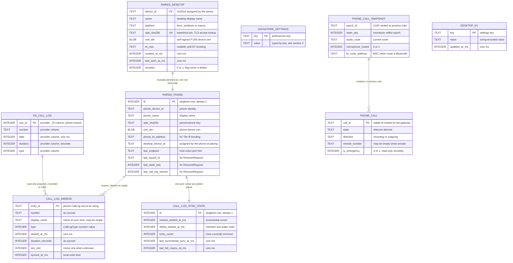

# Data Models

Every model Tandem persists or holds in memory, on both sides. The organizing rule is the ownership
model from [01-architecture.md](01-architecture.md): **the phone owns telephony truth, the desktop
owns only derived state.** Consequently the phone's persistent store is small (trust plus settings)
and the desktop's is a disposable cache plus one trust row.

Wire types (`CallInfo`, `CallSnapshot`, `CallLogEntry`, `Envelope`, and the rest of `tandem.v1`) are
**not** restated here — protobuf under `/proto` is their single source of truth and the catalog lives
in [06-transport-and-protocol.md](06-transport-and-protocol.md), Message Catalog. This document
covers only storage and in-memory shapes, and states how each maps to those wire types.

## 1. Store inventory

| Store | Location | Technology | Contents | Rebuildable |
|---|---|---|---|---|
| `tandem.db` v1 | Android app-private storage | Room | `paired_desktop` table | No — trust anchors |
| Preferences DataStore | Android app-private storage | Jetpack DataStore | User settings plus the persisted call-log version | No, but defaults are safe |
| Android Keystore | Hardware-backed, StrongBox when available | Keystore entry | Phone identity P-256 private key and its self-signed cert | No — loss means re-pairing every desktop |
| Phone in-memory state | Gateway process heap | Kotlin objects and Flows | `CallSnapshot`, session registry, pairing window | Yes — reconstructed at process start |
| `tandem-cache.db` | Desktop per-user data directory | rusqlite | `paired_phone`, `call_log_mirror`, `call_log_sync_state`, `kv` | All but `paired_phone` |
| `config.toml` | Desktop per-user config directory | Hand-editable TOML | Endpoint hints, backend selection, audio devices, log level | Yes — defaults apply when absent |
| OS secret store | Keychain, Credential Manager, Secret Service | `keyring` crate | Desktop identity P-256 private key, Bluetooth link keys `[Tier B — Win/macOS USB dongle]` | No — loss means re-pairing |
| Desktop in-memory state | `tandem-daemon` heap | `tandem_core` types | Mirrored `CallSnapshot`, connection state, pending requests | Yes |

Two things are deliberately **not** stored anywhere in Tandem: call audio (never captured — see
[02-feasibility-and-constraints.md](02-feasibility-and-constraints.md)) and any server-side copy of
call metadata (no account server, no telemetry in v1 — the privacy stance stated in
[08-security-and-encryption.md](08-security-and-encryption.md)).

## 2. Entity relationships



`OS_CALL_LOG` is drawn to show provenance; it is Android's own provider, not a Tandem table.
`PHONE_CALL_SNAPSHOT` and `PHONE_CALL` are in-memory only and appear for the same reason.

## 3. Android: Room database `tandem.db` v1

Docstring of `data/db/TandemDatabase.kt`:

> Room database (tandem.db, v1) hosting the paired-desktop table. Schema DDL and migration
> policy documented in docs/09-data-models.md.

One table. There is no call table and no call-log table on the phone: Telecom and the OS call-log
provider already hold that data, and duplicating it would create a second truth.

```sql
CREATE TABLE IF NOT EXISTS `paired_desktop` (
    `device_id`       TEXT    NOT NULL,
    `name`            TEXT    NOT NULL,
    `platform`        TEXT    NOT NULL,
    `spki_sha256`     TEXT    NOT NULL,
    `cert_der`        BLOB    NOT NULL,
    `bt_mac`          TEXT,
    `created_at_ms`   INTEGER NOT NULL,
    `last_seen_at_ms` INTEGER NOT NULL,
    `revoked`         INTEGER NOT NULL DEFAULT 0,
    PRIMARY KEY(`device_id`)
);

CREATE UNIQUE INDEX IF NOT EXISTS `index_paired_desktop_spki_sha256`
    ON `paired_desktop` (`spki_sha256`);
```

| Column | Kotlin type | Source | Notes |
|---|---|---|---|
| `device_id` | `String` | `PairingDecision.desktop_device_id` | UUIDv4 minted by the phone; primary key; sent back by the desktop in `SessionHello.device_id` |
| `name` | `String` | `PairingRequest.desktop_name` | Shown in the paired list and revoke UI |
| `platform` | `String` | `PairingRequest.desktop_platform` | `"linux"`, `"windows"`, or `"macos"` |
| `spki_sha256` | `String` | Computed by `crypto/Fingerprints` over `desktop_cert_der` | base64url SPKI-SHA256; unique index because TLS accept looks up by pin on every handshake |
| `cert_der` | `ByteArray` | `PairingRequest.desktop_cert_der` | Stored so the pin can be re-derived and audited; trust is the pin, never a chain |
| `bt_mac` | `String?` | `SessionHello.bt_adapter_address` | Null until the desktop reports an adapter; `BondedDesktopMatcher` resolves it to a live bond `[Tier B — Linux]` `[Tier B — Win/macOS USB dongle]` |
| `created_at_ms` | `Long` | Phone clock at acceptance | Unix ms |
| `last_seen_at_ms` | `Long` | Phone clock at each successful session start | Unix ms; drives the "last connected" label |
| `revoked` | `Boolean` | Set by `RevokeDesktop` | Revocation is a flag, never a delete, so audit history survives |

Behavioral contract:

- Lookup by `spki_sha256` happens inside the TLS accept path (`crypto/TlsServerFactory`); a row that
  is missing or has `revoked = 1` fails the handshake.
- `PairedDesktopEntity` mirrors this table one-to-one and maps to `domain.model.PairedDesktop` inside
  `PairedDeviceRepositoryImpl`, keeping Room out of the domain layer.
- Pairing-data semantics — what each field means for trust, and the revocation and re-pairing flows —
  are owned by [07-pairing-and-auth.md](07-pairing-and-auth.md).

**Migration policy.** Destructive fallback is disabled. Rows here are trust anchors: dropping them
would silently unpair every desktop with no user-visible cause. Every schema change ships a
hand-written Room `Migration` plus an exported schema JSON checked into the repo and asserted by a
migration test ([15-testing-strategy.md](15-testing-strategy.md)). The Room version number tracks
`tandem.db` only; the TLP `protocol_version` is independent
([06-transport-and-protocol.md](06-transport-and-protocol.md)).

## 4. Android: DataStore settings keys

One Preferences DataStore file, `tandem.preferences_pb`. `SettingsRepositoryImpl` exposes user
settings as Flows with suspend setters; `CallLogObserver` owns the one internal key.

| Key | Type | Default | Kind | Meaning |
|---|---|---|---|---|
| `autostart_enabled` | Boolean | `false` | User setting | `BootCompletedReceiver` starts `GatewayForegroundService` on boot only when true |
| `lan_port_override` | Int | `0` | User setting | `0` means use the default TLP port 46521; any other value is the bind port, and the effective port is always published in the mDNS SRV record |
| `device_display_name` | String | Device model name | User setting | Advertised in the `name` TXT record and sent as `SessionWelcome.phone_name` |
| `call_log_version` | Long | `0` | Internal state | Monotonic counter bumped by `CallLogObserver` on every OS call-log change; served as `CallLogSyncResponse.log_version`, `SessionWelcome.call_log_version`, and `CallLogChangedEvent.log_version` |

`call_log_version` must be persisted so that a gateway restart does not make desktops believe their
mirrors are current: it is the only phone-side sync state that survives the process. Everything else
about a session is re-derived, which is exactly why a restart mints a fresh `epoch_id`.

Not settings, and deliberately not in DataStore: the identity private key and its certificate live in
a fixed-alias Android Keystore entry managed by `IdentityStoreImpl` and `DeviceCertificates`, and are
read back from that entry rather than copied into preferences.

## 5. Android: in-memory `CallSnapshot`

`ObserveCallState` merges `TelecomBridge` call events, `CallMediaProvider` route changes, and mute
state into one versioned stream. That stream is the authoritative call-plane state: it feeds every
desktop session and the handset in-call UI alike, and it is never persisted.

| Field | Kotlin type | Lifetime | Notes |
|---|---|---|---|
| `epoch_id` | `String` | Process | UUID minted at gateway process start; a new value voids all desktop mirrors |
| `state_seq` | `ULong` | Process, monotonic | Bumped on every call-plane transition: call list change, route change, mute change |
| `calls` | `List<Call>` | Until each call disconnects | Domain `Call` from `domain/model/Call.kt`, produced by `CallStateMapper`; maps to `CallInfo` in `EnvelopeCodec` |
| `audio_route` | `AudioRoute` | Until the next route change | Reported by Telecom `CallAudioState` callbacks, not inferred from requests |
| `microphone_muted` | `Boolean` | Until the next mute change | Absolute state, matching the idempotent `MuteRequest` |
| `bt_route_address` | `String?` | While the route is Bluetooth | MAC of the active audio device `[Tier B — Linux]` `[Tier B — Win/macOS USB dongle]` |

Other phone-side in-memory state, all process-scoped:

| Holder | State | Notes |
|---|---|---|
| `SessionRegistry` | Live `DesktopSession` handles, per-session last delivered `state_seq`, the atomic answer claim | Backs event fan-out and first-answer-wins arbitration |
| `DesktopSession` | Negotiated `protocol_version`, per-session dial rate window at 5 per minute, outbound event queue | One coroutine per session; no shared mutable state |
| `PairingSession` | Current candidate, one-time token with its 120 s deadline, derived 6-digit short code | At most one candidate at a time; nothing persists until acceptance |
| `EmergencyNumberSourceImpl` | Cached emergency-number list | Refreshed on SIM and carrier-config change; served in `SessionWelcome.emergency_numbers` |

## 6. Desktop: SQLite `tandem-cache.db`

Docstring of `daemon/src/store.rs`:

> rusqlite-backed local store (tandem-cache.db): paired phone identity row, call-log mirror
> with sync cursor, and settings not held in config.toml. Schema DDL in docs/09.

```sql
PRAGMA user_version = 1;
PRAGMA journal_mode = WAL;
PRAGMA foreign_keys = ON;

CREATE TABLE IF NOT EXISTS paired_phone (
    id                    INTEGER PRIMARY KEY CHECK (id = 1),
    phone_device_id       TEXT    NOT NULL,
    phone_name            TEXT    NOT NULL,
    spki_sha256           TEXT    NOT NULL,
    cert_der              BLOB    NOT NULL,
    phone_bt_address      TEXT,
    desktop_device_id     TEXT    NOT NULL,
    protocol_version      INTEGER NOT NULL,
    last_endpoint         TEXT,
    last_epoch_id         TEXT,
    last_state_seq        INTEGER NOT NULL DEFAULT 0,
    last_call_log_version INTEGER NOT NULL DEFAULT 0,
    paired_at_ms          INTEGER NOT NULL,
    last_connected_at_ms  INTEGER
);

CREATE TABLE IF NOT EXISTS call_log_mirror (
    entry_id         TEXT    PRIMARY KEY,
    number           TEXT    NOT NULL,
    display_name     TEXT    NOT NULL DEFAULT '',
    type             INTEGER NOT NULL,
    started_at_ms    INTEGER NOT NULL,
    duration_seconds INTEGER NOT NULL,
    sim_slot         INTEGER NOT NULL DEFAULT -1,
    synced_at_ms     INTEGER NOT NULL
);

CREATE INDEX IF NOT EXISTS idx_call_log_mirror_started_at
    ON call_log_mirror (started_at_ms DESC);

CREATE TABLE IF NOT EXISTS call_log_sync_state (
    id                          INTEGER PRIMARY KEY CHECK (id = 1),
    newest_started_at_ms        INTEGER NOT NULL DEFAULT 0,
    oldest_started_at_ms        INTEGER NOT NULL DEFAULT 0,
    entry_count                 INTEGER NOT NULL DEFAULT 0,
    last_incremental_sync_at_ms INTEGER NOT NULL DEFAULT 0,
    last_full_resync_at_ms      INTEGER NOT NULL DEFAULT 0
);

CREATE TABLE IF NOT EXISTS kv (
    key           TEXT PRIMARY KEY,
    value         TEXT NOT NULL,
    updated_at_ms INTEGER NOT NULL
);
```

### 6.1 `paired_phone` — the one non-disposable row

Singleton by `CHECK (id = 1)`: v1 supports one paired phone per desktop.

| Column | Source | Used for |
|---|---|---|
| `phone_device_id` | `PairingDecision.phone_device_id` | Filtering mDNS candidates by the `id` TXT record before any connection attempt |
| `phone_name` | `PairingDecision.phone_name`, refreshed from `SessionWelcome.phone_name` | UI labels |
| `spki_sha256` | Derived from `cert_der` by `crypto/pinning.rs` | rustls peer verification; no WebPKI roots are consulted |
| `cert_der` | Phone cert observed during the pairing TLS session | Pin re-derivation and fingerprint display in settings |
| `phone_bt_address` | `PairingDecision.phone_bt_address` | Bluetooth bonding target `[Tier B — Linux]` `[Tier B — Win/macOS USB dongle]`; may be empty |
| `desktop_device_id` | `PairingDecision.desktop_device_id` | Sent as `SessionHello.device_id` on every reconnect |
| `protocol_version` | `PairingDecision.protocol_version` | Starting point for negotiation; re-negotiated per session and rewritten from `SessionWelcome.protocol_version` |
| `last_endpoint` | Last successful `host:port` | Fast reconnect hint tried before, and in parallel with, mDNS browse |
| `last_epoch_id`, `last_state_seq` | Last applied event pair | `ResumeRequest.last_epoch_id`, `ResumeRequest.last_state_seq` |
| `last_call_log_version` | Last observed `log_version` | `ResumeRequest.last_call_log_version`; the single truth for log freshness, which is why `call_log_sync_state` does not repeat it |
| `paired_at_ms`, `last_connected_at_ms` | Desktop clock | Settings display and diagnostics |

Private key material is never in this file — it lives in the OS secret store via
`crypto/secrets.rs`, with an encrypted-file fallback for headless Linux sessions.

### 6.2 `call_log_mirror` — read-only projection

Each row is one `CallLogEntry` from [06-transport-and-protocol.md](06-transport-and-protocol.md);
`entry_id` is the phone's `CallLog` row id as a string, so re-syncs upsert rather than duplicate.
`type` stores the numeric `CallLogType` value; unknown future values are stored verbatim and rendered
as "unknown" rather than being coerced, so a newer phone never corrupts an older desktop's mirror.
`synced_at_ms` is the local write time and backs the freshness indicator in `HistoryView`.

### 6.3 `call_log_sync_state` — the sync cursor

Cursor and statistics only. `newest_started_at_ms` is the incremental `since_ms` cursor;
`oldest_started_at_ms` and `entry_count` describe the retention window so the UI can say how far back
history goes and stop asking for more.

### 6.4 `kv` — settings not in `config.toml`

Complete v1 key set. Values are string-encoded; adding a key needs no schema change.

| Key | Encoding | Default | Meaning |
|---|---|---|---|
| `desktop_display_name` | string | Host name | Sent as `PairingRequest.desktop_name` and `SessionHello.client_name`; user-editable in settings |
| `autostart_enabled` | `"true"` / `"false"` | `"false"` | Whether the installer-managed OS autostart entry for `tandem-daemon` is active |
| `notify_incoming_calls` | `"true"` / `"false"` | `"true"` | Whether the Tauri shell raises an OS notification for `IncomingCallEvent` |
| `ui_theme` | `"system"` / `"light"` / `"dark"` | `"system"` | Front-end theme preference |

**Migration policy.** `PRAGMA user_version` gates forward-only migrations applied by
`daemon/src/store.rs` at startup. Because `call_log_mirror`, `call_log_sync_state`, and derived
columns are a projection, a migration is permitted to drop and rebuild them — the next sync refills
them from the phone. `paired_phone` is never dropped; it must be migrated in place, since losing it
forces a full re-pairing.

## 7. Call-log mirror: retention and refresh policy

**The call log is the phone's OS data, mirrored read-only to the desktop.** The phone reads
`android.provider.CallLog.Calls` with `READ_CALL_LOG` and never writes it; `WRITE_CALL_LOG` is not in
the manifest ([12-permissions-and-platform.md](12-permissions-and-platform.md)). The desktop never
sends history mutations, and no TLP message exists that could carry one. Deleting history is done on
the phone, in the phone's own UI.

**Retention: 1000 most recent entries by `started_at_ms`.** After every sync transaction the mirror
is trimmed in the same transaction:

```sql
DELETE FROM call_log_mirror
WHERE entry_id NOT IN (
    SELECT entry_id FROM call_log_mirror
    ORDER BY started_at_ms DESC, entry_id DESC
    LIMIT 1000
);
```

`call_log_sync_state.oldest_started_at_ms` and `entry_count` are then recomputed, so the UI shows the
true horizon instead of implying unlimited history.

**Refresh has exactly two modes**, both driven from `CallLogSyncRequest`/`CallLogSyncResponse` with a
page size of 200 (the phone caps `max_entries` at 200):

| Mode | Trigger | Request pattern | Effect |
|---|---|---|---|
| Full bounded resync | First pairing, or `SessionWelcome.call_log_version` / `ResumeResponse.call_log_version` differs from `paired_phone.last_call_log_version` | `since_ms = 0`, pages until `has_more = false` or 1000 entries are accumulated | Mirror replaced atomically in one transaction; this is the only mode that observes deletions and edits made on the phone |
| Incremental append | `CallLogChangedEvent` mid-session | `since_ms = newest_started_at_ms`, pages while `has_more = true` | Rows upserted by `entry_id`, then trimmed; cheap and bounded, typically one page of a few rows |

Timestamp-bounded incremental paging cannot see a deletion of an older row, so the session-start full
resync is what keeps the mirror honest. Both modes end by writing the served `log_version` into
`paired_phone.last_call_log_version` inside the same transaction as the rows, so an interrupted sync
never records a version it did not fully apply.

**Freshness and privacy.** `HistoryView` renders the mirror with the sync state from
`ui/src/lib/state.ts`; when the LAN link is down the history is shown and labelled stale, never
hidden. The mirror stays on the desktop, never leaves the LAN, and is deleted together with
`paired_phone` on unpair. Release-build logs redact call metadata
([08-security-and-encryption.md](08-security-and-encryption.md)).

## 8. Desktop: `config.toml`

Docstring of `daemon/src/config.rs`:

> Loads and validates config.toml (paired-phone endpoint hints, backend selection, audio
> devices, log level) with CLI overrides; documents every key in docs/09.

Operator-authored, hand-editable, and optional: every key has a working default, and a missing file
is equivalent to an empty one. It holds **no secrets and no state the daemon mutates** — the daemon
writes state to `tandem-cache.db`, never back into this file. Validation failures are fatal at
startup with the offending key named, rather than silently defaulted.

```toml
[phone]
host = "192.168.1.24"
port = 46521
prefer_discovery = true

[bluetooth]
backend = "auto"
adapter_address = ""
dongle_usb_id = ""
prefer_wideband = true

[audio]
backend = "cpal"
input_device = ""
output_device = ""
aec = true

[log]
level = "info"
to_file = true
redact_call_metadata = true

[ipc]
socket_path = ""
```

| Key | Type | Default | CLI override | Meaning |
|---|---|---|---|---|
| `phone.host` | string | empty | `--phone-host` | Endpoint hint tried alongside mDNS; empty means discovery only. Identity is still verified by pin, so a wrong hint is a failed connection, never a wrong peer |
| `phone.port` | u16 | `46521` | `--phone-port` | Port for the hint; discovery uses the SRV record's port |
| `phone.prefer_discovery` | bool | `true` | none | When true, an mDNS result for the paired `phone_device_id` supersedes `last_endpoint` and the hint |
| `bluetooth.backend` | `"auto"` / `"linux_bluez"` / `"usb_dongle"` / `"null"` | `"auto"` | `--bluetooth-backend` | Backend selection in `backends/mod.rs`; `"auto"` resolves per platform and falls back to `null`. `"null"` is the explicit `[Tier B-lite fallback]` choice |
| `bluetooth.adapter_address` | string | empty | none | Pin a specific local adapter; empty means the default adapter `[Tier B — Linux]` |
| `bluetooth.dongle_usb_id` | string `"vid:pid"` | empty | none | Select one controller when several are attached `[Tier B — Win/macOS USB dongle]` |
| `bluetooth.prefer_wideband` | bool | `true` | none | Advertise mSBC via `AT+BAC`; CVSD remains the mandatory fallback `[Tier B — Linux]` `[Tier B — Win/macOS USB dongle]` |
| `audio.backend` | `"cpal"` / `"null"` | `"cpal"` | `--audio-backend` | `AudioBackend` selection; `"null"` renders silence for tests and `[Tier B-lite fallback]` builds |
| `audio.input_device` | string | empty | none | cpal device name; empty means the system default `[Tier B — Linux]` `[Tier B — Win/macOS USB dongle]` |
| `audio.output_device` | string | empty | none | As above for playback |
| `audio.aec` | bool | `true` | none | Enable WebRTC AEC3; turning it off is only sane with a headset `[Tier B — Linux]` `[Tier B — Win/macOS USB dongle]` |
| `log.level` | `"error"` / `"warn"` / `"info"` / `"debug"` / `"trace"` | `"info"` | `--log-level` | `tracing` filter set by `daemon/src/logging.rs` |
| `log.to_file` | bool | `true` | none | Also write the rolling file log next to `tandem-cache.db` |
| `log.redact_call_metadata` | bool | `true` | none | Redact numbers and names in logs; release builds ignore a `false` value here |
| `ipc.socket_path` | string | empty | `--ipc-socket` | Override the UDS path or named pipe; empty means the platform default from `ipc/socket.rs` |

`--config <path>` selects an alternate file. CLI flags override file values, and file values override
defaults; nothing else can change a setting at runtime except the `kv` keys in §6.4.

## 9. Desktop: in-memory models

`tandem_core` holds the mirror. Its shapes come from `core/src/model.rs` and convert from `tandem.v1`
protos at the transport boundary only.

| Model | Owner | Contents | Persistence |
|---|---|---|---|
| Mirrored `CallSnapshot` | `core/src/controller.rs` | `epoch_id`, `state_seq`, calls, route, mute, `bt_route_address` — a direct mirror of §5 | None; `(epoch_id, state_seq)` alone is written to `paired_phone` |
| Pending-request table | `transport/src/codec.rs` | `message_id` to waiting response, with timeouts | None; dropped on disconnect, then requests are retried under the idempotency rules in [11-api-reference.md](11-api-reference.md) |
| Connection state | `transport/src/client.rs` and `reconnect.rs` | Current phase, heartbeat sequence, backoff position | None; state table in [06-transport-and-protocol.md](06-transport-and-protocol.md) |
| Emergency-number list | `core/src/emergency.rs` | Copy of `SessionWelcome.emergency_numbers` | None — deliberately session-scoped so a stale list cannot outlive its session; the phone's guard is authoritative (ADR-0008) |
| Audio pipeline buffers | `audio/src/ring_buffer.rs` | Lock-free SPSC frame buffers | None; overruns drop oldest and count, never block the real-time thread `[Tier B — Linux]` `[Tier B — Win/macOS USB dongle]` |
| Front-end stores | `ui/src/lib/state.ts` | Read-only projections of daemon events | None; rebuilt on every UI start |

## 10. Data lifecycle and erasure

| Event | Phone side | Desktop side |
|---|---|---|
| First pairing accepted | `paired_desktop` row inserted | `paired_phone` row written; identity key already in the OS secret store |
| Session established | `last_seen_at_ms` updated | `protocol_version`, `last_endpoint`, `last_connected_at_ms` updated; full resync if `call_log_version` differs |
| Gateway restart | New `epoch_id`; `call_log_version` survives in DataStore | `ResumeResponse` snapshot replaces the mirror |
| Revoke on the phone | `revoked = 1`; `RevokedEvent` sent and session closed | Connection refused thereafter; UI prompts re-pairing |
| Unpair on the desktop | Row remains until the user revokes it, so the stale entry is visible and removable | `paired_phone`, `call_log_mirror`, `call_log_sync_state`, and `kv` rows for that phone are deleted; identity key retained unless the user resets it |
| Desktop key loss | User revokes the stale row manually ([07-pairing-and-auth.md](07-pairing-and-auth.md)) | Fresh identity, fresh pairing, new `desktop_device_id` |
| Android app uninstall or data clear | `tandem.db`, DataStore, and the Keystore entry are removed; all desktops must re-pair | Unchanged until the next connection fails |
