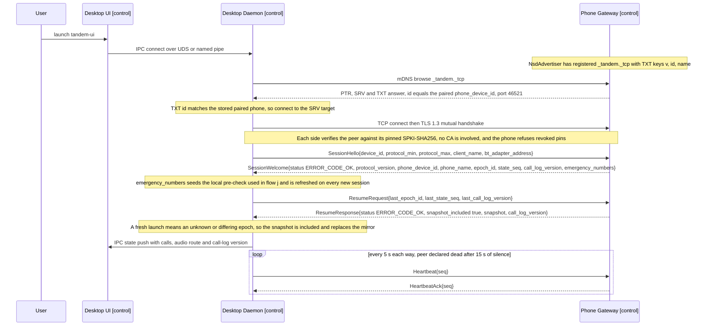
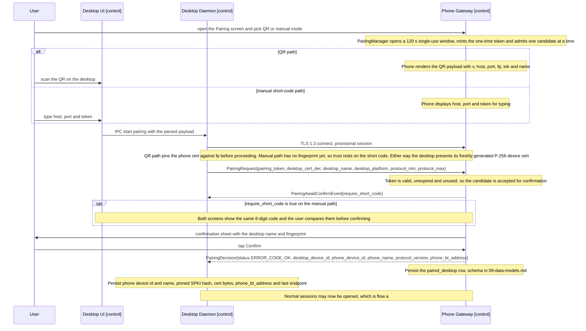
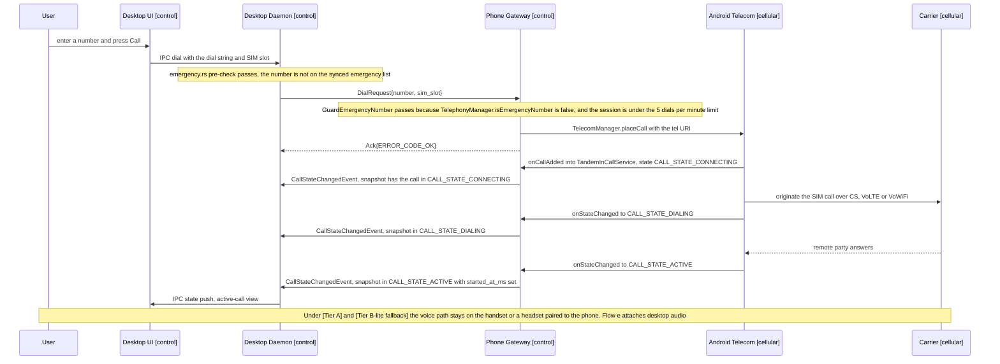
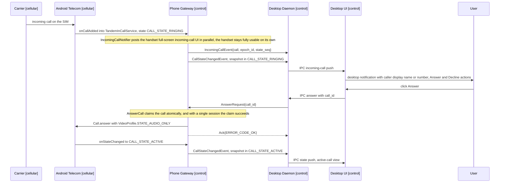
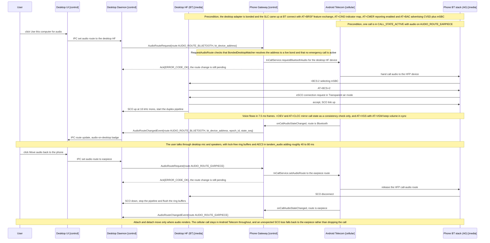
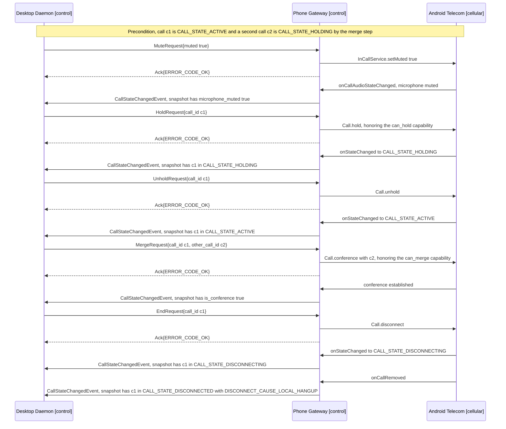
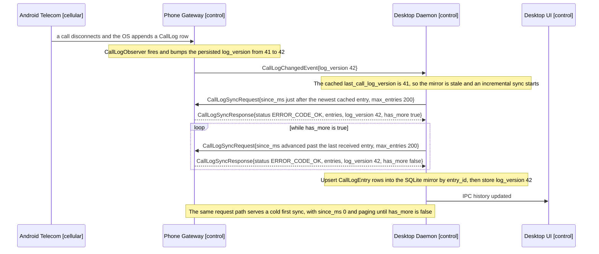
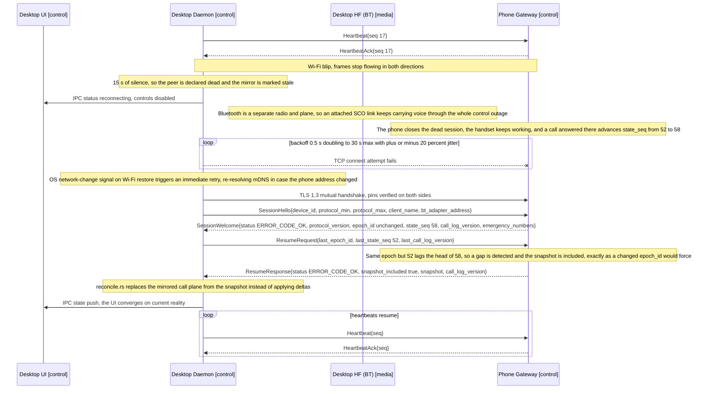
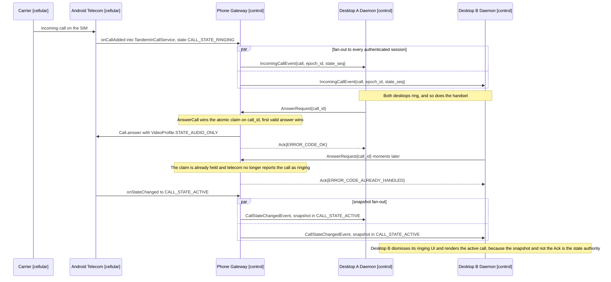
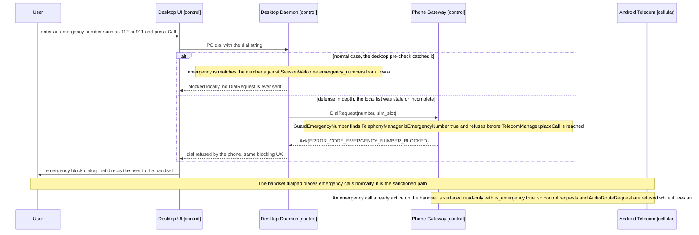

# Sequence Diagrams

The ten canonical end-to-end flows of Tandem, one Mermaid `sequenceDiagram` each. Every named
message that crosses the LAN exists verbatim in `proto/tandem/v1/` — see
[06-transport-and-protocol.md](06-transport-and-protocol.md), Message Catalog — and travels as one
protobuf `Envelope` per WebSocket binary frame over mutual TLS 1.3. Arrows between the desktop UI
and the desktop daemon are JSON-RPC 2.0 IPC, not TLP (see [04-desktop-app.md](04-desktop-app.md)).
HFP and AT-command names follow [05-bluetooth-hfp.md](05-bluetooth-hfp.md).

## Conventions

- Participants carry their plane in the label, drawn from the canonical set: `User`,
  `Desktop UI [control]`, `Desktop Daemon [control]`, `Desktop HF (BT) [media]`,
  `Phone Gateway [control]`, `Android Telecom [cellular]`, `Phone BT stack (AG) [media]`,
  `Carrier [cellular]`.
- Solid arrows are requests and events; dashed arrows are responses. Every response `Envelope`
  sets `in_reply_to` to the request's `message_id`; correlation is elided except where arbitration
  depends on it.
- `Ack{X}` abbreviates an `Ack` whose `Status.code` is `X`. Braces list the proto fields that
  matter at that step; omitted fields keep proto3 defaults.
- Single-command-path rule (see [05-bluetooth-hfp.md](05-bluetooth-hfp.md)): all user intent
  travels over the LAN control plane. The desktop HF never issues HFP call-control AT commands
  (`ATA`, `AT+CHUP`, `ATD`, `AT+CHLD` as a user action, `AT+VTS`). The HFP link carries audio
  (SCO/eSCO), codec negotiation (`AT+BAC` / `+BCS`), indicator mirroring (`+CIEV`, `AT+CLCC`) as a
  consistency check, and volume sync (`AT+VGS` / `AT+VGM`).
- The phone is the source of truth (ADR-0007). An `Ack` only confirms that a request was accepted;
  the `CallSnapshot` inside `CallStateChangedEvent` is what the desktop renders.

| Flow | Scenario | Tier | Primary TLP messages |
|---|---|---|---|
| [a](#flow-a--app-launch-auto-discovery-connect) | Launch, discovery, connect | `[Tier A]` | `SessionHello`, `SessionWelcome`, `ResumeRequest`, `ResumeResponse`, `Heartbeat` |
| [b](#flow-b--pairing-qr-primary-manual-short-code-fallback) | First pairing | `[Tier A]` | `PairingRequest`, `PairingAwaitConfirmEvent`, `PairingDecision` |
| [c](#flow-c--outgoing-call-from-the-desktop) | Outgoing call | `[Tier A]` | `DialRequest`, `Ack`, `CallStateChangedEvent` |
| [d](#flow-d--incoming-cellular-call-surfaced-to-the-desktop) | Incoming call | `[Tier A]` | `IncomingCallEvent`, `AnswerRequest`, `CallStateChangedEvent` |
| [e](#flow-e--audio-attachdetach-over-hfp) | Audio attach and detach | `[Tier B — Linux]` `[Tier B — Win/macOS USB dongle]` | `AudioRouteRequest`, `AudioRouteChangedEvent` |
| [f](#flow-f--mute-hold-unhold-merge-end-round-trips) | In-call control | `[Tier A]` | `MuteRequest`, `HoldRequest`, `UnholdRequest`, `MergeRequest`, `EndRequest` |
| [g](#flow-g--call-log-sync) | History sync | `[Tier A]` | `CallLogChangedEvent`, `CallLogSyncRequest`, `CallLogSyncResponse` |
| [h](#flow-h--lan-reconnect-after-a-wi-fi-blip-phone-as-source-of-truth) | Reconnect and re-sync | `[Tier A]` | `ResumeRequest`, `ResumeResponse` |
| [i](#flow-i--multi-desktop-incoming-fan-out-and-answer-arbitration) | Fan-out and arbitration | `[Tier A]` | `IncomingCallEvent`, `AnswerRequest`, `Ack{ERROR_CODE_ALREADY_HANDLED}` |
| [j](#flow-j--emergency-number-attempt-from-the-desktop-forced-to-handset) | Emergency refusal | `[Tier A]` | `DialRequest`, `Ack{ERROR_CODE_EMERGENCY_NUMBER_BLOCKED}` |

## Flow a — App launch, auto-discovery, connect

`[Tier A]`. The daemon browses mDNS for `_tandem._tcp`, matches the TXT `id` against its stored
paired phone, and opens a mutual-TLS session in which both peers verify pinned SPKI-SHA256 hashes.
`SessionHello`/`SessionWelcome` negotiate the protocol version and hand the desktop the phone's
current `(epoch_id, state_seq)` head plus the emergency-number list. `ResumeRequest`/
`ResumeResponse` then initialize the mirror from the authoritative snapshot; the connection state
table is in [06-transport-and-protocol.md](06-transport-and-protocol.md).

If `SessionWelcome.status` is `ERROR_CODE_VERSION_UNSUPPORTED` the phone closes the session and the
desktop surfaces an upgrade prompt instead of retrying; if it is `ERROR_CODE_UNAUTHENTICATED` the
stored pairing is stale and the user must re-pair (flow b).

## Flow b — Pairing (QR primary, manual short-code fallback)

`[Tier A]`. Pairing runs inside a provisional TLS session bootstrapped by the QR payload's
fingerprint and one-time token (TTL 120 s, single use); on the manual path the user types host,
port and token instead, and trust is deferred to a 6-digit short code derived via HKDF-SHA256 over
both SPKI hashes and the TLS exporter binding. The phone owns the verdict: the user confirms on a
sheet showing the desktop's name and fingerprint. Payload format, persisted fields and revocation
are specified in [07-pairing-and-auth.md](07-pairing-and-auth.md).

A rejected or expired candidacy yields `PairingDecision{status ERROR_CODE_PAIRING_REJECTED}` and
the provisional session closes; the token is burned either way. Bluetooth bonding for
`[Tier B — Linux]` and `[Tier B — Win/macOS USB dongle]` is a separate, later step and never gates
LAN pairing.

## Flow c — Outgoing call from the desktop

`[Tier A]`. A desktop dial clears the local emergency pre-check, then travels as `DialRequest` to
the phone, where `GuardEmergencyNumber` re-checks authoritatively and the per-session dial rate
limit applies before `TelecomManager.placeCall` runs. Each subsequent telecom transition fans out
as a `CallStateChangedEvent` carrying the full `CallSnapshot`, so the desktop converges with no
delta bookkeeping. The blocking path for emergency numbers is flow j.

Failure mapping: a refused or failed `placeCall` returns `Ack{ERROR_CODE_TELECOM_FAILURE}`, an
over-quota session returns `Ack{ERROR_CODE_RATE_LIMITED}`, and no `CallStateChangedEvent` follows
either. `DialRequest` is not idempotent — a retry after reconnect is deduplicated by
`message_id` (see [11-api-reference.md](11-api-reference.md)).

## Flow d — Incoming cellular call surfaced to the desktop

`[Tier A]`. Ringing is reported to `TandemInCallService`, raised on the handset by
`IncomingCallNotifier`, and fanned out to every authenticated session as `IncomingCallEvent`
followed by the ringing snapshot. Answering from the desktop is an `AnswerRequest` the phone
arbitrates before touching telecom. The contested two-desktop case is flow i.

Declining from the desktop is the same shape with `RejectRequest{call_id}`, ending in a
`CALL_STATE_DISCONNECTED` snapshot carrying `DISCONNECT_CAUSE_REJECTED`. An `AnswerRequest` for a
call that has already stopped ringing returns `Ack{ERROR_CODE_INVALID_CALL_STATE}`, and an unknown
id returns `Ack{ERROR_CODE_CALL_NOT_FOUND}`.

## Flow e — Audio attach/detach over HFP

`[Tier B — Linux]` `[Tier B — Win/macOS USB dongle]`. The LAN carries routing intent; HFP carries
the voice. `AudioRouteRequest` makes the phone call `InCallService.requestBluetoothAudio` toward
the desktop's bonded HF, after which Android's Bluetooth stack — the AG, never Tandem code —
selects a codec and opens eSCO, and `AudioRouteChangedEvent` reports the route that actually
happened. Under `[Tier B-lite fallback]` the desktop runs the null Bluetooth backend, this flow
never executes, and the user pairs a commodity Bluetooth speakerphone or earbuds to the phone
instead; SLC, codecs and degradation behavior are detailed in
[05-bluetooth-hfp.md](05-bluetooth-hfp.md).

`AudioRouteRequest` is idempotent — it names an absolute target route, so a repeat during a pending
transition is an OK no-op. If the address is not bonded or the AG refuses the audio connection the
phone answers `Ack{ERROR_CODE_AUDIO_ROUTE_UNAVAILABLE}` and the call keeps its previous route.

## Flow f — Mute, hold, unhold, merge, end round-trips

`[Tier A]`. Each control command is one request, one `Ack`, and one or more `CallStateChangedEvent`
snapshots once telecom reality changes — the snapshot, not the `Ack`, is what the UI renders.
`MuteRequest`, `HoldRequest` and `UnholdRequest` carry absolute target state and are idempotent;
`MergeRequest` and `EndRequest` are not, and are deduplicated by `message_id` on retry (see
[11-api-reference.md](11-api-reference.md)). The UI-to-daemon IPC leg before each command is
identical to flow c and elided.

A command whose capability flag is false — `HoldRequest` on a call with `can_hold` false,
`MergeRequest` with `can_merge` false — returns `Ack{ERROR_CODE_INVALID_CALL_STATE}` and produces
no snapshot. `SendDtmfRequest{call_id, digits}` follows the same request/`Ack` shape but emits no
snapshot, because DTMF changes no telecom state. The handset in-call UI dispatches through the same
use-cases, so both surfaces share one command path.

## Flow g — Call-log sync

`[Tier A]`. `CallLogObserver` watches the OS call-log provider, bumps the phone-persisted
`log_version`, and nudges every session with `CallLogChangedEvent`; desktops then page through
`CallLogSyncRequest`/`CallLogSyncResponse` at 200 entries per page. The desktop cache is a
read-only projection — no TLP message can write, edit or delete an OS call-log row. Retention and
refresh policy are in [09-data-models.md](09-data-models.md).

If `READ_CALL_LOG` is denied the phone still answers `CallLogSyncResponse`, with a non-OK `Status`
and no `entries`, and the desktop shows history as unavailable while call control keeps working
(see [12-permissions-and-platform.md](12-permissions-and-platform.md)).

## Flow h — LAN reconnect after a Wi-Fi blip, phone as source of truth

`[Tier A]`. Fifteen seconds of silence — three missed heartbeats — declares the peer dead; the
desktop then backs off from 0.5 s doubling to 30 s with ±20 % jitter and retries immediately on an
OS network-change signal. The phone kept working throughout, so its `state_seq` advanced past what
the desktop last saw and the stale `ResumeRequest` forces a full snapshot that replaces the mirror
wholesale. Stale desktop state never overrides phone truth (ADR-0007).

A restarted gateway process mints a new `epoch_id`, so `ResumeResponse` includes a snapshot on that
basis alone and every desktop-side sequence counter resets. If `call_log_version` also moved, the
desktop chains into flow g after reconciling.

## Flow i — Multi-desktop incoming fan-out and answer arbitration

`[Tier A]`. The phone accepts multiple concurrent authenticated sessions and fans every call-plane
event out to all of them. The first valid `AnswerRequest` wins an atomic claim in `SessionRegistry`
arbitrated against current telecom state; later answers get
`Ack{ERROR_CODE_ALREADY_HANDLED}`. Both desktops then receive the resulting
`CallStateChangedEvent`, so the loser converges on the active call rather than guessing from its
error.

The same arbitration covers the handset: if the user answers on the phone, both desktops receive
`Ack{ERROR_CODE_ALREADY_HANDLED}` for any in-flight `AnswerRequest` and the active snapshot right
after. Audio can be attached from only one desktop at a time — a second `AudioRouteRequest`
retargets the route rather than duplicating the SCO link.

## Flow j — Emergency-number attempt from the desktop, forced to handset

`[Tier A]`. Both ends refuse desktop-originated emergency calls (ADR-0008): the desktop pre-checks
against the list synced in `SessionWelcome` and blocks locally, and the phone's
`GuardEmergencyNumber` is the authoritative backstop via `TelephonyManager.isEmergencyNumber`,
answering `Ack{ERROR_CODE_EMERGENCY_NUMBER_BLOCKED}` without ever invoking
`TelecomManager.placeCall`. A desktop-originated emergency call has no reliable caller location, so
it is never silently bridged. The policy as a safety control is in
[08-security-and-encryption.md](08-security-and-encryption.md).

The dialog copy is fixed in `strings.xml` on the phone and its desktop counterpart, and both say
the same thing:

> Emergency calls cannot be placed from this computer. Dial the number on your phone — it can share
> your location with emergency services.

Mid-session staleness of the synced list (a SIM swap, a region change) is acceptable precisely
because the phone-side guard is authoritative; the desktop pre-check exists to fail fast and to
give the user the handset instruction without a network round-trip.
