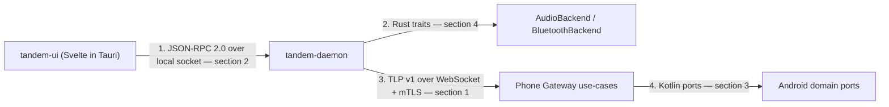

# API Reference

Every interface boundary in Tandem, with signatures and contracts — preconditions,
postconditions, error cases, idempotency. No implementations, no method bodies.

Four boundaries exist, and nothing crosses them implicitly:



Conventions used throughout:

- **Kotlin**: results are `kotlin.Result<T>`; every sealed error class in section 3.7 extends
  `Exception` so `Result` can carry it without a bespoke result type. Flows are cold and
  conflated unless stated otherwise. `typealias CallId = String` — the stable id the phone mints,
  identical to `CallInfo.call_id` on the wire.
- **Rust**: traits are `async` via `#[async_trait]`; errors are `thiserror` enums. Signatures here
  are normative; the sketches in [04-desktop-app.md](04-desktop-app.md) point at this document.
- **TypeScript**: types are generated from `tandem_ipc::api` by ts-rs. The shapes below are the
  generated shapes; do not hand-write them.
- Tier tags mark anything gated by OS, hardware, or vendor support. Untagged surfaces are
  `[Tier A]` and ship with the control-only product.

---

## 1. LAN protocol messages — TLP v1

The wire contract is defined once, in [06-transport-and-protocol.md](06-transport-and-protocol.md):
framing, correlation, the complete message catalog with per-message failure codes, the connection
state table, version negotiation, and all five `.proto` files embedded verbatim. It is not
duplicated here.

Use this document for what sits on either end of that wire:

| You want | Go to |
|---|---|
| Message fields, tag numbers, direction, response type | 06, *Message Catalog* |
| `ErrorCode` semantics on the wire | 06, *Error-code reference* |
| How a wire code becomes a typed error on each side | §3.7 (Kotlin), §4.5 (Rust) |
| Which requests may be retried after a reconnect | §5 |
| The IPC method a UI action maps to | §2 |

---

## 2. Desktop daemon ⇄ UI IPC

**Transport.** JSON-RPC 2.0 over a local socket: Unix domain socket at
`$XDG_RUNTIME_DIR/tandem/daemon.sock`, Windows named pipe `\\.\pipe\tandem-daemon`. Both ends
enforce a same-user peer check (`tandem_ipc::socket`). Framing is newline-delimited JSON, one
message per line, UTF-8. Multiple UI clients may connect; every client receives every event
notification.

**Authority.** The daemon owns all state. UI methods express intent and return the daemon's
acceptance; the resulting state always arrives as an event, never only as a return value. The UI
never talks to the phone, never touches audio or Bluetooth, and never holds key material.

**Failures.** A failed method returns a JSON-RPC `error` object; results are reserved for success.
Codes are stable (§2.4).

### 2.1 Methods

Fourteen methods, exactly the vocabulary named in the `tandem_ipc::api` docstring
(`audioRoute` is the camelCase JSON name of the `audio-route` concept):

```ts
// Generated from tandem_ipc::api via ts-rs; JSON-RPC method names are the property names.
interface IpcApi {
  dial(params: DialParams): CommandResult;
  answer(params: CallRef): CommandResult;
  reject(params: CallRef): CommandResult;
  end(params: CallRef): CommandResult;
  mute(params: MuteParams): CommandResult;
  hold(params: CallRef): CommandResult;
  unhold(params: CallRef): CommandResult;
  merge(params: MergeParams): CommandResult;
  dtmf(params: DtmfParams): CommandResult;
  audioRoute(params: AudioRouteParams): CommandResult;
  history(params: HistoryParams): HistoryResult;
  pairing(params: PairingParams): PairingResult;
  settings(params: SettingsParams): SettingsResult;
  status(params: null): StatusResult;
}
```

```ts
type DialParams = { number: string; simSlot: number };            // simSlot -1 = default SIM
type CallRef = { callId: string };
type MuteParams = { muted: boolean };                             // absolute state, not a toggle
type MergeParams = { callId: string; otherCallId: string | null }; // null = the single held call
type DtmfParams = { callId: string; digits: string };             // 0-9, *, #, A-D
type AudioRouteParams = { route: AudioRoute; btDeviceAddress: string | null };

type CommandResult = {
  callId: string | null;   // set by dial once the phone mints an id; null otherwise
  stateSeq: number;        // phone state_seq the daemon had observed when it accepted
};

type AudioRoute = "earpiece" | "speaker" | "wiredHeadset" | "bluetooth";
```

**Contracts common to `dial`, `answer`, `reject`, `end`, `mute`, `hold`, `unhold`, `merge`,
`dtmf`, `audioRoute`:**

- *Precondition*: the daemon holds a `Live` TLP session. Otherwise
  `IPC_NOT_CONNECTED`.
- *Postcondition*: on success the corresponding TLP request has been sent and `Ack{ERROR_CODE_OK}`
  received. The mirrored state change arrives separately as a `snapshotChanged` event; UIs must
  render from events, never from `CommandResult`.
- *Failure*: the phone's `ErrorCode` is mapped to an IPC error code (§2.4) and returned. The daemon
  does not retry on the UI's behalf inside a live session.
- *Timeout*: 5 s, surfaced as `IPC_TIMEOUT`.

**Per-method contracts:**

| Method | Preconditions beyond a live session | Notes and specific errors |
|---|---|---|
| `dial` | `number` non-empty | `core/emergency.rs` pre-checks against the list from `SessionWelcome.emergency_numbers` and refuses **locally** with `IPC_EMERGENCY_BLOCKED` before any frame is sent; the phone-side guard is authoritative and returns the same code if reached. Rate limit 5/min/session surfaces as `IPC_RATE_LIMITED` |
| `answer` | Call is in `ringing` in the mirror | Losing the multi-desktop race returns `IPC_ALREADY_HANDLED`; the UI must treat this as success-by-another-party and follow the event stream, not as an error toast |
| `reject` | Call is in `ringing` | Same race semantics as `answer` |
| `end` | Call exists and is not `disconnected` | Refused with `IPC_INVALID_CALL_STATE` when `isEmergency` is true — emergency calls are read-only |
| `mute` | — | Idempotent; sending the current state succeeds as a no-op |
| `hold` | Call's `canHold` is true | Idempotent; holding a held call succeeds as a no-op |
| `unhold` | Call exists | Idempotent; unholding an active call succeeds as a no-op |
| `merge` | Call's `canMerge` is true and a second call exists | Not idempotent — a second `merge` after a conference forms returns `IPC_INVALID_CALL_STATE` |
| `dtmf` | Call is `active`; `digits` contains only `0-9`, `*`, `#`, `A-D` | Not idempotent — digits are played each time. Invalid characters are rejected locally with `IPC_INVALID_PARAMS` |
| `audioRoute` | `btDeviceAddress` present when `route` is `"bluetooth"` | Idempotent. `[Tier B — Linux]` `[Tier B — Win/macOS USB dongle]`; with the null Bluetooth backend `[Tier B-lite fallback]` the daemon rejects `"bluetooth"` targeting its own adapter with `IPC_AUDIO_ROUTE_UNAVAILABLE` and the UI directs the user to pair earbuds to the phone instead |

**`history`** — reads the local mirror, optionally triggering a sync first.

```ts
type HistoryParams = {
  beforeMs: number | null;  // page backwards from this start time; null = newest
  limit: number;            // 1..200
  refresh: boolean;         // true = issue CallLogSyncRequest before answering
};
type HistoryResult = {
  entries: CallLogRow[];
  hasMore: boolean;
  logVersion: number;       // mirror's version, matching the phone's call_log_version
  syncedAtMs: number | null; // null before the first successful sync
};
```

- *Precondition*: none — the mirror is readable while offline; `refresh: true` additionally
  requires a live session and fails `IPC_NOT_CONNECTED` without one.
- *Postcondition*: read-only. This method never mutates the phone's OS call log, and no IPC method
  exists that could ([09-data-models.md](09-data-models.md)).
- `limit` above 200 is clamped, not rejected.

**`pairing`** — one method, a tagged action union, because pairing is a single stateful flow.

```ts
type PairingParams =
  | { action: "start"; qr: string }             // raw scanned/pasted QR JSON payload
  | { action: "startManual"; host: string; port: number; fingerprint: string; token: string }
  | { action: "confirmShortCode"; matches: boolean }
  | { action: "cancel" }
  | { action: "unpair" };

type PairingResult = {
  state: "idle" | "connecting" | "awaitingConfirm" | "awaitingShortCode" | "paired" | "failed";
  shortCode: string | null;      // 6 digits, present in awaitingShortCode
  phoneName: string | null;
  fingerprint: string | null;    // base64url SPKI-SHA256 of the phone, for user display
};
```

- *Precondition*: `start` / `startManual` require no existing pairing; call `unpair` first
  otherwise. `confirmShortCode` is valid only in `awaitingShortCode`.
- *Postcondition*: `state: "paired"` means the phone identity, the assigned
  `desktop_device_id`, and the endpoint are persisted; the daemon then begins normal connection.
  `unpair` deletes the local trust material and stops reconnecting; it does **not** revoke on the
  phone, which the user must do there.
- *Failure*: `IPC_PAIRING_FAILED` with the specific `PairingError` variant (§4.5) in the error
  `data` field, so the UI can show actionable copy.
- Flow detail: [07-pairing-and-auth.md](07-pairing-and-auth.md).

**`settings`** — get-or-set over the daemon's persisted configuration.

```ts
type SettingsParams =
  | { action: "get" }
  | { action: "set"; patch: Partial<Settings> };

type Settings = {
  audioInputDevice: string | null;    // null = system default
  audioOutputDevice: string | null;
  bluetoothBackend: "auto" | "linuxBluez" | "usbDongle" | "null";
  autostart: boolean;
  endpointOverride: string | null;    // "host:port" when mDNS is unavailable
  logLevel: "error" | "warn" | "info" | "debug";
};
type SettingsResult = { settings: Settings; restartRequired: boolean };
```

- *Postcondition*: `set` is atomic across the patch and persisted before returning.
  `restartRequired` is true when the change cannot be applied live — currently only
  `bluetoothBackend`.
- *Failure*: unknown device identifiers return `IPC_INVALID_PARAMS`; a store write failure returns
  `IPC_INTERNAL`. Selecting a backend unavailable on this platform returns `IPC_INVALID_PARAMS`
  rather than failing later at attach time.

**`status`** — one snapshot of everything the UI header needs. Read-only, always available, even
with no phone paired.

```ts
type StatusResult = {
  connection: "idle" | "discovering" | "connecting" | "authenticating" | "resuming"
            | "live" | "backoff" | "pairingProvisional" | "terminated";
                          // all nine states of the state table in docs/06 section 4.4
  phone: { deviceId: string; name: string; fingerprint: string } | null;
  epochId: string | null;
  stateSeq: number;
  calls: CallView[];
  audioRoute: AudioRoute | null;
  microphoneMuted: boolean;
  bluetooth: { backend: string; adapterPresent: boolean; scoActive: boolean };
  daemonVersion: string;
  protocolVersion: number;
};
```

### 2.2 Event stream

The daemon pushes JSON-RPC **notifications** with method `event` and a single tagged-union
parameter. There is no subscribe call: connecting subscribes. Events are ordered per connection and
never replayed — a UI that reconnects calls `status` to resynchronize.

```ts
type IpcEvent =
  | { type: "snapshotChanged"; epochId: string; stateSeq: number; calls: CallView[];
      audioRoute: AudioRoute; microphoneMuted: boolean }
  | { type: "incomingCall"; call: CallView }
  | { type: "audioRouteChanged"; route: AudioRoute; btDeviceAddress: string | null }
  | { type: "callLogChanged"; logVersion: number }
  | { type: "connectionChanged"; connection: StatusResult["connection"]; detail: string | null }
  | { type: "pairingProgress"; result: PairingResult }
  | { type: "emergencyBlocked"; number: string; guidance: string }
  | { type: "audioPipelineChanged"; scoActive: boolean; latencyMs: number | null }
  | { type: "revoked"; reason: string };
```

Contracts:

- `snapshotChanged` carries the **complete** mirrored call plane, so a UI needs no delta logic. It
  is emitted for every phone-side transition and after every resume.
- `incomingCall` is always followed by a `snapshotChanged` describing the same state; a UI may
  ignore `incomingCall` entirely and remain correct, using it only to raise ringing UI.
- `emergencyBlocked` fires on the local pre-check as well as on a phone-side refusal, so the
  guidance ("dial on the handset") is shown identically in both cases
  ([adr/0008-emergency-call-policy.md](adr/0008-emergency-call-policy.md)).
- `audioPipelineChanged` is `[Tier B — Linux]` `[Tier B — Win/macOS USB dongle]`; under
  `[Tier B-lite fallback]` `scoActive` is always false and `latencyMs` is null.
- `revoked` is terminal: the daemon has already deleted local trust material and will not
  reconnect.

### 2.3 Rust surface

```rust
// tandem_ipc::api — the single definition; ts-rs generates the TypeScript above from these types.
#[async_trait]
pub trait IpcApi: Send + Sync {
    async fn dial(&self, params: DialParams) -> Result<CommandResult, IpcError>;
    async fn answer(&self, params: CallRef) -> Result<CommandResult, IpcError>;
    async fn reject(&self, params: CallRef) -> Result<CommandResult, IpcError>;
    async fn end(&self, params: CallRef) -> Result<CommandResult, IpcError>;
    async fn mute(&self, params: MuteParams) -> Result<CommandResult, IpcError>;
    async fn hold(&self, params: CallRef) -> Result<CommandResult, IpcError>;
    async fn unhold(&self, params: CallRef) -> Result<CommandResult, IpcError>;
    async fn merge(&self, params: MergeParams) -> Result<CommandResult, IpcError>;
    async fn dtmf(&self, params: DtmfParams) -> Result<CommandResult, IpcError>;
    async fn audio_route(&self, params: AudioRouteParams) -> Result<CommandResult, IpcError>;
    async fn history(&self, params: HistoryParams) -> Result<HistoryResult, IpcError>;
    async fn pairing(&self, params: PairingParams) -> Result<PairingResult, IpcError>;
    async fn settings(&self, params: SettingsParams) -> Result<SettingsResult, IpcError>;
    async fn status(&self) -> Result<StatusResult, IpcError>;
    fn events(&self) -> BoxStream<'static, IpcEvent>;
}
```

`daemon/src/ipc_service.rs` is the only implementation; it owns the mapping from `CoreError` and
`TransportError` onto the codes below.

### 2.4 IPC error codes

JSON-RPC reserved codes keep their standard meaning (`-32700` parse error, `-32600` invalid
request, `-32601` method not found, `-32602` invalid params, `-32603` internal error).
Tandem codes occupy the implementation-defined `-32000` block. The symbolic name is stable; the
`data` field carries the originating `ErrorCode` or Rust error variant name for logs.

| Code | Name | Origin |
|---|---|---|
| `-32000` | `IPC_NOT_CONNECTED` | No live TLP session |
| `-32001` | `IPC_TIMEOUT` | Request timed out against the phone or the daemon |
| `-32002` | `IPC_INVALID_PARAMS` | Locally rejected before any frame was sent |
| `-32003` | `IPC_CALL_NOT_FOUND` | `ERROR_CODE_CALL_NOT_FOUND` or `CoreError::UnknownCall` |
| `-32004` | `IPC_INVALID_CALL_STATE` | `ERROR_CODE_INVALID_CALL_STATE` or `CoreError::InvalidStateForCommand` |
| `-32005` | `IPC_EMERGENCY_BLOCKED` | Local pre-check or `ERROR_CODE_EMERGENCY_NUMBER_BLOCKED` |
| `-32006` | `IPC_ALREADY_HANDLED` | `ERROR_CODE_ALREADY_HANDLED` |
| `-32007` | `IPC_RATE_LIMITED` | `ERROR_CODE_RATE_LIMITED` |
| `-32008` | `IPC_TELECOM_FAILURE` | `ERROR_CODE_TELECOM_FAILURE` |
| `-32009` | `IPC_AUDIO_ROUTE_UNAVAILABLE` | `ERROR_CODE_AUDIO_ROUTE_UNAVAILABLE`, `BluetoothError`, or `AudioError` |
| `-32010` | `IPC_PAIRING_FAILED` | Any `PairingError` variant |
| `-32011` | `IPC_UNAUTHORIZED` | Peer failed the same-user socket check, or `ERROR_CODE_UNAUTHENTICATED` from the phone (re-pairing required) |
| `-32012` | `IPC_VERSION_UNSUPPORTED` | `ERROR_CODE_VERSION_UNSUPPORTED` |
| `-32013` | `IPC_REVOKED` | Session revoked by the phone |
| `-32099` | `IPC_INTERNAL` | Anything else; always logged with a correlation id |

---

## 3. Android internal interfaces — `domain/port/`

Nine ports, one per I/O boundary, each with a fake in `test/kotlin/com/tandem/gateway/testkit/`
([15-testing-strategy.md](15-testing-strategy.md)). Every port is framework-free: no
`android.*` types cross these signatures. Docstrings are reproduced in
[03-android-app.md](03-android-app.md).

Shared contracts for all ports:

- Suspend functions are cancellation-safe: cancelling the caller never leaves the port in a
  partially applied state, and an in-flight telecom command either completed or never started.
- Flows never throw for expected conditions; failures are values in a state type or are confined to
  the suspend functions.
- No port throws a raw platform exception. Every platform failure is caught at the implementation
  boundary and converted into the port's sealed error type.

### 3.1 `TelecomBridge` `[Tier A]`

```kotlin
typealias CallId = String

interface TelecomBridge {
    val calls: Flow<List<Call>>
    val microphoneMuted: Flow<Boolean>

    suspend fun dial(number: String, simSlot: Int): Result<CallId>
    suspend fun answer(callId: CallId): Result<Unit>
    suspend fun reject(callId: CallId): Result<Unit>
    suspend fun disconnect(callId: CallId): Result<Unit>
    suspend fun setMuted(muted: Boolean): Result<Unit>
    suspend fun hold(callId: CallId): Result<Unit>
    suspend fun unhold(callId: CallId): Result<Unit>
    suspend fun merge(callId: CallId, otherCallId: CallId?): Result<Unit>
    suspend fun sendDtmf(callId: CallId, digits: String): Result<Unit>
}
```

| Member | Preconditions | Postconditions | Errors |
|---|---|---|---|
| `calls` | — | Emits the authoritative list on every telecom change, newest state last. Empty list when idle. Never completes while the service lives | — |
| `microphoneMuted` | — | Emits the current absolute mute state, including changes originating on the handset or a headset | — |
| `dial` | App holds `ROLE_DIALER` and `CALL_PHONE`; the emergency guard has already passed | Returns the minted `CallId` once Telecom has accepted the placement; the call appears in `calls` in `CONNECTING` or `DIALING` | `DialerRoleMissing`, `PermissionDenied`, `PlacementFailed`, `Internal` |
| `answer` | `callId` exists and is `RINGING` | Call transitions toward `ACTIVE` | `CallNotFound`, `InvalidCallState`, `Internal` |
| `reject` | `callId` exists and is `RINGING` | Call transitions to `DISCONNECTED` with `REJECTED` | `CallNotFound`, `InvalidCallState`, `Internal` |
| `disconnect` | `callId` exists and is not already `DISCONNECTED` | Call transitions to `DISCONNECTING` then `DISCONNECTED` | `CallNotFound`, `InvalidCallState`, `EmergencyCallActive`, `Internal` |
| `setMuted` | A call exists | Mute equals `muted`. **Idempotent**: setting the current value succeeds without a state change | `PlacementFailed`, `Internal` |
| `hold` | `callId` exists and `Call.canHold` is true | Call is `HOLDING`. **Idempotent**: an already-held call succeeds as a no-op | `CallNotFound`, `InvalidCallState`, `CapabilityUnsupported`, `Internal` |
| `unhold` | `callId` exists | Call is `ACTIVE`. **Idempotent**: an already-active call succeeds as a no-op | `CallNotFound`, `InvalidCallState`, `Internal` |
| `merge` | `callId` exists with `canMerge` true; `otherCallId` exists, or is null when exactly one held call exists | The resulting call reports `isConference` true | `CallNotFound`, `InvalidCallState`, `CapabilityUnsupported`, `Internal` |
| `sendDtmf` | `callId` is `ACTIVE`; `digits` matches `[0-9*#A-D]+` | Digits are played sequentially with standard Telecom tone timing. **Not idempotent** | `CallNotFound`, `InvalidCallState`, `Internal` |

`TelecomBridgeImpl` is the only class permitted to touch `android.telecom.Call`. Emergency calls
placed on the handset appear in `calls` with `isEmergency` true and every control method above
returns `EmergencyCallActive` for them.

### 3.2 `CallMediaProvider` `[Tier B — Linux]` `[Tier B — Win/macOS USB dongle]` `[Tier B-lite fallback]`

The media-plane seam. Routing is requested here; the audio itself never passes through this
interface, and never through software on the phone at all — see
[02-feasibility-and-constraints.md](02-feasibility-and-constraints.md) for why software capture of
carrier call audio is impossible on stock Android.

```kotlin
interface CallMediaProvider {
    val activeRoute: Flow<ActiveRoute>

    suspend fun requestRoute(route: AudioRoute, btDeviceAddress: String?): Result<Unit>
    suspend fun availableRoutes(): Result<Set<AudioRoute>>
    suspend fun bondedHandsFreeDevices(): Result<List<BluetoothDeviceRef>>
}

data class ActiveRoute(val route: AudioRoute, val btDeviceAddress: String?)
data class BluetoothDeviceRef(val address: String, val name: String, val hfpConnected: Boolean)
```

| Member | Preconditions | Postconditions | Errors |
|---|---|---|---|
| `activeRoute` | — | Emits the phone's **actual** route, including involuntary changes such as falling back to earpiece after a SCO drop. Reality, not intent | — |
| `requestRoute` | A call exists and is not an emergency call; `btDeviceAddress` non-null and bonded when `route` is `BLUETOOTH` | Route equals the request, or a typed error explains why not. **Idempotent** — the request is an absolute target state | `RouteUnavailable`, `DeviceNotBonded`, `BluetoothPermissionDenied`, `ScoUnavailable`, `EmergencyCallActive`, `Internal` |
| `availableRoutes` | — | The set the OS currently reports as selectable | `Internal` |
| `bondedHandsFreeDevices` | `BLUETOOTH_CONNECT` granted | Bonded devices exposing the Hands-Free role, with live HFP connection state | `BluetoothPermissionDenied`, `Internal` |

Contract that makes Tier B-lite first-class: **losing audio never affects the call.** If SCO drops
or the desktop's Hands-Free unit disappears, the implementation reports the new route through
`activeRoute` and the call continues on the handset. No implementation may end a call in response
to a media failure. With no Bluetooth target available, `requestRoute(BLUETOOTH, …)` fails cleanly
with `DeviceNotBonded` or `RouteUnavailable` and everything else keeps working
`[Tier B-lite fallback]`.

### 3.3 `LanServer` `[Tier A]`

```kotlin
interface LanServer {
    val status: Flow<LanServerStatus>
    val inbound: Flow<InboundRequest>

    suspend fun start(port: Int): Result<BoundEndpoint>
    suspend fun stop()
    suspend fun broadcast(event: OutboundEvent): Result<Unit>
    suspend fun send(sessionId: SessionId, event: OutboundEvent): Result<Unit>
    suspend fun respond(request: InboundRequest, response: OutboundResponse): Result<Unit>
    suspend fun closeSession(sessionId: SessionId, reason: String): Result<Unit>
    suspend fun claimCall(callId: CallId, sessionId: SessionId): Boolean
}

data class BoundEndpoint(val host: String, val port: Int)
data class InboundRequest(val sessionId: SessionId, val messageId: Long, val payload: ControlRequest)
```

| Member | Preconditions | Postconditions | Errors |
|---|---|---|---|
| `status` | — | Emits listener state and the live session list, so `StatusScreen` and the notification stay accurate | — |
| `inbound` | — | Emits only requests from **authenticated, non-revoked** sessions. Authentication happened at TLS accept; nothing unauthenticated reaches this flow | — |
| `start` | Identity key and device certificate exist; `INTERNET` granted | Listening on `port` over mutual TLS 1.3; returns the bound endpoint, which may differ from `port` when `0` was requested | `BindFailed`, `TlsSetupFailed` |
| `stop` | — | All sessions closed, listener released. Safe to call when not started | — |
| `broadcast` | — | The event is enqueued for every `Live` session. Per-session queues are independent: one stalled desktop cannot delay another and is closed on its own 15 s deadline | `SessionClosed` for individually dead sessions, which does not fail the broadcast |
| `send` | `sessionId` is live | Event enqueued for that session only | `SessionClosed` |
| `respond` | `request` came from `inbound` and has not been answered | Exactly one response frame with `in_reply_to = request.messageId` | `SessionClosed` |
| `closeSession` | — | `RevokedEvent` or a close frame is sent, then the socket closes and the session is deregistered. Takes effect before returning | — |
| `claimCall` | — | Returns true to exactly one caller per `callId`; atomic across concurrent sessions and against the handset. The primitive behind first-`AnswerRequest`-wins | — |

Multi-desktop fan-out and arbitration semantics:
[06-transport-and-protocol.md](06-transport-and-protocol.md), *Multi-desktop handling*.

### 3.4 `PairingManager`

```kotlin
interface PairingManager {
    val windowState: Flow<PairingWindowState>

    suspend fun openWindow(): Result<QrPayload>
    fun closeWindow()
    suspend fun validateToken(token: String): Result<PairingCandidate>
    suspend fun awaitUserDecision(candidate: PairingCandidate, requireShortCode: Boolean): PairingVerdict
    fun shortCodeFor(candidate: PairingCandidate, tlsExporter: ByteArray): String
}
```

| Member | Preconditions | Postconditions | Errors |
|---|---|---|---|
| `windowState` | — | Emits window open/expiry and candidate arrival for `PairingScreen` | — |
| `openWindow` | No window already open | A single-use token with a **120 s** TTL exists and the QR payload is renderable | `CandidateBusy` |
| `closeWindow` | — | Token invalidated immediately; a pending candidate is rejected. Idempotent | — |
| `validateToken` | Window open | Returns the candidate on a first, unexpired presentation. The token is consumed: a second presentation fails | `WindowClosed`, `TokenInvalid`, `TokenExpired`, `TokenAlreadyUsed` |
| `awaitUserDecision` | Candidate from `validateToken`; at most one candidate at a time | Returns the user's verdict, or a timeout verdict when the window expires first | `CandidateBusy`, `UserRejected`, `ShortCodeMismatch` |
| `shortCodeFor` | Candidate present; `tlsExporter` from the live provisional session | Six decimal digits derived via HKDF-SHA256 over both SPKI hashes plus the exporter; byte-identical to the desktop's derivation. Pure, no I/O | — |

Payload format, token rules, revocation, and re-pairing after key loss:
[07-pairing-and-auth.md](07-pairing-and-auth.md).

### 3.5 Remaining ports

```kotlin
interface CallLogRepository {                                                   // [Tier A]
    val changes: Flow<CallLogVersion>
    suspend fun entriesSince(sinceMs: Long, limit: Int): Result<CallLogPage>
    suspend fun currentVersion(): Result<CallLogVersion>
}

interface PairedDeviceRepository {
    val all: Flow<List<PairedDesktop>>
    suspend fun findBySpki(spkiSha256: ByteArray): Result<PairedDesktop?>
    suspend fun upsert(desktop: PairedDesktop): Result<Unit>
    suspend fun setRevoked(deviceId: String, revoked: Boolean): Result<Unit>
    suspend fun setBtAddress(deviceId: String, btMac: String?): Result<Unit>
    suspend fun touchLastSeen(deviceId: String, atMs: Long): Result<Unit>
}

interface IdentityStore {
    suspend fun identity(): Result<DeviceIdentity>
    suspend fun signHandshake(data: ByteArray): Result<ByteArray>
}

interface SettingsRepository {
    val autostart: Flow<Boolean>
    val listeningPort: Flow<Int>
    val deviceDisplayName: Flow<String>
    suspend fun setAutostart(enabled: Boolean): Result<Unit>
    suspend fun setListeningPort(port: Int): Result<Unit>
    suspend fun setDeviceDisplayName(name: String): Result<Unit>
}

interface EmergencyNumberSource {                                               // [Tier A]
    suspend fun isEmergencyNumber(dialString: String): Boolean
    suspend fun currentList(): List<String>
}
```

| Port | Key contracts | Errors |
|---|---|---|
| `CallLogRepository` | `entriesSince` returns entries with `startedAtMs >= sinceMs`, ascending, at most `limit` (caller-capped at 200), with `hasMore`. **Strictly read-only**: no method writes or deletes OS call-log rows, which is why `WRITE_CALL_LOG` is never requested. `changes` emits a monotonically increasing version on every provider change | `PermissionDenied`, `IoFailure` as `StoreError` variants |
| `PairedDeviceRepository` | `findBySpki` is on the hot path of every TLS accept and must be indexed, not a table scan. `setRevoked(true)` takes effect for subsequent handshakes before returning. Revocation is a flag, never a hard delete, so audit history survives | `StoreError` |
| `IdentityStore` | `identity()` creates the P-256 keypair on first call and is idempotent thereafter. Private key material never appears in a return value; `signHandshake` is the only way to use it | `StoreError.KeystoreUnavailable` |
| `SettingsRepository` | Writes are suspend and transactional. A port change causes `LanServerImpl` to rebind and `NsdAdvertiser` to re-register; `port` must be `0` or in `1024..65535` | `StoreError` |
| `EmergencyNumberSource` | `isEmergencyNumber` is consulted before **every** desktop-originated dial and must fail closed: if telephony data is unavailable it still matches the conservative static fallback. `currentList()` populates `SessionWelcome.emergency_numbers` | none — returns a conservative answer rather than failing |

### 3.6 Wire-code mapping (phone side)

`ControlPlaneRouter` maps use-case outcomes onto `Status.code`:

| Kotlin error | `ErrorCode` |
|---|---|
| `TelecomError.CallNotFound` | `ERROR_CODE_CALL_NOT_FOUND` |
| `TelecomError.InvalidCallState`, `TelecomError.CapabilityUnsupported`, `TelecomError.EmergencyCallActive` | `ERROR_CODE_INVALID_CALL_STATE` |
| `TelecomError.DialerRoleMissing`, `TelecomError.PermissionDenied`, `TelecomError.PlacementFailed` | `ERROR_CODE_TELECOM_FAILURE` |
| `MediaRouteError` — any variant, including `EmergencyCallActive` | `ERROR_CODE_AUDIO_ROUTE_UNAVAILABLE` |
| Emergency guard refusal of a desktop-originated dial | `ERROR_CODE_EMERGENCY_NUMBER_BLOCKED` |
| Lost `claimCall` arbitration | `ERROR_CODE_ALREADY_HANDLED` |
| Per-session rate limit exceeded | `ERROR_CODE_RATE_LIMITED` |
| `PairingError` — any variant | `ERROR_CODE_PAIRING_REJECTED` |
| `TransportError.VersionUnsupported` | `ERROR_CODE_VERSION_UNSUPPORTED` |
| `TransportError.UnknownPeer`, `TransportError.PeerRevoked` | `ERROR_CODE_UNAUTHENTICATED` |
| `StoreError` — any variant, or any unmapped failure | `ERROR_CODE_INTERNAL` |

### 3.7 Kotlin error enums

Stable, exhaustive, and part of each port's contract. Adding a variant is a source-compatible change
for `when` expressions only if they have an else branch, so callers enumerate variants explicitly
and are updated deliberately.

```kotlin
sealed class TelecomError(message: String) : Exception(message) {
    data class CallNotFound(val callId: CallId) : TelecomError("unknown call $callId")
    data class InvalidCallState(val callId: CallId, val state: CallState) : TelecomError("illegal for $state")
    data class CapabilityUnsupported(val callId: CallId, val capability: String) : TelecomError(capability)
    object DialerRoleMissing : TelecomError("ROLE_DIALER not held")
    data class PermissionDenied(val permission: String) : TelecomError(permission)
    data class PlacementFailed(val detail: String) : TelecomError(detail)
    data class EmergencyCallActive(val callId: CallId) : TelecomError("emergency call is read-only")
    data class Internal(val detail: String) : TelecomError(detail)
}

sealed class MediaRouteError(message: String) : Exception(message) {
    data class RouteUnavailable(val route: AudioRoute) : MediaRouteError("route unavailable")
    data class DeviceNotBonded(val address: String) : MediaRouteError("not bonded")
    data class BluetoothPermissionDenied(val permission: String) : MediaRouteError(permission)
    object ScoUnavailable : MediaRouteError("SCO could not be established")
    object EmergencyCallActive : MediaRouteError("routing refused during an emergency call")
    data class Internal(val detail: String) : MediaRouteError(detail)
}

sealed class TransportError(message: String) : Exception(message) {
    object NotListening : TransportError("server not started")
    data class BindFailed(val port: Int) : TransportError("cannot bind $port")
    data class TlsSetupFailed(val detail: String) : TransportError(detail)
    data class UnknownPeer(val spkiSha256: String) : TransportError("unpinned peer")
    data class PeerRevoked(val deviceId: String) : TransportError("revoked peer")
    data class ProtocolViolation(val detail: String) : TransportError(detail)
    data class FrameTooLarge(val bytes: Int) : TransportError("frame exceeds 256 KiB")
    data class VersionUnsupported(val min: Int, val max: Int) : TransportError("no common version")
    data class SessionClosed(val sessionId: SessionId) : TransportError("session closed")
}

sealed class PairingError(message: String) : Exception(message) {
    object WindowClosed : PairingError("no pairing window open")
    object TokenInvalid : PairingError("token does not match")
    object TokenExpired : PairingError("token TTL elapsed")
    object TokenAlreadyUsed : PairingError("token already consumed")
    object CandidateBusy : PairingError("another pairing is in progress")
    object ShortCodeMismatch : PairingError("short codes differ")
    object UserRejected : PairingError("user declined")
    data class CertificateInvalid(val detail: String) : PairingError(detail)
    data class VersionUnsupported(val min: Int, val max: Int) : PairingError("no common version")
}

sealed class StoreError(message: String) : Exception(message) {
    data class NotFound(val key: String) : StoreError(key)
    data class ConstraintViolation(val detail: String) : StoreError(detail)
    data class Corrupted(val detail: String) : StoreError(detail)
    object KeystoreUnavailable : StoreError("Android Keystore unavailable")
    data class PermissionDenied(val permission: String) : StoreError(permission)
    data class IoFailure(val detail: String) : StoreError(detail)
}
```

No error type carries key material, a full dial string beyond what the caller supplied, or contact
data; log redaction rules are in [08-security-and-encryption.md](08-security-and-encryption.md).

---

## 4. Desktop traits

Three traits are the daemon's entire view of the outside world. Each has a deterministic fake in
`tandem_testkit`, which is what makes the daemon testable without hardware.
[04-desktop-app.md](04-desktop-app.md) shows how `daemon/src/app.rs` selects implementations per
platform and configuration ([adr/0010-tier-model-and-media-backend-abstraction.md](adr/0010-tier-model-and-media-backend-abstraction.md)).

### 4.1 `TransportClient` — `tandem_transport` `[Tier A]`

```rust
#[async_trait]
pub trait TransportClient: Send + Sync {
    async fn connect(&self, endpoint: Endpoint) -> Result<SessionInfo, TransportError>;
    async fn send(&self, payload: EnvelopePayload) -> Result<(), TransportError>;
    async fn request(&self, payload: EnvelopePayload) -> Result<EnvelopePayload, TransportError>;
    fn events(&self) -> BoxStream<'static, TransportEvent>;
    async fn close(&self);
}
```

| Member | Preconditions | Postconditions | Errors |
|---|---|---|---|
| `connect` | Desktop identity key and certificate exist; the peer's pinned SPKI is known — from the paired-phone record, or from the QR payload on the pairing path | Mutual TLS 1.3 is up with the pin verified, `SessionHello` sent and `SessionWelcome{ERROR_CODE_OK}` received. `SessionInfo` carries the agreed `protocol_version`, `epoch_id`, `state_seq`, `call_log_version`, and `emergency_numbers`. Heartbeats are running | `Discovery`, `Tls`, `PinMismatch`, `Handshake`, `VersionUnsupported`, `Timeout`, `Io` |
| `send` | Live session | Exactly one `Envelope` was written with a fresh `message_id`. Fire-and-forget: use it only for `HeartbeatAck` and other frames with no response | `Closed`, `FrameTooLarge`, `Io` |
| `request` | Live session | Returns the frame whose `in_reply_to` matches the sent `message_id`. Timeouts are 5 s, or 15 s for `CallLogSyncRequest` | `Closed`, `Timeout`, `ProtocolViolation`, `FrameTooLarge`, `Io` |
| `events` | — | Unsolicited inbound frames and connection-state transitions, in per-session order. The stream survives reconnects: a `Connected`/`Disconnected` transition is an event, not a stream end | — |
| `close` | — | Graceful WebSocket close, pending requests resolved with `Closed`. Idempotent | — |

The trait is deliberately payload-agnostic — `EnvelopePayload` is the generated `oneof` — so
`tandem_core` never touches sockets and `fake_transport` can drive a real protocol conversation
against `fake_phone` in-process. Reconnect, backoff, and resume live in
`transport/src/reconnect.rs` above this trait, not inside implementations of it.

### 4.2 `AudioBackend` — `tandem_audio` `[Tier B — Linux]` `[Tier B — Win/macOS USB dongle]`

```rust
pub trait AudioBackend: Send {
    fn enumerate_devices(&self) -> Result<Vec<AudioDevice>, AudioError>;
    fn open(&mut self, config: StreamConfig) -> Result<DuplexHandles, AudioError>;
    fn events(&self) -> BoxStream<'static, AudioDeviceEvent>;
    fn close(&mut self);
}
```

| Member | Preconditions | Postconditions | Errors |
|---|---|---|---|
| `enumerate_devices` | — | Current input and output devices with their supported rates. May be empty; empty is not an error | `BackendUnavailable` |
| `open` | No stream currently open, or `close` was called first; `config` names devices from `enumerate_devices` or requests defaults | Duplex streams run at the negotiated rate. `DuplexHandles` couples the capture-consumer and playback-producer ends of the lock-free SPSC ring buffers. Latency is bounded by the configured buffer size | `DeviceUnavailable`, `FormatUnsupported`, `StreamFailed` |
| `events` | — | Device add/remove/default-change notifications, so `pipeline.rs` can rebuild without user action | — |
| `close` | — | Streams stopped, device handles released, ring buffers drained. Idempotent | — |

Real-time contract, binding on every implementation: **the OS audio callback must never block.**
It only pushes to or pops from a ring buffer. Overruns drop the oldest frames and increment a
counter surfaced as an `Xrun` event; they never block, allocate, or lock. Sample rates are 8 kHz for
CVSD and 16 kHz for mSBC, mono, in 7.5 ms frames matched to the SCO clock. `null_backend` accepts
and discards frames and produces silence, satisfying the same contract for
`[Tier B-lite fallback]` builds and tests.

### 4.3 `BluetoothBackend` — `tandem_bluetooth` `[Tier B — Linux]` `[Tier B — Win/macOS USB dongle]`

```rust
#[async_trait]
pub trait BluetoothBackend: Send {
    fn adapter_info(&self) -> AdapterInfo;
    async fn bond(&mut self, peer: BtAddress) -> Result<(), BluetoothError>;
    async fn connect_slc(&mut self, peer: BtAddress)
        -> Result<Box<dyn RfcommChannel>, BluetoothError>;
    async fn open_sco(&mut self, codec: ScoCodec) -> Result<ScoStream, BluetoothError>;
    async fn close_sco(&mut self) -> Result<(), BluetoothError>;
    fn events(&self) -> BoxStream<'static, BluetoothEvent>;
}
```

| Member | Preconditions | Postconditions | Errors |
|---|---|---|---|
| `adapter_info` | — | Adapter address, presence, and capability flags. Never fails: absence is reported as `adapter_present: false`, which is exactly how `null_backend` reports `[Tier B-lite fallback]` | — |
| `bond` | Adapter present; the user has put the phone in pairing mode where the platform requires it | The peer is bonded and the link key is stored via `tandem_crypto` secrets. Idempotent: an already-bonded peer succeeds | `NoAdapter`, `AdapterUnavailable`, `BondingFailed`, `Unsupported` |
| `connect_slc` | Peer bonded | An RFCOMM byte channel to the phone's Audio Gateway is open, ready for the HFP core to run SLC bring-up over. The backend supplies the channel and never interprets its bytes | `NotBonded`, `RfcommFailed`, `AdapterUnavailable` |
| `open_sco` | SLC established; `codec` is the one agreed via `AT+BAC`/`+BCS` | A SCO or eSCO link carries frames in the agreed codec, exchanged through `tandem_audio` ring buffers | `ScoUnavailable`, `Unsupported`, `AdapterUnavailable` |
| `close_sco` | — | SCO released, audio reverts to the phone's own routing. Idempotent | `AdapterUnavailable` |
| `events` | — | Adapter, bonding, RFCOMM, and SCO transitions, including unsolicited `ScoDropped` | — |

Two contracts every implementation must honor:

1. **The backend never issues HFP call-control AT commands.** No `ATA`, `AT+CHUP`, `ATD`, or
   `AT+CHLD` as user actions. All intent travels over TLP; HFP carries audio, codec negotiation,
   indicator mirroring, and volume sync only. This is the single-command-path rule in
   [05-bluetooth-hfp.md](05-bluetooth-hfp.md).
2. **Audio failure never ends a call.** Every failure above is recoverable at the media layer: the
   daemon reports degraded audio, the phone falls back to its own route, and the call continues on
   the handset. A backend that cannot attach must fail cleanly with a typed error and no panic —
   that clean rejection is what makes `[Tier B-lite fallback]` a supported mode rather than a
   broken state.

`RfcommChannel` is the byte-channel abstraction the OS-independent HFP core drives; `ScoStream`
carries codec frames. A future sanctioned platform audio API
`[Tier C — needs vendor support]` becomes one more implementation of this trait with no change to
the controller, transport, or UI.

### 4.4 Rust error enums

```rust
#[derive(Debug, thiserror::Error)]
pub enum CoreError {
    #[error("unknown call id {0}")]                 UnknownCall(String),
    #[error("command illegal in state {state}")]    InvalidStateForCommand { call_id: String, state: String },
    #[error("capability {0} not offered by the phone for this call")] CapabilityUnsupported(&'static str),
    #[error("emergency number blocked; dial on the handset")] EmergencyBlocked { number: String },
    #[error("stale epoch {seen}, current {current}")] StaleEpoch { seen: String, current: String },
    #[error("no live session")]                     NotConnected,
}

#[derive(Debug, thiserror::Error)]
pub enum TransportError {
    #[error("discovery failed: {0}")]               Discovery(String),
    #[error("TLS failure: {0}")]                    Tls(String),
    #[error("peer SPKI pin mismatch")]              PinMismatch,
    #[error("session handshake failed: {0}")]       Handshake(String),
    #[error("no mutually supported protocol version")] VersionUnsupported { local_max: u32, peer: u32 },
    #[error("request timed out")]                   Timeout,
    #[error("protocol violation: {0}")]             ProtocolViolation(String),
    #[error("frame exceeds 256 KiB ({0} bytes)")]   FrameTooLarge(usize),
    #[error("session closed")]                      Closed,
    #[error("io: {0}")]                             Io(#[from] std::io::Error),
}
```

`TransportError` exposes `fn is_retryable(&self) -> bool`, consumed by `reconnect.rs`: `Discovery`,
`Timeout`, `Closed`, and `Io` are retryable; `PinMismatch` and `VersionUnsupported` are not, and
drive the terminal states in [06-transport-and-protocol.md](06-transport-and-protocol.md) §4.4.
`Tls`, `Handshake`, and `ProtocolViolation` are retryable with backoff, because a transient
mid-handshake failure is indistinguishable from a restarting gateway.

```rust
#[derive(Debug, thiserror::Error)]
pub enum PairingError {
    #[error("QR payload malformed: {0}")]           InvalidQr(String),
    #[error("QR payload version {0} unsupported")]  UnsupportedQrVersion(u32),
    #[error("pairing token expired")]               TokenExpired,
    #[error("phone fingerprint mismatch")]          FingerprintMismatch,
    #[error("short codes differ")]                  ShortCodeMismatch,
    #[error("phone rejected pairing: {0}")]         Rejected(String),
    #[error("no mutually supported protocol version")] VersionUnsupported,
    #[error(transparent)]                           Transport(#[from] TransportError),
    #[error(transparent)]                           Crypto(#[from] CryptoError),
}

#[derive(Debug, thiserror::Error)]
pub enum CryptoError {
    #[error("key generation failed: {0}")]          KeyGeneration(String),
    #[error("OS secret store unavailable: {0}")]    SecretStoreUnavailable(String),
    #[error("secret not found for {0}")]            SecretNotFound(String),
    #[error("certificate error: {0}")]              Certificate(String),
    #[error("pin verification failed")]             PinVerification,
}

#[derive(Debug, thiserror::Error)]
pub enum AudioError {
    #[error("device unavailable: {0}")]             DeviceUnavailable(String),
    #[error("format {0} unsupported by the device")] FormatUnsupported(String),
    #[error("stream failed: {0}")]                  StreamFailed(String),
    #[error("xrun: {dropped} frames dropped")]      Xrun { dropped: u64 },
    #[error("audio backend unavailable")]           BackendUnavailable,
}

#[derive(Debug, thiserror::Error)]
pub enum BluetoothError {
    #[error("no Bluetooth adapter available")]      NoAdapter,
    #[error("adapter unavailable: {0}")]            AdapterUnavailable(String),
    #[error("peer {0} is not bonded")]              NotBonded(String),
    #[error("bonding failed: {0}")]                 BondingFailed(String),
    #[error("RFCOMM failure: {0}")]                 RfcommFailed(String),
    #[error("SCO unavailable: {0}")]                ScoUnavailable(String),
    #[error("SCO link dropped")]                    ScoDropped,
    #[error("HFP protocol error: {0}")]             HfpProtocol(String),
    #[error("unsupported by this backend: {0}")]    Unsupported(&'static str),
}

#[derive(Debug, thiserror::Error)]
pub enum IpcError {
    #[error("daemon unavailable")]                  DaemonUnavailable,
    #[error("connect failed: {0}")]                 Connect(String),
    #[error("protocol error: {0}")]                 Protocol(String),
    #[error("request timed out")]                   Timeout,
    #[error("peer is not the same user")]           Unauthorized,
    #[error("method failed: {code} {name}")]        MethodFailed { code: i32, name: String },
    #[error(transparent)]                           Core(#[from] CoreError),
    #[error(transparent)]                           Transport(#[from] TransportError),
}
```

`AudioError::Xrun` and `BluetoothError::ScoDropped` are **recoverable by pipeline rebuild**;
`DeviceUnavailable`, `BackendUnavailable`, and `NoAdapter` are fatal to the audio session and
degrade the product to control-only for the duration. None of them is ever fatal to a call.

### 4.5 Wire-code mapping (desktop side)

`core/src/controller.rs` maps inbound `ErrorCode` values onto `CoreError` before anything reaches
the IPC layer:

| `ErrorCode` | `CoreError` / handling | IPC code |
|---|---|---|
| `ERROR_CODE_OK` | Success | — |
| `ERROR_CODE_CALL_NOT_FOUND` | `UnknownCall`; drop the call from the mirror and request a resume | `IPC_CALL_NOT_FOUND` |
| `ERROR_CODE_INVALID_CALL_STATE` | `InvalidStateForCommand` | `IPC_INVALID_CALL_STATE` |
| `ERROR_CODE_EMERGENCY_NUMBER_BLOCKED` | `EmergencyBlocked` | `IPC_EMERGENCY_BLOCKED` |
| `ERROR_CODE_ALREADY_HANDLED` | Not an error: converge from the event stream | `IPC_ALREADY_HANDLED` |
| `ERROR_CODE_RATE_LIMITED` | Surface and back off; do not auto-retry | `IPC_RATE_LIMITED` |
| `ERROR_CODE_TELECOM_FAILURE` | Surface verbatim; the phone is authoritative on why | `IPC_TELECOM_FAILURE` |
| `ERROR_CODE_AUDIO_ROUTE_UNAVAILABLE` | Media-layer failure; control unaffected | `IPC_AUDIO_ROUTE_UNAVAILABLE` |
| `ERROR_CODE_UNAUTHENTICATED` | `TransportError::Handshake`; require re-pairing | `IPC_UNAUTHORIZED` |
| `ERROR_CODE_VERSION_UNSUPPORTED` | `TransportError::VersionUnsupported`; terminal | `IPC_VERSION_UNSUPPORTED` |
| `ERROR_CODE_PAIRING_REJECTED` | `PairingError::Rejected` | `IPC_PAIRING_FAILED` |
| `ERROR_CODE_INTERNAL`, `ERROR_CODE_UNSPECIFIED` | Retry idempotent operations once after backoff; surface otherwise | `IPC_INTERNAL` |

---

## 5. Idempotency and retry semantics

The rule, identical at all four boundaries: **idempotent operations carry absolute target state and
may be retried freely. Non-idempotent operations are deduplicated by
`(desktop_device_id, message_id)`.**

| TLP request | IPC method | Kotlin port call | Idempotent | Retry rule |
|---|---|---|---|---|
| `MuteRequest` | `mute` | `TelecomBridge.setMuted` | **Yes** — absolute `muted` | Retry freely; re-sending the current state is an OK no-op |
| `HoldRequest` | `hold` | `TelecomBridge.hold` | **Yes** — already held is an OK no-op | Retry freely |
| `UnholdRequest` | `unhold` | `TelecomBridge.unhold` | **Yes** — already active is an OK no-op | Retry freely |
| `AudioRouteRequest` | `audioRoute` | `CallMediaProvider.requestRoute` | **Yes** — absolute route | Retry freely; re-requesting the active route is an OK no-op |
| `DialRequest` | `dial` | `TelecomBridge.dial` | **No** | Auto-retried at most once after a reconnect, reusing the original `message_id`; deduplication on `(desktop_device_id, message_id)` means a second call is never placed. The desktop learns the outcome from the resume snapshot |
| `AnswerRequest` | `answer` | `TelecomBridge.answer` | **No** | Auto-retried at most once after a reconnect, deduplicated by `(desktop_device_id, message_id)`; a fresh `AnswerRequest` that loses arbitration returns `ERROR_CODE_ALREADY_HANDLED` |
| `RejectRequest` | `reject` | `TelecomBridge.reject` | **No** | Same as `answer` |
| `EndRequest` | `end` | `TelecomBridge.disconnect` | **No** | Auto-retried at most once after a reconnect, deduplicated by `(desktop_device_id, message_id)`; a fresh `EndRequest` against an already-disconnected call returns `ERROR_CODE_CALL_NOT_FOUND` or `ERROR_CODE_INVALID_CALL_STATE` |
| `MergeRequest` | `merge` | `TelecomBridge.merge` | **No** | Auto-retried at most once after a reconnect, deduplicated by `(desktop_device_id, message_id)`; a fresh `MergeRequest` after the conference forms returns `ERROR_CODE_INVALID_CALL_STATE` |
| `SendDtmfRequest` | `dtmf` | `TelecomBridge.sendDtmf` | **No** | Auto-retried at most once after a reconnect, reusing the original `message_id`; deduplication on `(desktop_device_id, message_id)` means the digits are never played a second time |
| `CallLogSyncRequest` | `history` | `CallLogRepository.entriesSince` | **Yes** — pure read | Retry freely |
| `ResumeRequest` | — | — | **Yes** — pure reconciliation | Retry freely; it is the recovery mechanism |

Deduplication mechanics: `message_id` is a per-sender monotonic counter that starts at 1 at first
pairing and **never resets across sessions**, so `(sender device id, message_id)` is unique for the
life of the pairing. The phone keeps a dedup ledger keyed by `(desktop_device_id, message_id)`
covering the non-idempotent request set — `DialRequest`, `AnswerRequest`, `RejectRequest`,
`EndRequest`, `MergeRequest`, `SendDtmfRequest` — retained for a bounded window of **10 minutes or
256 entries per device, whichever is larger**. A desktop retrying a non-idempotent request after a
reconnect reuses the original `message_id`; the ledger therefore recognizes the frame as a replay
and does not execute it a second time, and because ids never reset a reused id can never collide
with a fresh request. That is what makes execution **at-most-once across reconnects**, not merely
within one session.

Retries still never happen inside a live session: a live session either delivers the request or the
session is dead. After a reconnect the desktop resumes, observes the phone's actual state from the
snapshot, and reconciles the mirror before surfacing anything to the user.

Trait-level idempotency on the desktop: `TransportClient::close`, `AudioBackend::close`,
`BluetoothBackend::bond`, and `BluetoothBackend::close_sco` are all idempotent, so the daemon's
supervisor can tear down and rebuild subsystems without tracking whether it already did.
