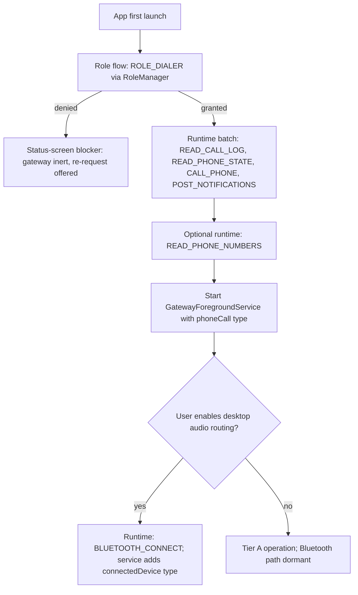

# Permissions and Platform

Canonical permission matrix for the Tandem Gateway Android app and the platform requirements for
the desktop on Linux, Windows, and macOS. Every permission the v1 app declares, requests at
runtime, or deliberately declines is listed here; permissions named elsewhere only as future work
(for example `READ_CONTACTS` in [16-roadmap.md](16-roadmap.md)) are out of scope until their own
ADR lands. Other documents cross-reference this file instead of restating it. Android facts:
minSdk 29 (Android 10), targetSdk 35, compileSdk 35. The manifest that declares all of this is
`android/app/src/main/AndroidManifest.xml`; its structure and skeleton are covered in
[03-android-app.md](03-android-app.md). Feasibility rationale for each mechanism lives in
[02-feasibility-and-constraints.md](02-feasibility-and-constraints.md); the commands that grant
these in a dev loop are in [13-build-and-setup.md](13-build-and-setup.md).

## Android permission matrix

Request-phase vocabulary used below:

- **Install-time** — `normal` protection level; granted at install, not user-deniable.
- **Runtime** — `dangerous` protection level; requested with a system dialog, user-deniable and
  revocable.
- **Role flow** — not a permission: `ROLE_DIALER` (`android.app.role.DIALER`) is requested via
  `RoleManager.createRequestRoleIntent` (`DefaultDialerManager`) during onboarding.
- **Settings opt-in** — declared in the manifest but exercised only after the user enables the
  feature in Tandem's settings.

| Permission / role | Tier | When requested | Why needed | Graceful degradation if denied/revoked |
|---|---|---|---|---|
| `ROLE_DIALER` | `[Tier A]` | Role flow, first onboarding step | Default-dialer status: binds `TandemInCallService` to Telecom, legalizes `TelecomManager.placeCall`, satisfies the prerequisite for the `phoneCall` foreground-service type | App is inert as a gateway: status screen shows a blocker with a re-request action; no call observation, no control, no history serving. Handset UI still opens but cannot manage calls |
| `READ_CALL_LOG` | `[Tier A]` | Runtime, onboarding batch after role grant | `CallLogRepositoryImpl` reads `android.provider.CallLog.Calls` to serve `CallLogSyncRequest` pages | Live call control keeps working; sync responses return empty pages with a non-OK `Status`; desktop history view shows a "history unavailable — permission denied on phone" state |
| `READ_PHONE_STATE` | `[Tier A]` | Runtime, onboarding batch | SIM/subscription detail: multi-SIM slot resolution (`sim_slot` in `CallInfo`/`CallLogEntry`), carrier labels | Control still works — `InCallService` supplies `Call` objects without it; `sim_slot` reports -1, SIM labels absent |
| `READ_PHONE_NUMBERS` | `[Tier A]` | Runtime, onboarding batch (skippable) | Display of the phone's own line number in status and pairing UX | Cosmetic only: own-number field shows "unknown"; no functional loss |
| `CALL_PHONE` | `[Tier A]` | Runtime, onboarding batch | Required by `TelecomManager.placeCall` (`OutgoingCallPlacer`) for handset and desktop-originated dials | Outgoing dials fail: `DialRequest` is answered with `Ack{ERROR_CODE_TELECOM_FAILURE}` and the UI explains the missing grant; incoming answer/reject/end/mute/hold still work |
| `BLUETOOTH_CONNECT` | `[Tier B — Linux]` `[Tier B — Win/macOS USB dongle]` `[Tier B-lite fallback]` | Runtime, deferred until the user first enables Bluetooth call-audio routing — to the desktop's HF or to a bonded headset (settings opt-in trigger); applies API 31+ | `HfpAgMonitor` headset-profile proxy, `BondedDesktopMatcher` bond enumeration, routing call audio to the desktop's HF via `HfpCallMediaProvider` | Audio routing over Bluetooth is unavailable: `AudioRouteRequest` targeting Bluetooth returns `Ack{ERROR_CODE_AUDIO_ROUTE_UNAVAILABLE}`; call audio stays on the handset earpiece/speaker; no Bluetooth target can be selected. Tier A is untouched |
| `BLUETOOTH` (legacy) | `[Tier B — Linux]` `[Tier B — Win/macOS USB dongle]` `[Tier B-lite fallback]` | Install-time, declared with `android:maxSdkVersion="30"` so it applies only on API 29–30 | Legacy pre-API-31 equivalent of `BLUETOOTH_CONNECT` for the `BluetoothHeadset` profile proxy used by `HfpAgMonitor`, and for `BondedDesktopMatcher` bond enumeration, on the minSdk floor | Not deniable: install-time where it applies, and not present above API 30 where `BLUETOOTH_CONNECT` takes over. Absence from the manifest is a build defect that would deny headset-profile access on API 29–30 |
| `POST_NOTIFICATIONS` | `[Tier A]` | Runtime (API 33+), onboarding batch | Persistent gateway status notification (`GatewayNotifications`) and incoming-call notification (`IncomingCallNotifier`) | Foreground service still runs but is invisible in the shade; incoming-call heads-up is missing while unlocked (full-screen `InCallActivity` still launches when locked/screen-off); desktops still receive `IncomingCallEvent` |
| `USE_FULL_SCREEN_INTENT` | `[Tier A]` | Install-time; auto-granted to calling apps on API 34+, user-revocable in system settings | Launch `InCallActivity` over the lock screen while ringing — used only by `IncomingCallNotifier` | Falls back to an expanded incoming-call notification with answer/decline actions; no lock-screen takeover |
| `FOREGROUND_SERVICE` | `[Tier A]` | Install-time | Prerequisite for running `GatewayForegroundService` at all | Not deniable at runtime; absence from the manifest is a build defect, surfaced as `SecurityException` at service start |
| `FOREGROUND_SERVICE_PHONE_CALL` | `[Tier A]` | Install-time (typed FGS permission, enforced from API 34) | Legalizes the `phoneCall` foreground-service type; valid because the app holds `ROLE_DIALER` | Not deniable. If the role is not yet held, the service start is deferred until the role flow completes — starting the `phoneCall` type without the role would throw |
| `FOREGROUND_SERVICE_CONNECTED_DEVICE` | `[Tier B — Linux]` `[Tier B — Win/macOS USB dongle]` | Install-time (typed FGS permission, enforced from API 34) | Legalizes the `connectedDevice` foreground-service type while Bluetooth audio coordination is active | Not deniable. In Tier A operation the service runs with the `phoneCall` type only; `connectedDevice` is added when desktop audio routing is enabled |
| `INTERNET` | `[Tier A]` | Install-time | Ktor (CIO) LAN listener on TCP 46521 and WebSocket frames of TLP v1 | Not deniable |
| `ACCESS_NETWORK_STATE` | `[Tier A]` | Install-time | Network-change detection so `NsdAdvertiser` re-registers `_tandem._tcp` after Wi-Fi transitions | Not deniable |
| `RECEIVE_BOOT_COMPLETED` | `[Tier A]` | Install-time; behavior is settings opt-in (autostart, default off) | `BootCompletedReceiver` restarts `GatewayForegroundService` after reboot when the user opted in | If the user never opts in, the receiver stays disabled and the gateway starts on next app launch |

API-level notes: on API 29–30 (minSdk floor), `BLUETOOTH_CONNECT` does not exist; the legacy
install-time `BLUETOOTH` permission is declared with `android:maxSdkVersion="30"` to cover the
headset-profile proxy there. `POST_NOTIFICATIONS` is a no-op below API 33. The typed
foreground-service permissions exist from API 34; below that, `FOREGROUND_SERVICE` plus the
`android:foregroundServiceType="phoneCall|connectedDevice"` declaration suffices.

`BIND_INCALL_SERVICE` is not in the matrix because Tandem never holds it: `TandemInCallService`
declares `android:permission="android.permission.BIND_INCALL_SERVICE"` so that **only** the
system Telecom service may bind it. It is an enforcement point, not a grant Tandem requests.

### Onboarding request order

Each denial in the batch degrades per its matrix row; no denial except `ROLE_DIALER` blocks the
rest of onboarding.

## Permissions explicitly NOT requested

| Permission | Status on stock Android | Why Tandem does not request it |
|---|---|---|
| `MANAGE_OWN_CALLS` | Obtainable (normal) | Exists for apps hosting their own self-managed VoIP calls via `ConnectionService`. Tandem drives carrier-managed SIM calls, for which default-dialer + `InCallService` + `TelecomManager.placeCall` is sufficient and correct — Tandem implements no `ConnectionService` (see [03-android-app.md](03-android-app.md), ConnectionService posture) |
| `ANSWER_PHONE_CALLS` | Obtainable (runtime) | Lets non-dialer apps answer calls. As default dialer, Tandem's `InCallService` already receives `Call` objects and answers via `Call.answer` — the permission is redundant with `ROLE_DIALER` |
| `WRITE_CALL_LOG` | Obtainable (runtime) | The call-log mirror is read-only by design: the phone's OS log is the source of truth and the desktop holds a projection; nothing in Tandem writes or deletes OS call-log rows (see [09-data-models.md](09-data-models.md)) |
| `REQUEST_IGNORE_BATTERY_OPTIMIZATIONS` | Obtainable (normal), but Play-restricted | Play allows the declaration only for a narrow list of use cases and rejects the rest, so Tandem does not declare it. When a user wants the exemption, the app deep-links to the OS battery-optimization settings screen and the user grants it there — same effect, no restricted declaration (Doze analysis in [02-feasibility-and-constraints.md](02-feasibility-and-constraints.md)) |
| `RECORD_AUDIO` | Obtainable (runtime) | Tandem never records or captures audio on the phone. The media plane is Bluetooth HFP, executed by Android's Bluetooth stack; requesting microphone access would imply a capture path the design forbids |
| `CAPTURE_AUDIO_OUTPUT` | **Unobtainable** — `signature\|privileged` | Gates the `VOICE_CALL`/`VOICE_DOWNLINK`/`VOICE_UPLINK` audio sources; installable apps cannot hold it, and there is no API to inject audio into the cellular uplink. Its unavailability is the reason the media plane is Bluetooth HFP at all (ADR-0002, [02-feasibility-and-constraints.md](02-feasibility-and-constraints.md)) |

Consequence to keep in mind when reading any media section: no permission on this page, requested
or not, would let Tandem capture carrier call audio in software on stock non-rooted Android. The
HFP design exists precisely because that wall is real.

## Minimum viable permission set: Tier A vs Tier B

**Tier A — control + history, zero Bluetooth audio work** `[Tier A]`:

- Role: `ROLE_DIALER`.
- Runtime: `READ_CALL_LOG`, `READ_PHONE_STATE`, `CALL_PHONE`, `POST_NOTIFICATIONS` (API 33+).
- Install-time: `FOREGROUND_SERVICE`, `FOREGROUND_SERVICE_PHONE_CALL`, `USE_FULL_SCREEN_INTENT`,
  `INTERNET`, `ACCESS_NETWORK_STATE`.
- Optional (degrade gracefully if skipped): `READ_PHONE_NUMBERS`, `RECEIVE_BOOT_COMPLETED`.
- Dormant: `BLUETOOTH_CONNECT` is never requested; the service runs with the `phoneCall` type
  only. Tier A ships as a complete product on exactly this set.

**Tier B additions (phone side)** `[Tier B — Linux]` `[Tier B — Win/macOS USB dongle]`:

- Runtime: `BLUETOOTH_CONNECT`, requested on first audio-routing enable.
- Exercised: `FOREGROUND_SERVICE_CONNECTED_DEVICE` — the service runs with
  `phoneCall|connectedDevice`.
- Nothing else: the HFP Audio Gateway is Android's own Bluetooth stack, so Tier B needs no
  additional privilege on the phone beyond observing and steering routes.

`[Tier B-lite fallback]` uses the Tier A set plus `BLUETOOTH_CONNECT` — the user pairs commodity
earbuds directly to the phone and Tandem's desktop stays control-plane-only, but selecting that
headset as the call-audio target still runs through
`HfpCallMediaProvider`/`requestBluetoothAudio(BluetoothDevice)`, which must enumerate the phone's
bonded devices and therefore needs the permission (on API 29–30 the legacy `BLUETOOTH`
declaration covers it).

Desktop side: Tier A requires no elevated OS privilege on any platform (outbound TCP plus mDNS).
Tier B desktop requirements are per-OS, below.

## Play Store policy notes

- **Default-handler policy.** Play permits `ROLE_DIALER` requests only from apps whose core
  functionality is being a phone app, and requires a genuinely usable dialer UX. Tandem
  satisfies this on the handset: `DialpadScreen` places calls, `InCallActivity`/`InCallScreen`
  fully control live calls without any desktop, and `DialIntentRouter` honors external
  `ACTION_DIAL`/`tel:` intents — the default-dialer contract, not a shell around the LAN
  gateway.
- **Permissions Declaration Form.** `READ_CALL_LOG` and the Phone-group permissions
  (`READ_PHONE_STATE`, `READ_PHONE_NUMBERS`, `CALL_PHONE`) are restricted; the Play Console
  declaration must select **Default Phone handler** as the core use case. Review can require a
  short demo video showing the dialer UX and the permission prompts in context.
- **Full-screen intent declaration.** For apps targeting API 34+, `USE_FULL_SCREEN_INTENT` is
  auto-granted only to apps whose core function is calling or alarms; Tandem qualifies as a
  dialer but must still complete the Play Console declaration.
- **Foreground-service type declarations.** targetSdk 34+ requires declaring each FGS type in
  the Play Console with a justification: `phoneCall` (default dialer keeping call control alive)
  and `connectedDevice` (Bluetooth audio-route coordination).
- **Data-safety form.** Call log and call metadata are read on-device and mirrored only to
  user-paired desktops on the local network; no collection, no transmission off the LAN, no
  analytics in v1 — declare accordingly (privacy substance in
  [08-security-and-encryption.md](08-security-and-encryption.md)).
- Sideloaded developer builds bypass Play review entirely, but the `ROLE_DIALER` grant is still
  gated by `RoleManager` on-device — see [13-build-and-setup.md](13-build-and-setup.md) for the
  dev-grant flow.

## Desktop platform requirements

### Linux

- **Tier A** `[Tier A]`: plain user process. Outbound TCP to the phone's advertised port
  (default 46521) and mDNS (UDP 5353 multicast) for discovery. No root, no groups.
- **Tier B** `[Tier B — Linux]`:
  - BlueZ `bluetoothd` reachable on the system D-Bus (`org.bluez`); version floor in
    [13-build-and-setup.md](13-build-and-setup.md). Debian-family D-Bus policy requires the
    user in the `bluetooth` group to talk to `org.bluez`.
  - HFP profile exclusivity: BlueZ allows one `Profile1` handler per UUID, so PipeWire's native
    HFP backend must be disabled or `tandem-daemon`'s Hands-Free registration (UUID 0x111E)
    fails with `AlreadyExists`. Config snippet and restart commands in
    [13-build-and-setup.md](13-build-and-setup.md); A2DP media audio stays with PipeWire.
  - SCO audio uses `BTPROTO_SCO` kernel sockets, openable by the session user on modern
    kernels — the same mechanism PipeWire itself uses; no elevation.
  - USB-dongle development on Linux (optional, for working on the
    `[Tier B — Win/macOS USB dongle]` backend): a udev rule granting the `plugdev` group access
    to the dongle's VID:PID, plus unbinding the kernel `btusb` driver from that dongle
    (commands in [13-build-and-setup.md](13-build-and-setup.md)).
- **Packaging/signing**: `.deb`/`.rpm`/AppImage via the Tauri bundler; `tandem-daemon` runs as
  a systemd user unit; IPC over `$XDG_RUNTIME_DIR/tandem/daemon.sock` with same-user peer
  checks. No elevated runtime components, no setuid binaries.

### Windows

- **Tier A** `[Tier A]`: normal user app. First run triggers a Windows Defender Firewall prompt
  for mDNS/outbound on private networks — must be allowed for discovery.
- **Tier B Windows software track**: the no-extra-hardware path is a signed Windows Bluetooth
  profile driver plus a user-mode `windows_profile` backend, as scoped in
  [17-windows-software-audio.md](17-windows-software-audio.md) and ADR-0011. It uses the built-in
  Bluetooth adapter rather than a Tandem-owned USB controller. This is not a normal app-level
  Bluetooth permission; it requires driver installation, driver signing, rollback handling, and
  a real-device spike before shipping.
- **Tier B hardware fallback** `[Tier B — Win/macOS USB dongle]`: if the native Windows driver
  spike fails and the product accepts extra hardware, Tandem can still drive a **dedicated** USB
  Bluetooth controller directly. That controller must be bound to **WinUSB** instead of the
  in-box Bluetooth driver:
  - Development: rebind with Zadig (steps in [13-build-and-setup.md](13-build-and-setup.md)).
    The dongle disappears from Windows' own Bluetooth — that is the point; any built-in radio
    keeps serving the OS.
  - Production: a signed WinUSB driver package (INF matching the supported dongle VID:PIDs,
    attestation-signed via the Microsoft Hardware Dev Center) installed by the app installer.
    Administrator elevation is required **only** for that one-time driver install; all runtime
    USB access is user-mode via `nusb` over WinUSB.
- **Packaging/signing**: MSI/NSIS installer via the Tauri bundler, Authenticode-signed
  (unsigned builds trip SmartScreen). The installer registers per-user autostart of
  `tandem-daemon`; IPC over the named pipe `\\.\pipe\tandem-daemon` with same-user peer checks.

### macOS

- **Tier A** `[Tier A]`: normal user app; the local-network privacy prompt (macOS asks before
  allowing mDNS/LAN traffic) must be accepted, and `NSLocalNetworkUsageDescription` plus the
  `_tandem._tcp` entry in `NSBonjourServices` must be present in the bundle `Info.plist`.
- **Tier B** `[Tier B — Win/macOS USB dongle]`: macOS does not expose the HF role either;
  Tandem claims a dedicated USB controller exclusively via IOKit (`IOUSBHost` user client).
  The claim succeeds only when no Apple driver holds the interface; controller families that
  macOS's Bluetooth stack auto-claims are unsupported — `tools/usb-dongle-probe` prints the
  per-device verdict. Tandem never asks users to disable SIP or unload Apple drivers;
  unsupported dongles are simply rejected.
- **Packaging/signing**: `.app` in a `.dmg`, Developer ID signed, hardened runtime, notarized
  (stapled ticket) so Gatekeeper passes on first launch; `tandem-daemon` as a LaunchAgent. App
  Store distribution is off the table for dongle builds: the App Sandbox is incompatible with
  exclusive USB claims (sandboxed builds would need the `com.apple.security.device.usb`
  entitlement and still cannot seize an interface another driver holds), so Tier B ships
  Developer ID outside the Mac App Store. A Tier A / `[Tier B-lite fallback]`-only build has no
  such conflict and could be sandboxed.

Security posture of these channels — what is and is not encrypted per plane — is defined in
[08-security-and-encryption.md](08-security-and-encryption.md); the HFP mechanics behind the
Bluetooth requirements are in [05-bluetooth-hfp.md](05-bluetooth-hfp.md).
