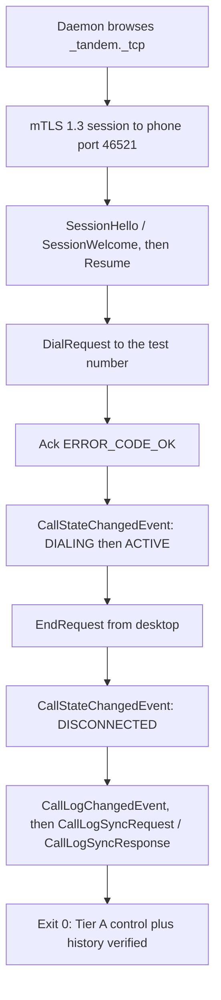

# Build and Setup

Developer setup for both halves of Tandem: the **Tandem Gateway** Android app (`android/`) and the
**desktop** Rust workspace plus Tauri UI (`desktop/`). Every command block below is
copy-pasteable; where POSIX and Windows differ, both are given. Run everything from the repository
root unless a block changes directory explicitly.

Scope by tier: sections 1–7 are all you need for `[Tier A]` — control plus history, which is a
complete shippable product with zero Bluetooth audio work. Sections 8–10 add the media plane for
`[Tier B — Linux]` and `[Tier B — Win/macOS USB dongle]`. `[Tier B-lite fallback]` needs nothing
beyond Tier A setup (section 11). Permission and platform prerequisites are justified in
[12-permissions-and-platform.md](12-permissions-and-platform.md); this document only shows how to
satisfy them.

## 1. Prerequisites

| Tool | Version | Used for |
|---|---|---|
| JDK | 17 (Temurin or equivalent) | Gradle + Kotlin compilation. Higher JDKs are not validated against AGP 8.7.x |
| Android Studio | Ladybug (2024.2.1) or newer | IDE, SDK manager, emulator. Optional if you install cmdline-tools directly |
| Android SDK | Platform 35, Build-Tools 35.0.0, Platform-Tools (`adb`) | compileSdk/targetSdk 35; minSdk 29 |
| Gradle wrapper | 8.9 (pinned in `android/gradle/wrapper/gradle-wrapper.properties`) | Reproducible Android builds |
| Rust | stable, pinned by `desktop/rust-toolchain.toml` (+ `rustfmt`, `clippy`) | Daemon, crates, Tauri shell |
| Node.js | LTS 20 or newer, npm 10 or newer | Svelte + Vite front-end, Tauri CLI |
| protoc | 25 or newer | `tools/gen-proto.*` verification and prost codegen |
| Tauri 2 system deps | per OS, below | Building `tandem-ui` |
| A real Android phone with a SIM | Android 10+ | Tier A end-to-end verification. The emulator has no carrier leg |

Emulators are fine for UI and control-plane work (`adb emu gsm call …` simulates incoming calls),
but the smoke test in section 7 requires a physical phone with a working SIM.

### Rust

```bash
curl --proto '=https' --tlsv1.2 -sSf https://sh.rustup.rs | sh
rustup component add rustfmt clippy
rustc --version && cargo --version
```

```powershell
winget install --id Rustlang.Rustup -e
rustup component add rustfmt clippy
rustc --version; cargo --version
```

`desktop/rust-toolchain.toml` pins the toolchain, so the first `cargo` invocation inside
`desktop/` may download it. Release builds target the host triple only
(`x86_64-unknown-linux-gnu`, `x86_64-pc-windows-msvc`, `aarch64-apple-darwin`); add
`rustup target add x86_64-apple-darwin` when producing a macOS universal bundle.

### Node and the Tauri CLI

```bash
node --version && npm --version
cd desktop/ui && npm install
```

The Tauri CLI is a dev dependency of `desktop/ui/package.json`; do not install it globally.

### Tauri system dependencies

```bash
# Debian/Ubuntu
sudo apt update && sudo apt install -y \
  build-essential pkg-config curl wget file libssl-dev \
  libwebkit2gtk-4.1-dev librsvg2-dev libayatana-appindicator3-dev libxdo-dev
```

```bash
# macOS
xcode-select --install
```

```powershell
# Windows: MSVC C++ build tools plus the WebView2 runtime
winget install --id Microsoft.VisualStudio.2022.BuildTools -e --override "--quiet --add Microsoft.VisualStudio.Workload.VCTools --includeRecommended"
winget install --id Microsoft.EdgeWebView2Runtime -e
```

### protoc

```bash
sudo apt install -y protobuf-compiler   # Debian/Ubuntu
brew install protobuf                   # macOS
protoc --version
```

```powershell
winget install --id Google.Protobuf -e
protoc --version
```

## 2. Clone and one-time bootstrap

```bash
git clone <repository-url> tandem
cd tandem
tools/gen-proto.sh
```

```powershell
git clone <repository-url> tandem
cd tandem
pwsh -File tools/gen-proto.ps1
```

`android/gradlew` is generated, not committed. If it is missing, create it once with a system
Gradle 8.9+:

```bash
cd android && gradle wrapper --gradle-version 8.9 && cd ..
```

Set the SDK/JDK locations your shell will use:

```bash
export JAVA_HOME="/usr/lib/jvm/temurin-17-jdk-amd64"
export ANDROID_HOME="$HOME/Android/Sdk"
export PATH="$ANDROID_HOME/platform-tools:$PATH"
```

```powershell
$env:JAVA_HOME = "C:\Program Files\Eclipse Adoptium\jdk-17"
$env:ANDROID_HOME = "$env:LOCALAPPDATA\Android\Sdk"
$env:PATH = "$env:ANDROID_HOME\platform-tools;$env:PATH"
```

## 3. Protobuf codegen

`/proto` is the single source of truth for every cross-device type (ADR-0009; message catalog in
[06-transport-and-protocol.md](06-transport-and-protocol.md)). Both language bindings are
generated, never hand-written, and the generated output is git-ignored.

```bash
tools/gen-proto.sh
```

```powershell
pwsh -File tools/gen-proto.ps1
```

The script verifies `protoc`, runs the Kotlin `generateProto` path via the Gradle protobuf plugin,
and builds `tandem_proto` so the prost `build.rs` recompiles `proto/tandem/v1/*.proto`. Run it
after **any** `/proto` edit and before opening a PR that touches the schema. CI runs the same
script followed by `git diff --exit-code` to catch checked-in drift (see
[15-testing-strategy.md](15-testing-strategy.md)).

## 4. Android app: build, test, sideload

```bash
cd android
./gradlew assembleDebug
./gradlew test
```

```powershell
cd android
.\gradlew.bat assembleDebug
.\gradlew.bat test
```

`./gradlew test` runs the unit tier against the testkit fakes; no device or SIM is involved.

Install on a connected device:

```bash
adb devices
adb install -r android/app/build/outputs/apk/debug/app-debug.apk
adb shell am start -n com.tandem.gateway/.ui.MainActivity
```

```powershell
adb devices
adb install -r android\app\build\outputs\apk\debug\app-debug.apk
adb shell am start -n com.tandem.gateway/.ui.MainActivity
```

Follow the gateway's own logs:

```bash
adb logcat --pid="$(adb shell pidof com.tandem.gateway)"
```

```powershell
adb logcat --pid=(adb shell pidof com.tandem.gateway)
```

## 5. Granting the default-dialer role in dev

Tandem is inert as a gateway until it holds `ROLE_DIALER`: without it Telecom never binds
`TandemInCallService` and `TelecomManager.placeCall` is refused
([12-permissions-and-platform.md](12-permissions-and-platform.md)).

**Interactive path (any device, including production consumer builds).** Launch the app; the
onboarding step invokes `RoleManager.createRequestRoleIntent` through `DefaultDialerManager` and
the system asks "Change default phone app?". Accept. To reach the same setting manually:

```bash
adb shell am start -a android.settings.MANAGE_DEFAULT_APPS_SETTINGS
```

**Scripted path (emulators, userdebug/eng builds, CI).** `cmd role` needs the shell to hold
`MANAGE_ROLE_HOLDERS`, which is the case on emulators and engineering builds but generally **not**
on retail consumer devices — there, use the interactive path.

```bash
adb shell cmd role add-role-holder android.app.role.DIALER com.tandem.gateway
adb shell cmd role get-role-holders android.app.role.DIALER
```

Restore the stock dialer when finished:

```bash
adb shell cmd role remove-role-holder android.app.role.DIALER com.tandem.gateway
adb shell cmd role add-role-holder android.app.role.DIALER com.google.android.dialer
```

**Runtime permissions for unattended runs.** Grant the Tier A set explicitly so no dialog blocks
a scripted session:

```bash
for p in READ_CALL_LOG READ_PHONE_STATE READ_PHONE_NUMBERS CALL_PHONE POST_NOTIFICATIONS; do
  adb shell pm grant com.tandem.gateway "android.permission.$p"
done
```

```powershell
foreach ($p in "READ_CALL_LOG","READ_PHONE_STATE","READ_PHONE_NUMBERS","CALL_PHONE","POST_NOTIFICATIONS") {
  adb shell pm grant com.tandem.gateway "android.permission.$p"
}
```

Add `android.permission.BLUETOOTH_CONNECT` only when exercising Tier B. To rehearse the
degradation paths documented in the permission matrix, revoke one and observe:

```bash
adb shell pm revoke com.tandem.gateway android.permission.READ_CALL_LOG
adb shell pm reset-permissions
```

## 6. Running the desktop: daemon and UI

Build and test the workspace:

```bash
cd desktop
cargo build --workspace
cargo test --workspace
cargo clippy --workspace --all-targets -- -D warnings
```

Run the headless daemon (control plane only by default — the Bluetooth backend defaults to
`null`, i.e. `[Tier B-lite fallback]`):

```bash
cd desktop
cargo run -p tandem_daemon -- --log-level debug
```

```powershell
cd desktop
cargo run -p tandem_daemon -- --log-level debug
```

Backend selection and endpoint hints live in `config.toml` next to the desktop store; the full key
reference is in [09-data-models.md](09-data-models.md). The one key you need for Tier B bring-up:

```toml
[bluetooth]
backend = "null"   # "null" | "linux_bluez" | "usb_dongle"
```

Run the UI in dev (Vite dev server inside the Tauri shell):

```bash
cd desktop/ui
npm install
npm run tauri dev
```

The UI is a separate process and talks to the daemon over JSON-RPC 2.0 on
`$XDG_RUNTIME_DIR/tandem/daemon.sock` (POSIX) or `\\.\pipe\tandem-daemon` (Windows). If the daemon
is not running, the shell shows a daemon-unavailable state and offers to start it; nothing in the
media path ever runs inside the webview. TypeScript types for that surface are emitted by `ts-rs`
from `tandem_ipc::api`:

```bash
cd desktop
cargo test -p tandem_ipc
```

Regenerate them after changing `crates/ipc/src/api.rs`; `desktop/ui/tsconfig.json` aliases the
output for `desktop/ui/src/lib/ipc.ts`. Method-by-method contracts are in
[11-api-reference.md](11-api-reference.md).

## 7. First-run smoke test: Tier A end to end on LAN

This is the acceptance gate for Tier A: control and history working over the LAN with **no
Bluetooth involvement at all**. Audio stays on the handset throughout — that is expected, not a
defect.

**Preconditions**

- Phone and desktop on the same subnet, with client isolation / AP isolation **off** and mDNS
  (UDP 5353) not filtered. On first run, accept the Windows Defender Firewall prompt or the macOS
  local-network prompt.
- The gateway app installed, holding `ROLE_DIALER` (section 5) and the Tier A runtime permissions.
- `tandem-daemon` and `tandem-ui` running (section 6).
- A **test number you are authorised to call** — your own second line, a carrier echo/test number,
  or a colleague. Never an emergency number: `GuardEmergencyNumber` refuses desktop-originated
  emergency dials with `ERROR_CODE_EMERGENCY_NUMBER_BLOCKED` and the desktop pre-checks the list
  from `SessionWelcome.emergency_numbers` before sending anything (ADR-0008). Verify that refusal
  path against the `fake_phone` fixture in [15-testing-strategy.md](15-testing-strategy.md), not
  against a live network.

**Manual walkthrough**

1. **Discover.** The daemon browses `_tandem._tcp`; the desktop UI lists the phone by its TXT
   `name`. If nothing appears, jump to the troubleshooting table.
2. **Pair.** On the phone, open Pairing to show the QR payload; enter it (or the manual short
   code) in the desktop's Pairing view, then confirm on the phone. Flow and the 6-digit
   comparison step: [07-pairing-and-auth.md](07-pairing-and-auth.md).
3. **Session.** Watch the daemon log for `SessionHello` → `SessionWelcome` with
   `ERROR_CODE_OK`, followed by `ResumeRequest`/`ResumeResponse`. Heartbeats appear every 5 s.
4. **Dial.** Enter the test number in the desktop dialer and place the call. Expect
   `Ack{ERROR_CODE_OK}` for the `DialRequest`, then `CallStateChangedEvent` snapshots walking
   `CALL_STATE_DIALING` → `CALL_STATE_ACTIVE`, with `state_seq` strictly increasing.
5. **Observe on both ends.** The handset shows `InCallScreen`; the desktop shows the same call and
   timer. Toggle mute from the desktop (`MuteRequest`) and confirm `microphone_muted` flips in the
   next snapshot on the phone UI too.
6. **End.** Hang up from the desktop (`EndRequest`); expect a snapshot with
   `CALL_STATE_DISCONNECTED` and `DISCONNECT_CAUSE_LOCAL_HANGUP`.
7. **Sync history.** Expect an unsolicited `CallLogChangedEvent` with a bumped `log_version`, then
   the desktop's `CallLogSyncRequest` and a `CallLogSyncResponse` whose entries include the call
   you just made. The desktop history view refreshes read-only.

**Scripted form** — `tools/dev/tier-a-smoke.sh` (POSIX) and `tools/dev/tier-a-smoke.ps1`
(Windows) perform the same sequence against an already-paired phone and assert each transition;
the exit code is the CI gate.

```bash
export TANDEM_SMOKE_NUMBER="+15555550123"
tools/dev/tier-a-smoke.sh --number "$TANDEM_SMOKE_NUMBER"
echo "smoke exit: $?"
```

```powershell
$env:TANDEM_SMOKE_NUMBER = "+15555550123"
pwsh -File tools/dev/tier-a-smoke.ps1 -Number $env:TANDEM_SMOKE_NUMBER
Write-Output "smoke exit: $LASTEXITCODE"
```

| Exit code | Stage that failed | First thing to check |
|---|---|---|
| 0 | none — Tier A verified | — |
| 10 | mDNS discovery of `_tandem._tcp` | AP isolation, VLAN split, mDNS filtering |
| 20 | TLS session / `SessionWelcome` | Desktop revoked on the phone, or stale pin — re-pair |
| 30 | `DialRequest` not acked `ERROR_CODE_OK` | `CALL_PHONE` grant, `ROLE_DIALER` still held, dial rate limit (5/min/session) |
| 40 | no `CallStateChangedEvent` progression | Foreground service killed, or gateway lost the role mid-run |
| 50 | `EndRequest` did not reach `CALL_STATE_DISCONNECTED` | `call_id` staleness after an epoch change |
| 60 | call-log sync mismatch | `READ_CALL_LOG` grant, `log_version` bump from `CallLogObserver` |



## 8. Linux Bluetooth prerequisites `[Tier B — Linux]`

Only needed to bridge live call audio to the desktop. Tier A is unaffected by everything in this
section; mechanics are in [05-bluetooth-hfp.md](05-bluetooth-hfp.md).

**Versions and group membership**

```bash
bluetoothctl --version          # BlueZ 5.66 or newer
systemctl status bluetooth
uname -r                        # kernel 5.10+ for transparent eSCO / mSBC
sudo usermod -aG bluetooth "$USER"   # Debian-family D-Bus policy for org.bluez
id -nG                          # re-login, then confirm "bluetooth" is listed
```

**Disable PipeWire's native HFP backend.** BlueZ accepts one `Profile1` handler per UUID, so
`tandem-daemon`'s Hands-Free registration (UUID `0x111E`) fails with `AlreadyExists` while
WirePlumber owns HFP/HSP. A2DP media audio is untouched by this change.

WirePlumber 0.5 or newer:

```bash
mkdir -p ~/.config/wireplumber/wireplumber.conf.d
cat > ~/.config/wireplumber/wireplumber.conf.d/51-tandem-disable-hfp.conf <<'EOF'
monitor.bluez.properties = {
  bluez5.roles = [ a2dp_sink a2dp_source ]
  bluez5.hfphsp-backend = "none"
}
EOF
systemctl --user restart wireplumber
```

WirePlumber 0.4 (Lua configuration):

```bash
mkdir -p ~/.config/wireplumber/bluetooth.lua.d
cat > ~/.config/wireplumber/bluetooth.lua.d/51-tandem-disable-hfp.lua <<'EOF'
bluez_monitor.properties = {
  ["bluez5.roles"] = "[ a2dp_sink a2dp_source ]",
  ["bluez5.hfphsp-backend"] = "none",
}
EOF
systemctl --user restart wireplumber
```

Verify the change took effect: bonded phones must no longer offer a handsfree profile to the audio
server, and the daemon must register without `AlreadyExists`.

```bash
pactl list cards short | grep -i bluez
cargo run -p tandem_daemon --features linux_bluez -- --log-level debug
```

**Optional: dongle-backend development on Linux.** Useful for working on the
`[Tier B — Win/macOS USB dongle]` code path without a Windows or macOS box. Replace the
VID:PID with the one `tools/usb-dongle-probe` prints for your device, and use a **second**,
dedicated dongle — never the adapter your desktop's own Bluetooth relies on.

```bash
sudo tee /etc/udev/rules.d/70-tandem-dongle.rules <<'EOF'
SUBSYSTEM=="usb", ATTR{idVendor}=="0a12", ATTR{idProduct}=="0001", GROUP="plugdev", MODE="0660"
EOF
sudo udevadm control --reload-rules && sudo udevadm trigger
sudo usermod -aG plugdev "$USER"

lsusb -t                                  # find the dongle's bus-port:config.interface
echo -n "1-4:1.0" | sudo tee /sys/bus/usb/drivers/btusb/unbind
cargo run --manifest-path tools/usb-dongle-probe/Cargo.toml
```

## 9. Windows USB-dongle bring-up `[Tier B — Win/macOS USB dongle]`

The Windows Bluetooth stack does not expose the HFP Hands-Free role to applications, so Tandem
drives a dedicated USB controller directly. The built-in radio keeps serving Windows.

1. Plug in the dedicated dongle and identify it:

```powershell
Get-PnpDevice -Class Bluetooth | Format-Table FriendlyName, InstanceId, Status
```

2. Rebind it to WinUSB with [Zadig](https://zadig.akeo.ie/) (run as Administrator):
   **Options → List All Devices**, select the dongle's Bluetooth interface, choose **WinUSB** as
   the target driver, click **Replace Driver**. The dongle then disappears from Windows'
   Bluetooth settings — that is the intended outcome. Production installs use a signed WinUSB
   driver package instead of Zadig; see
   [12-permissions-and-platform.md](12-permissions-and-platform.md).

3. Confirm Tandem can use it:

```powershell
cargo run --manifest-path tools/usb-dongle-probe/Cargo.toml
```

   The probe prints HCI version, SCO-over-USB support, mSBC capability, and exclusive-claim
   viability, ending in a supported/unsupported verdict. An unsupported verdict is final: pick a
   different controller rather than working around it.

4. Run the daemon against the dongle backend and bond the phone to the **dongle's** address (not
   the built-in radio) from the UI's Settings view:

```powershell
cd desktop
cargo run -p tandem_daemon --features usb_dongle -- --log-level debug
```

5. To revert: Device Manager → the dongle → **Uninstall device** with "delete the driver
   software" checked, then unplug and replug.

## 10. macOS USB-dongle bring-up `[Tier B — Win/macOS USB dongle]`

macOS likewise does not expose the HF role, so the same dedicated-controller path applies, with
an exclusive IOKit (`IOUSBHost`) claim in place of WinUSB.

```bash
system_profiler SPUSBDataType | grep -i -A 8 bluetooth
cargo run --manifest-path tools/usb-dongle-probe/Cargo.toml
cd desktop && cargo run -p tandem_daemon --features usb_dongle -- --log-level debug
```

The claim succeeds only when no Apple driver holds the interface; controller families the macOS
Bluetooth stack auto-claims are unsupported and the probe says so. Tandem never asks you to
disable SIP or unload Apple drivers. Locally built binaries run ad-hoc signed from the terminal;
distributable bundles need Developer ID signing, hardened runtime, and notarization — packaging
details in [12-permissions-and-platform.md](12-permissions-and-platform.md).

## 11. Tier B-lite `[Tier B-lite fallback]`

No setup beyond sections 1–7. Leave `[bluetooth] backend = "null"`; the desktop provides control
and history while the user pairs any commodity Bluetooth speakerphone or earbuds directly to the
phone for audio. This is a first-class supported mode, not a broken Tier B.

## 12. Troubleshooting

| Symptom | Likely cause | Fix |
|---|---|---|
| Phone never appears in the desktop's device list | AP/client isolation, separate VLANs or Wi-Fi bands with mDNS not bridged, or a blocked UDP 5353 | Put both on the same subnet; allow mDNS; as a fallback set the phone's endpoint hint in `config.toml` |
| TLS handshake rejected right after connect | Desktop revoked on the phone, or identity key lost so the pin no longer matches | Re-pair from scratch and revoke the stale entry on the phone ([07-pairing-and-auth.md](07-pairing-and-auth.md)) |
| `DialRequest` acked `ERROR_CODE_TELECOM_FAILURE` | `CALL_PHONE` not granted, or Tandem no longer holds `ROLE_DIALER` | Re-grant (section 5); a reinstall drops the role |
| `DialRequest` acked `ERROR_CODE_EMERGENCY_NUMBER_BLOCKED` | Working as designed | Dial emergency numbers on the handset (ADR-0008) |
| `DialRequest` acked `ERROR_CODE_RATE_LIMITED` | More than 5 dials in a minute on one session | Wait out the window; the limit is a toll-fraud control |
| Events stop while the phone screen is off | Gateway foreground service killed by battery optimisation | Exempt the app from battery optimisation; Doze behaviour is discussed in [02-feasibility-and-constraints.md](02-feasibility-and-constraints.md) |
| `AlreadyExists` registering the HF profile on Linux | WirePlumber still owns HFP/HSP | Apply the section 8 config and restart WirePlumber |
| SCO opens then immediately closes | Codec/eSCO mismatch, or a controller without SCO-over-USB | Run `tools/usb-dongle-probe`; CVSD-only fallback is expected on some controllers |
| Call audio drops but the call stays up | Intended degradation: HFP loss never ends a call | Audio falls back to the handset; re-attach from the UI ([05-bluetooth-hfp.md](05-bluetooth-hfp.md)) |
| `npm run tauri dev` fails to link on Linux | Missing `libwebkit2gtk-4.1-dev` | Install the Tauri system dependencies (section 1) |
| Daemon cannot create its socket | `XDG_RUNTIME_DIR` unset in a headless session | Export it, or run the daemon under a normal user session |

## 13. CI notes

Unit and integration tiers (`./gradlew test`, `cargo test --workspace`) run on every push with no
device attached, using the testkit fakes. The proto drift check is `tools/gen-proto.sh` followed
by `git diff --exit-code`. The Tier A smoke test from section 7 runs in the device lab on a real
phone with a SIM, gated on its exit code. Full pyramid, fakes, and the device/OS matrix:
[15-testing-strategy.md](15-testing-strategy.md).
