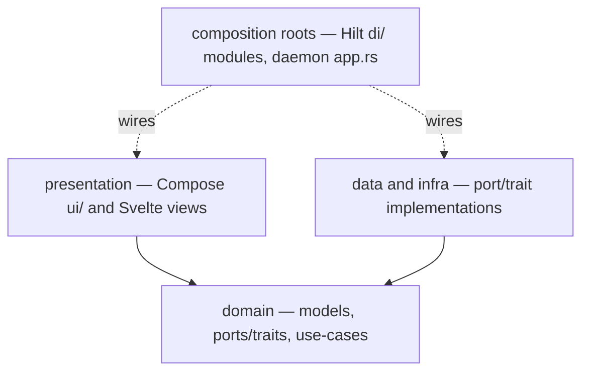

# Coding Conventions

These rules bind every source file in the repo, both apps, all languages. The canonical file
inventory and every file's docstring text live in [REPO-STRUCTURE.md](REPO-STRUCTURE.md); the test
seams these rules create are exercised per [15-testing-strategy.md](15-testing-strategy.md).

## 1. Layered structure

Both apps use the same three layers with dependencies pointing inward:

1. **domain** — pure models, ports/traits, and use-cases. Android: `com.tandem.gateway.domain`
   (`model/`, `port/`, `usecase/`). Desktop: `tandem_core`. No framework types, no I/O, no async
   runtime types in public APIs. Everything here is deterministic and unit-testable.
2. **data / infra** — implementations of the domain's ports/traits. Android: `telecom/`, `dialer/`,
   `calllog/`, `transport/`, `pairing/`, `crypto/`, `bluetooth/`, `data/`. Desktop:
   `tandem_transport`, `tandem_pairing`, `tandem_crypto`, `tandem_audio`, `tandem_bluetooth`,
   `daemon/src/store.rs`.
3. **presentation** — Android: Compose screens plus ViewModels in `ui/`; desktop: the Svelte
   front-end and Tauri shell under `desktop/ui/`, talking to the daemon only through the
   `tandem_ipc` JSON-RPC surface.



Binding rules:

- **Depend on interfaces, not concretions.** Use-cases and the desktop `CallController` see only
  the ports in `domain/port/` (Android) and the `TransportClient` / `BluetoothBackend` /
  `AudioBackend` traits (desktop). Interface names are fixed in
  [11-api-reference.md](11-api-reference.md).
- **No business logic in UI or framework callbacks.** `TandemInCallService` forwards telecom
  callbacks to `TelecomBridgeImpl` and nothing else; ViewModels project state and dispatch to
  use-cases; the Tauri shell's `main.rs` and `daemon_bridge.rs` contain no call logic; the daemon's
  `ipc_service.rs` translates IPC calls into controller commands. If a decision belongs to the
  product, it belongs in a use-case or in `tandem_core`.
- **Shared behavior lives in one place.** The handset in-call UI and the LAN path dispatch through
  the same use-cases (`InCallViewModel` — "one command path for both surfaces"). The emergency
  policy has exactly one authoritative gate, `GuardEmergencyNumber`; the desktop's
  `core/src/emergency.rs` is a documented defense-in-depth pre-check, not a second policy.
- **Only composition roots know concrete types**: the Hilt modules in `di/` on Android, and
  `daemon/src/app.rs` on the desktop (section 6).

## 2. File-level docstrings — the one sanctioned narrative slot

Every source file begins with exactly one file-level docstring and contains no other narration. It
states: purpose, key public types, collaborators, non-obvious constraints. The text for every
existing file is fixed in [REPO-STRUCTURE.md](REPO-STRUCTURE.md) — copy it verbatim; when a file's
behavior changes, update both places in the same commit.

| Language | Form |
|---|---|
| Kotlin | KDoc `/** … */` block above the `package` line |
| Rust | `//!` inner doc lines at the top of the module |
| TypeScript / Svelte | JSDoc `/** … */` at the top of the file, or at the top of the `<script lang="ts">` block in `.svelte` files |
| XML / HTML | `<!-- … -->` before the root element |
| Shell / TOML / properties | `#` line block at the top |
| Gradle KTS / `.proto` | `//` line block at the top |

One exemplar per language, using real Tandem files. Bodies are shown for shape only; normative
signatures live in [11-api-reference.md](11-api-reference.md).

**Kotlin** — `android/app/src/main/kotlin/com/tandem/gateway/domain/usecase/SetMute.kt`, complete:

```kotlin
/**
 * Use-case: set the phone microphone mute state via TelecomBridge. Idempotent by design:
 * callers send the absolute target state, not a toggle.
 */
package com.tandem.gateway.domain.usecase

import com.tandem.gateway.domain.port.TelecomBridge
import javax.inject.Inject

class SetMute @Inject constructor(
    private val telecomBridge: TelecomBridge,
) {
    suspend operator fun invoke(muted: Boolean) = telecomBridge.setMute(muted)
}
```

The file needs nothing else. The docstring carries the idempotency contract; the code carries the
rest through its names.

**Rust** — `desktop/crates/transport/src/reconnect.rs`, opening lines:

```rust
//! Reconnect loop: exponential backoff (0.5 s to 30 s, jittered), immediate retry on
//! network-change signals, and ResumeRequest emission with the last seen (epoch_id,
//! state_seq, call_log_version) so core can reconcile (docs/10 flow h).

use std::time::Duration;

use rand::rngs::SmallRng;

const BASE_BACKOFF_MS: u64 = 500;
const MAX_BACKOFF_MS: u64 = 30_000;
const MAX_DOUBLINGS: u32 = 6;
const JITTER_RATIO: f64 = 0.20;
```

**TypeScript** — `desktop/ui/src/lib/ipc.ts`, opening lines:

```typescript
/**
 * Typed wrapper over the JSON-RPC client for the daemon socket, using ts-rs-generated
 * types from tandem_ipc::api. The only module that talks to the daemon; views never do.
 */
import type { IpcEvent, IpcRequest } from "./generated/ipc";
```

In `.svelte` files the same JSDoc block sits first inside `<script lang="ts">` —
`desktop/ui/src/components/StatusBadge.svelte`, opening lines:

```svelte
<script lang="ts">
  /**
   * Small status badge for connection and audio-route states with accessible labels; used in
   * the header and settings.
   */
  import type { ConnectionState, RouteLabel } from "../lib/state";

  export let connection: ConnectionState;
  export let route: RouteLabel | null = null;
</script>
```

## 3. Commenting: correct vs incorrect

The same function from `reconnect.rs`, twice. Correct — the module `//!` docstring above already
names the policy and its numbers; the function adds only names:

```rust
fn next_backoff(attempt: u32, rng: &mut SmallRng) -> Duration {
    let doubled_ms = BASE_BACKOFF_MS.saturating_mul(1u64 << attempt.min(MAX_DOUBLINGS));
    let capped_ms = doubled_ms.min(MAX_BACKOFF_MS);
    Duration::from_millis(apply_jitter(capped_ms, JITTER_RATIO, rng))
}
```

Incorrect — the over-commented version that this codebase rejects:

```rust
// Calculates the next backoff delay.
fn next_backoff(attempt: u32, rng: &mut SmallRng) -> Duration {
    // Double the base delay once per attempt so far.
    let doubled_ms = BASE_BACKOFF_MS.saturating_mul(1u64 << attempt.min(MAX_DOUBLINGS));
    // Cap the delay at 60 seconds.
    let capped_ms = doubled_ms.min(MAX_BACKOFF_MS);
    // Apply jitter and convert to a Duration.
    Duration::from_millis(apply_jitter(capped_ms, JITTER_RATIO, rng))
}
```

Why the second is worse, not merely longer:

- Every comment restates the adjacent line. Information content: zero; review and diff load: doubled.
- One comment has already drifted — the cap is 30 s (`MAX_BACKOFF_MS = 30_000`, fixed by the
  reconnect schedule in [06-transport-and-protocol.md](06-transport-and-protocol.md)), not 60. The
  compiler checks names and types; it never checks comments. A wrong comment is worse than no
  comment because a reader will trust it over the code.
- Narration trains readers to skip comments — including the one docstring that actually matters.

## 4. The no-repeated-inline-comments rule

**Rule: no inline comments that repeat what the code says. The file-level docstring is the one
sanctioned narrative slot. Code self-explains through naming and small functions.**

Rationale: comments drift, and nothing enforces them; naming is the contract, and the compiler,
IDE, and reviewer all enforce it; concentrating narrative in the docstring gives every file exactly
one place to read and one place to keep true.

The single exception: a rare one-line note for genuinely non-obvious logic — something a competent
reader could not recover from the code, typically an external quirk or a spec subtlety. It states
*why*, never *what*:

```rust
// Some AGs emit +CIEV before acking AT+CMER; buffer indicators until the SLC completes.
```

If you need a second such note in one function, the function is too big or the knowledge belongs in
the docstring.

Also excluded from committed code: `TODO` / `FIXME` / `XXX` markers, commented-out code, ticket or
author tags, and decorative separator banners. Pending work belongs in an issue, a design decision
belongs in an ADR, and history belongs in `git log` — all three stay true without maintenance.
Formatting and style are tool-enforced rather than debated: `rustfmt` and `clippy` (pinned by
`desktop/rust-toolchain.toml`), the official Kotlin code style (set in `android/gradle.properties`),
and Prettier plus `svelte-check` for the front-end; the gates that run them are listed in
[15-testing-strategy.md](15-testing-strategy.md) section 5.

## 5. Naming

- **Kotlin**: `PascalCase` types, `camelCase` members and functions, packages under
  `com.tandem.gateway`. Port implementations are `<Port>Impl` (`TelecomBridgeImpl`); test fakes are
  `Fake<Port>` (`FakeTelecomBridge`) or descriptive (`InMemoryLanServer`).
- **Rust**: `snake_case` items, modules, and files; `PascalCase` types; crates named `tandem_*`;
  binaries `tandem-daemon` and `tandem-ui`. Testkit fakes are `fake_*` modules.
- **Docs**: `NN-kebab-case.md` under `docs/`. **ADRs**: `docs/adr/NNNN-kebab-title.md`.
- **Protobuf**: fixed by the files under `proto/tandem/v1/` — follow their existing style
  (`PascalCase` messages, `SCREAMING_SNAKE_CASE` enum values with type prefix, `snake_case` fields).

## 6. Dependency injection

**Android — Hilt.** The four modules in `di/` are the only place ports meet implementations, and
each is "bindings only; no logic":

- `AppModule` — dispatchers, monotonic clock, application context.
- `TelecomModule` — `TelecomBridge` → `TelecomBridgeImpl`, `CallMediaProvider` →
  `HfpCallMediaProvider`, `EmergencyNumberSource` → `EmergencyNumberSourceImpl`.
- `TransportModule` — `LanServer` → `LanServerImpl`, `PairingManager` → `PairingManagerImpl`,
  `IdentityStore` → `IdentityStoreImpl`.
- `DataModule` — provides `TandemDatabase`, DAOs, DataStore; binds `CallLogRepository`,
  `PairedDeviceRepository`, `SettingsRepository` to their impls.

**Desktop — explicit constructor wiring, no framework.** `daemon/src/app.rs` is the composition
root: it selects backends per platform/config (ADR-0010), constructs every subsystem, and connects
them with channels. Tests compose the same types by hand with fakes from `tandem_testkit` —
identical wiring pattern, different leaves.

## 7. Error handling

- One error type per boundary, closed and typed: Kotlin sealed classes `TelecomError`,
  `MediaRouteError`, `TransportError`, `PairingError`, `StoreError`; Rust `thiserror` enums
  `CoreError`, `TransportError`, `PairingError`, `CryptoError`, `AudioError`, `BluetoothError`,
  `IpcError`. Variants and contracts are specified in [11-api-reference.md](11-api-reference.md).
- **No stringly errors.** No throwing bare `Exception` across a boundary, no `anyhow` in library
  crates, no matching on message text. Error messages are for humans; variants are for code.
- **Map to TLP `Status` only at transport edges.** On Android, `ControlPlaneRouter` maps use-case
  results onto `Ack`/typed responses and `EnvelopeCodec` does the type conversion; on the desktop
  the mapping lives at the `tandem_transport` codec boundary (`core/src/error.rs` documents the
  `CoreError` ↔ `Status` correspondence). Domain code never sees an `ErrorCode`.

## 8. Testing seams

Every I/O boundary — telecom, Bluetooth, sockets, audio devices, storage, key custody — sits behind
a port (Android) or trait (desktop) with a deterministic fake. The fake list is fixed and matches
`testkit` in [REPO-STRUCTURE.md](REPO-STRUCTURE.md); what each tier of test uses is defined in
[15-testing-strategy.md](15-testing-strategy.md). A new I/O dependency is not mergeable until its
port/trait and fake exist.

## 9. Protobuf single source of truth

The wire schema exists once, under `/proto` (ADR-0009). Kotlin bindings come from
protobuf-gradle-plugin; Rust bindings from prost via `tandem_proto`'s `build.rs`. No hand-written
DTOs mirror wire types, ever.

Generated types appear only at codec edges: on Android, `EnvelopeCodec.kt` is the only file that
imports generated proto classes; on the desktop, `tandem_proto` types are converted to domain
models at the transport boundary only (`transport/src/codec.rs`, `core/src/model.rs` conversions).
Everything inward speaks domain types. The full message catalog is embedded in
[06-transport-and-protocol.md](06-transport-and-protocol.md), Message Catalog.

Schema evolution: adding an `Envelope.payload` variant or a new optional field is a minor change —
proto3 unknown fields are preserved and ignored, so older peers keep working. Changing the meaning
of an existing field is a major change requiring a `protocol_version` bump and a negotiation entry.
Field numbers are never renumbered or reused. Regenerate with `tools/gen-proto.sh` /
`tools/gen-proto.ps1` in the same commit as the `.proto` edit.

## 10. Feasibility tagging

Anything OS-specific, hardware-dependent, or vendor-gated carries a tier tag — in its file
docstring, in module maps, and in prose. The vocabulary is closed and the spelling is exact,
em dashes included:

`[Tier A]` `[Tier B — Linux]` `[Tier B — Win/macOS USB dongle]` `[Tier B-lite fallback]`
`[Tier C — needs vendor support]`

Rules: no synonyms, no abbreviations, no invented tiers. An untagged file or claim is asserting
that it is tier-independent infrastructure, so leaving a tag off a platform-gated file is a
correctness error, not a style lapse. A file whose behavior differs per tier is a signal to split
it behind the backend seam instead of branching inside it (ADR-0010). Tier definitions and their
feasibility verdicts live in [00-overview.md](00-overview.md); the per-capability evidence is in
[02-feasibility-and-constraints.md](02-feasibility-and-constraints.md). Never write a claim that
implies software capture of carrier call audio is possible on stock Android — it is not, which is
the reason the media plane is Bluetooth HFP at all.
