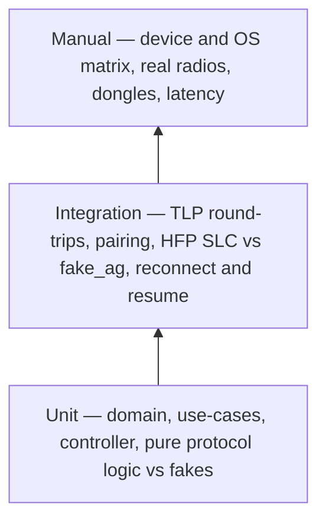

# Testing Strategy

Both apps follow the same pyramid: a wide unit tier running against the fakes mandated by
[14-coding-conventions.md](14-coding-conventions.md) section 8, an integration tier that exercises
real protocol logic through in-memory seams, and a thin manual tier for everything that needs a
radio, a SIM, or a USB controller. Interface contracts under test are specified in
[11-api-reference.md](11-api-reference.md); the flows the integration tier replays are the ten
sequences in [10-sequence-diagrams.md](10-sequence-diagrams.md).

## 1. Unit tier

**Android** (JVM tests, no emulator; all seams faked via `testkit`):

- Every `domain/usecase` class against fakes: `PlaceCall` + `GuardEmergencyNumber` refusal paths,
  `AnswerCall` first-answer-wins arbitration against `FakeTelecomBridge`, `SetMute` / `HoldCall` /
  `UnholdCall` idempotence, `SyncCallLog` paging and version handling against
  `FakeCallLogRepository`, `RevokeDesktop` against `FakePairedDeviceRepository`,
  `RequestAudioRoute` validation against `FakeCallMediaProvider` (including the
  emergency-call-active refusal).
- Pure logic, no fakes needed: `CallStateMapper` (exhaustive over telecom states and disconnect
  causes), `Fingerprints` (SPKI hashing, short-code derivation vectors shared with the desktop),
  `QrPayloadCodec`, the `PairingSession` state machine.
- ViewModels against fakes: state projection and use-case dispatch only — a ViewModel test that
  needs telecom types indicates a layering violation.

**Desktop** (`cargo test`, no I/O):

- `tandem_core`: `controller.rs` transition coverage (commands × states), `reconcile.rs`
  epoch-change and gap decisions, `emergency.rs` pre-check against a synced number list — the crate
  is deterministic by construction, so no fakes are required.
- HFP protocol core as pure logic: `hfp/at.rs` parse/serialize round-trips including AG quirks,
  `hfp/slc.rs` establishment ordering, `hfp/indicators.rs` +CIEV/+CLCC interpretation,
  `hfp/codec_negotiation.rs` mSBC selection and CVSD fallback.
- `tandem_pairing` `qr.rs` and `short_code.rs` (byte-identical vectors against the Android
  `Fingerprints` implementation, sourced from `fixtures.rs`); `tandem_crypto` `pinning.rs`;
  `tandem_audio` `ring_buffer.rs` overrun behavior and `resampler.rs` latency bounds under the
  deterministic clock of `fake_audio_backend`.

## 2. Integration tier

Still CI-runnable — no sockets, no TLS, no radios; the seams are in-memory but the logic is real.

- **LAN protocol round-trips.** Android: `InMemoryLanServer` connects in-process desktop sessions
  through the real `ControlPlaneRouter`, use-cases, and `EnvelopeCodec` — a `DialRequest` in yields
  the correct `Ack` and `CallStateChangedEvent` out, with no sockets or TLS. Desktop:
  `fake_transport` wired to `fake_phone` drives the real codec, controller, and reconcile path with
  scripted scenarios.
- **Pairing flow.** Android: `PairDesktop` end-to-end over `FakeIdentityStore` and
  `FakePairedDeviceRepository` — token validation, confirmation, persistence, `PairingDecision`
  payload, plus revocation closing live `InMemoryLanServer` sessions with `RevokedEvent`. Desktop:
  `pairing/flow.rs` against `fake_phone` — `PairingRequest` submission,
  `PairingAwaitConfirmEvent` handling, short-code path, decision persistence, token-expiry and
  rejection outcomes.
- **HFP SLC + state mirroring.** `fake_ag` drives the HFP core over an in-memory byte channel: SLC
  bring-up per HFP v1.8, indicator sequences, codec negotiation, SCO open/close.
  `hfp/call_mirror.rs` divergence tests assert LAN truth always wins (the single-command-path rule,
  [05-bluetooth-hfp.md](05-bluetooth-hfp.md)). `fake_bluetooth_backend` scripts mid-call SCO drops;
  assertions: the call is never ended, the route falls back, and `fake_audio_backend` observes
  pipeline teardown.
- **Reconnect / resume.** `fake_phone` scripts drops, epoch bumps, and sequence gaps; assertions:
  backoff schedule, `ResumeRequest` contents, snapshot-replace vs continue decisions, and answer
  races resolving to `Ack` with `ERROR_CODE_ALREADY_HANDLED` on the losing side. The Android
  mirror-image tests run the same scenarios through `InMemoryLanServer` with two concurrent
  sessions (fan-out + arbitration via `SessionRegistry`).
- **Cross-language golden vectors.** `fixtures.rs` holds canonical `Envelope` payloads, call-log
  pages, QR payloads, certificates, and keys; both codebases decode the same golden bytes so the
  two protobuf codegens can never drift apart silently.

## 3. Fakes to build

This list is binding and matches the `testkit` files in [REPO-STRUCTURE.md](REPO-STRUCTURE.md)
exactly. A new I/O boundary ships with its fake or it does not ship.

**Android — `android/app/src/test/kotlin/com/tandem/gateway/testkit/`**

| Fake | Fakes | Used for |
|---|---|---|
| `FakeTelecomBridge` | `TelecomBridge` | Scripted call arrivals and state transitions; asserts received commands; backs use-case and router tests without Android Telecom |
| `FakeCallMediaProvider` | `CallMediaProvider` | Records route requests; simulates route changes and SCO drops, including fall-back-to-earpiece |
| `FakeCallLogRepository` | `CallLogRepository` | Fixture-seeded history with paging bounds and log-version bumps for sync tests |
| `FakePairedDeviceRepository` | `PairedDeviceRepository` | Pairing, revocation, and TLS-pin lookup tests |
| `FakeIdentityStore` | `IdentityStore` | Fixed test keypair and fingerprint so pairing and TLS tests are deterministic |
| `FakeSettingsRepository` | `SettingsRepository` | Mutable settings Flows for settings-dependent behavior |
| `InMemoryLanServer` | `LanServer` | In-process desktop sessions through the real router/use-case path — no sockets, no TLS |

**Desktop — `desktop/crates/testkit/src/`**

| Fake | Fakes | Used for |
|---|---|---|
| `fake_phone` | The phone gateway peer | Speaks real TLP envelopes over an in-memory transport; scriptable scenarios: incoming calls, answer races, epoch bumps |
| `fake_ag` | An HFP Audio Gateway | Drives SLC bring-up, indicator sequences, codec negotiation, SCO open/close over an in-memory byte channel |
| `fake_audio_backend` | `AudioBackend` | Synthetic frames, captured playback, deterministic clocking for pipeline and latency tests |
| `fake_bluetooth_backend` | `BluetoothBackend` | Scripted adapter/bond/RFCOMM/SCO behavior including mid-call SCO drops |
| `fake_transport` | `TransportClient` | Connect/disconnect/resume scripting with deterministic timing, wired to `fake_phone` |
| `fixtures` | — | Canonical CallSnapshots, call-log pages, QR payloads, certificates, keys shared across all tests |

## 4. Manual / device matrix

Hardware truth the fakes cannot supply: real Telecom behavior per Android version, real BlueZ and
SCO scheduling, dongle firmware quirks, acoustic echo. Cadence per cell: **Full** = the complete
manual checklist below on every release; **Smoke** = `tools/dev/tier-a-smoke` plus, on Tier B rows,
one audio attach/detach cycle. Full columns are chosen where the platform shifted under Tandem:
Android 10 is the minSdk floor, 13 introduced the `POST_NOTIFICATIONS` runtime permission, 14
enforces typed foreground services, 15 is the targetSdk.

| Desktop configuration | Tier | Android 10 | Android 11 | Android 12 | Android 13 | Android 14 | Android 15 | USB dongle |
|---|---|---|---|---|---|---|---|---|
| Linux — control + history | `[Tier A]` | Full | Smoke | Smoke | Full | Full | Full | Not used |
| Windows — control + history | `[Tier A]` | Full | Smoke | Smoke | Full | Full | Full | Not used |
| macOS — control + history | `[Tier A]` | Full | Smoke | Smoke | Full | Full | Full | Not used |
| Any desktop OS — phone audio on commodity BT device | `[Tier B-lite fallback]` | Full | Smoke | Smoke | Full | Full | Full | Not used |
| Linux — software HFP via BlueZ + PipeWire | `[Tier B — Linux]` | Full | Smoke | Smoke | Full | Full | Full | Not used |
| Windows — HFP via dedicated controller | `[Tier B — Win/macOS USB dongle]` | Full | Smoke | Smoke | Full | Full | Full | Required, vetted family only |
| macOS — HFP via dedicated controller | `[Tier B — Win/macOS USB dongle]` | Full | Smoke | Smoke | Full | Full | Full | Required, vetted family only |

Full checklist (per applicable tier): outgoing + incoming call round-trips; mute/hold/merge/end and
DTMF; call-log sync freshness after a call; Wi-Fi blip → reconnect + `ResumeRequest` state re-sync;
two desktops → fan-out and first-answer-wins arbitration; overnight Doze survival of the foreground
service (limits in [02-feasibility-and-constraints.md](02-feasibility-and-constraints.md)); HFP
link drop mid-call → call continues on the handset, never dropped; audio attach/detach latency and
echo check on Tier B rows. Dongle rows start with `tools/usb-dongle-probe` reporting a supported
verdict.

**Emergency-policy verification, safely:** never dial an emergency number in testing. The refusal
logic is fully covered in unit/integration tests against fakes
(`ERROR_CODE_EMERGENCY_NUMBER_BLOCKED`). On real devices, verify only the desktop-side pre-check:
enter a number from the phone-synced emergency list and confirm the desktop blocks locally with the
dial-on-handset UX before any request is sent (flow j in
[10-sequence-diagrams.md](10-sequence-diagrams.md)).

## 5. CI outline (GitHub Actions)

| Job | Runner | Runs |
|---|---|---|
| `android-unit` | ubuntu | `./gradlew :app:testDebugUnitTest` — all unit + integration tests above (they are JVM tests) |
| `android-lint` | ubuntu | `./gradlew :app:lint` + Kotlin code-style check |
| `rust-test` | ubuntu | `cargo test --workspace` — includes every `tandem_testkit`-backed integration test |
| `rust-lint` | ubuntu | `cargo fmt --check`, `cargo clippy --workspace --all-targets -- -D warnings` (toolchain pinned by `rust-toolchain.toml`) |
| `rust-platform-check` | windows, macos | `cargo check` with the `usb_dongle` feature; ubuntu additionally checks `linux_bluez` — compile coverage for platform backends CI cannot run |
| `proto-check` | ubuntu | `tools/gen-proto.sh` — protoc available, Kotlin and Rust generation both compile from `/proto` (ADR-0009); fails on any schema/codegen breakage |
| `ui-check` | ubuntu | `npm ci` in `desktop/ui`, then `tsc --noEmit` and `svelte-check` against the ts-rs-generated IPC types, plus a Prettier formatting check |

CI-testable vs manual-only, by tier:

- `[Tier A]` — logic and protocol fully CI-testable through the fakes; the end-to-end proof on a
  real phone is `tools/dev/tier-a-smoke.sh` / `.ps1`, which needs an attached, paired device and a
  SIM, so it runs as a release gate on a phone-attached machine (self-hosted or manual — see
  [13-build-and-setup.md](13-build-and-setup.md)), never on hosted runners.
- `[Tier B-lite fallback]` — routing logic CI-testable (`FakeCallMediaProvider`, null backends);
  audio on a real commodity headset is manual-only.
- `[Tier B — Linux]` — the HFP core is CI-testable against `fake_ag`; anything touching real
  BlueZ, SCO sockets, or PipeWire is manual-only (hosted runners have no Bluetooth adapter).
- `[Tier B — Win/macOS USB dongle]` — compile checks in CI; every runtime test requires the vetted
  controller and is manual-only, starting from `tools/usb-dongle-probe`.
- `[Tier C — needs vendor support]` — no shippable code today; the seams it would plug into are
  covered by the existing backend-trait tests (ADR-0010).
