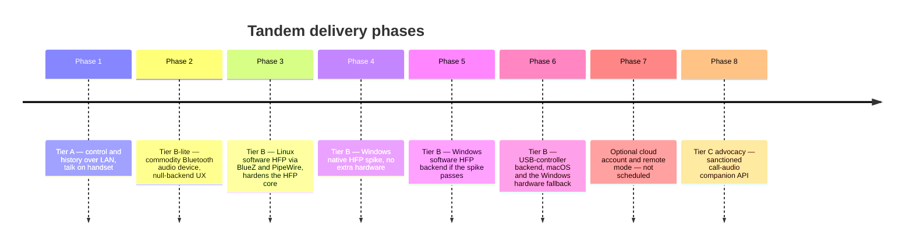
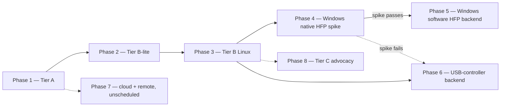

# Roadmap

Eight phases, ordered by feasibility, each independently valuable. Phase 1 is a complete product on
its own (the tier model in [00-overview.md](00-overview.md)); everything after it adds audio paths
or reach without ever touching Phase 1's control plane. Module and crate names below are the
canonical ones from [REPO-STRUCTURE.md](REPO-STRUCTURE.md).

## Standing constraints — every phase, no exceptions

Two realities bind all eight phases and every stretch item; full statements in
[08-security-and-encryption.md](08-security-and-encryption.md) and
[02-feasibility-and-constraints.md](02-feasibility-and-constraints.md):

- **Emergency calls never originate from the desktop** (ADR-0008). Enforcement has two ends: the
  desktop pre-checks every dial string against the emergency list carried in
  `SessionWelcome.emergency_numbers` and blocks the dial locally, and the phone's
  `GuardEmergencyNumber` is the authoritative backstop that checks every `DialRequest` that does
  reach it and refuses with `ERROR_CODE_EMERGENCY_NUMBER_BLOCKED`. Either way the user is directed
  to dial on the handset, which has carrier location facilities. An active emergency call is
  surfaced read-only. No later phase relaxes this — a remote desktop (Phase 7) is even less
  locatable, so the policy tightens, never loosens.
- **No software capture of carrier call audio, ever** (ADR-0002). On stock non-rooted Android,
  `VOICE_CALL`/`VOICE_DOWNLINK`/`VOICE_UPLINK` sit behind the `signature|privileged`
  `CAPTURE_AUDIO_OUTPUT` permission, and there is no API to inject audio into the cellular uplink.
  No phase assumes otherwise: audio moves only over Bluetooth HFP (Phases 2–6) or a hypothetical
  sanctioned platform API (Phase 8).

## Milestone overview

Inter-phase dependencies:

- Phase 2 needs only Phase 1 plus route targeting on top of the Android `bluetooth/` package that
  Phase 1 already builds — zero desktop audio work. It is never retired: B-lite remains the
  permanent fallback wherever full desktop audio is unavailable.
- Phase 3 builds the OS-independent HFP core once (`tandem_bluetooth::hfp`) against real Audio
  Gateways on the cheapest platform to reach them. Every later media phase reuses that core
  unchanged and only swaps what sits beneath RFCOMM, which is why Linux ships first despite
  Windows having more users: it de-risks the core before the expensive backends.
- Phase 4 is the Windows software-audio feasibility spike from
  [17-windows-software-audio.md](17-windows-software-audio.md): prove that a signed Windows
  Bluetooth profile-driver backend can expose HFP SLC and SCO/eSCO over the built-in adapter. It
  depends on Phase 3 so the spike tests the driver integration, not an unproven HFP core.
- Phase 5 exists only if Phase 4 passes. It productizes the Windows native profile-driver backend
  behind the existing `BluetoothBackend` seam, and is the preferred Windows answer because it
  meets the no-extra-hardware product goal (ADR-0011).
- Phase 6 delivers the USB-controller backend. It is macOS's only Tier B path, and doubles as the
  Windows fallback if the Phase 4 spike fails and the product accepts extra hardware. It reuses the
  Phase 3 HFP core beneath a host stack the daemon owns.
- Phases 7 and 8 have no code dependency on 3–6, but Phase 8's advocacy case is strongest with a
  shipping Tier B implementation as evidence of demand and of what apps are forced to build today.

## Phase 1 — `[Tier A]` control + history over LAN

Place, answer, and control real SIM calls from the desktop; mirrored call history; the user talks
on the handset or any headset already paired to the phone. Zero Bluetooth audio work. Shippable and
complete on its own.

Entry criteria: TLP v1 frozen at `protocol_version` 1 (`proto/tandem/v1/`); CI green per
[15-testing-strategy.md](15-testing-strategy.md) section 5; `tools/dev/tier-a-smoke.sh` / `.ps1`
passing against a real paired phone.

Activates:

- Android (`com.tandem.gateway`): `domain/` (model, port, usecase — all except
  `RequestAudioRoute.kt`), `telecom/`, `dialer/`, `calllog/`, `transport/`, `pairing/`, `crypto/`,
  `service/`, `data/`, `ui/`, `di/`. `bluetooth/HfpAgMonitor.kt` and
  `bluetooth/HfpCallMediaProvider.kt` are built and DI-bound from Phase 1 as well, doing route
  *mirroring* only — they report the phone's current audio route and nothing more: no desktop
  Hands-Free target, no `AudioRouteRequest` handling. That is required because
  `di/TelecomModule.kt` binds `CallMediaProvider` to `HfpCallMediaProvider`, and the `[Tier A]`
  `ObserveCallState` use case and `StatusScreen` both consume route state. It mirrors the desktop's
  null-backend rationale in the same phase. `bluetooth/BondedDesktopMatcher.kt` stays dormant.
- Desktop: `tandem_proto`, `tandem_core`, `tandem_transport`, `tandem_pairing`, `tandem_crypto`,
  `tandem_ipc`, `tandem_testkit`; binaries `tandem-daemon` and `tandem-ui`. `tandem_audio` and
  `tandem_bluetooth` compile only their null backends (`audio/src/null_backend.rs`,
  `bluetooth/src/backends/null_backend.rs`) so the `daemon/src/app.rs` composition keeps its final
  shape from day one (ADR-0010).
- Tools: `tools/gen-proto.sh` / `.ps1`, `tools/dev/tier-a-smoke.sh` / `.ps1`.
- Docs in force: [03-android-app.md](03-android-app.md), [04-desktop-app.md](04-desktop-app.md),
  [06-transport-and-protocol.md](06-transport-and-protocol.md),
  [07-pairing-and-auth.md](07-pairing-and-auth.md), [13-build-and-setup.md](13-build-and-setup.md)
  Tier A sections.

Done when: dial, answer, reject, mute, hold, merge, end, DTMF, and history sync all round-trip from
the desktop (flows a–d, f–j in [10-sequence-diagrams.md](10-sequence-diagrams.md)), audio on the
handset.

## Phase 2 — `[Tier B-lite fallback]` commodity Bluetooth audio

First-class supported mode, not a shim: the user pairs any commodity Bluetooth speakerphone or
earbuds to the **phone**; the desktop gains audio-route control (`AudioRouteRequest` targeting the
bonded device) and honest null-backend UX — the desktop states plainly that it has no audio backend
of its own and where the audio actually is.

Entry criteria: Phase 1 shipped; `BLUETOOTH_CONNECT` runtime-permission flow designed per
[12-permissions-and-platform.md](12-permissions-and-platform.md).

Activates:

- Android: `domain/usecase/RequestAudioRoute.kt`, the `BLUETOOTH_CONNECT` runtime-permission flow,
  and the route-*targeting* behavior of `HfpCallMediaProvider.kt` — the file itself and
  `HfpAgMonitor.kt` already ship route mirroring from Phase 1, so this phase turns route requests
  into route changes rather than adding the package. `BondedDesktopMatcher.kt` waits for Phase 3 (it
  resolves the desktop's own adapter, which does not exist as an audio target yet).
- Desktop: `bluetooth/src/backends/null_backend.rs` behavior becomes product UX ("reports no
  adapter and rejects audio-route attach cleanly"); route indicator in `ActiveCallView.svelte`,
  backend status in `SettingsView.svelte`, `StatusBadge.svelte`.
- Wire: `AudioRouteRequest` / `AudioRouteChangedEvent` — already in `call.proto` since v1, so no
  protocol change.

Done when: mid-call route switching earpiece ↔ speaker ↔ commodity Bluetooth device from the
desktop works; an SCO drop falls back to earpiece with the call untouched (degradation rule in
[05-bluetooth-hfp.md](05-bluetooth-hfp.md)).

## Phase 3 — `[Tier B — Linux]` software HFP

The desktop becomes the headset on Linux, software-only: HFP Hands-Free role via BlueZ, audio via
PipeWire-managed devices through cpal. No special hardware. This phase exists to harden the
OS-independent HFP core against real Audio Gateways on the platform that reaches them most cheaply;
Phases 4–6 reuse that core unchanged.

Entry criteria: Phase 2 shipped; the HFP core passes the full `fake_ag` integration suite
([15-testing-strategy.md](15-testing-strategy.md) section 2); the BlueZ profile-claim procedure
(disabling PipeWire's native HFP backend) validated and documented in
[13-build-and-setup.md](13-build-and-setup.md).

Activates:

- Desktop `tandem_audio` in full: `cpal_backend.rs`, `ring_buffer.rs`, `resampler.rs`, `aec.rs`,
  `pipeline.rs`.
- Desktop `tandem_bluetooth` HFP core: `hfp/at.rs`, `hfp/slc.rs`, `hfp/indicators.rs`,
  `hfp/codec_negotiation.rs`, `hfp/call_mirror.rs`; backend `backends/linux_bluez/` (`mod.rs`,
  `profile.rs`, `sco.rs`).
- Android: `BondedDesktopMatcher.kt` — resolves `SessionHello.bt_adapter_address` to the bonded
  desktop HF so `AudioRouteRequest` targets the right device.
- Docs in force: [05-bluetooth-hfp.md](05-bluetooth-hfp.md) end to end.

Done when: audio attaches to and detaches from an active call over HFP (flow e in
[10-sequence-diagrams.md](10-sequence-diagrams.md)); mSBC negotiated where the AG supports it, CVSD
fallback otherwise; added latency inside the ≈ 40–80 ms budget; HFP drop degrades to handset audio
with the call never dropped. The single-command-path rule holds throughout: LAN carries intent, HFP
carries audio and mirrors reality.

## Phase 4 — Windows native HFP feasibility spike

The desktop becomes the headset on Windows without an extra Bluetooth controller, if the platform
allows it through a signed Bluetooth profile driver. This is a feasibility phase, not a shipping
promise. Full scope and pass/fail criteria are in
[17-windows-software-audio.md](17-windows-software-audio.md); ADR-0011 records the product
direction.

Entry criteria: Phase 3 shipped, so the HFP core is already hardened against real Audio Gateways
and the spike isolates the Windows driver integration rather than the protocol core; Windows 11
target chosen; driver development/signing path understood; one Android phone selected as the first
Audio Gateway target.

Activates:

- A prototype signed Windows Bluetooth profile driver and a user-mode bridge to `tandem-daemon`.
- Desktop `tandem_bluetooth` HFP core against a real Android AG through that bridge.
- Desktop `tandem_audio` enough to prove duplex frame flow through WASAPI/cpal.
- Android: `BondedDesktopMatcher.kt` resolves `SessionHello.bt_adapter_address` to the built-in
  Windows adapter.
- Docs in force: [05-bluetooth-hfp.md](05-bluetooth-hfp.md) end to end.

Done when: docs/17 pass criteria all succeed on Windows 11 with a real Android phone and carrier
call: SLC stable, SCO/eSCO frames in both directions, audio attaches and detaches, backend loss
falls back to handset audio, and no private Windows or Phone Link behavior is used. If any fail
criterion is hit, Windows full-audio work routes to Phase 6's USB-controller backend, and Windows
ships as `[Tier A]` / `[Tier B-lite fallback]` until the hardware policy allows it.

## Phase 5 — Windows software HFP backend

Productize the successful Phase 4 backend: Windows desktop audio with no extra Bluetooth
controller. This is a signed driver plus user-mode backend, not an ordinary app-only feature.

Entry criteria: Phase 4 passed; driver signing and installer rollback validated; Windows 11 device
matrix chosen; Driver Verifier and reconnect stress tests designed.

Activates:

- Desktop: `tandem_bluetooth` backend `windows_profile` plus the Windows driver/user-mode bridge
  named by the implementation doc created after the spike.
- Desktop: full `tandem_audio` pipeline, reconnect supervision, and route UI.
- Docs: update docs/04, docs/05, docs/11, docs/12, docs/13, docs/15, and
  docs/REPO-STRUCTURE.md with concrete file paths and test commands.

Done when: flow-e behavior works on the supported Windows 11 matrix with the built-in Bluetooth
adapter: route to desktop, route away, mSBC where supported, CVSD fallback, daemon and driver
restart degradation, and no dropped cellular call.

## Phase 6 — `[Tier B — Win/macOS USB dongle]` HFP via dedicated controller

The same Hands-Free role by driving a dedicated USB Bluetooth controller directly, because neither
OS stack exposes the HF role to applications
([02-feasibility-and-constraints.md](02-feasibility-and-constraints.md)). This is a legitimate
implementation of the published Bluetooth SIG HFP v1.8 specification, not reverse engineering of
any product.

This phase serves two distinct needs: it is **macOS's only Tier B path**, and it is the **Windows
hardware fallback** if the Phase 4 spike fails and the product goal changes to allow extra
hardware. On Windows it is no longer the preferred answer — Phase 5 is, because it meets the
no-extra-hardware goal (ADR-0011).

Entry criteria: Phase 3 shipped — the HFP core is hardened against real AGs; a vetted controller
family selected via `tools/usb-dongle-probe`; driver/packaging story (WinUSB claim, IOKit
entitlements) settled per the desktop platform notes in
[12-permissions-and-platform.md](12-permissions-and-platform.md).

Activates:

- Desktop: `backends/usb_dongle/` — `mod.rs`, `usb_transport.rs`, `hci.rs`, `l2cap.rs`,
  `rfcomm.rs`, `sdp.rs`, `security.rs`, `sco_route.rs`.
- Tools: `tools/usb-dongle-probe` as the documented bring-up gate
  ([13-build-and-setup.md](13-build-and-setup.md)).

Done when: flow-e behavior matches Phase 3 on macOS — and on Windows if this path is taken — with
the vetted dongle; the probe's supported verdict is a precondition of every support statement.
Users without a dongle stay on `[Tier B-lite fallback]` permanently and lose nothing from Phase 2.

## Phase 7 — optional cloud account + beyond-same-room mode (explicitly out of scope today)

Not scheduled, no code, and excluded from v1 by the non-goals in [00-overview.md](00-overview.md).
Recorded here so the architecture stays honest about what could and could not extend:

- **Control could relay.** TLP assumes same-LAN only for discovery (`_tandem._tcp`); the session
  itself is pinned mutual TLS between two devices with no CA. A cloud rendezvous could forward the
  encrypted byte stream without ever joining the trust model — pins stay pins
  ([08-security-and-encryption.md](08-security-and-encryption.md)). An account layer could slot in
  exactly where [07-pairing-and-auth.md](07-pairing-and-auth.md) notes: endpoint discovery and
  device-list sync, never trust anchoring.
- **Media cannot relay.** Bluetooth HFP is a short-range radio link between the phone and whatever
  renders audio next to it. No cloud component moves that, and software capture on the phone
  remains impossible (standing constraints above). A beyond-same-room mode is therefore control +
  history only — `[Tier A]` at a distance — with call audio staying wherever the phone is: the
  handset or a device bonded to it.
- The emergency policy applies with extra force: a remote desktop is even further from any usable
  location, so the force-to-handset refusal is unchanged.
- Privacy bar to clear first: today call metadata never leaves the LAN and there is no telemetry
  ([08-security-and-encryption.md](08-security-and-encryption.md)); any relay design must preserve
  that or explicitly renegotiate it in an ADR.

Entry criteria: demonstrated user demand; a dedicated ADR; privacy review. Activates today:
nothing. The touch points would be `tandem_transport` (an endpoint source beside `discovery.rs`)
and the pairing docs.

## Phase 8 — `[Tier C — needs vendor support]` sanctioned call-audio companion API advocacy

Advocacy, not code: argue for an AOSP/OEM "call-audio companion" API — the capability class Android
Auto uses — so a desktop could attach call audio without owning Bluetooth radio hardware.

The architecture already accepts such an API as a drop-in (ADR-0010): on Android it would implement
the existing `CallMediaProvider` port beside `HfpCallMediaProvider`; on the desktop it would be a
new backend behind the `BluetoothBackend`/`AudioBackend` trait seam that `daemon/src/app.rs`
selects from. No restructuring, only a new leaf.

Entry criteria: outside Tandem's control — platform or vendor action. Tandem's own readiness
criterion: the backend-trait seams stay stable and covered by the trait-level tests in
[15-testing-strategy.md](15-testing-strategy.md), so a Tier C backend remains a bounded addition.

## Stretch items — no phase commitment

- **SMS/RCS mirroring.** Requires the separate default-SMS role and an entirely new protocol
  surface; nothing in TLP v1 carries messaging, so this is at least a protocol minor version and
  its own permission review. Not started, not designed.
- **Multi-SIM UX.** The wire already carries `sim_slot` on `DialRequest`, `CallInfo`, and
  `CallLogEntry`, so no protocol change: the stretch work is pure UX — SIM selection in
  `DialpadScreen.kt` and `DialerView.svelte`, per-SIM labels in `HistoryView.svelte`.
- **Contacts sync.** Today names are resolved on the phone and mirrored as display strings
  (`CallInfo.remote_display_name`, `CallLogEntry.display_name`). A full contact mirror would need
  `READ_CONTACTS` — not in the current permission set
  ([12-permissions-and-platform.md](12-permissions-and-platform.md)) — plus a new sync surface and
  retention policy.

Each stretch item gates on a product decision, its own ADR, and a version-compatibility review
under the rules in [06-transport-and-protocol.md](06-transport-and-protocol.md).
